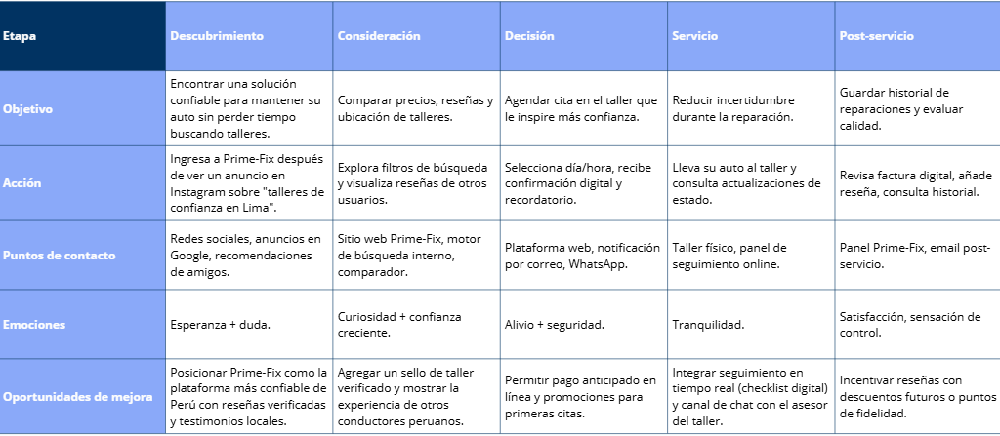
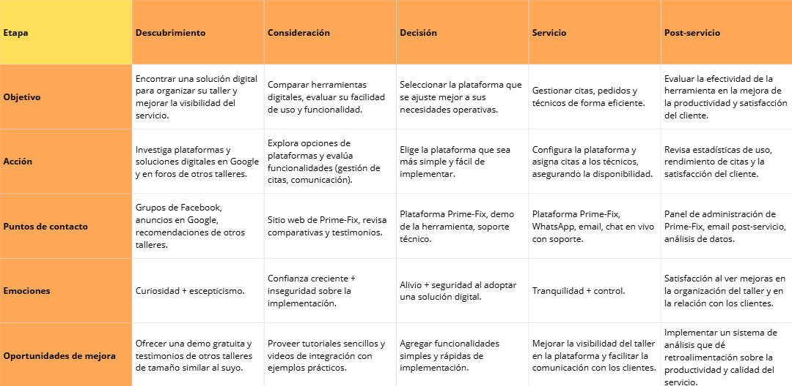
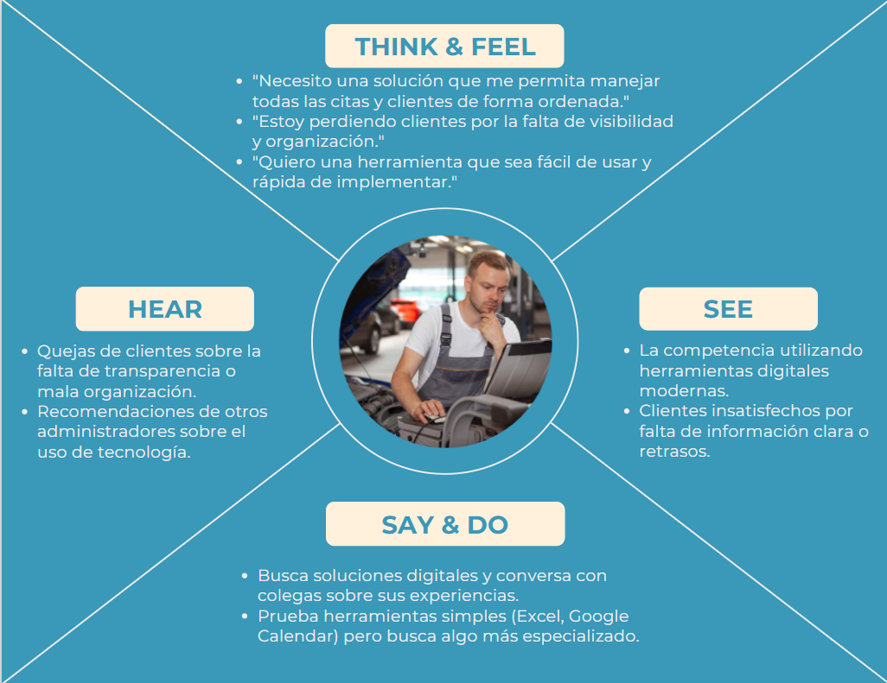
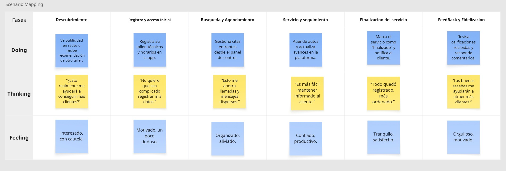
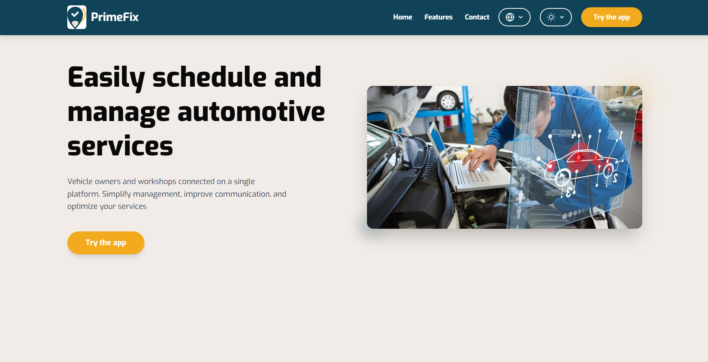
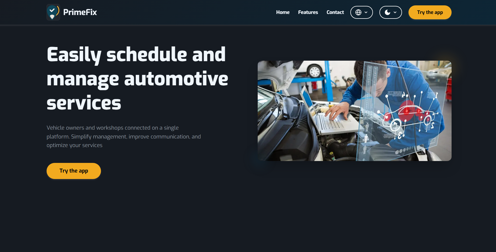
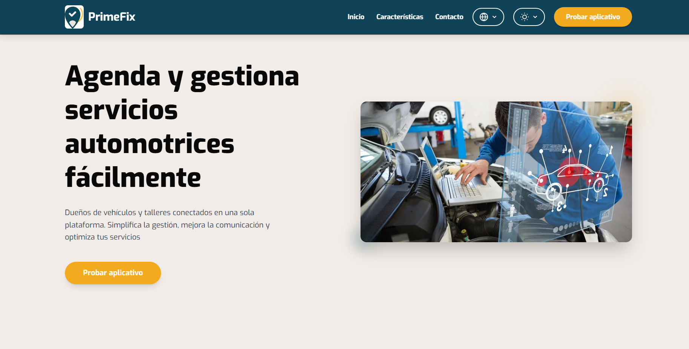
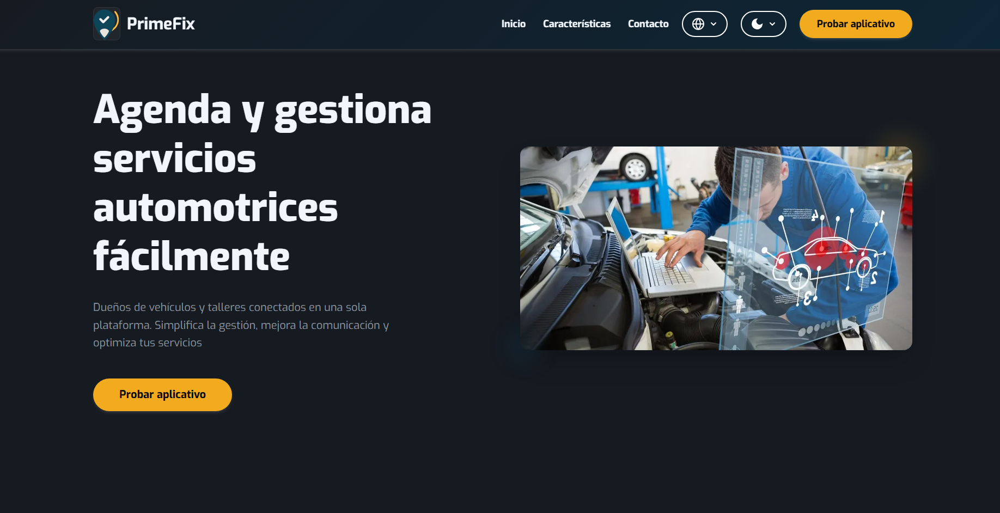

<h2 align="center">
  
</h2>

<h1 align="center">Universidad Peruana de Ciencias Aplicadas</h1>

<h3 align="center">
  Ingeniería de Software
    
  Curso: Aplicaciones Web
    
  Sección: 7452
    
  Profesor: Hugo Allan Mori Paiva
    
  Semestre: 2025-20
    
  Informe del Trabajo Final
    
  Startup: Prime-Fix
    
  Producto: AutoFix
</h3>

| 
Alumno
 | 
Código
 |
|:-------------------------------------------:|:-------------------------------------------:|
|       Cesar Augusto Arostegui Alzamora      |            u202114548                       |
|       Gianmarco Fabian Jiménez Guerra       |            u202123843                       |
|       Flor De María Contreras Leon          |            u202323243                      |
|       Giorgio Marzouk Awad Vargas           |            u202324041                       |
|       Piero Francesco Tenorio Medina        |            u202318731                       |

 Setiembre 2025 

# Registro de Versiones del Informe  
---

| Versión | Fecha       | Autor(es)                                                                 | Descripción de modificación |
|---------|-------------|---------------------------------------------------------------------------|------------------------------|
|   TB1   | XX/09/2025  | Gianmarco Fabian Jiménez Guerra                                           | Realicé ... |
|   TB1   | XX/09/2025  | Cesar Augusto Arostegui Alzamora                                          | Realicé ... |
|   TB1   | XX/09/2025  | Flor De María Contreras Leon                                              | Realicé 1.2.2.1. Lean UX Problem Statements; 1.2.2.2. Lean UX Assumptions; 1.2.2.3. Lean UX Hypothesis Statements; 2.3.1. User Personas; 2.3.2. User Task Matrix; 2.4. Big Picture Event Storming; 3.1. To-Be Scenario Mapping; 3.3. Impact Mapping; 4.1. Style Guidelines; 4.1.1. General Style Guidelines; 4.1.2. Web Style Guidelines; 3.2. User Stories; 3.4. Product Backlog; 5.1. Software Configuration Management; 5.1.1. Software Development Environment Configuration; 5.1.2. Source Code Management; 5.2. Landing Page, Services & Applications Implementation. |
|   TB1   | XX/09/2025  | Giorgio Marzouk Awad Vargas                                               | Realicé ... |
|   TB1   | XX/09/2025  | Piero Francesco Tenorio Medina                                            | Realicé ... |

# Project Report Collaboration Insights  

---

# Contenido
- [Registro de Versiones del Informe](#registro-de-versiones-del-informe)
- [Project Report Collaboration Insights](#project-report-collaboration-insights)
- [Contenido](#contenido)
- [Student Outcome](#student-outcome)
- [Capítulo I: Introducción](#capítulo-i-introducción)
  - [1.1. Startup Profile](#11-startup-profile)
    - [1.1.1. Descripción de la Startup](#111-descripción-de-la-startup)
    - [1.1.2. Perfiles de integrantes del equipo](#112-perfiles-de-integrantes-del-equipo)
  - [1.2. Solution Profile](#12-solution-profile)
    - [1.2.1. Antecedentes y problemática](#121-antecedentes-y-problemática)
    - [1.2.2. Lean UX Process](#122-lean-ux-process)
      - [1.2.2.1. Lean UX Problem Statements](#1221-lean-ux-problem-statements)
      - [1.2.2.2. Lean UX Assumptions](#1222-lean-ux-assumptions)
      - [1.2.2.3. Lean UX Hypothesis Statements](#1223-lean-ux-hypothesis-statements)
      - [1.2.2.4. Lean UX Canvas](#1224-lean-ux-canvas)
  - [1.3. Segmentos objetivo](#13-segmentos-objetivo)
- [Capítulo II: Requirements Elicitation \& Analysis](#capítulo-ii-requirements-elicitation--analysis)
  - [2.1. Competidores](#21-competidores)
    - [2.1.1. Análisis competitivo](#211-análisis-competitivo)
    - [2.1.2. Estrategias y tácticas frente a competidores](#212-estrategias-y-tácticas-frente-a-competidores)
  - [2.2. Entrevistas](#22-entrevistas)
    - [2.2.1. Diseño de entrevistas](#221-diseño-de-entrevistas)
    - [2.2.2. Registro de entrevistas](#222-registro-de-entrevistas)
    - [2.2.3. Análisis de entrevistas](#223-análisis-de-entrevistas)
  - [2.3. Needfinding](#23-needfinding)
    - [2.3.1. User Personas](#231-user-personas)
    - [2.3.2. User Task Matrix](#232-user-task-matrix)
    - [2.3.3. User Journey Mapping](#233-user-journey-mapping)
    - [2.3.4. Empathy Mapping](#234-empathy-mapping)
  - [2.4. Big Picture Event Storming](#24-big-picture-event-storming)
  - [2.5. Ubiquitous Language](#25-ubiquitous-language)
- [Capítulo III: Requirements Specification](#capítulo-iii-requirements-specification)
  - [3.1. To-Be Scenario Mapping](#31-to-be-scenario-mapping)
  - [3.2. User Stories](#32-user-stories)
  - [3.3. Impact Mapping](#33-impact-mapping)
  - [3.4. Product Backlog](#34-product-backlog)
- [Capítulo IV: Product Design](#capítulo-iv-product-design)
  - [4.1. Style Guidelines](#41-style-guidelines)
    - [4.1.1. General Style Guidelines](#411-general-style-guidelines)
    - [4.1.2. Web Style Guidelines](#412-web-style-guidelines)
  - [4.2. Information Architecture](#42-information-architecture)
    - [4.2.1. Organization Systems](#421-organization-systems)
    - [4.2.2. Labeling Systems](#422-labeling-systems)
    - [4.2.3. SEO Tags and Meta Tags](#423-seo-tags-and-meta-tags)
    - [4.2.4. Searching Systems](#424-searching-systems)
    - [4.2.5. Navigation Systems](#425-navigation-systems)
  - [4.3. Landing Page UI Design](#43-landing-page-ui-design)
    - [4.3.1. Landing Page Wireframe](#431-landing-page-wireframe)
    - [4.3.2. Landing Page Mock-up](#432-landing-page-mock-up)
  - [4.4. Web Applications UX/UI Design](#44-web-applications-uxui-design)
    - [4.4.1. Web Applications Wireframes](#441-web-applications-wireframes)
    - [4.4.2. Web Applications Wireflow Diagrams](#442-web-applications-wireflow-diagrams)
    - [4.4.2. Web Applications Mock-ups](#442-web-applications-mock-ups)
    - [4.4.3. Web Applications User Flow Diagrams](#443-web-applications-user-flow-diagrams)
  - [4.5. Web Applications Prototyping](#45-web-applications-prototyping)
  - [4.6. Domain-Driven Software Architecture](#46-domain-driven-software-architecture)
    - [4.6.1. Design-Level Event Storming](#461-design-level-event-storming)
    - [4.6.2. Software Architecture Context Diagram](#462-software-architecture-context-diagram)
    - [4.6.3. Software Architecture Container Diagrams](#463-software-architecture-container-diagrams)
    - [4.6.4. Software Architecture Components Diagrams](#464-software-architecture-components-diagrams)
  - [4.7. Software Object-Oriented Design](#47-software-object-oriented-design)
    - [4.7.1. Class Diagrams](#471-class-diagrams)
  - [4.8. Database Design](#48-database-design)
    - [4.8.1. Database Diagrams](#481-database-diagrams)
- [Capítulo V: Product Implementation, Validation \& Deployment](#capítulo-v-product-implementation-validation--deployment)
  - [5.1. Software Configuration Management](#51-software-configuration-management)
    - [5.1.1. Software Development Environment Configuration](#511-software-development-environment-configuration)
    - [5.1.2. Source Code Management](#512-source-code-management)
    - [5.1.3. Source Code Style Guide \& Conventions](#513-source-code-style-guide--conventions)
    - [5.1.4. Software Deployment Configuration](#514-software-deployment-configuration)
  - [5.2. Landing Page, Services \& Applications Implementation](#52-landing-page-services--applications-implementation)
    - [5.2.1. Sprint 1](#521-sprint-1)
      - [5.2.1.1. Sprint Planning 1](#5211-sprint-planning-1)
      - [5.2.1.2. Aspect Leaders and Collaborators](#5212-aspect-leaders-and-collaborators)
      - [5.2.1.3. Sprint Backlog 1](#5213-sprint-backlog-1)
      - [5.2.1.4. Development Evidence for Sprint Review](#5214-development-evidence-for-sprint-review)
      - [5.2.1.5. Execution Evidence for Sprint Review](#5215-execution-evidence-for-sprint-review)
      - [5.2.1.6. Services Documentation Evidence for Sprint Review](#5216-services-documentation-evidence-for-sprint-review)
      - [5.2.1.7. Software Deployment Evidence for Sprint Review](#5217-software-deployment-evidence-for-sprint-review)
      - [5.2.1.8. Team Collaboration Insights during Sprint](#5218-team-collaboration-insights-during-sprint)
  - [5.3. Validation Interviews](#53-validation-interviews)
    - [5.3.1. Diseño de Entrevistas](#531-diseño-de-entrevistas)
    - [5.3.2. Registro de Entrevistas](#532-registro-de-entrevistas)
    - [5.3.3. Evaluaciones según heurísticas](#533-evaluaciones-según-heurísticas)
  - [5.4. Video About-the-Product](#54-video-about-the-product)
- [Conclusiones](#conclusiones)
- [Conclusiones y recomendaciones](#conclusiones-y-recomendaciones)
- [Video About-the-Team](#video-about-the-team)
- [Bibliografía](#bibliografía)
- [Anexos](#anexos)

# Student Outcome  

*ABET – EAC - Student Outcome 5*

En el siguiente cuadro se presentan las acciones desarrolladas por el grupo, junto con las conclusiones obtenidas, que respaldan el cumplimiento del logro correspondiente al ABET – EAC - Student Outcome 5.

| Criterio específico | Acciones Realizadas | Conclusiones |
|-----------|-----------|-----------|
| 1. Trabaja en equipo para proporcionar liderazgo    |**Flor De Maria Contreras Leon  TB1: **  Trabajé en equipo para proporcionar liderazgo al desarrollar secciones clave de la documentación del proyecto como 1.2.2.1. Lean UX Problem Statements, 1.2.2.2. Lean UX Assumptions y 1.2.2.3. Lean UX Hypothesis Statements. Estas actividades permitieron guiar al equipo en la definición clara de problemas, supuestos e hipótesis, de manera que se estableciera una base conceptual sólida para estructurar el producto. Con ello se fortaleció la organización del trabajo y se aseguró que todos los integrantes tuvieran un marco común de referencia para continuar con el desarrollo.   |**Flor De Maria Contreras Leon  TB1: **     Mi participación en la elaboración de los apartados vinculados a Lean UX (Problem Statements, Assumptions e Hypothesis Statements) permitió brindar liderazgo en la identificación y organización de los problemas centrales del proyecto. Esto contribuyó a guiar al equipo hacia una visión compartida y a alinear los esfuerzos individuales con los objetivos generales del trabajo.  |
| 2. Crea un entorno colaborativo, establece metas, planifica tareas y cumple objetivos   | **Flor De Maria Contreras Leon  TB1: **   Contribuí a crear un entorno colaborativo, estableciendo metas y cumpliendo objetivos mediante la elaboración de entregables como 2.3.1. User Personas, 2.3.2. User Task Matrix, 2.4. Big Picture Event Storming, 3.1. To-Be Scenario Mapping, 3.3. Impact Mapping y 3.2. User Stories, además de secciones técnicas como 4.1. Style Guidelines, 3.4. Product Backlog y la configuración en 5.1. Software Configuration Management. Estas contribuciones hicieron posible cumplir con los objetivos del TB1, fomentar la colaboración entre los integrantes y garantizar insumos consistentes para avanzar en las siguientes fases del proyecto.    | **Flor De Maria Contreras Leon  TB1: **   Al desarrollar entregables como User Personas, User Task Matrix, Big Picture Event Storming, To-Be Scenario Mapping, Impact Mapping, User Stories y Product Backlog, propicié un entorno colaborativo en el que cada integrante pudo aportar de manera ordenada. Gracias a la planificación de estas tareas y a la definición de metas claras, se alcanzaron los objetivos propuestos en el TB1, consolidando un avance estructurado y efectivo del proyecto.   |
---

# Capítulo I: Introducción
## 1.1. Startup Profile
### 1.1.1. Descripción de la Startup
Prime-Fix es una startup especializada en el desarrollo de soluciones tecnológicas aplicadas a la web, cuyo propósito es transofrmar la forma en que los usuarios acceden a servicios de mantenimiento y reparación automotriz.
Con Prime-Fix nace AutoFix, una plataforma digital cuyo objetivo es facilitar el contacto entre talleres de vehículos y dueños de los mismos implementando una serie de funcionalidades que permitirán a ambos usuarios, obtener una experiencia de gestión clara.

<b>Misión: </b> Nuestra misión es acercar a los dueños de vehículos a talleres confiables por medio de una plataforma accesible y amigable. De esta manera, modernizamos el sector automotriz y optimizamos de toda la experiencia de este tipo de  servicios.

<b>Visión: </b> Tenemos como objetivo posicionarnos como la plataforma líder en Perú para la gestión digital de servicios automotrices, considerando una posible expansión hacia toda América Latina. A su vez, en el futuro se buscará integrar a este proyecto aplicaciones móviles y dispositivos IoT que permitan un mantenmiento inteligente para los vehículos.

### 1.1.2. Perfiles de integrantes del equipo

| Foto | Descripción |
|------|-------------|
|  | Mi nombre es Flor de María Contreras León y actualmente estudio la carrera de Ingeniería de Software en la Universidad Peruana de Ciencias Aplicadas (UPC), sede San Miguel. Tengo 20 años y me considero una persona responsable, comprometida y dedicada a mi formación profesional.Me apasiona la programación y la investigación, áreas en las que busco seguir aprendiendo y desarrollando nuevas habilidades. Aunque me considero una persona callada, siempre estoy atenta a los detalles, lo que me permite trabajar de manera cuidadosa y eficiente en mis proyectos. Asimismo, valoro el trabajo en equipo y creo que un entorno colaborativo y respetuoso es clave para alcanzar los mejores resultados. |
|  |  |
|  |  |
|  |  |   
|  |  |

## 1.2. Solution Profile
### 1.2.1. Antecedentes y problemática
### 1.2.2. Lean UX Process
#### 1.2.2.1. Lean UX Problem Statements
En el Perú, miles de dueños de vehículos enfrentan a diario la dificultad de acceder a servicios de mantenimiento y reparación de manera confiable y eficiente. La búsqueda de talleres suele convertirse en un proceso poco claro y desgastante, donde predominan la informalidad, la falta de información sobre disponibilidad y la ausencia de canales digitales que faciliten la comunicación. Como consecuencia, muchos conductores pierden tiempo llamando o visitando distintos talleres, enfrentan largas esperas y experimentan desconfianza frente a la calidad y transparencia del servicio recibido.

Al mismo tiempo, los talleres y mecánicos independientes cargan con limitaciones importantes. La gestión de citas se realiza de manera tradicional, mediante llamadas, mensajes o visitas presenciales, lo que genera desorden, sobrecarga de trabajo y pérdida de oportunidades de negocio. La falta de herramientas digitales para organizar horarios, técnicos y clientes impide que los talleres optimicen sus recursos y ofrezcan una experiencia más clara y moderna.

Las entrevistas realizadas revelan que tanto dueños de vehículos como mecánicos perciben esta situación como una limitación significativa y manifiestan el deseo de contar con una plataforma accesible, confiable y estructurada que facilite la comunicación, optimice la gestión de servicios y brinde mayor transparencia a todo el proceso de mantenimiento automotriz.

#### 1.2.2.2. Lean UX Assumptions

##### Suposiciones sobre dueños de vehículos
- Suponemos que los dueños de vehículos buscan talleres confiables y accesibles, pero actualmente enfrentan dificultades para encontrarlos de manera rápida y transparente.

- Suponemos que valoran la posibilidad de conocer horarios y disponibilidad en tiempo real antes de decidir a qué taller acudir.

- Suponemos que prefieren una experiencia digital sencilla, visual y clara, que les ahorre llamadas, visitas y pérdidas de tiempo.

- Suponemos que se sienten más seguros cuando reciben notificaciones y pueden dar seguimiento al servicio solicitado.

- Suponemos que confían más en una plataforma si les brinda transparencia en costos, tiempos y calidad del trabajo.

##### Suposiciones sobre mecánicos / talleres
- Suponemos que los talleres y mecánicos desean atraer más clientes sin sobrecargar sus canales de atención tradicionales.

- Suponemos que necesitan herramientas digitales para organizar técnicos, horarios y disponibilidad de manera eficiente.

- Suponemos que estarían dispuestos a usar una plataforma si esta facilita la comunicación con clientes y reduce la pérdida de citas o confusiones.

- Suponemos que valoran un sistema que les ayude a fidelizar clientes y mejorar su reputación en el mercado.

- Suponemos que los administradores de talleres aceptarían registrar técnicos y disponibilidad si esto aumenta su visibilidad y confianza frente a potenciales clientes.

##### Suposiciones sobre el entorno digital
- Suponemos que la plataforma debe ser accesible desde web y móvil, con una interfaz amigable y moderna.

- Suponemos que las notificaciones automáticas y formularios dinámicos son claves para la interacción fluida entre cliente y taller.

- Suponemos que un modelo freemium o por suscripción podría incentivar a los talleres a sumarse, mientras que la gratuidad inicial para clientes facilitaría la adopción.

- Suponemos que la inclusión de un sistema de reseñas y calificaciones generará confianza y motivará el uso frecuente.

------------

##### User Outcomes
- Que los dueños de vehículos puedan agendar servicios de manera rápida, segura y transparente.

- Que confíen en los talleres registrados y logren ahorrar tiempo en la gestión de mantenimiento y reparación.

- Que los talleres logren digitalizar su gestión interna, mejorando la organización y optimización de recursos.

- Que los mecánicos establezcan una relación más clara y confiable con los clientes, incrementando su fidelización.

##### Business Outcomes
- Lograr una alta adopción inicial entre dueños de vehículos y talleres mecánicos en Lima y posteriormente en otras ciudades del Perú.

- Generar confianza en el mercado automotriz como la primera plataforma digital que centraliza la gestión de citas y servicios.

- Incrementar la conversión de talleres gratuitos a planes de pago mediante funcionalidades premium (ej. mayor visibilidad, métricas de clientes, gestión avanzada de recursos).
  
#### 1.2.2.3. Lean UX Hypothesis Statements

A partir de nuestras asunciones, formulamos las siguientes hipótesis que deben ser validadas con usuarios reales:

1. **Creemos que los dueños de vehículos necesitan una forma confiable y rápida de agendar servicios de mantenimiento o reparación** porque actualmente enfrentan pérdida de tiempo, falta de transparencia y desconfianza en los talleres,entonces, si les ofrecemos una plataforma digital con agenda en línea, disponibilidad en tiempo real y notificaciones  aumentará su confianza y la frecuencia con la que solicitan servicios.

2. **Creemos que los talleres necesitan una herramienta para organizar técnicos, horarios y citas** porque ahora trabajan con sistemas manuales, llamadas y mensajes dispersos, entonces, si les damos un panel de gestión con registro de técnicos, agenda y comunicación integrada podrán atender más clientes de manera ordenada y mejorar su reputación.

3. **Creemos que una plataforma visual, intuitiva y accesible desde web o móvil motivará a los dueños de vehículos a usarla** porque están acostumbrados a aplicaciones simples y rápidas en su vida diaria,entonces, si Prome Fix ofrece una experiencia fluida y amigable, se incrementará la adopción y retención de usuarios.

4. **Creemos que permitir a los dueños de vehículos ver reseñas, calificaciones y disponibilidad en tiempo real aumentará la confianza en los talleres** porque actualmente sienten inseguridad respecto a la calidad y tiempos de atención entonces, si ofrecemos funciones de reseñas y visibilidad de horarios,los usuarios elegirán talleres a través de la plataforma en lugar de buscar por canales informales.

5. **Creemos que un modelo free con funciones básicas gratuitas para talleres y clientes permitirá captar más usuarios porque reduce la barrera de entrada y genera valor desde el primer uso**,entonces, si ofrecemos planes premium con mayor visibilidad, métricas y herramientas avanzadas,lograremos convertir talleres gratuitos en clientes de pago y sostener el crecimiento de la plataforma.
Estas hipótesis serán validadas mediante pruebas con usuarios, entrevistas, prototipos de la plataforma y análisis de métricas de uso.

#### 1.2.2.4. Lean UX Canvas
| **Business Problem** | **Business Outcomes** |
|----------------------|------------------------|
| - El sector automotriz en Perú carece de digitalización. - Dueños de vehículos no encuentran talleres confiables ni transparentes. - Talleres tienen procesos manuales e ineficientes. | - Incrementar talleres afiliados. - Reducir tiempo de búsqueda y agendamiento. - Aumentar confianza con transparencia en precios y reseñas. - Posicionar a FixTech como líder en Perú y LATAM. |

| **Users** | **User Outcomes & Benefits** |
|-----------|-------------------------------|
| - Dueños de vehículos: buscan **confianza, transparencia y facilidad**. - Talleres: necesitan digitalizar su gestión, captar clientes y mejorar organización. | - Dueños de vehículos: mayor confianza, ahorro de tiempo, historial de mantenimientos. - Talleres: más visibilidad, captación de clientes y mejor gestión. |

| **Hypotheses** | **Solutions** |
|----------------|---------------|
| - Creemos que los **dueños de vehículos** usarán Prime-Fix porque encontrarán confianza y transparencia. - Creemos que los talleres se afiliarán para captar más clientes y organizar su gestión. - Creemos que digitalizar procesos reducirá tiempos y aumentará satisfacción. | - Plataforma digital que conecte dueños de vehículos con talleres. - Agenda en línea con recordatorios. - Perfiles de talleres con reseñas y catálogo. - Historial digital de mantenimientos. - Futuras integraciones con app móvil e IoT. |

| **What’s the most important thing we need to learn first?** | **What’s the least amount of work we need to do to learn the next most important thing?** |
|-------------------------------------------------------------|------------------------------------------------------------------------------------------------|
| - Validar si los usuarios confían en la plataforma para agendar servicios. - Verificar si los talleres están dispuestos a afiliarse y pagar por visibilidad. | - Entrevistar a un grupo reducido de talleres y usuarios. - Recoger feedback y medir uso real. |

## 1.3. Segmentos objetivo

**Segmento 1: Dueños de vehículos**
**Aspectos Demográficos:**

* Sexo: Masculino y Femenino
* Edades: Entre 22 y 50 años

**Aspectos Geográficos:**

* Zona Geográfica en la que viven: Urbana, ciudad altamente transitada por vehículos.

**Aspectos Psicográficos:**

* Valoran el buen servicio y la eficacia.
* Tienen interés en la calidad del servicio que se le brinda a su vehiculo. 

**Segmento 2: Administrador de taller automotriz**
**Aspectos Demográficos:**

* Sexo: Masculino y Femenino
* Edades: Entre 30 y 50 años
* Ocupación: Dueño o administrador de un taller automotriz

**Aspectos Geográficos:**

* Zona Geográfica en la que viven: Urbana, ciudad altamente transitada por vehículos.
* Ubicacion del taller: Cercana a avenidas transitadas, zonas industriales o barrios con alta circulación vehicular.

**Aspectos Psicográficos:**

* Valoran la organizacion y eficiencia en la gestión de clientes.
* Interés en fidelizar clientes y mejroar la reputación de su taller.
* Buscan soluciones tecnológicas que les permitan optimizar el tiempo y reducir errores dentro del taller.

---

# Capítulo II: Requirements Elicitation & Analysis
## 2.1. Competidores
### 2.1.1. Análisis competitivo
### 2.1.2. Estrategias y tácticas frente a competidores

## 2.2. Entrevistas

### 2.2.1. Diseño de entrevistas

Segmento #1: Dueños de vehículos 
"Buenos días/tardes/noches 'Nombre del entrevistado'. Mi nombre es 'Nombre del entrevistador' de la startup Prime-Fix. Nos encontramos desarrollando una plataforma para que los dueños de vehículos tengan la facilidad de programar sus visitas a talleres de reparación de autos, hacer seguimiento al servicio y ver el diagnóstico de la falla detectada. En base a ello, tengo preparadas una lista de preguntas para conocer su punto de vista sobre algunos temas importantes para nuestra plataforma."

Preguntas:
1. ¿Ha realizado la búsqueda de algún taller durante los últimos meses? De ser así, ¿Podría comentarnos su experiencia?
2. ¿Qué plataformas o medios utiliza para realizar la búsqueda de talleres cuando su vehículo necesita reparación?
3. ¿Qué aspectos valora más en un servicio de taller (distancia, disponibilidad, costo)?
4. ¿Ha tenido experiencias negativas con talleres? De ser así, ¿Le hubiera gustado registrar dichas experiencias de manera pública?
5. ¿Usted mantiene un registro de su vehículo y del mantenimiento que le ha brindado durante todo este tiempo?
6. ¿Ha dejado su vehículo en un taller durante días u horas?¿Cómo se le avisa que su vehículo ya está listo?
7. ¿Estaría interesado en usar una plataforma que le permita agendar visita en talleres de su zoma? ¿Por qué?
8. ¿Qué funcionalidades cree que harían que esta plataforma sea útil para el día a día?
9. ¿Se sentiría cómodo recibiendo algunos recordatorios de mantenimiento preventivo desde una app?
10. ¿Le gustaría hacer seguimiento al estado de su vehículo mientras este se encuentra en mantenimiento?

Segmento #2: Administrador de taller automotriz 
"Buenos días/tardes/noches 'Nombre del entrevistado'. Mi nombre es 'Nombre del entrevistador' de la startup Prime-Fix. Nos encontramos desarrollando una plataforma para que los talleres tengan la facilidad de agendar y hacer seguimiento a las visitas de posibles clientes que solicitan la reparación de sus autos. En base a ello, tengo preparadas una lista de preguntas para conocer su punto de vista sobre algunos temas importantes para nuestra plataforma."

Preguntas:
1. ¿Cómo consigue actualmente a sus clientes para el taller?
2. ¿En qué medio promociona sus servicios?
3. ¿Encuentra dificultades al competir con talleres más grandes? De ser así ¿Podrías describirlas?
4. ¿Cómo gestiona los pedidos o solicitudes de servicios de reparación? (ej. llamadas, WhatsApp o visitas directas)
5. ¿Ha tenido algún reclamo sobre el desempeño de los téncnicos? ¿Podría detallar más la experiencia?
6. ¿Cómo maneja la información sobre lso técnicos? ¿Tienen una base de datos?
7. ¿Qué tan importante consideraría mostrar la disponibilidad de sus técnicos en tiempo real?
8. ¿Qué tanto te ayudaría una plataforma donde puedas registrar tu taller, tus técnicos y mostrar reseñas de clientes?
9. ¿Qué funcionalidades le añadirías a la plataforma?
10. ¿Le parece importante que el cliente sepa en qué estado se encuentra su vehículo y cuál es su diagnóstico final?
11. ¿Estaría interesado en una plataforma que notifique al cliente el momento en que puede recoger su vehículo?

### 2.2.2. Registro de entrevistas

##### Segmento 1: Dueños de Vehiculos

##### Entrevista N°1: Dionisio Rodriguez

- Sexo: Maculino
- Edad:25 años
- Direccion: Lima, Av Arequipa Miraflores.

|  |
|-------------------------------------------------------------------------------------------------------------------|
|** Link De la Entrevista:** |
|Duracion:**00:05:02**&nbsp;&nbsp;&nbsp;&nbsp;&nbsp;Inicio:**00:00:31**&nbsp;&nbsp;&nbsp;&nbsp;Final:**00:05:02**|
| Dionisio Rodríguez, de 25 años, es conductor de automóvil y comentó que al momento de elegir un taller prioriza la confianza en el servicio, incluso si esto implica desplazarse a zonas más lejanas. Para ubicar opciones suele utilizar Google Maps, aunque reconoce que no siempre refleja la calidad real del taller. Señaló que en una ocasión tuvo una experiencia negativa, pues su vehículo fue dañado en un taller y los responsables no asumieron la reparación, lo que generó desconfianza y la necesidad de contar con mecanismos de referencia más seguros.Asimismo, resaltó que le resultaría valioso contar con una plataforma que permita no solo agendar visitas a talleres, sino también hacer seguimiento en tiempo real al estado del vehículo mientras se encuentra en mantenimiento. Además, considera importante que los usuarios puedan registrar y compartir públicamente sus experiencias, ya que esto ofrecería mayor transparencia y ayudaría a otros conductores a tomar mejores decisiones.|
### 2.2.3. Análisis de entrevistas

## 2.3. Needfinding
### 2.3.1. User Personas
Esta sección presenta dos arquetipos desarrollados para representar a los segmentos objetivos de Prime-Fix: Conductores de Autos y Administradores de talleres automotriz.

#### User Persona - Segmento 1 : Dueño de vehículo

- **Nombre:** José Ramírez
- **Edad:** 29 años
- **Género:** Masculino
- **Ocupación:** Analista de marketing digital
- **Ubicación:** Lima, Perú
- **Acceso digital:** Smartphone con conexión de datos móviles, laptop con internet en casa

**Objetivos y necesidades**

- Encontrar talleres confiables que garanticen un buen servicio.

- Poder agendar citas de manera rápida y sin pérdida de tiempo.

- Hacer seguimiento al estado de su vehículo mientras está en reparación.

- Tener transparencia en costos, tiempos y disponibilidad.

- Consultar reseñas reales de otros clientes antes de elegir un taller.

**Frustraciones**

- Pérdida de tiempo al llamar o visitar talleres para preguntar disponibilidad.

- Desconfianza hacia talleres informales por malas experiencias.

- Falta de seguimiento y comunicación clara sobre el estado del vehículo.

- No tener un historial organizado de mantenimientos realizados.

**Comportamientos digitales**

- Usa Google Maps y WhatsApp para buscar y comunicarse con talleres.

- Confía en reseñas en línea, pero reconoce que no siempre son fiables.

- Prefiere plataformas móviles rápidas y fáciles de usar.

**Frase representativa**

"Quiero un taller en el que pueda confiar y que me ahorre tiempo en llamadas innecesarias."

------------
#### User Persona - Segmento 2: Administrador de taller automotriz

- **Nombre:** Jorge Salazar
- **Edad:** 38 años
- **Sexo:** Masculino
- **Ocupación:** Administrador y dueño de un taller automotriz en Lima (zona industrial)
- **Ubicación:** Lima – Cercado de Lima

**Objetivos y necesidades**

- Organizar mejor las citas y disponibilidad de sus técnicos.

- Ofrecer a sus clientes un servicio más moderno y confiable.

- Aumentar la visibilidad del taller en internet para captar nuevos clientes.

- Fidelizar clientes con transparencia y comunicación constante.

- Reducir los reclamos por falta de información o retrasos.

**Frustraciones**

- No contar con una base de datos centralizada de clientes y técnicos.

- Pérdida de clientes por saturación de horarios y mala organización.

- Dificultad para competir con talleres grandes que tienen más visibilidad.

- Manejo desordenado de la información en medios dispersos (llamadas, mensajes, hojas).

**Comportamientos digitales**

- Usa Facebook y WhatsApp para promocionar su taller.

- Maneja citas en cuadernos y hojas de cálculo básicas.

- Tiene interés en soluciones digitales, pero necesita que sean simples y rápidas de implementar.

**Frase representativa**

"Necesito una herramienta que me ayude a organizar mi taller y mostrarle a los clientes que somos confiables."
### 2.3.2. User Task Matrix

Los segmentos considerados son:

Conductores de Autos (Jose Ramirez)
Administradores de Talleres Mecanicos(Jorge Salazar)

| **Tarea** | **Dueño de vehículo – Frecuencia** | **Dueño de vehículo – Importancia** | **Administrador de taller – Frecuencia** | **Administrador de taller – Importancia** |
|-----------|-------------------------------------|-------------------------------------|------------------------------------------|-------------------------------------------|
| Buscar talleres de confianza en internet | Alta | Alta | Media | Alta |
| Agendar una cita de mantenimiento/reparación | Media | Alta | Alta | Alta |
| Hacer seguimiento al estado del vehículo en el taller | Media | Alta | Media | Alta |
| Consultar disponibilidad y costos antes de acudir | Alta | Alta | Media | Alta |
| Revisar reseñas o experiencias de otros usuarios | Media | Alta | Baja | Media |
| Recibir notificaciones sobre avances del servicio | Media | Alta | Media | Alta |
| Gestionar pedidos y citas de clientes | N/A | N/A | Alta | Alta |
| Registrar técnicos y disponibilidad | N/A | N/A | Media | Alta |
| Responder consultas de clientes (WhatsApp, llamadas) | Media | Media | Alta | Alta |
| Promocionar el taller en canales digitales | Baja | Media | Alta | Media |
| Organizar información sobre diagnósticos y servicios | N/A | N/A | Media | Alta |
| Llevar un historial digital del vehículo | Media | Media | Baja | Media |

**Análisis comparativo**

Las tareas con mayor coincidencia en importancia para ambos segmentos son:

- Agendar citas.

- Hacer seguimiento del servicio.

- Recibir información clara y transparente.

**Para los dueños de vehículos las tareas con mas importancia son:**

- Alta frecuencia en buscar talleres en línea y consultar disponibilidad antes de decidir.

- Importancia alta en confianza, reseñas y notificaciones.

**Para los administradores de taller las tareas con mas importancia son:**

- Alta frecuencia en gestionar pedidos, responder consultas y organizar técnicos.

- Importancia alta en la gestión digital de clientes y transparencia frente al mercado.
  
### 2.3.3. User Journey Mapping
Segmento 1 (Dueño de vehículo: José Paredes):

Segmento 2 (Asesor de taller automotriz: Luis Chávez):

### 2.3.4. Empathy Mapping
Segmento 1 - Dueño de vehículo   
Empathy Mapping - José Paredes

Segmento 2 - Asesor de taller automotriz   
Empathy Mapping - Luis Chávez

## 2.4. Big Picture Event Storming

## 2.5. Ubiquitous Language

---

# Capítulo III: Requirements Specification
## 3.1 To-Be Scenario Mapping

------------

**1. Conductor de auto (Jose Ramirez)**

Simular cómo sería una experiencia ideal con AutoFix, desde la perspectiva del conductor de auto, comparándola con el As-Is ya trabajado. El flujo debe enfocarse en una experiencia estructurada, empática y guiada, que acompañe al usuario en cada fase: desde el descubrimiento de la aplicación, el registro, la búsqueda de talleres, hasta la finalización del servicio y la fidelización.

------------

**2. Administrador de talleres (Jorge Salazar)**

Simular cómo sería una experiencia ideal con Prime-Fix, desde la perspectiva del administrador de taller, comparándola con el As-Is ya trabajado. El flujo debe enfocarse en una experiencia estructurada, empática y guiada, que acompañe al usuario en cada fase: desde el descubrimiento de la aplicación, el registro de su taller, la gestión de citas y clientes, hasta el seguimiento de servicios realizados y la fidelización de los conductores.

## 3.2. User Stories

### 3.2.1 Epics

| Epic ID | Título                                       | Descripción                                                                                                                                                                                  |
| ------- | -------------------------------------------- | -------------------------------------------------------------------------------------------------------------------------------------------------------------------------------------------- |
| EP-01   | Acceso de Usuarios                           | Como usuario del aplicativo, quiero un sistema de registro y acceso específico y completo para poder ingresar mediante mis credenciales.                                                     |
| EP-02   | Claridad Durante la Autenticación de Usuario | Como usuario, quiero brindar la información solicitada de manera clara para autorizar mi acceso al aplicativo sin confusiones.                                                               |
| EP-03   | Planes de Pago                               | Como usuario, quiero conocer los planes de pago para conocer las funcionalidades a las cuales no podré acceder                                                                               |
| EP-04   | Configuración de la Información de la Cuenta | Como usuario, quiero poder modificar la información previamente brindada para actualizar estos datos cuando corresponda.                                                                     |
| EP-05   | Personalización del Aplicativo               | Como usuario, quiero personalizar algunas funciones del aplicativo para mejorar mi experiencia de usuario según lo necesite.                                                                 |
| EP-06   | Navegación Inmediata                         | Como usuario, quiero tener a simple vista el acceso a diferentes funcionalidades del aplicativo, para agilizar la navegación y poder realizar mis tareas de manera rápida y sencilla.        |
| EP-07   | Notificaciones y Avisos                      | Como usuario, quiero recibir notificaciones o avisos de los procesos que esté realizando en la aplicación, para mantenerme informado en tiempo real sobre lo que está sucediendo.            |
| EP-08-  | Página Informativa                           | Como usuario, quiero tener acceso a una Landing Page que me informe sobre los servicios ofrecidos por Prime-Fix para saber a qué funcionalidades tendré acceso cuando adquiera el producto.  |
| EP-09   | Contacto desde la Landing Page               | Como usuario, quiero que la Landing Page me permita conocer los medios de contacto de Prime-Fix para poder realizar las preguntar pertinentes sobre el producto.                             |
| EP-10   | Información del Taller                       | Como asesor de servicios de un taller, quiero registrar datos relevante sobre el negocio y los trabajadores para que el cliente pueda estar informado sobre el negocio durante la búsqueda.  |
| EP-11   | Búsqueda de Talleres                         | Como dueño de coche, quiero buscar talleres según parámetros de ubicación para poder llevar el coche a lugares cercanos.                                                                     |
| EP-12   | Programación de Visita                       | Como dueño de coche, quiero programar mi visita al taller para un determinado momento brindando la información necesaria sobre mi visita, para que el taller pueda prepararse adecuadamente. |
| EP-13   | Gestión de Visita                            | Como asesor de servicios de un taller, quiero tener control e información de la solicitud de visitas para poder tomar la decisión de agendarla.                                              |
| EP-14   | Proceso y Avance del Servicio                | Como usuario, quiero formar parte del proceso de reparación del vehículo para poder realizar el seguimiento correcto.                                                                        |
| EP-15   | Finalización del Servicio                    | Como dueño de coche, quiero pagar y calificar el servicio para culminar con la atención de forma correcta.                                                                                    |

### 3.2.2 User Stories

| Epic/StoryID | Título | Descripción | Criterios de aceptación | Relacionado con epica |
| ------------ | ------ | ----------- | ----------------------- | --------------------- |
| US-01        | Ingreso con nombre de usuario  | Como usuario del aplicativo, quiero iniciar sesión con mi nombre de usuario elegido para facilitar el acceso a mi cuenta       | Scenario 1:Ingreso exitoso Given tengo un nombre de usuario definido para el aplicativo When inicio sesiòn con la información de usuario correspondiente Then se produce un inicio de sesión de manera exitosa Scenario 2: Ingreso fallido Given tengo entendido que puedo ingresar con el correo electrónico When inicio sesión con el correo electrónico en lugar del nombre de usuario Then se muestra un mensaje de error y no se realiza el inicio de sesión.| EP-01                 |
| US-02        | Selección del departamento de residencia  | Como dueño de vehículo, quiero seleccionar un departamento de residencia como referencia geográfica, para centralizar los talleres en una zona/distrito específico.       | Scenario 1: Seleccionar departamento de manera escrita Given estoy dentro del apartado de buscar Taller When me dirijo al apartado de departamento And selecciono esa opción Then la página me deja escribir el departamento en donde me ubico. Scenario 2: Seleccionar departamento de manera visual Given estoy dentro del apartado de buscar Taller When me dirijo al apartado de departamento And selecciono esa opción Then la página me deja elegir los distintos departamentos disponibles.| EP-01                 |
| US-03        | Selección del distrito de residencia  | Como dueño de vehículo, quiero seleccionar el distrito en donde me encuentro, para garantizar encontrar talleres cercanos a mi ubicación       | Scenario 1: Seleccionar distrito de manera escrita Given estoy dentro del apartado de buscar Taller When me dirijo al apartado de distrito And selecciono esa opción Then la página me deja escribir el distrito en donde me ubico. Scenario 2: Seleccionar distrito de manera visual Given estoy dentro del apartado de buscar Taller When me dirijo al apartado de distrito And selecciono esa opción Then la página me deja elegir los distintos distritos disponibles.                   | EP-01                 |
| US-04        | Restauración de Contraseña  | Como usuario, quiero recuperar mi clave para poder acceder si la olvido.       | Scenario 1: Solicitud de link de recuperación Given olvido mi contraseña When ingreso mi correo Then recibo un link para restablecer clave Scenario 2: Correo no registrado Given ingreso correo no registrado When solicito recuperación Then recibo un mensaje de error| EP-01                 |
| US-05        | Registro de cuenta con campos comprensibles  | Como usuario, quiero que los campos del registro de cuenta sean completamente entendibles para poder inscribirme de manera correcta.       | Scenario 1: Registro exitoso Given quiero crear mi cuenta para dueño de coche en Prime-Fix When ingreso cada campo de manera correcta Then se concreta el registro y aparece el mensaje de “Registro Exitoso” Scenario 2: Registro erróneo Given quiero crear mi cuenta para taller en Prime-Fix When aparece el apartado de correo electrónico Y lo lleno con mi correo personal Then se ha realizado un registro equivocado del taller, por lo que debo editar esta información.| EP-02                 |
| US-06        | Visualización planes de pago disponibles  | Como usuario, quiero visualizar los diferentes planes de pago disponibles con sus precios y funcionalidades, para entender los beneficios que puedo obtener con cada plan y las funciones que no estarán disponibles en otros planes       | Scenario 1: Visualización de planes de pago Given que el usuario accede a la sección “Planes de Pago” en la aplicación When el sistema carga la página con los planes Then se deben mostrar tres planes distintos: Básico, Estándar, Premium And cada plan debe incluir el precio y la lista de funcionalidades disponibles Scenario 2: Selección de un plan Given que el usuario se encuentra en la sección ”Planes de Pago” When el usuario selecciona el botón “Elegir plan” en el plan estándar Then el sistema debe registrar la elección And mostrar un mensaje de confirmación con los detalles del plan.| EP-03                 |
| US-07        | Cambio de contraseña  | Como usuario, quiero cambiar mi contraseña desde la sección configuración para mantener la seguridad de mi cuenta y evitar accesos no autorizados       | Scenario 1: Cambio exitoso de contraseña Given que el usuario está en la sección de configuración de la cuenta And ha validado correctamente la contraseña actual When hacer clic en el botón “Guardar cambios” Then el sistema debe mostrar el mensaje “Tu contraseña se ha actualizado correctamente” And actualizar la contraseña Scenario 2: Error por contraseña actual incorrecta Given que el usuario está en la sección de configuración de la cuenta And ha ingresado la contraseña actual de manera incorrecta When hace clic en “Guardar cambios” Then se muestra el mensaje “La contraseña actual no es correcta| EP-04                 |
| US-08        | Edición del perfil  | Como usuario, quiero modificar mi información para mantener mi perfil actualizado.       | Scenario 1: Actualización exitosa Given acceso a mi perfil When modifico datos y guardo Then se actualizan correctamente| EP-04                 |
| US-09        | Adición del vehiculo del usuario  | Como dueño de un vehículo, quiero agregar un nuevo auto a mi Lista de Vehículos, para agregar los distintos vehículos que puedan necesitar un mantenimiento.       | Scenario 1: Agregar un vehículo Given me encuentro en la sección de agregar vehículo And deseo agregar mi vehículo que necesita reparación When selecciono la opcion de agregar vehículo Then me redirecciona a la sección Agregar Coches| EP-04                 |
| US-10        | Adición del modelo de Vehículo  | Como dueño de vehículo, quiero agregar el modelo de vehículos en la sección de Registrar Vehículos, para ejemplificar o dar una idea del tipo de vehículo que se está registrando.       | Scenario 1: Añadir modelo de vehículo manualmente Given estoy en la sección de Agregar Coches And quiero especificar el modelo de mi vehículo When me dirija a la opción de Modelo de Vehículo Then la página me daría la opción de escribir un modelo específico de modelo de Auto. Scenario 2: Saltar la opción de modelo de vehículo Given me encuentro en la sección de Agregar Coches When seleccione la opción de Modelo de Vehículo And no ingrese nada Then la pagina me dice que la información es necesaria.                   | EP-04                 |
| US-11        | Adición de la placa de vehículo  | Como dueño de vehículo, quiero registrar la placa de un nuevo vehículo, para manejar un identificador único de mi vehículo que sea reconocible para mí.       | Scenario 1: Añadir placa de vehículo Given estoy en la sección de Agregar Coches And quiero agregar la placa de mi vehículo When me dirija a la opción de Agregar Placa Then la página me daría la opción de escribir la placa de mi vehículo. Scenario 2: Saltar la opción de placa de vehículo Given me encuentro en la sección de Agregar Coches When seleccione la opción de Agregar Placa And no ingrese nada Then la pagina me dice que la información es necesaria.| EP-04                 |
| US-12        | Cambio de idioma  | Como usuario del aplicativo, quiero ver las funcionalidades en español para no equivocarme al utilizar el aplicativo.       | Scenario 1: Aplicativo en español Given accedo al aplicativo, When leo las etiquetas Then todas estan en español por lo que comprendo todo Scenario 2: Aplicativo en inglés Given accedo al aplicativo When leo las etiquetas, noto que todo está en inglés Then no me siento seguro de utilizar el aplicativo ya que puedo reservar una cita por equivocación| EP-05                 |
| US-13        | Cambio de tema de la interfaz  | Como usuario registrado quiero poder elegir entre un tema claro u oscuro en el aplicativo para personalizar mi experiencia visual y mejorar la comodidad al usarlo       | Scenario 1: Cambio al tema oscuro Given que el usuario está en la sección “Configuración de Personalización” And está usando el tema claro When selecciona la opción “Tema oscuro” Then el sistema debe actualizar la interfaz al tema oscuro de inmediato Scenario 2: persistencia de la preferencia de tema Given que el usuario ha seleccionado el tema oscuro en una sesión anterior  When inicia sesión nuevamente en el aplicativo Then el sistema debe cargar la interfaz automáticamente en el tema oscuro| EP-05                 |
| US-14        | Cancelación de Reserva  | Como dueño de vehículo, quiero poder cancelar una reserva en caso de imprevisto, para reorganizar mi agenda con facilidad.       | Scenario 1: Cancelar reserva válidamente Given tengo una reserva activa When selecciono cancelar Then la reserva queda eliminada y el taller es notificado Scenario 2: Intentar cancelar reserva ya pasada Given la cita ya ocurrió When intento cancelar Then recibo un mensaje de error indicando que no es posible cancelar| EP-06                 |
| US-15        | Acceso rápido desde la pantalla principal  | Como usuario del aplicativo quiero tener accesos directos a las funcionalidades más utilizadas para poder navegar rápidamente       | Scenario 1: Visualización de funcionalidades Given que el usuario accede al aplicativo desde la pantalla principal When se carga la sección de navegación inmediata Then el sistema debe mostrar las funcionalidades principales Scenario 2: Acceso rápido a agendar cita Given que el usuario está en la pantalla principal del aplicativo When selecciona el acceso rápido “Agendar cita” Then el sistema debe llevarlo directamente al formulario de agendamiento de citas| EP-06                 |
| US-16        | Notificación de Promociones  | Como usuario, quiero recibir avisos sobre promociones activas para aprovechar descuentos.       | Scenario 1: Recibir notificación al registrarme a promos Given estoy suscrito When se activa una promoción nueva Then recibo aviso en la app| EP-07                 |
| US-17        | Notificaciones próxima cita  | Como dueño de vehículo, quiero recibir notificaciones cuando se acerque la fecha de mi cita en el taller, para no olvidar el mantenimiento.       | Scenario 1: Recibir notificación 24 horas antes Given tengo una cita agendada When falten 24 horas para la cita Then recibo una notificación recordatoria Scenario 2: No recibir notificación si la cita es cancelada Given cancelé mi cita When se acerque la fecha original de la cita Then no recibo ninguna notificación| EP-07                 |
| US-18        | Visualización de servicios principales  | Como visitante potencial de la plataforma, quiero conocer los servicios principales que ofrece AutoFix para entender qué problemas resuelve la plataforma       | Scenario 1: Given que soy un dueño de vehículo visitando la landing page When navego por la sección de beneficios y características Then debería ver información clara sobre registro de vehículos, solicitud de servicios, historial completo y seguimiento en tiempo real Scenario 2: Given que soy propietario de un taller automotriz When reviso la sección de funcionalidades para talleres Then debería ver información específica sobre registro del taller, gestión de técnicos, sistema de notificaciones y reporte de estado de mantenimiento | EP-08                 |
| US-19        | Comprensión del proceso de funcionamiento  | Como usuario interesado en la plataforma, quiero entender cómo funciona el proceso completo de Prime-Fix para saber qué pasos debo seguir para usar el servicio         | Scenario 1: Given que quiero entender el proceso de AutoFix When navego a la sección "¿Cómo funciona?" Then debería ver un proceso claro de 3 pasos: Registro del usuario, Solicitud de servicio, y Seguimiento Scenario 2: Given que estoy revisando los pasos del proceso When leo cada una de las 3 etapas Then cada paso debería explicar claramente las acciones tanto para clientes como para talleres | EP-08                 |
| US-20        | Acceso a información detallada de características  | Como potencial usuario de la plataforma quiero acceder a información detallada sobre todas las características disponibles para evaluar si la plataforma satisface mis necesidades específicas        | Scenario 1: Given que soy un dueño de vehículo evaluando la plataforma When navego a la sección de características detalladas Then debería ver funcionalidades específicas como registro de vehículos, programación de citas, historial completo y seguimiento en tiempo real Scenario 2: Given que represento un taller automotriz When reviso las funcionalidades para talleres Then debería ver herramientas como registro del taller, gestión de técnicos, sistema de notificaciones y reporte de estados | EP-08                 |
| US-21        |  Acceso a información de contacto  | Como usuario interesado en PrimeFix quiero encontrar fácilmente la información de contacto para poder comunicarme con el equipo de Prime-Fix       | Scenario 1: Given que necesito contactar al equipo de Prime-Fix When navego por la landing page buscando información de contacto Then debería encontrar una sección claramente identificada como "Contacto" en el footer de la página Scenario 2: Given que quiero ir directamente a la información de contacto When uso el menú de navegación y hago clic en "Contacto" Then debería ser dirigido automáticamente a la sección de contacto en el footer| EP-08                 |
| US-22        | Múltiples canales de comunicación  | Como usuario con diferentes preferencias de comunicación quiero tener acceso a múltiples medios de contacto para elegir el canal que me resulte más conveniente         | Scenario 1: Given que prefiero comunicarme por correo electrónico When reviso la sección de contacto Then debería ver una dirección de email (primefix@g	mail.com) como enlace clickeable que abra mi cliente de correo Scenario 2: Given que prefiero otros medios de comunicación When consulto los medios de contacto disponibles Then debería ver un número de teléfono y un enlace a Instagram con íconos representativos| EP-08                 |
| US-23        | Botón de cambio de idioma (ES/EN)  | CComo visitante internacional de la plataforma quiero poder cambiar el idioma de la Landing Page entre español e ingle para comprender fácilmente la información en mi idioma preferido       | Scenario 1: Given que estoy navegando en español en la Landing Page When hago clic en el botón de cambio de idioma y selecciono “English” Then toda la interfaz debe mostrarse en inglés. 2: Given que estoy navegando en inglés en la Landing Page When selecciono “Español” en el botón de idioma Then la interfaz debe actualizarse y mostrarse nuevamente en español| EP-08                 |
| US-24        | Botón de cambio de tema visual  | Como usuario que prefiere una experiencia personalizada Quiero poder cambiar entre modo claro y oscuro en la Landing Page Para mejorar la accesibilidad y la comodidad visual durante la navegación       | Scenario 1: Given que estoy navegando en modo claro When activo la opción “Modo Oscuro” en el botón de diseño Then todos los elementos visuales deben cambiar a un tema oscuro, manteniendo legibilidad y contraste adecuado 2: Given que estoy navegando en modo oscuro When selecciono la opción “Modo Claro” en el botón de diseño Then todos los elementos visuales deben volver a un tema claro, asegurando la misma consistencia de estilo| EP-08                 |
| US-25        | Adición de la información general del taller  | Como asesor de servicios de un taller quiero registrar la información básica en mi taller para que los clientes puedan conocer mejor mi negocio       | Scenario 1: Registro exitoso de la información del taller Given que el asesor de servicios accede a la sección “Información del taller” And relleno los campos nombre, dirección, teléfono, horario y servicios When hace clic en “Guardar” Then el sistema mostrará el mensaje “La información del taller ha sido registrada correctamente” Scenario 2: Error por campos incompletos Given que el asesor de servicios accede a la sección “Información del taller” And no ha rellenado los campos When hace clic en “Guardar” Then el sistema muestra el mensaje: “Por favor completa todos los campos obligatorios”| EP-10                 |
| US-26        | Adición de trabajadores del taller  | Como dueño de un taller de autos quiero registrar la información de los trabajadores para que los clientes puedan conocer a mi equipo y confiar en nuestro taller       | Scenario 1: Registro exitoso de un trabajador Given que el asesor accede a la sección “Trabajadores del taller” And ha ingresado el nombre, especialidad y experiencia del trabajador When hace clic en “Guardar” Then el sistema mostrará el mensaje “El trabajador ha sido registrado correctamente” Scenario 2: Given que el asesor accede a la sección “Trabajadores del taller” And ha dejado vacío el campo de nombre y especialidad When hace clic en “Guardar” Then el sistema debe mostrar el mensaje “Por favor completa los campos obligatorios”| EP-10                 |
| US-27        | Visualización de los talleres con los distintos requerimientos  | Como dueño del vehículo quiero visualizar los distintos talleres recomendados por la aplicación para decidir cuál taller se adecua a mis posibilidades como usuario.     | Scenario 1: Visualizar los talleres una vez completado los filtros Given me encuentro en la sección de Talleres When completo todas los requisitos de búsqueda Then la pagina me recomienda distintos talleres que tengan esos atributos| EP-11                 |
| US-28        | Visualización de los talleres dentro de la sección de Búsqueda  | Como dueño de vehiculos quiero dirigirme a la sección de Búsqueda de Talleres para encontrar el taller necesario y adecuado para mi vehículo       | Scenario 1: Ingresar a la sección de Búsqueda Given quiero buscar un taller adecuado para mi vehículo When me muevo por los distintos apartados de la página Then seleccionar la opción de Taller And me redirige al apartado que sirve para la búsqueda de talleres.| EP-11                 |
| US-29        | Visualización reseñas de Talleres  | Como dueño de vehículo, quiero ver calificaciones y comentarios para elegir un taller confiable.       | Scenario 1: Visualizar reseñas existentes Given ingreso al perfil de un taller When solicito ver reseñas Then se muestra la lista de reseñas con puntajes Scenario 2: No hay reseñas aún Given el taller no tiene reseñas When intento ver reseñas Then el sistema muestra “No hay reseñas disponibles”| EP-11                 |
| US-30        | Selección del vehículo registrado en la sección de Agendar Visita  | Como dueño de vehículo, quiero seleccionar uno de los vehículos anteriormente registrados, para agendar una visita en el taller con el vehículo que presenta fallas       | Scenario 1: Seleccionar el vehículo registrado de manera manual Given estoy dentro de la sección Programación de Visita When me dirijo a la sección de Modelo de Coche Then selecciono el vehículo a reparar Scenario 2: Seleccionar el vehículo registrado de automática Given estoy dentro de la sección Programación de Visita When me dirijo a la sección de Modelo de Coche And no selecciono un modelo en especifico And solo hay un modelo registrado Then se selecciona el modelo de manguera automáticamente.Scenario 3: No se selecciona ningún modelo Given estoy dentro de la sección Programación de Visita When me dirijo a la sección de Modelo de Coche And no selecciono ningun coche Then la página me recomienda seleccionar alguno.| EP-12                 |
| US-31        | Selección de fecha y hora  | Como dueño de coche, quiero seleccionar la fecha y hora de mi visita al taller, para ajustar la atención de mi vehículo a mi disponibilidad.       | Scenario 1: Selección de fecha y hora correcta Given el dueño del coche quiere agendar una visita When programa su visita, selecciona las fechas que tenía previstas Then agenda la visita de manera correcta. Scenario 2: Selección de fecha y hora erróneas Given el dueño del coche quiere agendar una visita When programa su visita, selecciona una fecha distinta a la que planeaba Then agenda la visita de manera incorrecta y luego tendrá que cancelar la visita.| EP-12                 |
| US-32        | Finalización de registro de fallas  | Como dueño de vehículo,quiero registrar las fallas de mi vehículo en un espacio determinado para detallar al técnico del taller que está fallando dentro de mi vehículo       | Scenario 1: Registrar fallas del vehículo Given me encuentro en la sección de Programación de Visita When me dirijo a la sección de Fallas Then escribo las fallas registradas en mi vehiculos| EP-12                 |
| US-33        | Visualización de Solicitudes disponibles  | Como asesor de taller, quiero visualizar las distintas solicitudes pendientes de nuestro taller,para tener un control general de las distintas visitas.       | Scenario 1: Visualizar las solicitudes pendientes Given deseo visualizar las solicitudes del taller When me dirijo a la sección de Solicitudes Then se mostrarán las solicitudes pendientes del taller| EP-13                 |
| US-34        | Verificación de solicitudes de visita  | Como asesor de servicios de un taller quiero poder visualizar las solicitudes de visita que envían los clientes para evaluar la disponibilidad y decidir si agendarlas o no       | Scenario 1: Visualización de solicitudes pendientes Given que el asesor accede al módulo “Gestión de visitas” When consulta la lista de solicitudes then el sistema debe mostrar todas las solicitudes con estado “pendiente” And despegar la información básica como cliente, vehículo, fecha y motivo de la visita Scenario 2: Aceptación de una solicitud Given que el asesor accede al módulo “Gestión de Visitas” And selecciona una solicitud pendiente When hace clic en aceptar Then el sistema debe actualizar el estado de la solicitud a “Aceptada” And enviar una notificación al cliente confirmando la cita| EP-13

## 3.3. Impact Mapping
## 3.4. Product Backlog

---

# Capítulo IV: Product Design
## 4.1. Style Guidelines
### 4.1.1. General Style Guidelines
### 4.1.2. Web Style Guidelines

## 4.2. Information Architecture
### 4.2.1. Organization Systems
### 4.2.2. Labeling Systems
### 4.2.3. SEO Tags and Meta Tags
### 4.2.4. Searching Systems
### 4.2.5. Navigation Systems

## 4.3. Landing Page UI Design
### 4.3.1. Landing Page Wireframe
### 4.3.2. Landing Page Mock-up

## 4.4. Web Applications UX/UI Design
### 4.4.1. Web Applications Wireframes
### 4.4.2. Web Applications Wireflow Diagrams
### 4.4.2. Web Applications Mock-ups
### 4.4.3. Web Applications User Flow Diagrams

## 4.5. Web Applications Prototyping

## 4.6. Domain-Driven Software Architecture
### 4.6.1. Design-Level Event Storming
#### Registro de talleres Bounded Context
#### 

### 4.6.2. Software Architecture Context Diagram
### 4.6.3. Software Architecture Container Diagrams
### 4.6.4. Software Architecture Components Diagrams

## 4.7. Software Object-Oriented Design
### 4.7.1. Class Diagrams

## 4.8. Database Design
### 4.8.1. Database Diagrams

---

# Capítulo V: Product Implementation, Validation & Deployment
## 5.1. Software Configuration Management
### 5.1.1. Software Development Environment Configuration
### 5.1.2. Source Code Management
### 5.1.3. Source Code Style Guide & Conventions
En esta sección se detallan las convenciones de estilo y buenas prácticas que se deben seguir al momento de escribir código en los lenguajes y frameworks seleccionados para el proyecto.   

#### Landing Page:

| **Tecnología** | **Convenciones principales** |
|----------------|-------------------------------|
| **Tailwind CSS** | - Usar solo clases utilitarias de Tailwind. - Ordenar clases en bloques: Layout → Box Model → Tipografía → Colores/Fondos → Otros. - Mantener legibilidad en clases largas. |
| **HTML** | - Usar etiquetas semánticas (`header`, `main`, `section`, etc.). - Indentación de 2 espacios. - Atributos entre comillas dobles `" "`. - Orden de atributos: `id`, `class` → accesibilidad (`aria-*`) → funcionales (`src`, `href`, `alt`). - Nombres en **kebab-case** (`main-section`). |
| **C#** | - Variables y métodos en **camelCase**. - Clases, interfaces y controladores en **PascalCase**. - Constantes en **ALL_CAPS**. - Propiedades en **PascalCase**. - Usar `var` solo cuando el tipo es evidente. - Mantener un máximo de una clase por archivo. - Usar `async`/`await` de forma consistente para operaciones asíncronas. - Seguir principios SOLID y convenciones de .NET. - Ordenar `using`: primero los del framework, luego externos, finalmente internos. |
| **Astro** | - Archivos `.astro` en **PascalCase**. - Orden del archivo: `frontmatter` → HTML/JSX → estilos `<style>`. - Props siempre tipadas con TypeScript. - Importaciones cortas y claras. - Componentes pequeños y reutilizables. |
| **Gherkin** | - Los escenarios deben escribirse en **lenguaje claro y entendible**. - Estructura: **Given, When, Then**, y opcionalmente **And**. - Un escenario debe reflejar un caso de uso específico. - Las historias de usuario deben agruparse en **Features**. - Mantener consistencia en la redacción (tiempos verbales en presente). |   

Front-End:

**Resumen:** Reglas para Vue 3 con Vite. Componentes pequeños y tipados, comunicación clara por props/emits, y manejo de estado y APIs mantenible.

| **Tecnología** | **Convención** |
|-------------|-----------------|
| **Stack** | Vue 3 + Vite + SFC (`*.vue`) + Tailwind; ESLint + Prettier; (opcional) TypeScript. |
| **Estructura** | `src/components`, `src/views`, `src/composables`, `src/services`, `src/store` (Pinia), `src/router`, `src/assets`. |
| **Componentes** | Nombres **PascalCase** (`UserCard.vue`); 1 componente por archivo; extraer subcomponentes cuando superen ~200 líneas. |
| **Script** | `<script setup>`; Composition API; evitar lógica compleja en el template; composables para lógica reutilizable. |
| **Props/Emits** | `props` tipadas/validadas; `emits` declarados; eventos en **kebab-case** (`update:model-value`). |
| **Estado/Routing** | Pinia modular; no lógica de negocio en componentes; rutas perezosas (lazy) y guards en router. |
| **Estilo de código** | Indentación 2 espacios; comillas simples; imports ordenados; evitar `any` si hay TS. |
| **Accesibilidad** | Roles/`aria-*`; foco gestionado; mensajes de error con `aria-live`. |
| **CSS/Tailwind** | Utilitarias; evitar `!important`; patrones repetidos a componentes o `@apply` en CSS global. |
| **API** | `src/services/*` con axios/fetch envuelto; interceptores para auth/errores; timeouts/reintentos. |
| **Pruebas** | Unit con Vitest; Vue Test Utils para componentes; mocks de store/router/HTTP. |

Back-End:

**Resumen:** Convenciones para APIs limpias, seguras y testables con ASP.NET Core y EF Core. Separación por capas, DTOs, validación y observabilidad.

| **Aspecto** | **Convención** |
|-------------|-----------------|
| **Arquitectura** | Capas: **API** (Controllers/Minimal API) → **Application** (Services/Casos de uso) → **Domain** (Entidades/Reglas) → **Infrastructure** (EF Core/Repos/Integraciones). |
| **Nomenclatura** | Clases/métodos/propiedades en **PascalCase**; variables locales en **camelCase**; privados `_camelCase`; constantes **ALL_CAPS**. |
| **DI & Config** | DI nativa; opciones con `IOptions<T>`; secretos con **User Secrets**/vault; no credenciales en código. |
| **DTOs/Mapping** | Exponer DTOs (nunca entidades); AutoMapper o mapeo explícito; contratos versionados. |
| **Validación** | `DataAnnotations` o **FluentValidation**; respuestas 400 con detalle de errores; reglas de dominio en capa Domain. |
| **EF Core** | `DbContext` por request; `AsNoTracking` en lecturas; migraciones versionadas; transacciones cuando aplique; `CancellationToken`. |
| **Asincronía** | I/O con `async/await`; evitar `.Result/.Wait()`; timeouts/circuit breaker en integraciones. |
| **Errores & Logs** | Middleware global → ProblemDetails (RFC 7807); `ILogger<T>`; correlación (`TraceId`) y métricas (Prometheus/OpenTelemetry). |
| **API** | Versionado (`/api/v1`); Swagger/Swashbuckle; paginación/orden/búsqueda; códigos HTTP correctos; idempotencia en operaciones sensibles. |
| **Seguridad** | Autenticación **JWT**; autorización por políticas/roles; CORS explícito; rate limiting; validación de entrada estricta. |
| **Pruebas** | Unit con xUnit; integración con `WebApplicationFactory`; pruebas de repos y servicios; fixtures de datos. |

### 5.1.4. Software Deployment Configuration
## Despliegue de la Landing Page (Vercel + GitHub)

1. **Registro en GitHub**  
   Creamos una cuenta en GitHub para poder gestionar los repositorios del proyecto y almacenar el código de la Landing Page de Prime-Fix-App-Web.

2. **Creación del repositorio**  
   Hicimos clic en **New** para crear un nuevo repositorio.  
   Le asignamos el nombre **landing-page** dentro de la organización **prime-fix-app-web**.

3. **Configuración del repositorio**  
   - Visibilidad **pública** para permitir la integración con Vercel.  
   - Añadimos un `README.md` inicial y un `.gitignore` adecuado.

4. **Carga de los archivos de la landing**  
   - Subimos los archivos del proyecto (**HTML, TailwindCSS, TypeScript, Astro**).  
   - Confirmamos que los cambios estén en la rama **main**.  
   - “**Commit changes**”.

5. **Configuración en Vercel**  
   - Iniciamos sesión en Vercel → **New Project** → vinculamos GitHub.  
   - Importamos el repo `landing-page`.  
   - Framework **Astro** (detección automática).  
   - Definimos la rama de despliegue (**main** / `master`).

6. **Verificación del sitio web**  
   En pocos minutos, Vercel genera la **URL pública** del proyecto.

7. **Actualización del sitio**  
   Con cada **commit** a `main`, Vercel recompila y publica automáticamente.

## 5.2. Landing Page, Services & Applications Implementation

En esta sección se documenta el proceso de implementación, pruebas, documentación y despliegue del Landing Page, los Web Services y las Frontend Web Applications.
Cada Sprint se registra con detalle en términos de producto, trabajo colaborativo y evidencias de revisión.

### 5.2.1. Sprint 1
#### 5.2.1.1. Sprint Planning 1

| **Sprint #** | Sprint 1 |
|--------------|----------|
| **Sprint Planning Background** | |
| **Date** | 2025-09-16 |
| **Time** | 09:00 PM |
| **Location** | Virtual (Discord) |
| **Prepared By** | Aróstegui Alzamora, César Augusto |
| **Attendees (to planning meeting)** | Aróstegui Alzamora, César Augusto / Jiménez Guerra, Gianmarco Fabian / Tenorio Medina, Piero Francesco / Contreras Leon, Flor De María / Awad Vargas, Giorgio Marzouk |
| **Sprint 0 Review Summary** | No aplica por que es el primer Sprint |
| **Sprint 0 Retrospective Summary** | No aplica por que es el primer Sprint |
| **Sprint Goal & User Stories** | |
| **Sprint 1 Goal** | Desplegar la Landing Page inicial con estructura básica, estilos globales y primeras secciones funcionales. |
| **Sprint 1 Velocity** | 20 Story Points |
| **Sum of Story Points** | 20 Story Points |

#### 5.2.1.2. Aspect Leaders and Collaborators

En esta sección se presenta la **Leadership-and-Collaboration Matrix (LACX)**.  
Se indican los aspectos principales considerados en el Sprint, especificando quién asume el rol de **Líder (L)** y quiénes participan como **Colaboradores (C)**.  
Esta organización asegura claridad en la comunicación y coherencia en la selección de tareas del Sprint.

| **Team Member (Last Name, First Name)** | **GitHub Username** | **Landing Page** (L / C) | **Services** (L / C) | **Applications** (L / C) | **Deployment** (L / C) |
|-----------------------------------------|---------------------|--------------------------|----------------------|--------------------------|------------------------|
| Aróstegui Alzamora, César Augusto        | Legendnt1             | L                        | C                    | C                        | L                      |
| Jiménez Guerra, Gianmarco Fabián         | ZAICO21             | C                        | L                    | C                        | C                      |
| Tenorio Medina, Piero Francesco          | PieroTM2005             | C                        | C                    | L                        | C                      |
| Contreras Leon, Flor De María              | FlorDeMa             | C                        | C                    | C                        | L                      |
| Awad Vargas, Giorgio Marzouk        | GiorgioAwad             | C                        | C                    | C                        | C                      |

#### 5.2.1.3. Sprint Backlog 1

El Sprint Backlog 1 se centra en implementar las primeras funcionalidades de la solución, asegurando la construcción inicial de la **Landing Page**.  
A continuación se muestra la tabla de control de estado para este Sprint.

| **Sprint #** | Sprint 1 |
|--------------|----------|

| **User Story Id** | **User Story Title**                           | **Task Id** | **Task Title**                        | **Description**                                                                 | **Estimation (Hours)** | **Assigned To** | **Status** |
|-------------------|-------------------------------------------------|-------------|---------------------------------------|---------------------------------------------------------------------------------|------------------------|-----------------|------------|
| US-18      | Visualización de servicios principales         | T-01        | Maquetar sección de servicios          | Crear estructura base de la sección de beneficios con Astro y Tailwind           | 3                     | César           | Done      |
| US-18      | Visualización de servicios principales         | T-02        | Integrar contenido dinámico            | Mostrar servicios diferenciados para dueños de vehículos y talleres              | 2                     | Gianmarco       | Done      |
| US-18      | Visualización de servicios principales         | T-03        | Ajustes de diseño responsive           | Optimizar visualización en desktop, tablet y móvil                              | 3                     | Flor          | Done      |
| US-19      | Comprensión del proceso de funcionamiento      | T-04        | Crear sección “¿Cómo funciona?”        | Diseñar e implementar layout con 3 pasos claros (registro, solicitud, seguimiento) | 3                     | Piero           | Done      |
| US-19      | Comprensión del proceso de funcionamiento      | T-05        | Redacción de textos explicativos       | Redactar contenido para cada etapa del flujo                                    | 4                     | Giorgio       | Done      |
| US-19      | Comprensión del proceso de funcionamiento      | T-06        | Diseño gráfico de ilustraciones        | Incluir íconos o diagramas representativos de los pasos                          | 2                     | Flor          | Done      |
| US-20      | Acceso a información detallada de características | T-07     | Maquetación de la sección              | Implementar bloque con funcionalidades detalladas para usuarios                 | 1                     | César           | Done      |
| US-20      | Acceso a información detallada de características | T-08     | Integrar listas de características     | Organizar funcionalidades específicas para talleres y dueños de vehículos       | 6                     | Gianmarco       | Done      |
| US-21      | Acceso a información de contacto                | T-10        | Implementar sección de contacto        | Crear footer con dirección de correo y teléfono                                 | 1                     | Cesar       | Done      |
| US-21      | Acceso a información de contacto                | T-11        | Vincular menú de navegación            | Agregar enlace desde el menú principal a la sección de contacto                  | 1                     | Gianmarco       | Done      |
| US-22      | Múltiples canales de comunicación               | T-13        | Configuración de email clickeable      | Integrar enlace `mailto:` para abrir cliente de correo automáticamente          | 1                     | César           | Done      |
| US-22      | Múltiples canales de comunicación               | T-14        | Integración de teléfono                | Mostrar número de contacto con enlace directo a llamada                         | 1                     | César           | Done      |
| US-22      | Múltiples canales de comunicación               | T-15        | Enlace a redes sociales                | Incluir enlace a Instagram con íconos representativos                           | 1                     | César          | Done      |
| US-23             | Botón de cambio de idioma (ES/EN)           | T-06        | Implementación de selector de idioma | Agregar botón para alternar entre español e inglés en la interfaz | 2                      | Piero       | Done  |
| US-23             | Botón de cambio de idioma (ES/EN)           | T-07        | Configuración de archivos i18n       | Crear y organizar archivos de traducción para ES y EN            | 3                     | Gianmarco       | Done       |
| US-24            | Botón de cambio de tema    | T-09        | Implementar switch de tema           | Desarrollar botón que permita cambiar entre modo claro y oscuro  | 3                    | Flor           | Done       |
| US-24             | Botón de cambio de tema    | T-10        | Configuración de estilos en Tailwind | Definir variables y clases para ambos temas en Tailwind          | 3                     | Giorgio           | Done       |

#### 5.2.1.4. Development Evidence for Sprint Review

| **Repository**              | **Branch**            | **Commit Id** | **Commit Message**                | **Commit Message Body**                                | **Committed on (Date)** |
|------------------------------|-----------------------|---------------|-----------------------------------|--------------------------------------------------------|--------------------------|
| prime-fix-app-web/landing-page       | development       | xxxxxx       | feat: Implement internationalization        | Implement internationalization for feature, footer, header, home, and home guide components   | 2025-09-XX               |
| prime-fix-app-web/landing-page       | development      | xxxxxx       |  feat: Refactor language      | Refactor language handling and UI translations; remove unused components and implement dynamic language support in pages       | 2025-09-XX               |
| prime-fix-app-web/landing-page        | development          | xxxxxx       | feat: introducing button change theme          | Added button change Theme     | 2025-09-XX               |
| prime-fix-app-web/landing-page           | development  | xxxxxx       | feat: Implement dark theme support and improve theme toggle functionality    | Improve toggle functionality      | 2025-09-XX               |

#### 5.2.1.5. Execution Evidence for Sprint Review

Se completó la primera versión de la Landing Page con sección de bienvenida, navegación y estructura inicial de servicios.  

Landing Page modo claro en inglés:

Landing Page modo oscuro en inglés:

Landing Page modo claro en español:

Landing Page modo oscuro en español:

#### 5.2.1.6. Services Documentation Evidence for Sprint Review

No aplica por que el Sprint se centró en la Landing Page.

#### 5.2.1.7. Software Deployment Evidence for Sprint Review

- Se configuró un pipeline de CI/CD en GitHub Actions.  
- Se desplegó la Landing Page en Vercel con integración automática desde la rama main.  
- Se validaron configuraciones de DNS y HTTPS.  

#### 5.2.1.8. Team Collaboration Insights during Sprint

- El equipo trabajó con ramas **development/** y revisiones vía **pull requests**.  
- Cada miembro realizó commits relacionados con su área principal.

## 5.3. Validation Interviews
### 5.3.1. Diseño de Entrevistas
### 5.3.2. Registro de Entrevistas
### 5.3.3. Evaluaciones según heurísticas

## 5.4. Video About-the-Product

---

# Conclusiones
# Conclusiones y recomendaciones
# Video About-the-Team
# Bibliografía
# Anexos
