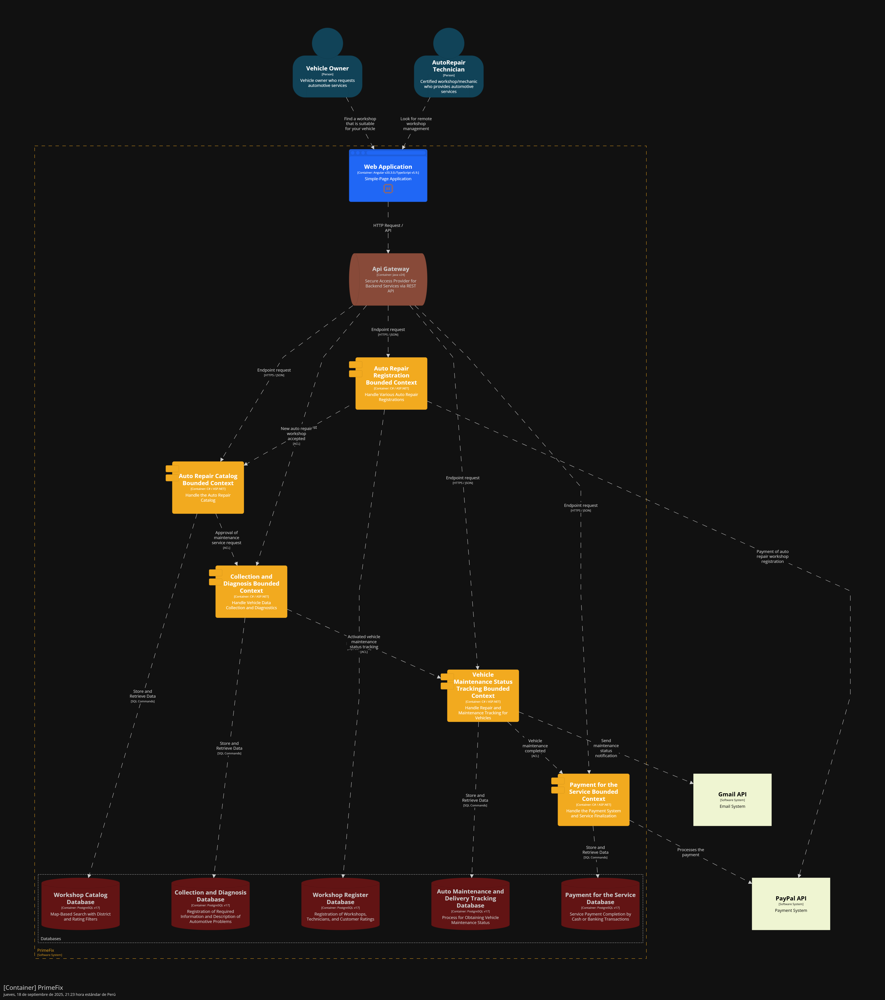
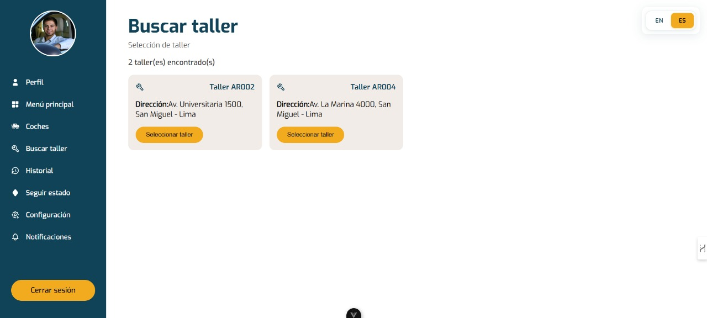

<h2 style="text-align:center">
  
</h2>

<h1 style="text-align:center">Universidad Peruana de Ciencias Aplicadas</h1>

<h3 style="text-align:center; margin-top:18px; margin-bottom:18px;">
  Ingeniería de Software
    
  Curso: Aplicaciones Web
    
  Sección: 7452
    
  Profesor: Hugo Allan Mori Paiva
    
  Semestre: 2025-20
    
  Informe del Trabajo Final
    
  Startup: FixTech
    
  Producto: Prime-Fix
</h3>

<table style="margin: 0 auto; width: auto; display: table; border-collapse: collapse; font-size: 12pt;">
  <thead>
    <tr>
      <th style="border:1px solid #000; padding:6px 12px; text-align:center;">Alumno</th>
      <th style="border:1px solid #000; padding:6px 12px; text-align:center;">Código</th>
    </tr>
  </thead>
  <tbody>
    <tr><td style="border:1px solid #000; padding:6px 12px; text-align:center;">Cesar Augusto Arostegui Alzamora</td><td style="border:1px solid #000; padding:6px 12px; text-align:center;">u202114548</td></tr>
    <tr><td style="border:1px solid #000; padding:6px 12px; text-align:center;">Gianmarco Fabian Jiménez Guerra</td><td style="border:1px solid #000; padding:6px 12px; text-align:center;">u202123843</td></tr>
    <tr><td style="border:1px solid #000; padding:6px 12px; text-align:center;">Giorgio Marzouk Awad Vargas</td><td style="border:1px solid #000; padding:6px 12px; text-align:center;">u202324041</td></tr>
    <tr><td style="border:1px solid #000; padding:6px 12px; text-align:center;">Flor De María Contreras Leon</td><td style="border:1px solid #000; padding:6px 12px; text-align:center;">u202323243</td></tr>
    <tr><td style="border:1px solid #000; padding:6px 12px; text-align:center;">Piero Francesco Tenorio Medina</td><td style="border:1px solid #000; padding:6px 12px; text-align:center;">u202318731</td></tr>
  </tbody>
</table>

 Noviembre 2025 

# Registro de Versiones del Informe  
---

| Versión | Fecha       | Autor(es)                                                                 | Descripción de modificación |
|---------|-------------|---------------------------------------------------------------------------|------------------------------|
|   TB1   | 21/09/2025  | Gianmarco Fabian Jiménez Guerra                                           | Realicé la Descripción de la Startup, User Stories, Product Backlog, Organization Systems, Labeling Systems, Landing Page Wireframe, Landing Page Mock-up, Web Applications Wireframes, Web Applications Wireflow Diagrams, Web Applications Mock-ups, Web Applications User Flow Diagrams, Web Applications Prototyping |
|   TB1   | 21/09/2025  | Cesar Augusto Arostegui Alzamora                                          | Realicé el Ubiquitous Language, Web Applications UX/UI Design, Domain-Driven Software Architecture, Class Diagrams y la Primera versión de la Landing Page, Services & Applications Implementation. |
|   TB1   | 21/09/2025  | Flor De María Contreras Leon                                              | Realicé 1.2.2.1. Lean UX Problem Statements; 1.2.2.2. Lean UX Assumptions; 1.2.2.3. Lean UX Hypothesis Statements; 2.3.1. User Personas; 2.3.2. User Task Matrix; 2.4. Big Picture Event Storming; 3.1. To-Be Scenario Mapping; 3.3. Impact Mapping; 4.1. Style Guidelines; 4.1.1. General Style Guidelines; 4.1.2. Web Style Guidelines; 3.2. User Stories; 3.4. Product Backlog; 5.1. Software Configuration Management; 5.1.1. Software Development Environment Configuration; 5.1.2. Source Code Management; 5.2. Landing Page, Services & Applications Implementation. |
|   TB1   | 21/09/2025  | Giorgio Marzouk Awad Vargas                                               | Realicé Antecedentes y problematica, Lean UX Canvas, Análisis Competitivo, Estrategias y tácticas frente a competidores, User Journey Mapping, Empathy Mapping, Source Code Style Guide & Conventions, Software Deployment Configurations. |
|   TB1   | 21/09/2025  | Piero Francesco Tenorio Medina                                            | Realicé la secciones de User Stories, evaluando cada escenario posible de cada funcionalidad.Tambien el Diagrama de Clase en una versión temprana. Además de hacer los segmentos objetivos del proyecto. Evaluando los posibles usuarios a los que va dirijido el trabajo. |
|   TP1   | 10/10/2025  | Gianmarco Fabian Jiménez Guerra                                           |  En esta entrega desarrollé el Bounded Context de Payment Service, donde implementé las funcionalidades para la gestión de pagos y transacciones. Coordiné con el equipo para asegurar la integración correcta con otros bounded contexts. |
|   TP1   | 10/10/2025  | Cesar Augusto Arostegui Alzamora                                          | En esta entrega desarollé el Bounded Context de IAM y Maintenance Tracking, donde implementé las funcionalidades para la gestión de identidades y el seguimiento de mantenimiento. Coordiné con el equipo para asegurar la integración correcta con otros bounded contexts.|
|   TP1   | 10/10/2025  | Flor De María Contreras Leon                                              | En esta entrega desarollé el Bounded Context de Auto Repair Registration, donde implementé las funcionalidades para la gestión de registros de reparación de automóviles y manejo de los técnicos de los talleres automotrices. Coordiné con el equipo para asegurar la integración correcta con otros bounded contexts. |
|   TP1   | 10/10/2025  | Giorgio Marzouk Awad Vargas                                               | En esta entrega desarrollé el Bounded Context de Auto Repair Catalog, donde implementé las funcionalidades para la búsqueda de talleres con filtros de búsqueda y ubicación. Coordiné con el equipo para asegurar la integración correcta con otros bounded contexts.|
|   TP1   | 10/10/2025  | Piero Francesco Tenorio Medina                                            |  En esta entrega desarrollé el Bounded Context de Data Collection and Diagnosis, donde implementé las funcionalidades para la recolección y gestión de datos del sistema. Coordiné con el equipo para asegurar la integración correcta con otros bounded contexts y comuniqué efectivamente los requisitos técnicos y las decisiones de diseño tomadas.|
|   TB2   | 16/11/2025  | Gianmarco Fabian Jiménez Guerra                                           |  En esta entrega desarrollé el Bounded Context de Payment Service en el apartado del backend, pude formular las preguntas para las entrevistas de validación y realicé una entrevista a un asesor de servicios automotrices. | 
|   TB2   | 16/11/2025 | Piero Francesco Tenorio Medina | En esta entrega me encargue de desarrollar el Bounded Context de Diagnosis and Data Collection en el apartado del backend. Pude compartir mis dudas y las distintas sugerencias de cambio con respecto a distintos apartados del trabajo. |
|   TB2   | 16/11/2025  | Gianmarco Fabian Jiménez Guerra                                           |  En esta entrega desarrollé el Bounded Context de Payment Service en el apartado del backend, pude formular las preguntas para las entrevistas de validación y realicé una entrevista a un asesor de servicios automotrices. |
|   TB2   | 16/11/2025  | Giorgio Marzouk Awad Vargas                                           |  En esta entrega me encargué de desarrollar con la documentación y realización del Sprint 3, incluyendo el objetivo del Sprint 3, Sprint Planning y Sprint Backlog 3. |
|  TB2   | 16/11/2025  | Flor De María Contreras Leon                                              |  En esta entrega participé en la planificación y documentación del Sprint 3, detallando su objetivo, la planificación y su Sprint Backlog. Estas tareas ayudaron a mantener claridad en las actividades del sprint y aseguraron que todos los integrantes tuvieran visibilidad sobre el progreso y las tareas por completar. |
|  TB2   | 16/11/2025  | Cesar Augusto Arostegui Alzamora                                          | En esta entrega participé en la planificación y documentación del Sprint 3, me encargue de mis bounded contexts en el RESTful Web Services y desplegar todo el Web Services con el servicio en la nube de AWS |
|  TF1   | 05/12/2025  | Cesar Augusto Arostegui Alzamora                                          | En esta entrega participé en la planificación y me encargue de mis bounded contexts en el RESTful Web Services, sincronizar el frontend con el backend y desplegar todo el Web Services con el servicio en la nube de AWS |
|  TF1   | 05/12/2025  | Gianmarco Fabian Jiménez Guerra                                          | En esta entrega participé en la planificación y documentación del Sprint 4, me encargue de la mejora y corrección del bounded context PaymentService en el RESTful Web Services.|
|  TF1   | 05/12/2025  | Flor De María Contreras Leon                                          | En esta entrega participé en la planificación y documentación del Sprint 4, apoyo en la implementación de la autenticación JWT.|
|  TF1   | 05/12/2025  | Piero Francesco Tenorio Medina                                          | En esta entrega participé en la planificación y me encargue de corregir y modificar el Bounded Context de Diagnosis and Data Collection así como los tipos de dato de los ID en todos los bounded contexts |
|  TF1   | 05/12/2025  | Giorgio Marzouk Awad Vargas                                          | En esta entrega participé en la planificación y documentación del Sprint 4.|
|  TF1   | 05/12/2025  | Cesar Augusto Arostegui Alzamora                                         | En esta entrega participé en la planificación y me encargue de mis bounded contexts IAM y Maintenance Status Tracking en el RESTful Web Services, sincronizar el frontend con el backend y desplegar todo el Web Services con el servicio en la nube de AWS, junto con el despliegue final de la Landing Page y Frontend Web Applications en Vercel |

# Project Report Collaboration Insights  

|  URL de la organización del proyecto  |             URL del repositorio del reporte          |
| :-----------------------------------: |:----------------------------------------------------:| 
| https://github.com/prime-fix-app-web| https://github.com/prime-fix-app-web/docs |

|  URL del repositorio de la landing page  |             URL del repositorio del frontend          |
| :-----------------------------------: |:----------------------------------------------------:| 
| https://github.com/prime-fix-app-web/landing-page| https://github.com/prime-fix-app-web/frontend |

|          URL del repositorio del backend          |
|:---------------------------------------------------------:|
| https://github.com/prime-fix-app-web/backend |

TB1: 
| Integrante | Tarea Asignada |
|------------|----------------|
|Arostegui Alzamora	, Cesar Augusto| Class Diagrams, Primera versión de la Landing Page, Services & Applications Implementation. |
|Jiménez Guerra, Gianmarco Fabian| Labeling Systems, Landing Page Wireframe, Landing Page Mock-up, Web Applications Wireframes, Web Applications Wireflow Diagrams, Web Applications Mock-ups, Web Applications User Flow Diagrams, Web Applications Prototyping.|
|Awad Vargas, Giorgio Marzouk | Software Deployment Configurations|
|Contreras Leon, Flor De María | Software Configuration Management (Environment y Source Code), Landing Page, Services & Applications Implementation |
|Tenorio Medina, Piero Francesco | Diagrama de Clase (versión temprana) |

*Pull requests evidence*:

TP: 
| Integrante | Tarea Asignada |
|------------|----------------|
|Arostegui Alzamora	, Cesar Augusto| Desarrollo e implementación del Bounded Context de IAM (gestión de identidades) y Maintenance Tracking (seguimiento de mantenimiento). Coordinación de integración con otros Bounded Contexts |
|Jiménez Guerra, Gianmarco Fabian| Desarrollo e implementación del Bounded Context de Payment Service (gestión de pagos y transacciones). Coordinación de integración con otros Bounded Contexts|
|Awad Vargas, Giorgio Marzouk | Desarrollo e implementación del Bounded Context de Auto Repair Catalog (búsqueda de talleres con filtros de búsqueda y ubicación). Coordinación de integración con otros Bounded Contexts|
|Contreras Leon, Flor De María | Desarrollo e implementación del Bounded Context de Auto Repair Registration (gestión de registros de reparación de automóviles y manejo de técnicos). Coordinación de integración con otros Bounded Contexts |
|Tenorio Medina, Piero Francesco | Desarrollo e implementación del Bounded Context de Data Collection and Diagnosis (recolección y gestión de datos del sistema). Coordinación de integración con otros Bounded Contexts y comunicación de requisitos técnicos/decisiones de diseño|

*Pull requests evidence*:

TB2: 
| Integrante | Tarea Asignada |
|------------|----------------|
|Arostegui Alzamora	, Cesar Augusto| Participación en la planificación y documentación del Sprint 3. Desarrollo de sus Bounded Contexts en los RESTful Web Services y despliegue del Web Services en AWS (servicio en la nube) |
|Jiménez Guerra, Gianmarco Fabian| Desarrollo del Bounded Context de Payment Service en el backend. Formulación de preguntas para entrevistas de validación y realización de una entrevista a un asesor de servicios automotrices|
|Awad Vargas, Giorgio Marzouk | Documentación y realización del Sprint 3 (Objetivo, Sprint Planning y Sprint Backlog 3)|
|Contreras Leon, Flor De María | Participación en la planificación y documentación del Sprint 3 (detallando objetivo, planificación y Sprint Backlog |
|Tenorio Medina, Piero Francesco | Desarrollo del Bounded Context de Diagnosis and Data Collection en el backend. Compartir dudas y sugerencias de cambio|

*Pull requests evidence*:

TF: 
| Integrante | Tarea Asignada |
|------------|----------------|
|Arostegui Alzamora	, Cesar Augusto| Participación en la planificación y documentación del Sprint 4. Actualizacion de sus Bounded Contexts en los RESTful Web Services y despliegue del Web Services en AWS (servicio en la nube) |
|Jiménez Guerra, Gianmarco Fabian| Actualizacion del Bounded Context de Payment Service en el backend.|
|Awad Vargas, Giorgio Marzouk | Documentación y realización del Sprint 4 (Objetivo, Sprint Planning y Sprint Backlog 4)|
|Contreras Leon, Flor De María | Participación en la planificación y documentación del Sprint 4 (detallando objetivo, planificación y Sprint Backlog y Actualizacion de sus Bounded Contexts en los RESTful Web Services|
|Tenorio Medina, Piero Francesco | Actualizacion del Bounded Context de Diagnosis and Data Collection en el backend. Compartir dudas y sugerencias de cambio|

*Pull requests evidence*:

---

# Contenido
- [Registro de Versiones del Informe](#registro-de-versiones-del-informe)
- [Project Report Collaboration Insights](#project-report-collaboration-insights)
- [Contenido](#contenido)
- [Student Outcome](#student-outcome)
- [Capítulo I: Introducción](#capítulo-i-introducción)
  - [1.1. Startup Profile](#11-startup-profile)
    - [1.1.1. Descripción de la Startup](#111-descripción-de-la-startup)
    - [1.1.2. Perfiles de integrantes del equipo](#112-perfiles-de-integrantes-del-equipo)
  - [1.2. Solution Profile](#12-solution-profile)
    - [1.2.1. Antecedentes y problemática](#121-antecedentes-y-problemática)
    - [1.2.2. Lean UX Process](#122-lean-ux-process)
      - [1.2.2.1. Lean UX Problem Statements](#1221-lean-ux-problem-statements)
      - [1.2.2.2. Lean UX Assumptions](#1222-lean-ux-assumptions)
      - [1.2.2.3. Lean UX Hypothesis Statements](#1223-lean-ux-hypothesis-statements)
      - [1.2.2.4. Lean UX Canvas](#1224-lean-ux-canvas)
  - [1.3. Segmentos objetivo](#13-segmentos-objetivo)
- [Capítulo II: Requirements Elicitation \& Analysis](#capítulo-ii-requirements-elicitation--analysis)
  - [2.1. Competidores](#21-competidores)
    - [2.1.1. Análisis competitivo](#211-análisis-competitivo)
    - [2.1.2. Estrategias y tácticas frente a competidores](#212-estrategias-y-tácticas-frente-a-competidores)
  - [2.2. Entrevistas](#22-entrevistas)
    - [2.2.1. Diseño de entrevistas](#221-diseño-de-entrevistas)
    - [2.2.2. Registro de entrevistas](#222-registro-de-entrevistas)
    - [2.2.3. Análisis de entrevistas](#223-análisis-de-entrevistas)
  - [2.3. Needfinding](#23-needfinding)
    - [2.3.1. User Personas](#231-user-personas)
    - [2.3.2. User Task Matrix](#232-user-task-matrix)
    - [2.3.3. User Journey Mapping](#233-user-journey-mapping)
    - [2.3.4. Empathy Mapping](#234-empathy-mapping)
  - [2.4. Big Picture Event Storming](#24-big-picture-event-storming)
  - [2.5. Ubiquitous Language](#25-ubiquitous-language)
- [Capítulo III: Requirements Specification](#capítulo-iii-requirements-specification)
  - [3.1. To-Be Scenario Mapping](#31-to-be-scenario-mapping)
  - [3.2. User Stories](#32-user-stories)
  - [3.3. Impact Mapping](#33-impact-mapping)
  - [3.4. Product Backlog](#34-product-backlog)
- [Capítulo IV: Product Design](#capítulo-iv-product-design)
  - [4.1. Style Guidelines](#41-style-guidelines)
    - [4.1.1. General Style Guidelines](#411-general-style-guidelines)
    - [4.1.2. Web Style Guidelines](#412-web-style-guidelines)
  - [4.2. Information Architecture](#42-information-architecture)
    - [4.2.1. Organization Systems](#421-organization-systems)
    - [4.2.2. Labeling Systems](#422-labeling-systems)
    - [4.2.3. SEO Tags and Meta Tags](#423-seo-tags-and-meta-tags)
    - [4.2.4. Searching Systems](#424-searching-systems)
    - [4.2.5. Navigation Systems](#425-navigation-systems)
  - [4.3. Landing Page UI Design](#43-landing-page-ui-design)
    - [4.3.1. Landing Page Wireframe](#431-landing-page-wireframe)
    - [4.3.2. Landing Page Mock-up](#432-landing-page-mock-up)
  - [4.4. Web Applications UX/UI Design](#44-web-applications-uxui-design)
    - [4.4.1. Web Applications Wireframes](#441-web-applications-wireframes)
    - [4.4.2. Web Applications Wireflow Diagrams](#442-web-applications-wireflow-diagrams)
    - [4.4.3. Web Applications Mock-ups](#443-web-applications-mock-ups)
    - [4.4.4. Web Applications User Flow Diagrams](#444-web-applications-user-flow-diagrams)
  - [4.5. Web Applications Prototyping](#45-web-applications-prototyping)
  - [4.6. Domain-Driven Software Architecture](#46-domain-driven-software-architecture)
    - [4.6.1. Design-Level Event Storming](#461-design-level-event-storming)
    - [4.6.2. Software Architecture Context Diagram](#462-software-architecture-context-diagram)
    - [4.6.3. Software Architecture Container Diagrams](#463-software-architecture-container-diagrams)
    - [4.6.4. Software Architecture Components Diagrams](#464-software-architecture-components-diagrams)
  - [4.7. Software Object-Oriented Design](#47-software-object-oriented-design)
    - [4.7.1. Class Diagrams](#471-class-diagrams)
  - [4.8. Database Design](#48-database-design)
    - [4.8.1. Database Diagrams](#481-database-diagrams)
- [Capítulo V: Product Implementation, Validation \& Deployment](#capítulo-v-product-implementation-validation--deployment)
  - [5.1. Software Configuration Management](#51-software-configuration-management)
    - [5.1.1. Software Development Environment Configuration](#511-software-development-environment-configuration)
    - [5.1.2. Source Code Management](#512-source-code-management)
    - [5.1.3. Source Code Style Guide \& Conventions](#513-source-code-style-guide--conventions)
    - [5.1.4. Software Deployment Configuration](#514-software-deployment-configuration)
  - [5.2. Landing Page, Services \& Applications Implementation](#52-landing-page-services--applications-implementation)
    - [5.2.1. Sprint 1](#521-sprint-1)
      - [5.2.1.1. Sprint Planning 1](#5211-sprint-planning-1)
      - [5.2.1.2. Aspect Leaders and Collaborators](#5212-aspect-leaders-and-collaborators)
      - [5.2.1.3. Sprint Backlog 1](#5213-sprint-backlog-1)
      - [5.2.1.4. Development Evidence for Sprint Review](#5214-development-evidence-for-sprint-review)
      - [5.2.1.5. Execution Evidence for Sprint Review](#5215-execution-evidence-for-sprint-review)
      - [5.2.1.6. Services Documentation Evidence for Sprint Review](#5216-services-documentation-evidence-for-sprint-review)
      - [5.2.1.7. Software Deployment Evidence for Sprint Review](#5217-software-deployment-evidence-for-sprint-review)
      - [5.2.1.8. Team Collaboration Insights during Sprint](#5218-team-collaboration-insights-during-sprint)
    - [5.2.2. Sprint 2](#522-sprint-2)
      - [5.2.2.1. Sprint Planning 2](#5221-sprint-planning-2)
      - [5.2.2.2. Aspect Leaders and Collaborators](#5222-aspect-leaders-and-collaborators)
      - [5.2.2.3. Sprint Backlog 2](#5223-sprint-backlog-2)
      - [5.2.2.4. Development Evidence for Sprint Review](#5224-development-evidence-for-sprint-review)
      - [5.2.2.5. Execution Evidence for Sprint Review](#5225-execution-evidence-for-sprint-review)
      - [5.2.2.6. Services Documentation Evidence for Sprint Review](#5226-services-documentation-evidence-for-sprint-review)
      - [5.2.2.7. Software Deployment Evidence for Sprint Review](#5227-software-deployment-evidence-for-sprint-review)
      - [5.2.2.8. Team Collaboration Insights during Sprint](#5228-team-collaboration-insights-during-sprint)
    - [5.2.3. Sprint 3](#523-sprint-3)
      - [5.2.3.1. Sprint Planning 3](#5231-sprint-planning-3)
      - [5.2.3.2. Aspect Leaders and Collaborators](#5232-aspect-leaders-and-collaborators)
      - [5.2.3.3. Sprint Backlog 3](#5233-sprint-backlog-3)
      - [5.2.3.4. Development Evidence for Sprint Review](#5234-development-evidence-for-sprint-review)
      - [5.2.3.5. Execution Evidence for Sprint Review](#5235-execution-evidence-for-sprint-review)
      - [5.2.3.6. Services Documentation Evidence for Sprint Review](#5236-services-documentation-evidence-for-sprint-review)
      - [5.2.3.7. Software Deployment Evidence for Sprint Review](#5237-software-deployment-evidence-for-sprint-review)
      - [5.2.3.8. Team Collaboration Insights during Sprint](#5238-team-collaboration-insights-during-sprint)
    - [5.2.4. Sprint 4](#524-sprint-4)
      - [5.2.4.1. Sprint Planning 4](#5241-sprint-planning-4)
      - [5.2.4.2. Aspect Leaders and Collaborators](#5242-aspect-leaders-and-collaborators)
      - [5.2.4.3. Sprint Backlog 4](#5243-sprint-backlog-4)
      - [5.2.4.4. Development Evidence for Sprint Review](#5244-development-evidence-for-sprint-review)
      - [5.2.4.5. Execution Evidence for Sprint Review](#5245-execution-evidence-for-sprint-review)
      - [5.2.4.6. Services Documentation Evidence for Sprint Review](#5246-services-documentation-evidence-for-sprint-review)
      - [5.2.4.7. Software Deployment Evidence for Sprint Review](#5247-software-deployment-evidence-for-sprint-review)
      - [5.2.4.8. Team Collaboration Insights during Sprint](#5248-team-collaboration-insights-during-sprint)
  - [5.3. Validation Interviews](#53-validation-interviews)
    - [5.3.1. Diseño de Entrevistas](#531-diseño-de-entrevistas)
    - [5.3.2. Registro de Entrevistas](#532-registro-de-entrevistas)
    - [5.3.3. Evaluaciones según heurísticas](#533-evaluaciones-según-heurísticas)
  - [5.4. Video About-the-Product](#54-video-about-the-product)
- [Conclusiones](#conclusiones)
- [Conclusiones y recomendaciones](#conclusiones-y-recomendaciones)
- [Video About-the-Team](#video-about-the-team)
- [Bibliografía](#bibliografía)
- [Anexos](#anexos)

# Student Outcome  

*ABET – EAC - Student Outcome 5*

En el siguiente cuadro se presentan las acciones desarrolladas por el grupo, junto con las conclusiones obtenidas, que respaldan el cumplimiento del logro correspondiente al ABET – EAC - Student Outcome 5.

| Criterio específico | Acciones Realizadas | Conclusiones |
|-----------|-----------|-----------|
| 1. Trabaja en equipo para proporcionar liderazgo    |**Flor De Maria Contreras Leon**   **TB1:**  Trabajé en equipo para proporcionar liderazgo al desarrollar secciones clave de la documentación del proyecto como 1.2.2.1. Lean UX Problem Statements, 1.2.2.2. Lean UX Assumptions y 1.2.2.3. Lean UX Hypothesis Statements. Estas actividades permitieron guiar al equipo en la definición clara de problemas, supuestos e hipótesis, de manera que se estableciera una base conceptual sólida para estructurar el producto. Con ello se fortaleció la organización del trabajo y se aseguró que todos los integrantes tuvieran un marco común de referencia para continuar con el desarrollo.   **TP1:** En el TP1, lideré el desarrollo del Bounded Context de Auto Repair Registration, implementando funcionalidades para la gestión de registros de reparación de automóviles y la administración de técnicos en talleres automotrices. También trabajé en la integración de este contexto con otros bounded contexts, asegurando la coherencia en la implementación del sistema.    **TB2:** Durante el Sprint 3, demostré mis competencias en el desarrollo de software al lograr la integración completa frontend-backend de Prime-Fix, implementando servicios RESTful robustos y pruebas end-to-end.   **TF1:** En esta entrega ejercí liderazgo dentro del equipo al participar activamente en la planificación del Sprint 4 y en la elaboración de su documentación. Guié a mis compañeros en la organización de las tareas y en la definición de los entregables, asegurando que todos tuviéramos claridad sobre el propósito del sprint y los pasos a seguir. Además, brindé soporte técnico en la implementación de la autenticación JWT, contribuyendo a resolver dudas y facilitando el avance del grupo.    **Gianmarco Fabian Jiménez Guerra**   **TB1:**  Logré contribuir y organizarme con el grupo para el desarrollo de Realicé la Descripción de la Startup, User Stories, Product Backlog, Organization Systems, Labeling Systems, Landing Page Wireframe, Landing Page Mock-up, Web Applications Wireframes, Web Applications Wireflow Diagrams, Web Applications Mock-ups, Web Applications User Flow Diagrams, Web Applications Prototyping.  **TP1:** Logré contribuir con: Mejora de algunos Mockups, reorganización de algunas historias de usuario, Sprint 2 (desarrollo de mi bounded context)  **TB2:** Pude contribuir y organizarme con el grupo para el desarrollo de las preguntas de las entrevistas de validación y para realizar una de las entrevistas. Además desarrollé el backend de mi bounded context.   **TF1:** Pude contribuir y organizarme con el grupo para corregir y modificar el backend de mi bounded context con el fin de habilitar la comunicación con otros BC. **Giorgio Marzouk Awad Vargas**   **TB1:** Participé liderando la elaboración de secciones analíticas y estratégicas del informe como Antecedentes y problemática, Lean UX Canvas, Análisis competitivo, Estrategias y tácticas frente a competidores, además de User Journey Mapping, Empathy Mapping, Source Code Style & Conventions y Software Deployment Configurations. Estas contribuciones aportaron claridad al contexto del proyecto, estructuración de la propuesta de valor y lineamientos técnicos de implementación.   **TP1:** Durante el TP1, lideré el desarrollo del Bounded Context de Auto Repair Catalog, implementando funcionalidades clave como la búsqueda de talleres con filtros avanzados y ubicación geográfica. Además, trabajé en la integración de este contexto con otros bounded contexts, asegurando la coherencia en la arquitectura del sistema. También realicé pruebas unitarias para validar las funcionalidades implementadas.    **TB2:** En el TB2 participé en la planificación y documentación del Sprint 3, detallando su objetivo, la planificación y su Sprint Backlog. Estas tareas ayudaron a mantener claridad en las actividades del sprint y aseguraron que todos los integrantes tuvieran visibilidad sobre el progreso y las tareas por completar.    **Piero Francesco Tenorio Media**   **TB1:** Durante el desarrollo del trabajo, realice y participe de manera activa en el grupo de trabajo. Se me llegó a asignar los puntos de Diagrama de Clases, Diagramas de Arquitectura de Software, el desarrollo de las User Stories y el desarrollo de los Segmentos Objetivos.  **TP1:** Para esta entrega se me ha sido asignado el desarrollo del Bounded Context de Data Collection and Diagnosis. Para poder plasmar el BC se solicitó ayuda y opiniones a integrantes del grupo sobre el enfoque que se debería dar a esta funcionalidad, tomando en cuenta opiniones y retroalimentación de cada integrante.   **TB2:** Para esta entrega me vi en la tarea de verificar el funcionamiento de los BC, sugiriendo cambios para un mejor funcionamiento del producto. Trabaje el backend de mi BC designado, implementado y comprobando la distribucion asiganda para cada BC.  **César Augusto Aróstegui Alzamora**   **TB1:** En el desarrollo del proyecto participé en la elaboración del Ubiquitous Language, lo que permitió que todos los integrantes del equipo compartiéramos un mismo entendimiento de los términos del dominio. También diseñé la parte de UX/UI de la aplicación web, propuse la arquitectura de software siguiendo principios de Domain-Driven Design, elaboré diagramas de clases para representar las entidades principales del sistema y realicé la primera versión de la Landing Page, junto con la implementación inicial de servicios y aplicaciones   **TP1:**   Durante el TP1, lideré el desarrollo del Bounded Context de IAM y Maintenance Tracking, implementando funcionalidades clave para la gestión de identidades y el seguimiento de mantenimiento de vehículos. Además, trabajé en la integración de este contexto con otros bounded contexts, asegurando la coherencia en la arquitectura del sistema. También realicé pruebas de integración para validar el correcto funcionamiento del sistema.  **TB2:** Durante la TB2, lideré el desarrollo de los bounded contexts de IAM y Maintenance Tracking en el RESTful Web Services para consiguiente poder desplegarlo en AWS.   **TF1:** En esta entrega final, lideré la sincronización completa entre el frontend y el backend, asegurando que los Bounded Contexts de IAM y Maintenance Status Tracking funcionaran correctamente en el entorno de producción. Además, asumí la responsabilidad del despliegue final de la arquitectura en la nube, configurando los servicios en AWS para el backend y en Vercel para el frontend y la Landing Page.  |**Flor De Maria Contreras Leon**    **TB1:** Mi participación en la elaboración de los apartados vinculados a Lean UX (Problem Statements, Assumptions e Hypothesis Statements) permitió brindar liderazgo en la identificación y organización de los problemas centrales del proyecto. Esto contribuyó a guiar al equipo hacia una visión compartida y a alinear los esfuerzos individuales con los objetivos generales del trabajo.  **TP1:** El desarrollo del Bounded Context de Auto Repair Registration permitió estructurar un sistema eficiente para la gestión de talleres y técnicos. Esto contribuyó a mejorar la organización interna de los talleres y a garantizar una experiencia de usuario más fluida y confiable.   **TB2:** El Sprint 3 culminó con la integración exitosa del frontend y backend de Prime-Fix, estableciendo una arquitectura sólida basada en principios SOLID y patrones CQRS. Esta base técnica robusta, respaldada por pruebas end-to-end y un manejo efectivo de errores, garantiza la escalabilidad y mantenibilidad de la plataforma para futuras evoluciones.   **TF1:** Con esta experiencia reafirmé mi capacidad para asumir liderazgo dentro del equipo, tomando la iniciativa en la planificación y documentación del Sprint 4. El apoyo que brindé en la implementación de la autenticación JWT me permitió fortalecer mi rol como guía técnica, contribuyendo a que el equipo mantenga un rumbo claro y avance de manera coordinada.    **Gianmarco Fabian Jiménez Guerra**   **TB1:** Mi aporte principalmente en el capítulo IV fue de gran ayuda par apoder proporcionar una visión clara de lo que buscamos tener en el aplicativo, ello lo realicé coordinando y organizando las tareas con mis compañeros.  **TP1:** Para esta segunda entrega, pude aportar con algunas correcciones de la entrega anterior y principalmente, en el capítulo V con el desarrollo del bounded context payment-service, para el cual hubo previas coordinaciones con mis compañeros.  **TB2:** Para esta entrega, me centré en las entrevistas de validación y en el desarrollo del bounded context payment-service para el apartado del backend  **TF1:** Para esta entrega, me centré en la mejora del bounded context payment-service para el apartado del backend y en realizar la documentación del Sprint 4.   **Giorgio Marzouk Awad Vargas**   **TB1:** Mis aportes permitieron consolidar el enfoque estratégico y competitivo del proyecto, además de establecer convenciones de código y configuraciones de despliegue que guiarán al equipo en fases posteriores, asegurando coherencia técnica y sostenibilidad en el desarrollo.    **TP1:** Mi liderazgo en el desarrollo del Bounded Context de Auto Repair Catalog permitió consolidar una funcionalidad esencial para los usuarios, asegurando una experiencia fluida y confiable. La integración con otros bounded contexts fortaleció la cohesión del sistema, mientras que las pruebas unitarias garantizaron la calidad del código.    **TB2:** Mis aportes permitieron fortalecer el análisis estratégico del proyecto y establecer bases conceptuales y técnicas que guiaron el trabajo del equipo. Si bien no asumí un rol de liderazgo formal, contribuí activamente al orden, la coherencia y el entendimiento común del proyecto, lo que ayudó a que el equipo pueda avanzar alineado.    **Piero Francesco Tenorio Medina**   **TB1:** Los aportes realizados para los distintos capitulos fueron fundamentales para el desarrollo completo del trabajo. Poder identificar y investigar me permitió centrarnos en el correcto desarrollo del trabajo.   **TP1:** Mi aporte dentro de esta entrega está mas vinculado a la sección de mi Bounded Context. Enlazar las distintas funcionalidades, dentro de lo que abarca lo delimitado, con los demás BC, estableciendo una comunicacion constante con los integrantes del equipo. **TB2:** Los aportes que se realizaron dentro de esta entrega fuen con respecto a mi boudend Context designado, además de entrevistar a las personas designadas, me permitió verificar las distintas funcionaliddes asignadas a la aplicación.   **César Augusto Aróstegui Alzamora**   **TB1:** Estas actividades me permitieron asumir un rol de liderazgo técnico dentro del equipo, ya que ayudaron a organizar el proyecto desde sus primeras fases y a orientar a mis compañeros en la construcción de los entregables. Considero que este trabajo conjunto fortaleció la coordinación del grupo y facilitó que logremos los primeros resultados de manera ordenada y clara.   **TP1:**   Mi liderazgo en el desarrollo del Bounded Context de IAM y Maintenance Tracking permitió consolidar una funcionalidad esencial para la gestión de usuarios y vehículos. La integración con otros bounded contexts fortaleció la interoperabilidad del sistema, mientras que las pruebas garantizaron la calidad y confiabilidad del código.  **TB2:** Mi liderazgo en el desarrollo de los bounded context de IAM y Maintenance Tracking en el RESTful Web Services permitió consolidar liderazgo y contribución al trabajo.   **TF1:** Mi liderazgo en la fase final del proyecto fue crucial para la integración exitosa de todos los componentes del sistema. Al encargarme del despliegue en AWS y Vercel, aseguré que el producto fuera accesible y funcional, consolidando el esfuerzo de todo el equipo en una solución tangible y operativa. |
| 2. Crea un entorno colaborativo, establece metas, planifica tareas y cumple objetivos | **Flor De Maria Contreras Leon**   **TB1:**   Contribuí a crear un entorno colaborativo, estableciendo metas y cumpliendo objetivos mediante la elaboración de entregables como 2.3.1. User Personas, 2.3.2. User Task Matrix, 2.4. Big Picture Event Storming, 3.1. To-Be Scenario Mapping, 3.3. Impact Mapping y 3.2. User Stories, además de secciones técnicas como 4.1. Style Guidelines, 3.4. Product Backlog y la configuración en 5.1. Software Configuration Management. Estas contribuciones hicieron posible cumplir con los objetivos del TB1, fomentar la colaboración entre los integrantes y garantizar insumos consistentes para avanzar en las siguientes fases del proyecto.  **TP1:** Trabajé en equipo para definir las metas y tareas relacionadas con el desarrollo del Bounded Context de Auto Repair Registration. Realicé reuniones periódicas con los integrantes para recibir retroalimentación y ajustar las funcionalidades según las necesidades del proyecto.   **TB2:**  He demostrado capacidad para adaptar mi comunicación escrita a diferentes audiencias. Para el equipo técnico, desarrollé documentación detallada de APIs y arquitectura en el Bounded Context de Collection & Diagnosis. Para stakeholders, redacté reportes de sprint con lenguaje claro centrado en beneficios de la integración frontend-backend. Y mediante commits descriptivos como "Add Application files in Collection and Diagnosis   **TF1:** Durante el desarrollo del Sprint 4 fomenté un ambiente colaborativo, manteniendo comunicación constante con mi equipo y coordinando la distribución de tareas. Apoyé en la definición de metas claras y en la planificación del trabajo necesario para completar la autenticación JWT. Gracias a esta organización logramos cumplir los objetivos del sprint de manera ordenada y eficiente, fortaleciendo nuestro flujo de trabajo colectivo. BC    **Gianmarco Fabian Jiménez Guerra**   **TB1:** Junto con mis compañeros, pude avanzar cada una de mis partes especificadas previamente estableciendo algunas metas semanales y organizándonos mediante reuniones virtuales, ello me permitió cumplir de manera exitosa con cada una de las tareas asignadas.  **TP1:** Para esta entrega, el desarrollo del frontend requería realizar reuniones y coordinacions para asignar cada bounded context a cada integrante. De esta manera, ya se tendrían clara las metas a cumplir para la entrega.  **TB2:** En esta entrega, participé en reuniones donde se aprobaron las preguntas, entrevistas y también se realizó la prueba de lo que codifiqué para el backend.  **TF1:** En esta entrega, pude participar en reuniones virtuales donde se me indicó las modificaciones a realizar sobre el bounded context payment-service.   **Giorgio Marzouk Awad Vargas**   **TB1:** Colaboré en la planificación de tareas relacionadas con la fundamentación del proyecto y la estrategia frente a competidores, lo que aseguró que el equipo tuviera un marco claro para avanzar. Asimismo, mi trabajo en User Journey y Empathy Mapping facilitó la alineación de objetivos del equipo con las necesidades reales de los usuarios.   **TP1:** Colaboré activamente con el equipo para planificar y coordinar las tareas relacionadas con el desarrollo del Bounded Context de Auto Repair Catalog. Participé en reuniones de sincronización para asegurar que las metas del sprint fueran alcanzadas y que las funcionalidades estuvieran alineadas con los objetivos del proyecto.    **TB2:** Participé en la planificación del Sprint 3, aportando en la definición de tareas, prioridades y estructura del backlog. Esto ayudó a organizar el trabajo de manera clara y a asegurar que todos los integrantes avanzaran según los objetivos acordados.    **Piero Francesco Tenorio Medina**   **TB1:** Junto a los integrantes del grupo, pude avanzar con los distintos puntos asignados en el trabajo. Todo gracias a una comunicación constante y acertiva sobre los distintos puntos en los que cada integrante presentaba dudas.   **TP1:** Para esta entrega se estableció la meta de implemntar las distintas funcionalides asignadas para el BC, para ellos se solicitó y se conversó con los distintos integrantes del grupo. Buscando soluciones y realizando pruebas sobre el funcionamiento de las distintas herramientas a utilizar.  **TB2:** Para esta entrea se estableció la meta de construir el funcionamieto de nuestro Backend como grupo con la finalidad de integrarse para la entrega asignada. Cada cambio se evaluó y converso con los disiontos integrantes del grupo.    **César Augusto Aróstegui Alzamora**   **TB1:** Además de las tareas técnicas, apoyé en la planificación de los objetivos iniciales del proyecto, definiendo junto con mis compañeros las metas alcanzables para el sprint. Contribuí a generar un entorno colaborativo compartiendo avances y resolviendo dudas en equipo, especialmente durante la elaboración de la Landing Page y la implementación de los servicios. Las actividades como el Ubiquitous Language y los diagramas de clases también facilitaron la distribución de tareas, ya que sirvieron como guía común para todo el grupo.  **TP1:** Colaboré con el equipo para planificar y coordinar las tareas relacionadas con el desarrollo del Bounded Context de IAM y Maintenance Tracking. Participé en reuniones de sincronización para asegurar que las metas del sprint fueran alcanzadas y que las funcionalidades estuvieran alineadas con los objetivos del proyecto.   **TB2:** Con todas las tareas técnicas, se pudo lograr la planificación efectiva de la documentación con OpenApi y el despliegue efectivo del RESTful Web Services.   **TF1:** Participé activamente en la planificación del Sprint 4, estableciendo objetivos claros para la integración final y el despliegue. Fomenté la colaboración al coordinar con el equipo la sincronización de los servicios, asegurando que cada integrante pudiera validar sus funcionalidades en el entorno desplegado. | **Flor De Maria Contreras Leon**   **TB1:**   Al desarrollar entregables como User Personas, User Task Matrix, Big Picture Event Storming, To-Be Scenario Mapping, Impact Mapping, User Stories y Product Backlog, propicié un entorno colaborativo en el que cada integrante pudo aportar de manera ordenada. Gracias a la planificación de estas tareas y a la definición de metas claras, se alcanzaron los objetivos propuestos en el TB1, consolidando un avance estructurado y efectivo del proyecto.  **TP1:** La colaboración y comunicación constante con el equipo facilitaron el desarrollo exitoso del Bounded Context de Auto Repair Registration. Esto garantizó que las funcionalidades implementadas cumplieran con los requisitos técnicos y de usuario establecidos.   **TB2:** Este proyecto demostró mi capacidad para comunicar efectivamente con diferentes audiencias, adaptando el lenguaje técnico para desarrolladores, stakeholders y usuarios finales. La experiencia reforzó mis competencias en trabajo colaborativo, desarrollo de software calidad y presentación de resultados técnicos de manera clara y persuasiva.   **TF1:** Esta entrega me permitió consolidar un entorno de trabajo colaborativo, donde la comunicación y la planificación fueron claves para cumplir las metas propuestas. La organización del sprint y mi participación activa en las tareas del equipo demostraron mi compromiso por alcanzar los objetivos de forma eficiente, manteniendo siempre una actitud participativa y orientada a resultados.    **Gianmarco Fabian Jiménez Guerra**   **TB1:** Parte importante de mi avance fue desarrollar el aplicativo en Figma, para ello, tuve que establecer metas con el fin de que mis compañeros puedan ver mis avances y poder aprobarlos entre todos. Además, ello me sirvió para reforzar mis conocimientos sobre Figma.  **TP1:** En este caso, lo principal fue desarrollar mi bounded context aplicando lo aprendido en clase y, en este caso, con vistas más personalizadas a lo que corresponde el aplicativo. Con ello, considero que he aprendido más sobre vue y sobre el consumo de apis.  **TB2:** En este avance pude mejorar la manera en la que comprendo los requisitos de desarrollo de software y también pude reforzar lo aprendido en clase sobre el backend junto con el apoyo de mis compañeros.  **TF1:** Este avance me permitió comprender de una mejor manera sobre cómo se une todo el backend de un aplicativo y a su vez cómo se puede sincronizar con el frontend.   **Giorgio Marzouk Awad Vargas**   **TB1:** Mi aporte ayudó a que el grupo tuviera claridad en los antecedentes, contexto y lineamientos técnicos. Esto favoreció la organización colectiva y el cumplimiento de objetivos con base en una visión estratégica y de valor frente al mercado.   **TP1:** La planificación y colaboración constante con el equipo permitieron cumplir con los objetivos del sprint de manera eficiente. Esto aseguró que el Bounded Context de Auto Repair Catalog estuviera completamente integrado y funcional dentro del sistema.    **TB2:** Mi participación contribuyó a generar un entorno colaborativo basado en comunicación constante, claridad de tareas y apoyo mutuo. Las actividades realizadas durante los sprints me permitieron trabajar de manera organizada, adaptarme a los ritmos del equipo y cumplir con los objetivos acordados. El proceso también reforzó mi capacidad para planificar tareas, coordinar actividades y organizar mis responsabilidades dentro del proyecto.    **Piero Francesco Tenorio Medina**   **TB1:** Una de las secciones importantes de lo que he desarrollado seria el planteamiento de algunas User Stories que abarcan un completo Bounded Context. Además de los distintos diagramas, tanto el de Clases y el de Base de Datos. Esto me sirvió para poder reforzar los conocimientos adquiridos previamente.   **TP1:** Gracias al desarrollo de mi Bounded Context pudimos establecer limites y metas claves sobre el trabajo a realizar. Esto llegó a favorecer a los distintos integrantes pertenecientes al grupo sobre la extensión del proyecto.  **TB2:** Gracias al desarrollo del Backend de mi BC pude establecer con mi grupo las limitantes de cada parte asignada. Además de conversar sobre la estructura a seguir para la implmentación a futuro de nuevas caracteristicas.  **César Augusto Aróstegui Alzamora**   **TB1:** Gracias a estas acciones el equipo pudo organizarse mejor y avanzar de forma colaborativa. Se logró cumplir los objetivos del sprint inicial y cada integrante tuvo claro cómo aportar en el desarrollo. Este proceso me permitió mejorar mi capacidad de trabajar en grupo, tomar decisiones en conjunto y valorar la importancia de la planificación para cumplir con los entregables a tiempo.   **TP1:**  La colaboración y planificación efectiva permitieron cumplir con los objetivos del sprint de manera eficiente. Esto aseguró que el Bounded Context de IAM y Maintenance Tracking estuviera completamente integrado y funcional dentro del sistema.    **TB2:** La colaboración y planificación efectiva permitieron cumplir en conjunto y valorar la importancia de la planificación para cumplir con los entregables a tiempo y desplegar correctamente el RESTful Web Services.   **TF1:** La planificación y coordinación en esta etapa final permitieron que el equipo trabajara de manera alineada hacia el despliegue. Mi rol en la sincronización y puesta en producción facilitó que cumpliéramos con los objetivos del curso, entregando un producto de software completo y desplegado. |

# Capítulo I: Introducción
## 1.1. Startup Profile
### 1.1.1. Descripción de la Startup
Prime-Fix es una startup especializada en el desarrollo de soluciones tecnológicas aplicadas a la web, cuyo propósito es transofrmar la forma en que los usuarios acceden a servicios de mantenimiento y reparación automotriz.
Con Prime-Fix nace AutoFix, una plataforma digital cuyo objetivo es facilitar el contacto entre talleres de vehículos y dueños de los mismos implementando una serie de funcionalidades que permitirán a ambos usuarios, obtener una experiencia de gestión clara.

<b>Misión: </b> Nuestra misión es acercar a los dueños de vehículos a talleres confiables por medio de una plataforma accesible y amigable. De esta manera, modernizamos el sector automotriz y optimizamos de toda la experiencia de este tipo de  servicios.

<b>Visión: </b> Tenemos como objetivo posicionarnos como la plataforma líder en Perú para la gestión digital de servicios automotrices, considerando una posible expansión hacia toda América Latina. A su vez, en el futuro se buscará integrar a este proyecto aplicaciones móviles y dispositivos IoT que permitan un mantenmiento inteligente para los vehículos.

### 1.1.2. Perfiles de integrantes del equipo

| Foto | Descripción |
|------|-------------|
|  | Mi nombre es Flor de María Contreras León y actualmente estudio la carrera de Ingeniería de Software en la Universidad Peruana de Ciencias Aplicadas (UPC), sede San Miguel. Tengo 20 años y me considero una persona responsable, comprometida y dedicada a mi formación profesional. Me apasiona la programación y la investigación, áreas en las que busco seguir aprendiendo y desarrollando nuevas habilidades. Aunque me considero una persona callada, siempre estoy atenta a los detalles, lo que me permite trabajar de manera cuidadosa y eficiente en mis proyectos. Asimismo, valoro el trabajo en equipo y creo que un entorno colaborativo y respetuoso es clave para alcanzar los mejores resultados. |
|  | Soy Gianmarco Jiménez alumno de Ingeniería de Software. Me gusta trabajar en equipo pues me permite aprender sobre las ideas que tienen los participantes y contrastarlas con las mías. He utilizado lenguajes como C++, Python, SQL y Java. Estoy muy interesado en aprender todo sobre el desarrollo de aplicaciones web con frameworks. |
|  | Soy Piero Tenorio, estudio en la sede San Miguel de la UPC estudiando la carrera de Ingeniería de Software . Soy una persona colaborativa, responsable y comprometida con los trabajos en los que estoy implicado, tratando de ser lo más eficiente posible.Conocimientos en HTML, CSS, Java, C++, JavaScript y Python. Cada día trato de mejorar como persona y si llego a cometer algún error, tratar de aprender de ello.  |
|  | Soy César Augusto, estudiante de Ingeniería de Software, actualmente con 21 años, mi lenguaje más utilizado y favorito es Python, actualmente adaptándome en JavaScript y estudiando frameworks  relacionados para el Desarrollo Web. |   
|  |Mi nombre es Giorgio Awad, estudio la carrera de Ingenieria de Software y tengo 22 años. Considero ser alguien que aporta ideas nuevas al equipo, que a largo plazo contribuyen con la resolución de cualquier problema que se presente. Asimismo, soy capaz de adaptarme al momento de trabajar en equipo, convirtiéndome en un compañero polifuncional. |

## 1.2. Solution Profile
### 1.2.1. Antecedentes y problemática
El sector automotriz en el Perú y en gran parte de Latinoamérica aún se encuentra rezagado en términos de digitalización de servicios, debido a que la mayoría de talleres funcionan con procesos manuales, tales como agendas físicas, llamadas telefónicas y mensajería web, afectando la trazabilidad de reparaciones y la atención que reciben los dueños de vehículos. Esto genera dificultades para ellos al obstaculizar la búsqueda de talleres confiables hoy en día.

A nivel global, ya existen plataformas que conectan a usuarios con talleres y servicios automotrices, lo que demuestra que hay una tendencia hacia la digitalización dentro de este sector. Sin embargo, en el Perú este modelo no ha sido consolidado y, por ende, se ha retrasado la modernización del servicio al cliente dentro de este sector, aumentando la desorganización en la gestión de talleres, debido a que no se cuenta con sistemas digitales de registro de citas ni sistemas para facilitar el seguimiento de las reparaciones. Según **Manrique (2011)**, los talleres en el Perú requieren de sistemas electrónicos para reservar citas previas a la atención, con el fin de optimizar recursos del taller en cuanto a organización y planificación.

En este contexto, **Fixtech** surge como una startup de base tecnológica que busca cerrar la brecha entre talleres y clientes mediante la creación de nuestro aplicativo **PrimeFix**, el cual tiene como objetivo centralizar la oferta de talleres en un entorno digital que otorgue transparencia, accesibilidad y confianza a los usuarios. 

Además, en Latinoamérica la inversión publicitaria digital en la industria automotriz está creciendo y señalando que los negocios del rubro están obligados a adaptarse al entorno digital para mantenerse competitivos. Por ejemplo, en octubre de 2024, Perú representó aproximadamente un **2,67 % de la inversión digital en publicidad automotriz en LATAM**, lo que indica interés y movimiento en el ecosistema digital automotriz del país (**Similarweb, 2024**).

### 1.2.2. Lean UX Process
#### 1.2.2.1. Lean UX Problem Statements
En el Perú, miles de dueños de vehículos enfrentan a diario la dificultad de acceder a servicios de mantenimiento y reparación de manera confiable y eficiente. La búsqueda de talleres suele convertirse en un proceso poco claro y desgastante, donde predominan la informalidad, la falta de información sobre disponibilidad y la ausencia de canales digitales que faciliten la comunicación. Como consecuencia, muchos conductores pierden tiempo llamando o visitando distintos talleres, enfrentan largas esperas y experimentan desconfianza frente a la calidad y transparencia del servicio recibido.

Al mismo tiempo, los talleres y mecánicos independientes cargan con limitaciones importantes. La gestión de citas se realiza de manera tradicional, mediante llamadas, mensajes o visitas presenciales, lo que genera desorden, sobrecarga de trabajo y pérdida de oportunidades de negocio. La falta de herramientas digitales para organizar horarios, técnicos y clientes impide que los talleres optimicen sus recursos y ofrezcan una experiencia más clara y moderna.

Las entrevistas realizadas revelan que tanto dueños de vehículos como mecánicos perciben esta situación como una limitación significativa y manifiestan el deseo de contar con una plataforma accesible, confiable y estructurada que facilite la comunicación, optimice la gestión de servicios y brinde mayor transparencia a todo el proceso de mantenimiento automotriz.

#### 1.2.2.2. Lean UX Assumptions

##### Suposiciones sobre dueños de vehículos
- Suponemos que los dueños de vehículos buscan talleres confiables y accesibles, pero actualmente enfrentan dificultades para encontrarlos de manera rápida y transparente.

- Suponemos que valoran la posibilidad de conocer horarios y disponibilidad en tiempo real antes de decidir a qué taller acudir.

- Suponemos que prefieren una experiencia digital sencilla, visual y clara, que les ahorre llamadas, visitas y pérdidas de tiempo.

- Suponemos que se sienten más seguros cuando reciben notificaciones y pueden dar seguimiento al servicio solicitado.

- Suponemos que confían más en una plataforma si les brinda transparencia en costos, tiempos y calidad del trabajo.

##### Suposiciones sobre mecánicos / talleres
- Suponemos que los talleres y mecánicos desean atraer más clientes sin sobrecargar sus canales de atención tradicionales.

- Suponemos que necesitan herramientas digitales para organizar técnicos, horarios y disponibilidad de manera eficiente.

- Suponemos que estarían dispuestos a usar una plataforma si esta facilita la comunicación con clientes y reduce la pérdida de citas o confusiones.

- Suponemos que valoran un sistema que les ayude a fidelizar clientes y mejorar su reputación en el mercado.

- Suponemos que los administradores de talleres aceptarían registrar técnicos y disponibilidad si esto aumenta su visibilidad y confianza frente a potenciales clientes.

##### Suposiciones sobre el entorno digital
- Suponemos que la plataforma debe ser accesible desde web y móvil, con una interfaz amigable y moderna.

- Suponemos que las notificaciones automáticas y formularios dinámicos son claves para la interacción fluida entre cliente y taller.

- Suponemos que un modelo freemium o por suscripción podría incentivar a los talleres a sumarse, mientras que la gratuidad inicial para clientes facilitaría la adopción.

- Suponemos que la inclusión de un sistema de reseñas y calificaciones generará confianza y motivará el uso frecuente.

------------

##### User Outcomes
- Que los dueños de vehículos puedan agendar servicios de manera rápida, segura y transparente.

- Que confíen en los talleres registrados y logren ahorrar tiempo en la gestión de mantenimiento y reparación.

- Que los talleres logren digitalizar su gestión interna, mejorando la organización y optimización de recursos.

- Que los mecánicos establezcan una relación más clara y confiable con los clientes, incrementando su fidelización.

##### Business Outcomes
- Lograr una alta adopción inicial entre dueños de vehículos y talleres mecánicos en Lima y posteriormente en otras ciudades del Perú.

- Generar confianza en el mercado automotriz como la primera plataforma digital que centraliza la gestión de citas y servicios.

- Incrementar la conversión de talleres gratuitos a planes de pago mediante funcionalidades premium (ej. mayor visibilidad, métricas de clientes, gestión avanzada de recursos).
  
#### 1.2.2.3. Lean UX Hypothesis Statements

A partir de nuestras asunciones, formulamos las siguientes hipótesis que deben ser validadas con usuarios reales:

1. **Creemos que los dueños de vehículos necesitan una forma confiable y rápida de agendar servicios de mantenimiento o reparación** porque actualmente enfrentan pérdida de tiempo, falta de transparencia y desconfianza en los talleres,entonces, si les ofrecemos una plataforma digital con agenda en línea, disponibilidad en tiempo real y notificaciones  aumentará su confianza y la frecuencia con la que solicitan servicios.

2. **Creemos que los talleres necesitan una herramienta para organizar técnicos, horarios y citas** porque ahora trabajan con sistemas manuales, llamadas y mensajes dispersos, entonces, si les damos un panel de gestión con registro de técnicos, agenda y comunicación integrada podrán atender más clientes de manera ordenada y mejorar su reputación.

3. **Creemos que una plataforma visual, intuitiva y accesible desde web o móvil motivará a los dueños de vehículos a usarla** porque están acostumbrados a aplicaciones simples y rápidas en su vida diaria,entonces, si Prome Fix ofrece una experiencia fluida y amigable, se incrementará la adopción y retención de usuarios.

4. **Creemos que permitir a los dueños de vehículos ver reseñas, calificaciones y disponibilidad en tiempo real aumentará la confianza en los talleres** porque actualmente sienten inseguridad respecto a la calidad y tiempos de atención entonces, si ofrecemos funciones de reseñas y visibilidad de horarios,los usuarios elegirán talleres a través de la plataforma en lugar de buscar por canales informales.

5. **Creemos que un modelo free con funciones básicas gratuitas para talleres y clientes permitirá captar más usuarios porque reduce la barrera de entrada y genera valor desde el primer uso**,entonces, si ofrecemos planes premium con mayor visibilidad, métricas y herramientas avanzadas,lograremos convertir talleres gratuitos en clientes de pago y sostener el crecimiento de la plataforma.
Estas hipótesis serán validadas mediante pruebas con usuarios, entrevistas, prototipos de la plataforma y análisis de métricas de uso.

#### 1.2.2.4. Lean UX Canvas
| **Business Problem** | **Business Outcomes** |
|----------------------|------------------------|
| - El sector automotriz peruano presenta baja digitalización, especialmente en talleres medianos y pequeños. - Los dueños de vehículos enfrentan desconfianza, procesos lentos y falta de transparencia al buscar servicios confiables. - Los talleres gestionan citas y clientes de forma manual, generando pérdidas de tiempo y desorganización. - No existe una plataforma nacional que centralice talleres verificados y permita seguimiento digital de los servicios. | - Digitalizar la gestión de mantenimiento automotriz mediante una plataforma accesible y confiable. - Reducir el tiempo de búsqueda y agendamiento de servicios en al menos un 40%. - Posicionar a **Prime-Fix** como la **primera plataforma peruana** que conecta talleres verificados con conductores. - Aumentar la confianza del usuario mediante reseñas verificadas y transparencia en precios y disponibilidad. - Escalar el modelo a ciudades principales y eventualmente a LATAM. |

| **Users** | **User Outcomes & Benefits** |
|-----------|-------------------------------|
| - **Dueños de vehículos:** buscan confianza, rapidez y transparencia al elegir un taller. - **Administradores de talleres:** necesitan visibilidad digital, mejor organización y fidelización de clientes. | - Los conductores pueden encontrar talleres confiables en minutos, comparar reseñas y agendar sin llamadas ni visitas. - Los talleres optimizan su carga de trabajo con una agenda digital y registro de técnicos. - Se reduce la desconfianza y se establece una relación más transparente y eficiente entre ambas partes. |

| **Hypotheses** | **Solutions** |
|----------------|---------------|
| - Creemos que los **conductores** usarán Prime-Fix si pueden comparar precios, reseñas y disponibilidad en tiempo real. - Creemos que los **talleres** se afiliarán si pueden atraer más clientes y organizar su gestión desde un panel digital. - Creemos que un **modelo freemium** permitirá una adopción inicial rápida y sostenible. - Creemos que incorporar **notificaciones automáticas y diagnóstico digital** aumentará la fidelización de usuarios y talleres. | - Plataforma web que conecta talleres y conductores mediante registro y búsqueda geolocalizada. - **Agenda en línea inteligente** con disponibilidad de técnicos y recordatorios automáticos. - **Panel administrativo** para talleres con gestión de servicios, reseñas y métricas. - **Historial digital de mantenimientos** y diagnósticos en línea. - **Sistema de notificaciones** sobre progreso y entrega del vehículo. - Integraciones futuras con **app móvil** e **IoT** para diagnósticos inteligentes. |

| **What’s the most important thing we need to learn first?** | **What’s the least amount of work we need to do to learn the next most important thing?** |
|-------------------------------------------------------------|------------------------------------------------------------------------------------------------|
| - Validar si los usuarios confían en la plataforma para programar servicios y compartir reseñas reales. - Confirmar que los talleres perciben beneficios concretos al digitalizar su gestión y desean mantenerse activos en el sistema. | - Desarrollar un **MVP funcional** con agendamiento básico y reseñas verificadas. - Realizar **pruebas piloto** con talleres de Lima y usuarios reales. - Medir métricas clave: tasa de reservas, satisfacción del usuario y frecuencia de uso. - Recoger feedback directo y ajustar funcionalidades según los resultados. |

| **Unique Value Proposition (Propuesta de Valor)** | **Key Differentiators (Diferenciadores frente a la competencia)** |
|---------------------------------------------------|--------------------------------------------------------------------|
| “**Prime-Fix** transforma la experiencia automotriz conectando a conductores y talleres mediante una plataforma confiable, moderna y totalmente digital.” | - Primera plataforma peruana que **centraliza talleres verificados**. - **Disponibilidad en tiempo real** y seguimiento digital del vehículo. - **Reseñas verificadas con evidencia** (fotos, comprobantes, historial). - **Modelo freemium** para talleres pequeños que impulsa su digitalización. - Enfoque en **transparencia, trazabilidad y confianza** en todo el proceso de servicio. |

## 1.3. Segmentos objetivo

**Segmento 1: Dueños de vehículos**
**Aspectos Demográficos:**

* Sexo: Masculino y Femenino
* Edades: Entre 22 y 50 años

**Aspectos Geográficos:**

* Zona Geográfica en la que viven: Urbana, ciudad altamente transitada por vehículos.

**Aspectos Psicográficos:**

* Valoran el buen servicio y la eficacia.
* Tienen interés en la calidad del servicio que se le brinda a su vehiculo. 

**Segmento 2: Administrador de taller automotriz**
**Aspectos Demográficos:**

* Sexo: Masculino y Femenino
* Edades: Entre 21 y 50 años
* Ocupación: Dueño, administrador o asesor de servicios de un taller automotriz

**Aspectos Geográficos:**

* Zona Geográfica en la que viven: Urbana, ciudad altamente transitada por vehículos.
* Ubicacion del taller: Cercana a avenidas transitadas, zonas industriales o barrios con alta circulación vehicular.

**Aspectos Psicográficos:**

* Valoran la organizacion y eficiencia en la gestión de clientes.
* Interés en fidelizar clientes y mejroar la reputación de su taller.
* Buscan soluciones tecnológicas que les permitan optimizar el tiempo y reducir errores dentro del taller.

---

# Capítulo II: Requirements Elicitation & Analysis
## 2.1. Competidores
### 2.1.1. Análisis competitivo
En el mercado peruano de servicios automotrices, los competidores se pueden clasificar en tres grupos principales:  

1. **Competidores directos digitales**  
   - **Talleres con plataformas propias:** Algunos talleres grandes ya cuentan con páginas web o sistemas básicos de reservas en línea. Sin embargo, suelen ser limitados a un solo local y no agrupan múltiples opciones.  
   - **Aplicativos de búsqueda genéricos (Google Maps, Facebook, OLX Autos):** Son usados por conductores para encontrar talleres cercanos, pero no ofrecen trazabilidad, gestión de citas ni transparencia en precios y reputación.  

2. **Competidores indirectos tradicionales**  
   - **Talleres pequeños y medianos:** Se promocionan en redes sociales y captan clientes por recomendaciones. Su fortaleza es el trato cercano, pero carecen de procesos digitales estandarizados.  
   - **Agencias oficiales de marcas automotrices:** Tienen sistemas organizados y reputación fuerte, pero sus costos son altos y no son accesibles para la mayoría de conductores.  

3. **Referentes internacionales (benchmarking)**  
   - **Autofix (México), Carfix (Brasil), ClickMechanic (UK):** Plataformas que conectan talleres con usuarios, ofreciendo reservas online, reseñas y diagnósticos digitales. Estas soluciones muestran una tendencia clara hacia la digitalización del sector y sirven de inspiración para Prime-Fix, aunque aún no existe un actor consolidado en Perú.  

**Hallazgos clave del análisis:**  
- La **informalidad y falta de confianza** en talleres es el principal dolor de los usuarios.  
- Las **herramientas actuales no garantizan trazabilidad ni transparencia**.  
- Existe una **oportunidad de primer mover** en Perú para centralizar la gestión digital de talleres.  
- Los usuarios ya están acostumbrados a usar apps y redes sociales, por lo que la barrera de adopción tecnológica es baja.

| **Fortalezas** | **Oportunidades** |
|----------------|-------------------|
| - Plataforma innovadora en el Perú que centraliza la gestión de talleres y clientes. | - Creciente tendencia hacia la digitalización en el sector automotriz en Latinoamérica. |
| - Funcionalidades diferenciales: reseñas verificadas, disponibilidad en tiempo real, historial digital de mantenimientos. | - Aumento de la inversión en publicidad digital automotriz en Perú. |
| - Modelo freemium que facilita la captación de talleres y clientes desde la etapa inicial. | - Falta de plataformas consolidadas en el país, lo que ofrece ventaja de ser pioneros. |
| - Equipo multidisciplinario con visión tecnológica y conocimiento del mercado local. | - Posibilidad de expansión a mercados regionales (Arequipa, Trujillo, luego LATAM). |

| **Debilidades** | **Amenazas** |
|-----------------|---------------|
| - Dependencia inicial de la confianza de talleres y clientes para generar adopción. | - Competidores internacionales podrían ingresar al mercado peruano con más recursos. |
| - Recursos limitados para competir en marketing frente a grandes agencias automotrices. | - La informalidad en talleres pequeños puede dificultar la adopción digital. |
| - Riesgo de complejidad tecnológica en la implementación de funcionalidades avanzadas (IoT, app móvil). | - Posible desconfianza de usuarios al inicio respecto a pagos y transparencia en reseñas. |
| - Necesidad de soporte continuo y capacitación para talleres menos digitalizados. | - Cambios regulatorios en el sector automotriz que afecten la operación de talleres. |

### 2.1.2. Estrategias y tácticas frente a competidores
**Estrategia de diferenciación (vs. talleres tradicionales y Google Maps):**  
- Posicionarse como **plataforma de confianza**: incluir reseñas verificadas, historial de mantenimientos y diagnósticos digitalizados.  
- Integrar **disponibilidad en tiempo real** y notificaciones automáticas, algo que no ofrecen ni talleres pequeños ni buscadores generales.  

**Estrategia de penetración (vs. plataformas digitales incipientes):**  
- Implementar un **modelo freemium**: talleres pueden registrarse gratis con funciones básicas y luego acceder a planes premium con visibilidad destacada y métricas avanzadas.  
- Fomentar la **adopción rápida** con campañas de marketing digital enfocadas en dueños de vehículos jóvenes y en talleres medianos que necesitan visibilidad.  

**Estrategia de fidelización (vs. agencias oficiales de marcas):**  
- Ofrecer precios accesibles con un **sistema de comparación transparente** de costos y tiempos de servicio.  
- Incorporar **programas de fidelización digital** (recordatorios de mantenimientos preventivos, descuentos para clientes recurrentes).  

**Tácticas específicas:**  
- **Alianzas estratégicas:** Convenios con aseguradoras, universidades y flotas empresariales para captar usuarios masivos.  
- **Marketing de confianza:** Campañas en redes sociales con casos reales de clientes satisfechos, enfatizando seguridad y transparencia.  
- **Innovación constante:** A futuro, integrar IoT (dispositivos de diagnóstico vehicular) y una app móvil que facilite el seguimiento en tiempo real.  
- **Expansión escalonada:** Iniciar en Lima Metropolitana (alta densidad vehicular) y luego expandir hacia ciudades con gran parque automotor (Arequipa, Trujillo).  

## 2.2. Entrevistas

### 2.2.1. Diseño de entrevistas

Segmento #1: Dueños de vehículos 
"Buenos días/tardes/noches 'Nombre del entrevistado'. Mi nombre es 'Nombre del entrevistador' de la startup FixTech. Nos encontramos desarrollando una plataforma para que los dueños de vehículos tengan la facilidad de programar sus visitas a talleres de reparación de autos, hacer seguimiento al servicio y ver el diagnóstico de la falla detectada. En base a ello, tengo preparadas una lista de preguntas para conocer su punto de vista sobre algunos temas importantes para nuestra plataforma."

Preguntas:
1. ¿Ha realizado la búsqueda de algún taller durante los últimos meses? De ser así, ¿Podría comentarnos su experiencia?
2. ¿Qué plataformas o medios utiliza para realizar la búsqueda de talleres cuando su vehículo necesita reparación?
3. ¿Qué aspectos valora más en un servicio de taller? (distancia, disponibilidad, costo)
4. ¿Ha tenido experiencias negativas con talleres? De ser así, ¿Le hubiera gustado registrar dichas experiencias de manera pública?
5. ¿Usted mantiene un registro de su vehículo y del mantenimiento que le ha brindado durante todo este tiempo?
6. ¿Ha dejado su vehículo en un taller durante días u horas? ¿Cómo se le avisa que su vehículo ya está listo?
7. ¿Con qué dispositivo suele solicitar el servicio de mantenimiento?
8. ¿Qué herramientas o software utiliza para encontrar algún taller cerca de una ubicación específica?
9. Una vez terminado el servicio ¿Qué medios de pago utiliza? (efectivo, transferencia, etc)
11. ¿Estaría interesado en usar una plataforma que le permita agendar visita en talleres de su zona? ¿Por qué?
12. ¿Qué funcionalidades cree que harían que esta plataforma sea útil para el día a día?
13. ¿Se sentiría cómodo recibiendo algunos recordatorios de mantenimiento preventivo desde una app?
14. ¿Estaría de acuerdo con utilizar un aplicativo web para agilizar la programación de sus visitas?
15. ¿Le gustaría hacer seguimiento al estado de su vehículo mientras este se encuentra en mantenimiento?

Segmento #2: Asesor de servicios de un taller automotriz 
"Buenos días/tardes/noches 'Nombre del entrevistado'. Mi nombre es 'Nombre del entrevistador' de la startup FixTech. Nos encontramos desarrollando una plataforma para que los talleres tengan la facilidad de agendar y hacer seguimiento a las visitas de posibles clientes que solicitan la reparación de sus autos. En base a ello, tengo preparadas una lista de preguntas para conocer su punto de vista sobre algunos temas importantes para nuestra plataforma."

Preguntas:
1. Actualmente, ¿Cómo consigue clientes para el taller?
2. ¿En qué medio promociona sus servicios?
3. ¿Qué dispositivo se suele utilzar en la empresa para la programación de visitas de clientes? (celular, computadora de escritorio, laptop, etc)
4. ¿Encuentra dificultades al competir con talleres más grandes? De ser así ¿Podrías describirlas?
5. ¿Cómo gestiona los pedidos o solicitudes de servicios de reparación? (ej. llamadas, WhatsApp o visitas directas)
6. ¿Ha tenido algún reclamo sobre el desempeño de los técnicos? ¿Podría detallar más la experiencia? ¿Por qué medios se presentaron estos reclamos?
7. ¿Cómo maneja la información sobre los técnicos? ¿Cuenta con una base de datos?
8. ¿Qué tan importante consideraría mostrar la disponibilidad de sus técnicos en tiempo real?
9. ¿Qué tanto te ayudaría una plataforma donde puedas registrar tu taller, los técnicos y mostrar reseñas de clientes?
10. ¿Qué funcionalidades le añadirías a la plataforma?
11. ¿Le parece importante que el cliente sepa en qué estado se encuentra su vehículo y cuál es su diagnóstico final?
12. ¿Estaría interesado en una plataforma que notifique al cliente el momento en que puede recoger su vehículo?

### 2.2.2. Registro de entrevistas

### Segmento 1: Dueños de Vehiculos

##### Entrevista N°1: Dionisio Rodriguez

- Sexo: Masculino
- Edad:25 años
- Dirección: Lima, Av Arequipa Miraflores.

 |

**Link De la Entrevista:** **<https://upcedupe-my.sharepoint.com/:v:/g/personal/u202323243_upc_edu_pe/EZqmOelsxipLu6PdtBXftbsBmEjUS50k-dWYf3z7AC2i_w?nav=eyJyZWZlcnJhbEluZm8iOnsicmVmZXJyYWxBcHAiOiJTdHJlYW1XZWJBcHAiLCJyZWZlcnJhbFZpZXciOiJTaGFyZURpYWxvZy1MaW5rIiwicmVmZXJyYWxBcHBQbGF0Zm9ybSI6IldlYiIsInJlZmVycmFsTW9kZSI6InZpZXcifX0%3D&e=a5g003>** 
Duracion:**00:05:02**&nbsp;&nbsp;&nbsp;&nbsp;&nbsp;Inicio:**00:00:31**&nbsp;&nbsp;&nbsp;&nbsp;Final:**00:05:02**
Dionisio Rodríguez, de 25 años, es conductor de automóvil y comentó que al momento de elegir un taller prioriza la confianza en el servicio, incluso si esto implica desplazarse a zonas más lejanas. Para ubicar opciones suele utilizar Google Maps, aunque reconoce que no siempre refleja la calidad real del taller. Señaló que en una ocasión tuvo una experiencia negativa, pues su vehículo fue dañado en un taller y los responsables no asumieron la reparación, lo que generó desconfianza y la necesidad de contar con mecanismos de referencia más seguros.Asimismo, resaltó que le resultaría valioso contar con una plataforma que permita no solo agendar visitas a talleres, sino también hacer seguimiento en tiempo real al estado del vehículo mientras se encuentra en mantenimiento. Además, considera importante que los usuarios puedan registrar y compartir públicamente sus experiencias, ya que esto ofrecería mayor transparencia y ayudaría a otros conductores a tomar mejores decisiones.

##### Entrevista N°2: Marcos Contreras
- Sexo: Masculino
- Edad:24 años
- Dirección: Lima, Independencia.

 

**Link De la Entrevista:** **<https://upcedupe-my.sharepoint.com/:v:/g/personal/u202318731_upc_edu_pe/EU-OfAcUkxlLsrpkalhCNRQBkang9sWzDtFzbJ4EEzaXvQ?e=Rq6OAR&nav=eyJyZWZlcnJhbEluZm8iOnsicmVmZXJyYWxBcHAiOiJTdHJlYW1XZWJBcHAiLCJyZWZlcnJhbFZpZXciOiJTaGFyZURpYWxvZy1MaW5rIiwicmVmZXJyYWxBcHBQbGF0Zm9ybSI6IldlYiIsInJlZmVycmFsTW9kZSI6InZpZXcifX0%3D>** 
Duracion:**00:06:45**&nbsp;&nbsp;&nbsp;&nbsp;&nbsp;Inicio:**00:00:01**&nbsp;&nbsp;&nbsp;&nbsp;Final:**00:05:45**
Marcos Contreras es un joven de 24 años quien trabaja y estudia de manera paralela. Marcos nos cuenta que el tiene un vehiculo por la cual facilita movilizarse dentro de la ciudad. Marcos nos comenta que a la hora de encontrar un buen servicio que pueda atender a su vehículo, más que nada resalta que no llega a encontrar un lugar accesible. Marcos tambien nos cuenta que utiliza Google Maps,WhastApp e incluso Fcaebook para poder encontrar un taller que sea recomendado. Nos dice que valora la confianza y la calidad sobre el precio dentro de un servicio. Dentro de las experiencia negativas nos cuenta que si llego a presentar alguna, en la entrega de su vehículo. Finalmente, Marcos resalta que una aplicación que le ayude a gestionar los talleres a los que va, le puede hacer de mucha utilidad en su día a día. Que implemente funcionalidades que sean pertinentes para él como las agendas y las ubicaciones en mapas.

##### Entrevista N°3: Anyelo Alejos
- Sexo: Masculino
- Edad: 23 años
- Dirección: Lima, Comas.

**Link De la Entrevista:** **<https://upcedupe-my.sharepoint.com/:v:/g/personal/u202318731_upc_edu_pe/EbUouuLCEqlGvWQEGCCiPf4B8TQJNZIvqrxVh6ufl-rZQQ?e=zp4nf9&nav=eyJyZWZlcnJhbEluZm8iOnsicmVmZXJyYWxBcHAiOiJTdHJlYW1XZWJBcHAiLCJyZWZlcnJhbFZpZXciOiJTaGFyZURpYWxvZy1MaW5rIiwicmVmZXJyYWxBcHBQbGF0Zm9ybSI6IldlYiIsInJlZmVycmFsTW9kZSI6InZpZXcifX0%3D>** 
Duracion:**00:05:40**&nbsp;&nbsp;&nbsp;&nbsp;&nbsp;Inicio:**00:00:01**&nbsp;&nbsp;&nbsp;&nbsp;Final:**00:05:40**
Anyelo Alejos es un chico de 23 años de edad. Él solo estudia pero cuenta con un Vehiculo para movilizarse a su centro de estudios. Él comenta que utiliza apliaciones como Google Maps para poder encontrar un taller que le sea pertinente, pero tambien lo busca de manera manual. Él valora aspectos como la confiabilidad dentro de un taller. Además, cuenta que no tuvo problemas con los talleres. Él suele solicitar servicios por un móvil y raras veces de manera manual. Anyelo comenta que le gustaría tener una aplicación que le ayude a a gendar citas en talleres para su vehículo, teniendo funcionalidades como reseña, precios y calificaciones de talleres.

### Segmento #2: Asesor de servicios de un taller automotriz

##### Entrevista N°1: Jesús Valenzuela

- Sexo: Masculino
- Edad:21 años
- Dirección: Lima, San Miguel.

 
**Link De la Entrevista:** **<https://upcedupe-my.sharepoint.com/:v:/g/personal/u202123843_upc_edu_pe/EYVM_zdjduJKtn1KgPIWBJMB0jBtWI7znAkA--v8FtmlRA?nav=eyJyZWZlcnJhbEluZm8iOnsicmVmZXJyYWxBcHAiOiJPbmVEcml2ZUZvckJ1c2luZXNzIiwicmVmZXJyYWxBcHBQbGF0Zm9ybSI6IldlYiIsInJlZmVycmFsTW9kZSI6InZpZXciLCJyZWZlcnJhbFZpZXciOiJNeUZpbGVzTGlua0NvcHkifX0&e=IIHRcz>** 
Duracion:**00:06:31**&nbsp;&nbsp;&nbsp;&nbsp;&nbsp;Inicio:**00:00:05**&nbsp;&nbsp;&nbsp;&nbsp;Final:**00:06:31**
Jesús Valenzuela es un joven asesor de servicios de reparación del taller Alvillantas, nos comenta que para atraer clientes, utiliza las redes sociales como Facebook y TikTok y una landing page. El entrevistado comenta que no siente que el taller donde trabaja sea afectado por la competencia dada su ubicación estratégica junto con la de sus otras sedes. Jesús menciona que la gestión de las solicitudes de servicios se realizan principalmente mediante WhatsApp, también reciben llamadas telefónicas y visitas directas al taller. En cuanto al desempeño de los técnicos y los servicios brindados, sí han recibido cierta retroalimentación. Se menciona que la gestión de los técnicos y de su información es un poco desordenada; sin embargo, considera interesante la idea de digitalizar ello y permitir que los clientes puedan conocer la disponibilidad de los trabajadores en tiempo real. El asesor menciona que en su taller se hace uso de un software llamado Qumpa para la gestión de su inventario de llantas de manera organizada, pero le parece interesante una plataforma que pueda ser utilizada por el cliente para la gestión de visitas con el fin de agilizar el proceso. Jesús menciona que este aplicativo puede ser de gran utilidad si cuenta con notificaciones para que el cliente pueda estar atento al estado de su vehículo. El diagnóstico de las fallas que ofrecen en Alvillantas se realiza mediante un documento físico, por lo que Jesús considera que podría ser buena idea virtualizar esta función para que el cliente pueda obtener esta información en sus dispositivos. Para finalizar, recalcó lo importante que es tener una plataforma con todas las funcionalidades mencionadas para garatizarle un buen servicio al cliente.

##### Entrevista N°2: William Espinoza

- Sexo: Masculino
- Edad: 47 años
- Dirección: Lima, San Miguel.

**Link De la Entrevista:** **<https://upcedupe-my.sharepoint.com/:v:/g/personal/u202114548_upc_edu_pe/EYKmpMYFGk5BnxR4GI37EcsBrQaCB2q7n-PhGydUdeJAvg?nav=eyJyZWZlcnJhbEluZm8iOnsicmVmZXJyYWxBcHAiOiJPbmVEcml2ZUZvckJ1c2luZXNzIiwicmVmZXJyYWxBcHBQbGF0Zm9ybSI6IldlYiIsInJlZmVycmFsTW9kZSI6InZpZXciLCJyZWZlcnJhbFZpZXciOiJNeUZpbGVzTGlua0NvcHkifX0&e=zfkZrQ>**
Duracion:**00:03:53**&nbsp;&nbsp;&nbsp;&nbsp;&nbsp;Inicio:**00:00:01**&nbsp;&nbsp;&nbsp;&nbsp;Final:**00:03:53**
William Espinoza se desempeña en el área de almacén, repuestos y mantenimiento de un taller automotriz. Comenta que la captación de clientes se realiza principalmente a través de redes sociales y avisos publicitarios en la puerta del local. Para la programación de visitas utilizan una computadora con Excel. Señala que no perciben dificultades frente a talleres más grandes, ya que la atención depende más de la capacidad instalada que de la competencia.
La gestión de pedidos se lleva a cabo mediante un diagnóstico inicial, tras el cual se presenta al cliente una cotización del repuesto y del servicio requerido. Ha recibido algunos reclamos relacionados con la actitud o comunicación de los técnicos, normalmente de forma presencial. Explica que cuentan con una base de datos para evaluar la trayectoria de los técnicos y destaca la importancia de mostrar la disponibilidad de los mismos en tiempo real, pues considera que esto transmite confianza y rapidez al cliente.
Respecto a la posibilidad de digitalizar procesos, considera útil una plataforma que permita registrar el taller, técnicos y reseñas de clientes, resaltando que dicha información debería estar disponible también para los usuarios externos. Actualmente, la comunicación del estado del vehículo y los diagnósticos finales se realiza mediante WhatsApp, enviando fotos o videos desde el área técnica al área administrativa y de allí al cliente. Valora positivamente la idea de una plataforma que notifique cuándo el vehículo está listo para ser recogido y que permita al técnico subir directamente la información para que el cliente la consulte en línea. En conclusión, William considera que una herramienta digital con estas funcionalidades resultaría de gran utilidad para mejorar la transparencia y la experiencia del cliente.

##### Entrevista N°3: Héctor Cárdenas

- Sexo: Masculino
- Edad: 35 años
- Dirección: Lima, San Miguel.

**Link De la Entrevista:** **<https://upcedupe-my.sharepoint.com/:v:/g/personal/u202114548_upc_edu_pe/EWUY_frgM_RKtA929ZLKHA0Bd6suNWEVHuj-_ofQHR_Ecg?e=1yRvjo&nav=eyJyZWZlcnJhbEluZm8iOnsicmVmZXJyYWxBcHAiOiJTdHJlYW1XZWJBcHAiLCJyZWZlcnJhbFZpZXciOiJTaGFyZURpYWxvZy1MaW5rIiwicmVmZXJyYWxBcHBQbGF0Zm9ybSI6IldlYiIsInJlZmVycmFsTW9kZSI6InZpZXcifX0%3D>**
Duracion:**00:05:26**&nbsp;&nbsp;&nbsp;&nbsp;&nbsp;Inicio:**00:00:01**&nbsp;&nbsp;&nbsp;&nbsp;Final:**00:05:26**
Héctor Cárdenas es un joven asesor de servicios de reparación del taller Alvillantas, nos comenta que para atraer clientes, utiliza las redes sociales como Facebook y TikTok y una landing page. El entrevistado comenta que no siente que el taller donde trabaja sea afectado por la competencia dada su ubicación estratégica junto con la de sus otras sedes. Jesús menciona que la gestión de las solicitudes de servicios se realizan principalmente mediante WhatsApp, también reciben llamadas telefónicas y visitas directas al taller. En cuanto al desempeño de los técnicos y los servicios brindados, sí han recibido cierta retroalimentación. Se menciona que la gestión de los técnicos y de su información es un poco desordenada; sin embargo, considera interesante la idea de digitalizar ello y permitir que los clientes puedan conocer la disponibilidad de los trabajadores en tiempo real. El asesor menciona que en su taller se hace uso de un software llamado Qumpa para la gestión de su inventario de llantas de manera organizada, pero le parece interesante una plataforma que pueda ser utilizada por el cliente para la gestión de visitas con el fin de agilizar el proceso. Jesús menciona que este aplicativo puede ser de gran utilidad si cuenta con notificaciones para que el cliente pueda estar atento al estado de su vehículo. El diagnóstico de las fallas que ofrecen en Alvillantas se realiza mediante un documento físico, por lo que Jesús considera que podría ser buena idea virtualizar esta función para que el cliente pueda obtener esta información en sus dispositivos. Para finalizar, recalcó lo importante que es tener una plataforma con todas las funcionalidades mencionadas para garatizarle un buen servicio al cliente.

### 2.2.3. Análisis de entrevistas
**Segmento 1:**

**Entrevista 1:** Dionisio enfatiza la importancia de la confianza en los talleres, incluso por encima de la distancia. Relata experiencias previas negativas, como daños en su vehículo sin que se asumiera responsabilidad, lo que evidencia la necesidad de referencias verificadas y seguimiento en tiempo real.

**Entrevista 2:** Marcos también valora la confianza y la calidad del servicio por encima del precio. Busca seguridad y buenas recomendaciones para evitar inconvenientes, recurriendo a Google Maps y WhatsApp como principales canales digitales para informarse.

**Entrevista 3:** Anyelo combina la búsqueda digital con revisiones manuales y destaca la importancia de reseñas, precios y calificaciones confiables. Al igual que los demás, prioriza la confianza y la transparencia.

**Resumen:** Los entrevistados coinciden en la necesidad de una **aplicación centralizada** que les permita agendar citas, acceder a reseñas de otros usuarios, verificar precios y hacer seguimiento en tiempo real. Sus experiencias negativas previas refuerzan la demanda de transparencia, responsabilidad en reparaciones y fuentes confiables de información.

**Segmento #2**

Total de entrevistados: 3

Datos sobre las preguntas:
  - 100% usa las redes sociales para promocionarse
  - 33% tiene dificultades al momento de competir con talleres más grandes
  - 67% no maneja una base de datos para la gestión de técnicos
  - 100% opina que la plataforma es buena idea

En resumen, la información brindada por este segmento es muy similar a lo previsto. Todos los talleres tienen algunas dificultados para mejorar la calidad de su servicio y todos consideran que Prime-Fix podría ser una muy buena plataforma que implementarían en sus talleres.

A continuación se mostrará de manera gráfica el análisis de las preguntas más relevantes:

**Redes sociales para promoción**

**Competencia con talleres más grandes**

**Base de datos para los técnicos**

**Opinión de Prime-Fix**

## 2.3. Needfinding
### 2.3.1. User Personas
Esta sección presenta dos arquetipos desarrollados para representar a los segmentos objetivos de Prime-Fix: Conductores de Autos y Administradores de talleres automotriz.

#### User Persona - Segmento 1 : Dueño de vehículo

- **Nombre:** José Ramírez
- **Edad:** 29 años
- **Género:** Masculino
- **Ocupación:** Analista de marketing digital
- **Ubicación:** Lima, Perú
- **Acceso digital:** Smartphone con conexión de datos móviles, laptop con internet en casa

**Objetivos y necesidades**

- Encontrar talleres confiables que garanticen un buen servicio.

- Poder agendar citas de manera rápida y sin pérdida de tiempo.

- Hacer seguimiento al estado de su vehículo mientras está en reparación.

- Tener transparencia en costos, tiempos y disponibilidad.

- Consultar reseñas reales de otros clientes antes de elegir un taller.

**Frustraciones**

- Pérdida de tiempo al llamar o visitar talleres para preguntar disponibilidad.

- Desconfianza hacia talleres informales por malas experiencias.

- Falta de seguimiento y comunicación clara sobre el estado del vehículo.

- No tener un historial organizado de mantenimientos realizados.

**Comportamientos digitales**

- Usa Google Maps y WhatsApp para buscar y comunicarse con talleres.

- Confía en reseñas en línea, pero reconoce que no siempre son fiables.

- Prefiere plataformas móviles rápidas y fáciles de usar.

**Frase representativa**

"Quiero un taller en el que pueda confiar y que me ahorre tiempo en llamadas innecesarias."

------------
#### User Persona - Segmento 2: Administrador de taller automotriz

- **Nombre:** Jorge Salazar
- **Edad:** 38 años
- **Sexo:** Masculino
- **Ocupación:** Administrador y dueño de un taller automotriz en Lima (zona industrial)
- **Ubicación:** Lima – Cercado de Lima

**Objetivos y necesidades**

- Organizar mejor las citas y disponibilidad de sus técnicos.

- Ofrecer a sus clientes un servicio más moderno y confiable.

- Aumentar la visibilidad del taller en internet para captar nuevos clientes.

- Fidelizar clientes con transparencia y comunicación constante.

- Reducir los reclamos por falta de información o retrasos.

**Frustraciones**

- No contar con una base de datos centralizada de clientes y técnicos.

- Pérdida de clientes por saturación de horarios y mala organización.

- Dificultad para competir con talleres grandes que tienen más visibilidad.

- Manejo desordenado de la información en medios dispersos (llamadas, mensajes, hojas).

**Comportamientos digitales**

- Usa Facebook y WhatsApp para promocionar su taller.

- Maneja citas en cuadernos y hojas de cálculo básicas.

- Tiene interés en soluciones digitales, pero necesita que sean simples y rápidas de implementar.

**Frase representativa**

"Necesito una herramienta que me ayude a organizar mi taller y mostrarle a los clientes que somos confiables."
### 2.3.2. User Task Matrix

Los segmentos considerados son:

Conductores de Autos (Jose Ramirez)
Administradores de Talleres Mecanicos(Jorge Salazar)

| **Tarea** | **Dueño de vehículo – Frecuencia** | **Dueño de vehículo – Importancia** | **Administrador de taller – Frecuencia** | **Administrador de taller – Importancia** |
|-----------|-------------------------------------|-------------------------------------|------------------------------------------|-------------------------------------------|
| Buscar talleres de confianza en internet | Alta | Alta | Media | Alta |
| Agendar una cita de mantenimiento/reparación | Media | Alta | Alta | Alta |
| Hacer seguimiento al estado del vehículo en el taller | Media | Alta | Media | Alta |
| Consultar disponibilidad y costos antes de acudir | Alta | Alta | Media | Alta |
| Revisar reseñas o experiencias de otros usuarios | Media | Alta | Baja | Media |
| Recibir notificaciones sobre avances del servicio | Media | Alta | Media | Alta |
| Gestionar pedidos y citas de clientes | N/A | N/A | Alta | Alta |
| Registrar técnicos y disponibilidad | N/A | N/A | Media | Alta |
| Responder consultas de clientes (WhatsApp, llamadas) | Media | Media | Alta | Alta |
| Promocionar el taller en canales digitales | Baja | Media | Alta | Media |
| Organizar información sobre diagnósticos y servicios | N/A | N/A | Media | Alta |
| Llevar un historial digital del vehículo | Media | Media | Baja | Media |

**Análisis comparativo**

Las tareas con mayor coincidencia en importancia para ambos segmentos son:

- Agendar citas.

- Hacer seguimiento del servicio.

- Recibir información clara y transparente.

**Para los dueños de vehículos las tareas con mas importancia son:**

- Alta frecuencia en buscar talleres en línea y consultar disponibilidad antes de decidir.

- Importancia alta en confianza, reseñas y notificaciones.

**Para los administradores de taller las tareas con mas importancia son:**

- Alta frecuencia en gestionar pedidos, responder consultas y organizar técnicos.

- Importancia alta en la gestión digital de clientes y transparencia frente al mercado.
  
### 2.3.3. User Journey Mapping
Segmento 1 (Dueño de vehículo: José Ramírez):

Segmento 2 (Asesor de taller automotriz: Jorge Salazar):

### 2.3.4. Empathy Mapping
Segmento 1 - Dueño de vehículo   
Empathy Mapping - José Ramírez

Segmento 2 - Asesor de taller automotriz   
Empathy Mapping - Jorge Salazar

Segmento 1: Jose Ramirez

Segmento 2: Jorge Salazar 

## 2.4. Big Picture Event Storming

En esta sección el equipo introduce, resume el proceso realizado por el equipo y presenta capturas y explicaciones de las etapas del Big Picture Event Storming. En una sesión colaborativa, el equipo se enfoca en entender el dominio del negocio en general, plasmando los eventos significativos y sus relaciones. Es una primera aproximación visual de alto nivel que explora el landscape del negocio, identificando procesos clave, exponiendo potenciales problemas u oportunidades.

- **Identificar los actores principales:** el taller mecánico (como proveedor de servicios) y el dueño de auto (como cliente que solicita reparación/mantenimiento).

- **Mapear eventos clave del negocio:** registro de talleres, consulta en el catálogo de talleres, recopilación y diagnóstico del vehículo, seguimiento del mantenimiento, pago del servicio y retroalimentación mediante calificaciones.

- **Definir relaciones y flujos de información:** se evidenció la interacción entre los usuarios, la aplicación web y la base de datos, así como la integración con servicios externos para pagos.

- **Detectar posibles problemas u oportunidades:** como la necesidad de garantizar la confiabilidad de la información de talleres, la transparencia en la calificación de técnicos y la facilidad en el proceso de pago.

El resultado de este ejercicio fue un mapa visual de alto nivel, que permitió comprender el landscape del negocio y sentar las bases para fases posteriores del proyecto, tales como el diseño de escenarios To-Be, la priorización del backlog y la identificación de puntos críticos en la experiencia de usuario.

## 2.5. Ubiquitous Language

En esta sección, presentaremos el lenguaje ubicuo del proyecto.

**Glosario del Dominio del Negocio - Prime-Fix**

Este glosario contiene términos relacionados al dominio del proyecto Prime-Fix. Los a presentar estan en inglés, seguido de su equivalente en español entre paréntesis. Las definiciones redactadas están en el idioma español, explicando de manera clara y sin ambigüedades sus significados. Esto se hace para facilitar la comunicación entre todos los miembros del equipo y los stakeholders.  

**1. Stakeholders & Roles**
- Technician (Técnico de Taller): Persona asignada a un taller en específico. Enacragdo del mantenimiento de los vehiculos que llegan al taller.

- Vehicle Owner: Persona que es dueña de un vehículo y busca un taller adecuado para el mantenimiento de su vehículo.

**2. Funcionalidades de la Plataforma**
- Register Auto Repair (Registro de Taller): Proceso en la que el usuario registra el taller al sistema.

- Register Technician (Registro de Técnico): Proceso en la que el encargado del taller registra a los técnicos asignados del taller.

- Register Vehicle (Registro de Vehículo): Proceso en la que el usuario registra el vehúclo con sus especificaciones dentro de la plataforma.

- Search Auto Repair (Búsqueda de Taller mecánico): Proceso en la cual el usuario busca los talleres para su vehículo por medio de las especificaciones que él mismo ingrese. 

- Follow Status (Seguimiento de estado): Apartado donde se puede visualizar el estado en la que el vehículo registrado se encuentra. 

**3. Otros conceptos del dominio**
- Auto Repair (Taller mecánico): Se refiere al taller que es registrado por el usuario. Contiene información clave como técnicos asignados, ubicación, valoraciones, entre otros.

- Visit Schedule (Programación de Visita): Referido a la visita que es programada por el usuario, donde se especifica el costo, el vehículo a antender y los problemas que este presenta.

- Visit Attended (Vista en espera): Visita programada que ya a sido antendida por el taller.

- Record (Historial): Historial donde el usuario puede visualizar las Visitas completadas en el pasado.

- Rating (Valoración): Apartado donde el usuario puede escribir un comentario sobre el servicio ofrecido.

---

# Capítulo III: Requirements Specification
## 3.1 To-Be Scenario Mapping

------------

**1. Conductor de auto (Jose Ramirez)**

Simular cómo sería una experiencia ideal con AutoFix, desde la perspectiva del conductor de auto, comparándola con el As-Is ya trabajado. El flujo debe enfocarse en una experiencia estructurada, empática y guiada, que acompañe al usuario en cada fase: desde el descubrimiento de la aplicación, el registro, la búsqueda de talleres, hasta la finalización del servicio y la fidelización.

------------

**2. Administrador de talleres (Jorge Salazar)**

Simular cómo sería una experiencia ideal con Prime-Fix, desde la perspectiva del administrador de taller, comparándola con el As-Is ya trabajado. El flujo debe enfocarse en una experiencia estructurada, empática y guiada, que acompañe al usuario en cada fase: desde el descubrimiento de la aplicación, el registro de su taller, la gestión de citas y clientes, hasta el seguimiento de servicios realizados y la fidelización de los conductores.

## 3.2. User Stories

En esta sección se presentan las User Stories que definen los requerimientos funcionales de Prime-Fix desde la perspectiva de los usuarios finales. Las User Stories constituyen el núcleo de nuestro enfoque ágil de desarrollo, proporcionando una descripción clara y concisa de las funcionalidades que el sistema debe ofrecer para satisfacer las necesidades identificadas durante el proceso de Requirements Elicitation & Analysis.

### 3.2.1 Epics

| Epic ID | Título                                       | Descripción                                                                                                                                                                                  |
| ------- | -------------------------------------------- | -------------------------------------------------------------------------------------------------------------------------------------------------------------------------------------------- |
| EP-01  | Página Informativa                           | Como usuario, quiero tener acceso a una Landing Page que me informe sobre los servicios ofrecidos por Prime-Fix para saber a qué funcionalidades tendré acceso cuando adquiera el producto.  |
| EP-02   | Configuración de la Información de la Cuenta | Como usuario, quiero poder modificar la información previamente brindada para actualizar estos datos cuando corresponda.                                                                     |
| EP-03   | Personalización del Aplicativo               | Como usuario, quiero personalizar algunas funciones del aplicativo para mejorar mi experiencia de usuario según lo necesite.                                                                 |
| EP-04   | Navegación Inmediata                         | Como usuario, quiero tener a simple vista el acceso a diferentes funcionalidades del aplicativo, para agilizar la navegación y poder realizar mis tareas de manera rápida y sencilla.        |
| EP-05   | Notificaciones y Avisos                      | Como usuario, quiero recibir notificaciones o avisos de los procesos que esté realizando en la aplicación, para mantenerme informado en tiempo real sobre lo que está sucediendo.            |
| EP-06   | Información del Taller                       | Como asesor de servicios de un taller, quiero registrar datos relevante sobre el negocio y los trabajadores para que el cliente pueda estar informado sobre el negocio durante la búsqueda.  |
| EP-07   | Búsqueda de Talleres                         | Como dueño de coche, quiero buscar talleres según parámetros de ubicación para poder llevar el coche a lugares cercanos.                                                                     |
| EP-08   | Programación de Visita                       | Como dueño de coche, quiero programar mi visita al taller para un determinado momento brindando la información necesaria sobre mi visita, para que el taller pueda prepararse adecuadamente. |
| EP-09   | Gestión de Visita                            | Como asesor de servicios de un taller, quiero tener control e información de la solicitud de visitas para poder tomar la decisión de agendarla.                                              |
| EP-10   | Proceso y Avance del Servicio                | Como usuario, quiero formar parte del proceso de reparación del vehículo para poder realizar el seguimiento correcto.                                                                        |
| EP-11   | Finalización del Servicio                    | Como dueño de coche, quiero pagar y calificar el servicio para culminar con la atención de forma correcta.                                                                                    |
| EP-12   | Acceso de Usuarios                           | Como usuario del aplicativo, quiero un sistema de registro y acceso específico y completo para poder ingresar mediante mis credenciales.                                                     |

### 3.2.2 User Stories

| Epic/StoryID | Título | Descripción | Criterios de aceptación | Relacionado con epica |
| ------------ | ------ | ----------- | ----------------------- | --------------------- |
| US-01        | Visualización de servicios principales  | Como visitante potencial de la plataforma, quiero conocer los servicios principales que ofrece AutoFix para entender qué problemas resuelve la plataforma       | Scenario 1: Given que soy un dueño de vehículo visitando la landing page When navego por la sección de beneficios y características Then debería ver información clara sobre registro de vehículos, solicitud de servicios, historial completo y seguimiento en tiempo real Scenario 2: Given que soy propietario de un taller automotriz When reviso la sección de funcionalidades para talleres Then debería ver información específica sobre registro del taller, gestión de técnicos, sistema de notificaciones y reporte de estado de mantenimiento | EP-01                 |
| US-02        | Comprensión del proceso de funcionamiento  | Como usuario interesado en la plataforma, quiero entender cómo funciona el proceso completo de Prime-Fix para saber qué pasos debo seguir para usar el servicio         | Scenario 1: Given que quiero entender el proceso de AutoFix When navego a la sección "¿Cómo funciona?" Then debería ver un proceso claro de 3 pasos: Registro del usuario, Solicitud de servicio, y Seguimiento Scenario 2: Given que estoy revisando los pasos del proceso When leo cada una de las 3 etapas Then cada paso debería explicar claramente las acciones tanto para clientes como para talleres | EP-01                 |
| US-03        | Acceso a información detallada de características  | Como potencial usuario de la plataforma quiero acceder a información detallada sobre todas las características disponibles para evaluar si la plataforma satisface mis necesidades específicas        | Scenario 1: Given que soy un dueño de vehículo evaluando la plataforma When navego a la sección de características detalladas Then debería ver funcionalidades específicas como registro de vehículos, programación de citas, historial completo y seguimiento en tiempo real Scenario 2: Given que represento un taller automotriz When reviso las funcionalidades para talleres Then debería ver herramientas como registro del taller, gestión de técnicos, sistema de notificaciones y reporte de estados | EP-01                 |
| US-04        |  Navegación intuitiva en landing page  | Como visitante, quiero navegar de forma intuitiva por la landing page para encontrar rápidamente la información que busco.       | Scenario 1: Given que soy un visitante buscando información When navego por la landing page Then debería identificar fácilmente las secciones principales sin perderme. Scenario 2: Given que deseo encontrar una sección específica When utilizo el menú de navegación Then debería ser dirigido directamente a la sección correspondiente| EP-01                 |
| US-05        | Información clara de beneficios  | Como potencial usuario, quiero conocer claramente los beneficios de Prime-Fix para tomar una decisión informada sobre su uso.         | Scenario 1: Given que soy un potencial usuario When reviso la sección de beneficios Then debería ver explicados claramente los beneficios principales de Prime-Fix. Scenario 2: Given que quiero comparar Prime-Fix con otras opciones When leo los beneficios Then debería entender cómo la plataforma me aporta valor| EP-01                 |
| US-06        | Testimonios y casos de éxito  | Como potencial usuario, quiero leer testimonios reales y casos de éxito para generar confianza en la plataforma.       | Scenario 1: Given que evalúo la confiabilidad de la plataforma When navego a la sección de testimonios Then debería encontrar experiencias reales de otros usuarios. Scenario 2: Given que quiero conocer resultados concretos When visualizo casos de éxito Then debería ver ejemplos claros del impacto positivo del servicio| EP-01                 |
| US-07        | Call-to-action prominente  | Como visitante interesado, quiero encontrar fácilmente cómo registrarme o comenzar a usar Prime-Fix.       | Scenario 1: Given que estoy interesado en registrarme When ingreso a la landing page Then debería ver un botón de registro destacado. Scenario 2: Given que estoy evaluando comenzar a usar la plataforma When reviso las secciones informativas Then debería encontrar CTAs visibles que me lleven al registro o inicio| EP-01                 |
| US-08        | Información de precios transparente  | Como potencial usuario, quiero conocer los precios y planes disponibles para evaluar la inversión requerida.       | Scenario 1: Given que estoy considerando suscribirme When accedo a la sección de precios Then debería ver cada plan con su costo y funcionalidades claramente indicadas. Scenario 2: Given que necesito comparar opciones When reviso los planes Then debería identificar fácilmente las diferencias entre ellos| EP-01                 |
| US-09        | Acceso a información de contacto  | Como usuario interesado, quiero encontrar fácilmente la información de contacto para comunicarme con Prime-Fix.       | Scenario 1: Given que necesito comunicarme con Prime-Fix When navego por la landing page Then debería encontrar una sección clara de información de contacto. Scenario 2: Given que prefiero distintos medios de comunicación When reviso los datos de contacto Then debería visualizar opciones como correo, teléfono o redes sociales| EP-01                 |
| US-10        | Múltiples canales de comunicación  | Como usuario, quiero tener múltiples medios de contacto para elegir el canal conveniente.       | Scenario 1: Given que quiero elegir cómo contactar a la empresa When reviso la sección de contacto Then debería ver al menos dos medios de comunicación disponibles. Scenario 2: Given que deseo usar redes sociales para comunicarme When reviso los canales disponibles Then debería encontrar un enlace a redes activas| EP-01                 |
| US-11        | Botón de cambio de idioma  | Como visitante internacional, quiero cambiar idioma entre español e inglés para comprender la información.       | Scenario 1: Given que soy un visitante internacional When selecciono el cambio de idioma Then todo el contenido de la landing page debería mostrarse en el idioma elegido. Scenario 2: Given que deseo volver al idioma original When hago clic nuevamente en el selector Then la página debería actualizarse correctamente al idioma anterior.                   | EP-03                 |
| US-12        | Botón de cambio de tema visual  | Como usuario, quiero cambiar entre modo claro y oscuro para mejorar accesibilidad y comodidad visual.       | Scenario 1: Given que estoy navegando en la plataforma When selecciono el modo oscuro Then la interfaz debería cambiar a un tema oscuro sin afectar la legibilidad. Scenario 2: Given que prefiero un tema claro When desactivo el modo oscuro Then la interfaz debería volver al tema claro manteniendo consistencia visual.| EP-03                 |
| US-13        | Adición de información general del taller  | Como asesor de servicios, quiero registrar la información básica de mi taller para que clientes lo conozcan.       | Scenario 1: Given que soy asesor de servicios When ingreso al registro de información del taller Then debería poder completar los campos básicos del negocio. Scenario 2: Given que deseo registrar mi taller correctamente When guardo la información Then debería recibir confirmación del registro exitoso.| EP-06                 |
| US-14        | Adición de trabajadores del taller  | Como dueño de taller, quiero registrar información de mis trabajadores para que los clientes confíen en mi equipo.       | Scenario 1: Given que tengo nuevos técnicos en mi taller When ingreso a la sección de trabajadores Then debería poder registrar los datos de cada uno. Scenario 2: Given que quiero garantizar confianza a los clientes When reviso la información registrada Then debería ver claramente la especialidad y experiencia del personal.| EP-06                 |
| US-15        | Adición del vehículo  | Como dueño de vehículo, quiero agregar un nuevo auto a mi lista de vehículos, para incluir todos los que requieran mantenimiento.       | Scenario 1: Given que tengo varios vehículos When ingreso a la sección de agregar vehículo Then debería poder registrar cada unidad con su información correspondiente. Scenario 2: Given que quiero gestionar mi flota When agrego un vehículo Then debería confirmarse su registro en mi lista de vehículos.| EP-11                 |
| US-16        | Adición del modelo de vehículo  | Como dueño de vehículo, quiero agregar el modelo de vehículos en la sección de registro para especificar tipo de vehículo registrado.       | Scenario 1: Given que estoy registrando un vehículo When llego al campo de modelo Then debería poder seleccionar o ingresar el modelo correspondiente. Scenario 2: Given que no ingreso un modelo When intento continuar Then debería indicarse que el modelo es obligatorio.| EP-04                 |
| US-17        | Adición de la placa de vehículo  | Como dueño de vehículo, quiero registrar la placa de un nuevo vehículo, para usarlo como identificador único.       | Scenario 1: Given que quiero identificar mi vehículo When ingreso la placa Then debería registrarse como identificador único. Scenario 2: Given que no ingreso una placa When intento guardar Then debería mostrarse un mensaje indicando que el campo es obligatorio.| EP-05                 |
| US-18        | Edición del perfil  | Como usuario, quiero modificar mi información para mantener mi perfil actualizado.       | Scenario 1: Given que necesito actualizar mis datos When modifico mi información en el perfil Then debería guardarse correctamente. Scenario 2: Given que ingreso datos inválidos When intento actualizar mi perfil Then debería mostrarse un mensaje indicando el error.| EP-05                 |
| US-19        | Visualización de talleres con requerimientos  | Como dueño de vehículo, quiero visualizar talleres recomendados según filtros, para decidir cuál se adapta mejor.       | Scenario 1: Given que aplico filtros de búsqueda When visualizo los resultados Then debería ver talleres que cumplan con esos criterios. Scenario 2: Given que no existen talleres que coincidan When aplico filtros Then debería mostrarse un mensaje indicando que no hay coincidencias.| EP-07                 |
| US-20        | Visualización de talleres en búsqueda  | Como dueño de vehículo, quiero ingresar a la sección de búsqueda de talleres para encontrar el adecuado.       | Scenario 1: Given que quiero buscar un taller When ingreso a la sección de búsqueda Then debería ver un listado inicial de talleres disponibles Scenario 2: Given que aplico criterios de búsqueda When la página procesa los datos Then debería mostrarse una lista filtrada de talleres.| EP-07                 |
| US-21        | Visualización de reseñas de talleres  | Como dueño de vehículo, quiero ver calificaciones y comentarios para elegir un taller confiable.     | Scenario 1: Given que quiero evaluar un taller When ingreso a su perfil Then debería ver reseñas con puntuaciones y comentarios. Scenario 2: Given que un taller no tiene reseñas When reviso su perfil Then debería mostrarse un mensaje indicando que aún no hay reseñas| EP-07                 |
| US-22        | Selección de vehículo registrado  | Como dueño de vehículo, quiero seleccionar uno de mis vehículos registrados para agendar visita.       | Scenario 1: Given que tengo varios vehículos registrados When agendo una visita Then debería poder seleccionar el vehículo correspondiente. Scenario 2: Given que no selecciono vehículo When intento continuar Then debería mostrarse un mensaje solicitando la selección.| EP-04                 |
| US-23        | Selección de fecha y hora  | Como dueño de vehículo, quiero seleccionar fecha y hora de visita para ajustar atención a mi disponibilidad.       | Scenario 1: Given que deseo agendar una visita When selecciono fecha y hora disponibles Then debería confirmarse la programación. Scenario 2: Given que la fecha elegida no está disponible When intento seleccionarla Then debería mostrarse un mensaje indicando la indisponibilidad.| EP-08                 |
| US-24        | Finalización de registro de fallas  | Como dueño de vehículo, quiero registrar las fallas de mi auto para informar al técnico.       | Scenario 1: Given que deseo informar al técnico When ingreso a la sección de fallas Then debería poder registrar una descripción de los problemas del vehículo. Scenario 2: Given que no ingreso ninguna falla When intento continuar Then debería indicarse que la información es requerida.| EP-08                 |
| US-25        | Visualización de solicitudes disponibles  | Como asesor de taller, quiero visualizar solicitudes pendientes de visitas para controlarlas.       | Scenario 1: Given que soy asesor de taller When ingreso a la sección de solicitudes Then debería ver las solicitudes pendientes. Scenario 2: Given que una solicitud no tiene datos completos When intento visualizarla Then debería mostrarse un mensaje indicando la información faltante.| EP-09                 |
| US-26        | Verificación de solicitudes de visita  | Como asesor de servicios, quiero ver y aceptar solicitudes de visita enviadas por clientes.       | Scenario 1: Given que gestiono visitas When reviso la lista de solicitudes Then debería ver solicitudes enviadas por los clientes. Scenario 2: Given que acepto una solicitud When confirmo la aceptación Then debería actualizarse su estado correctamente.| EP-09                 |
| US-27        | Visualización de estado y avance  | Como dueño de vehículo, quiero ver estado y avance de mi orden de servicio con hora de última actualización y responsable.       | Scenario 1: Given que tengo órdenes en curso When ingreso a seguimiento Then debería ver el estado y progreso de cada orden. Scenario 2: Given que el estado cambia When permanezco en seguimiento Then debería actualizarse la información sin necesidad de recargar.| EP-10                 |
| US-28        | Ingreso con nombre de usuario  | Como usuario del aplicativo, quiero iniciar sesión con mi nombre de usuario elegido para facilitar el acceso a mi cuenta.       | Scenario 1: Given que he registrado un nombre de usuario When accedo a la pantalla de inicio de sesión Then debería poder autenticarme con ese nombre. Scenario 2: Given que ingreso un nombre de usuario incorrecto When intento iniciar sesión Then debería mostrarse un mensaje de error.| EP-12                 |
| US-29        | Registro de cuenta con campos comprensibles  | Como usuario, quiero que los campos del registro de cuenta sean entendibles para inscribirme correctamente.       | Scenario 1: Given que deseo crear una cuenta When veo el formulario de registro Then debería entender claramente la finalidad de cada campo. Scenario 2: Given que ingreso información incompleta When intento registrarme Then debería mostrarse un mensaje indicando qué campos debo corregir.| EP-12                 |
| US-30        | Visualización de planes de pago  | Como usuario, quiero visualizar los diferentes planes de pago con precios y funcionalidades, para entender beneficios y limitaciones de cada plan.       | Scenario 1: Given que estoy evaluando opciones When accedo a planes de pago Then debería ver cada plan con precios y características. Scenario 2: Given que necesito entender diferencias When comparo los planes Then debería identificar beneficios y limitaciones de cada uno.| EP-10                 |

#### Technical Stories

| ID | Título Técnico                        | Descripción                                                                                     | Relacionado con                                                                                       |
| -------- | ----------------------------- | ----------------------------------------------------------------------------------------------- | ------------------------------------------------------------------------------------------------------------ |
| TS-01    | API CRUD para talleres | Como desarrollador, necesito implementar endpoints CRUD para la gestión de talleres en la base de datos y permitir su administración. | US-20                                                                                                  |
| TS-02    | API CRUD para vehículos | Como desarrollador, necesito implementar endpoints CRUD para registrar, consultar, actualizar y eliminar información de vehículos. | US-15                                                                                                   |
| TS-03    | API de gestión de citas       | Como desarrollador, necesito implementar endpoints para crear, actualizar y consultar citas y servicios agendados. | US-13                                                                                                   |
| TS-04        | API de procesamiento de pagos                           | Como desarrollador, necesito implementar endpoints para crear, actualizar y consultar citas y servicios agendados. | US-30                 |
| TS-05        | API de registro de reseñas                     | Como desarrollador, necesito implementar endpoints seguros para registrar, actualizar y consultar reseñas de talleres.                                                                                                                         | US-21            |
| TS-06        | API de notificaciones                             | Como desarrollador, necesito implementar un sistema de notificaciones en tiempo real para informar cambios de estado a los usuarios.                                                                                               | US-26            |
| TS-07        | API de búsqueda y filtros                         | Como desarrollador, necesito implementar endpoints de búsqueda con filtros avanzados para talleres y servicios.                                                                                                                    | US-20            |
| TS-08        | API de Autenticación JWT                        | Como desarrollador, necesito implementar un sistema de autenticación JWT para asegurar el acceso a la API y controlar sesiones de usuario.                                                                                                       | US-28            |
| TS-09        | Integración de API para autenticación                        | Como desarrollador, necesito integrar el frontend con la API de autenticación para garantizar el inicio de sesión, registro y manejo seguro de sesiones de usuario.                                                                                                       | US-28            |
| TS-10        | Integración de API para gestión de vehículos                        | Como desarrollador, necesito integrar el frontend con la API de gestión de vehículos para permitir que los usuarios registren, visualicen, actualicen y eliminen sus vehículos desde la interfaz.                                                                                                       | US-22            |
| TS-11        | Integración de API para programación de citas                        | Como desarrollador, necesito integrar el frontend con la API de programación de citas para permitir que los usuarios soliciten y consulten sus citas de servicio.                                                                                                       | US-26            |
| TS-12        | Integración de API para seguimiento de estado                        | Como desarrollador, necesito integrar el frontend con la API de seguimiento de estado para mostrar en tiempo real el progreso y cambios de las órdenes de servicio a los usuarios.                                                                                                       | US-27            |
| TS-13        | Integración de API para reseñas de talleres                        | Como desarrollador, necesito integrar el frontend con la API de reseñas de talleres para permitir que los usuarios registren,y visualicen calificaciones y comentarios sobre los talleres.                                                                                                       | US-21            |
| TS-14        | Integración de API para búsqueda de talleres                        | Como desarrollador, necesito integrar el frontend con la API de búsqueda de talleres para permitir que los usuarios apliquen filtros y encuentren talleres según su ubicación.                                                                                                       | US-20            |
| TS-15        | Integración de API para gestión de solicitudes                        | Como desarrollador, necesito integrar el frontend con la API de gestión de solicitudes para que los asesores puedan visualizar, aceptar o rechazar solicitudes de visita desde la interfaz del taller.                                                                                                       | US-26            |
| TS-16        | Pruebas end-to-end completas                        | Como desarrollador, necesito implementar pruebas end-to-end completas que verifiquen los flujos críticos del sistema desde la interfaz de usuario hasta la base de datos para asegurar el correcto funcionamiento de las funcionalidades integradas.                                                                                                       | TS-15            |

## 3.3. Impact Mapping

## 3.4. Product Backlog

| Epic/StoryID | Título                                           | Descripción                                                                                                                                                                                                                      | Story Points |
|--------------|--------------------------------------------------|----------------------------------------------------------------------------------------------------------------------------------------------------------------------------------------------------------------------------------|--------------|
| **LANDING PAGE** |
| US-01        | Visualización de servicios principales            | Como visitante, quiero conocer los servicios principales que ofrece Prime-Fix para entender qué problemas resuelve.                                                                                                               | 5            |
| US-02        | Comprensión del proceso de funcionamiento         | Como usuario interesado, quiero entender cómo funciona Prime-Fix para saber qué pasos seguir.                                                                                                                                      | 5            |
| US-03        | Acceso a información detallada de características | Como potencial usuario, quiero acceder a información detallada sobre características de la plataforma para evaluar si satisface mis necesidades.                                                                                  | 5            |
| US-04        | Navegación intuitiva en landing page             | Como visitante, quiero navegar de forma intuitiva por la landing page para encontrar rápidamente la información que busco.                                                                                                        | 3            |
| US-05        | Información clara de beneficios                  | Como potencial usuario, quiero conocer claramente los beneficios de Prime-Fix para tomar una decisión informada sobre su uso.                                                                                                     | 3            |
| US-06        | Testimonios y casos de éxito                     | Como potencial usuario, quiero leer testimonios reales y casos de éxito para generar confianza en la plataforma.                                                                                                                  | 5            |
| US-07        | Call-to-action prominente                        | Como visitante interesado, quiero encontrar fácilmente cómo registrarme o comenzar a usar Prime-Fix.                                                                                                                              | 3            |
| US-08        | Información de precios transparente              | Como potencial usuario, quiero conocer los precios y planes disponibles para evaluar la inversión requerida.                                                                                                                      | 5            |
| US-09        | Acceso a información de contacto                  | Como usuario interesado, quiero encontrar fácilmente la información de contacto para comunicarme con Prime-Fix.                                                                                                                   | 3            |
| US-10        | Múltiples canales de comunicación                 | Como usuario, quiero tener múltiples medios de contacto para elegir el canal conveniente.                                                                                                                                         | 3            |
| US-11        | Botón de cambio de idioma                         | Como visitante internacional, quiero cambiar idioma entre español e inglés para comprender la información.                                                                                                                        | 3            |
| US-12        | Botón de cambio de tema visual                    | Como usuario, quiero cambiar entre modo claro y oscuro para mejorar accesibilidad y comodidad visual.                                                                                                                             | 3            |
| **CRUD OPERATIONS** |
| US-13        | Adición de información general del taller         | Como asesor de servicios, quiero registrar la información básica de mi taller para que clientes lo conozcan.                                                                                                                       | 5            |
| US-14        | Adición de trabajadores del taller                | Como dueño de taller, quiero registrar información de mis trabajadores para que los clientes confíen en mi equipo.                                                                                                                | 5            |
| US-15        | Adición del vehículo                             | Como dueño de vehículo, quiero agregar un nuevo auto a mi lista de vehículos, para incluir todos los que requieran mantenimiento.                                                                                                | 5            |
| US-16        | Adición del modelo de vehículo                   | Como dueño de vehículo, quiero agregar el modelo de vehículos en la sección de registro para especificar tipo de vehículo registrado.                                                                                            | 3            |
| US-17        | Adición de la placa de vehículo                  | Como dueño de vehículo, quiero registrar la placa de un nuevo vehículo, para usarlo como identificador único.                                                                                                                     | 3            |
| US-18        | Edición del perfil                               | Como usuario, quiero modificar mi información para mantener mi perfil actualizado.                                                                                                                                               | 3            |
| **CORE BUSINESS LOGIC** |
| US-19        | Visualización de talleres con requerimientos      | Como dueño de vehículo, quiero visualizar talleres recomendados según filtros, para decidir cuál se adapta mejor.                                                                                                                 | 5            |
| US-20        | Visualización de talleres en búsqueda             | Como dueño de vehículo, quiero ingresar a la sección de búsqueda de talleres para encontrar el adecuado.                                                                                                                           | 3            |
| US-21        | Visualización de reseñas de talleres              | Como dueño de vehículo, quiero ver calificaciones y comentarios para elegir un taller confiable.                                                                                                                                   | 5            |
| US-22        | Selección de vehículo registrado                  | Como dueño de vehículo, quiero seleccionar uno de mis vehículos registrados para agendar visita.                                                                                                                                   | 5            |
| US-23        | Selección de fecha y hora                         | Como dueño de vehículo, quiero seleccionar fecha y hora de visita para ajustar atención a mi disponibilidad.                                                                                                                       | 5            |
| US-24        | Finalización de registro de fallas                | Como dueño de vehículo, quiero registrar las fallas de mi auto para informar al técnico.                                                                                                                                           | 3            |
| US-25        | Visualización de solicitudes disponibles          | Como asesor de taller, quiero visualizar solicitudes pendientes de visitas para controlarlas.                                                                                                                                      | 5            |
| US-26        | Verificación de solicitudes de visita             | Como asesor de servicios, quiero ver y aceptar solicitudes de visita enviadas por clientes.                                                                                                                                        | 5            |
| US-27        | Visualización de estado y avance                  | Como dueño de vehículo, quiero ver estado y avance de mi orden de servicio con hora de última actualización y responsable.                                                                                                        | 5            |
| **TECHNICAL STORIES** |
| TS-01        | API CRUD para talleres                            | Como desarrollador, necesito implementar endpoints CRUD para la gestión de talleres en la base de datos y permitir su administración.                                                                                              | 5            |
| TS-02        | API CRUD para vehículos                           | Como desarrollador, necesito implementar endpoints CRUD para registrar, consultar, actualizar y eliminar información de vehículos.                                                                                                 | 5            |
| TS-03        | API de gestión de citas                           | Como desarrollador, necesito implementar endpoints para crear, actualizar y consultar citas y servicios agendados.                                                                                                                 | 5            |
| TS-04        | API de procesamiento de pagos                     | Como desarrollador, necesito implementar endpoints seguros para procesar pagos y registrar transacciones.                                                                                                                         | 5            |
| TS-05        | API de registro de reseñas                     | Como desarrollador, necesito implementar endpoints seguros para registrar, actualizar y consultar reseñas de talleres.                                                                                                                         | 5            |
| TS-06        | API de notificaciones                             | Como desarrollador, necesito implementar un sistema de notificaciones en tiempo real para informar cambios de estado a los usuarios.                                                                                               | 5            |
| TS-07        | API de búsqueda y filtros                         | Como desarrollador, necesito implementar endpoints de búsqueda con filtros avanzados para talleres y servicios.                                                                                                                    | 5            |
| TS-08        | API de Autenticación JWT                          | Como desarrollador, necesito implementar un sistema de autenticación JWT para asegurar el acceso a la API y controlar sesiones de usuario.                                                                                         | 8            |
| TS-09        | Integración de API para autenticación                        | Como desarrollador, necesito integrar el frontend con la API de autenticación para garantizar el inicio de sesión, registro y manejo seguro de sesiones de usuario.                                                                                                       | 8            |
| TS-10        | Integración de API para gestión de vehículos                        | Como desarrollador, necesito integrar el frontend con la API de gestión de vehículos para permitir que los usuarios registren, visualicen, actualicen y eliminen sus vehículos desde la interfaz.                                                                                                       | 8            |
| TS-11        | Integración de API para programación de citas                        | Como desarrollador, necesito integrar el frontend con la API de programación de citas para permitir que los usuarios soliciten y consulten sus citas de servicio.                                                                                                       | 8            |
| TS-12        | Integración de API para seguimiento de estado                        | Como desarrollador, necesito integrar el frontend con la API de seguimiento de estado para mostrar en tiempo real el progreso y cambios de las órdenes de servicio a los usuarios.                                                                                                       | 5            |
| TS-13        | Integración de API para reseñas de talleres                        | Como desarrollador, necesito integrar el frontend con la API de reseñas de talleres para permitir que los usuarios registren,y visualicen calificaciones y comentarios sobre los talleres.                                                                                                       | 5            |
| TS-14        | Integración de API para búsqueda de talleres                        | Como desarrollador, necesito integrar el frontend con la API de búsqueda de talleres para permitir que los usuarios apliquen filtros y encuentren talleres según su ubicación.                                                                                                       | 5            |
| TS-15        | Integración de API para gestión de solicitudes                        | Como desarrollador, necesito integrar el frontend con la API de gestión de solicitudes para que los asesores puedan visualizar, aceptar o rechazar solicitudes de visita desde la interfaz del taller.                                                                                                       | 8            |
| TS-16        | Pruebas end-to-end completas                        | Como desarrollador, necesito implementar pruebas end-to-end completas que verifiquen los flujos críticos del sistema desde la interfaz de usuario hasta la base de datos para asegurar el correcto funcionamiento de las funcionalidades integradas.                                                                                                       | 8            |
| **IAM (USUARIO)** |
| US-28        | Ingreso con nombre de usuario                    | Como usuario del aplicativo, quiero iniciar sesión con mi nombre de usuario elegido para facilitar el acceso a mi cuenta.                                                                                                        | 3            |
| US-29        | Registro de cuenta con campos comprensibles      | Como usuario, quiero que los campos del registro de cuenta sean entendibles para inscribirme correctamente.                                                                                                                      | 5            |
| US-30        | Visualización de planes de pago                  | Como usuario, quiero visualizar los diferentes planes de pago con precios y funcionalidades, para entender beneficios y limitaciones de cada plan.                                                                                  | 8            |

Captura de pantalla del Product Backlog en Trello:

Link de Trello: [https://trello.com/invite/b/68e553625941b3277a631f79/ATTIbdc7ed65f50e7fba04796f3c4c17e9660F991CC5/prime-fix](https://trello.com/invite/b/68e553625941b3277a631f79/ATTIbdc7ed65f50e7fba04796f3c4c17e9660F991CC5/prime-fix)

# Capítulo IV: Product Design
## 4.1. Style Guidelines

En esta sección el equipo presenta la Guía de Estilos de Prime-Fix.

### 4.1.1. General Style Guidelines

**Branding**

El logo de FixTech representa el mensaje que nosotros queremos dar con nuestra StarUp que es una búsqueda de calidad en lo que talleres mecánicos se refiere. El logo se compone de un ícono de ubicación utilizado para referenciar el lugar en el que se encutran los talleres. Asimismo, se tiene un check dentro de este ícono, con esto queremos dar a entender que los vehiculos que son atendidos gracias al servicio de Prime-Fix, serán agendados a un mantenimiento vehicular que sea pertinente para el vehiculo. Los colores que hemos elegido para nuestro proyecto,transmiten una sensación de estar en un servicio que es enfocado en lo vehicular confiable y eficaz.

**Variantes del Logo**

<h3>Logo original</h3>

<h3>Logo transparente sin letras</h3>

<h3>Logo transparente con letras</h3>

**Typography**

Nuestra tipografía Exo proyecta una imagen de profesionalidad y confianza que se alinea con la misión de FixTech. Con su estilo moderno y geométrico, transmite una sensación de tecnología e innovación, mostrando que estamos al día con las últimas herramientas del mundo automotriz. Además, su claridad y legibilidad refuerzan la transparencia de nuestro servicio. Utilizaremos Exo en sus variantes más gruesas para títulos y llamadas a la acción, aportando un dinamismo que capta la atención. Para el cuerpo del texto, optaremos por un estilo más ligero, garantizando que toda la información sea fácil de leer, lo que contribuye a una experiencia de usuario que se percibe como limpia, ordenada y fiable. Todo esto se ve reforzado con los colores que impulsan y agilizan la lectura dentro de la página web. 

**Colors**

La paleta de colores elegida para la web de Prime-Fix fue diseñada para transmitir un mensaje dirigidos a los consumidores. El azul petróleo se asocia con la seguridad, la profesionalidad y la fiabilidad convirtiéndose en el color principal de la marca. El amarillo mostaza tiene la función de resaltar acciones importantes y de aportar energia al logo. El beige claro y el blanco se transmiten limpieza, simplicidad y frescura, con estos colores nuestra página es más ligera a la hora de navegar en ella. El color negro refuerza la seriedad a la sofisticación, al elegancia y la seriedad mientras que el gris medio aporta equilibrio. Finalmente, el azul grisáceo actúa como tono de apoyo.

<h3>Estilos</h3>

**Paleta de colores**
| **Color**        | **Código Hex** | **Descripción de uso** |
|------------------|----------------|-------------------------|
| Azul petróleo     | `#114358`      | Color principal de la marca, se usa en fondos, sidebar, y elementos que transmiten confianza y profesionalidad. |
| Amarillo mostaza  | `#F2AA1F`      | Color complementario y de acción; destaca botones principales y enlaces. |
| Beige claro       | `#F1ECE7`      | Color de soporte; aplicado en tarjetas, fondos de secciones (landing page) y formularios para dar claridad y frescura. |
| Blanco            | `#FFFFFF`      | Neutro principal para contraste; usado en textos que requieren limpieza visual. |
| Negro             | `#090909`      | Neutro fuerte; aplicado en textos principales para dar sensación de seriedad y sofisticación. |
| Gris medio        | `#B1B1B1`      | Secundario; usado para el trackeo de estados inactivos y elementos que requieren menor jerarquía. |
| Azul grisáceo     | `#6491A4`      | Color adicional; utilizado en iconografía secundaria y visualización de pestañas activas|

### 4.1.2. Web Style Guidelines

Respecto al estilo de la estructura de la web, se ha empleado el patrón Persistent Navigation, con una barra de navegación mediante la cual el usuario podrá tener acceso a las secciones principales sin perderse en el flujo y con la posibilidad de volver. Con este patrón se puede cumplir la heurística de visibilidad del estado del sistema donde el menú ne navegación resaltará la sección activa en todo momento.
El patrón de diseño Card Layout es visible en algunas secciones, este se encarga de organizar información relevante en bloques.
En la web de Prime-Fix se puede visualizar el uso de la huerística de brindar retroalimentación del usuario mediante la barra de progreso que permite rastrear el estado actual del vehículo.
En cuanto a los botones, destaca el patrón Primary Call to Action, con el que se permite destacar lo importante mediante un contraste y se guía al usuario hacia acciones críticas. 

## 4.2. Information Architecture

En esta sección se detallará parte importante de la estructura y etiquetado del aplicativo

### 4.2.1. Organization Systems

### 4.2.2. Labeling Systems

| Sección            | Etiqueta                 | Descripción                                                                                                                                                                                                                      |
| ------------------ | ------------------------ | -------------------------------------------------------------------------------------------------------------------------------------------------------------------------------------------------------------------------------- |
| Menú principal     | Visitas agendadas        | Apartado que muestra las visitas que el dueño del coche tenga programadas con el taller. Este se mostrará tanto para el dueño del vehículo como para el asesor de servicios que use el aplicativo en representación de un taller |
|                    | Calificaciones recibidas | Muestra información sobre calificaciones realizadas por parte de algunos clientes al servicio brindado por el taller.                                                                                                            |
| Perfil             | Editar perfil            | Botón que permitirá que el usuario pueda cambiar información de su perfil                                                                                                                                                        |
| Coches             | Agregar coche            | Permite que un usuario dueño de más de un coche los pueda registrar según sus necesidades                                                                                                                                        |
| Buscar taller      | Departamento             | El usuario que requiera una reparación deberá registrar el departamento en que se encuentra para realizar la búsqueda                                                                                                            |
|                    | Distrito                 | El usuario que requiera una reparación deberá registrar el distrito en que se encuentra para realizar la búsqueda                                                                                                                |
|                    | Programación de visita   | Es un apartado diseñado para que el usuario pueda programar su vida de manera correcta                                                                                                                                           |
| Historial          | Historial de visitas     | Contiene información relevante sobre visitas ya realizadas por el usuario                                                                                                                                                        |
| Seguir estado      | Estado                   | Muestra el estado actual del vehículo que ha sido dejado en el taller y cuya información será modificada por parte del propio taller                                                                                             |
| Configuración      | Cambiar contraseña       | Se le brinda a ambos tipos de usuario la posibilidad de cambiar las contraseñas que correspondan a la cuenta.                                                                                                                    |
|                    | Métodos de pago          | Apartado que le brinda la posibilidad de eliminar o agregar un nuevo método de pago.                                                                                                                                             |
|                    | Suscripción              | Muestra el plan de suscripciones adquirido por el momento                                                                                                                                                                        |
|                    | Ajustes                  | Permite que el usuario pueda  realizar ajustes de uso de aplicativo                                                                                                                                                              |
| Taller             | Nombre                   | Se ve el nombre del taller registrado                                                                                                                                                                                            |
|                    | Dirección                | Se muestra en escrito la dirección del taller registrada                                                                                                                                                                         |
|                    | Ubicación                | Se muestra en un mapa marcado la ubicación exacta del taller y sus alrededores                                                                                                                                                   |
| Gestionar técnicos | Agregar técnico          | Botón que permite agregar un nuevo técnico                                                                                                                                                                                       |
| Estado de coches   | Modificar estado         | Permite que el taller pueda cambiar el estado del vehículo que está siendo reparado en tiempo real                                                                                                                               |

### 4.2.3. SEO Tags and Meta Tags

**Landing Page Title:** Prime-Fix

**Description:** Prime-Fix es una startup que se especializa en el desarrollo de soluciones tecnológicas para web. Con FixTech, facilitamos el acceso a los usuarios en los distintos servicios de mantenimiento y reparación automotriz, lo que facilita la conexión entre los talleres y dueños de vehículos.

**Meta Keywords:** Mantenimiento automotriz, reparación de vehiculos, talleres confiables, gestion digital, tecnología automotriz.

**Meta Author:** FixTech

**Meta Description:** Facilitar la conexión entre los dueños de vehículos que necesiten un mantenimiento y los talleres automotrices.  

**Title:** FixTech

**Description:** FixTech, la plataforma digital de Prime-Fix, conecta a los dueños de vehiculos con talleres confiables, foreciendo servicios de mantenimiento y de reparación automotriz con una experiencia moderna, clara y de manera eficiente.

**Meta Author:** FixTech

### 4.2.4. Searching Systems

Prime-Fix cuenta con un sistema de búqueda que permite que el usuario poder buscar los talleres que sean más aptos para su vehiculo, esto a través de múltiples filtros:

| Filtros | Descripción |
| --- | --- |
| Departamento | Filtro geográfico que ayuda a ecnontrar los talleres disponibles en una zona específica. |
| Cantidad de Técnicos | Filtra los talleres según la cantidad de técnicos registrados en el taler. |
| Técnicos Disponibles | Filtra la cantidad de técnicos disponibles en el taller. |
| Reseñas  | Filtro que muestra los talleres que tienen mejor/pero reseña por parte de los usuarios. |
| Distrito | Filtro que selecciona a los talleres que se encuentran en un rango limitado por distrito. |

### 4.2.5. Navigation Systems

Los sistemas de navegación de Prime-Fix han sido diseñados para poder guiar de forma intuitiva a los usuarios a tráves de la Landing Page y dentro de la aplicación, facilitando la exploración del contenido y el acceso a las distintas funcionalidades que la aplicación ofrece. Prime-Fix sigue una estructura lógica clara que permite al usuario encontrar rápidamente lo que necesita mediante menús jerarquicos, enlaces destacados y botones de acción visibles para el usuario.

| Icono | Funcionalidad |
|---|---|
|  | Este ícono permite que el usuario pueda dirigirse a la pantalla inicial que brinda información vital sobre el funcionamiento de Prime-Fix.  |N
|  | Este ícono, que pertenece al lado del dueños de vehiculos, permite visualizar los coches que el usuario ha registrado. |
|  | Este ícono permite buscar un taller que se adecue a la situación del usuario. |
|  | Este ícono dirige al usuario al apartado de Historial, donde podrá visualizar los mantenimientos anteriores de su vehículo. |
|  | Permite visualizar el estado de los distintos vehiculos registrados dentro de Prime-Fix |
|  | Permite visualizar las solicitudes que están pednientes dentro del taller. |
|  | Permite gestionar y viualizar a los distintos técnicos dentro del taller registrado. |
|  | Permite al usuario visualizar el perfil con el que se ha registrado, brindado información pertinente como Nombres, contraseña, etc. |

## 4.3. Landing Page UI Design

A continuación se mostrarán los diseños realizados en Figma para la creación de la landing page de Prime-Fix

### 4.3.1. Landing Page Wireframe

### 4.3.2. Landing Page Mock-up

## 4.4. Web Applications UX/UI Design
### 4.4.1. Web Applications Wireframes

En este apartado se presentarán los Wireframes más relevantes del proyecto

**Formulario de registro de dueño de coche**

**Plan de pago para dueño de coche**

**Menú inicial para dueño de coche**

**Configuración para dueño de coche**

**Perfil de dueño de coche**

**Registro de coches del usuario dueño de coche**

**Búsqueda da taller y programación de visita**

**Historial de visitas realizadas**

**Seguimiento de estado de coche**

**Realizacion de pago del servicio**

**Formulario de registro del taller**

**Planes de pago para el taller**

**Menú inicial para el taller**

**Configuración para el taller**

**Perfil de taller**

**Información del taller**

**Solicitudes de servicio para el taller**

**Gestión de técnicos del taller**

**Estado de coches desde la vista del taller**

### 4.4.2. Web Applications Wireflow Diagrams

**En este apartado se mostrarán mediante los Wireframes los flujos de actividades a realizar para que el usuario pueda alcanzar sus respectivas metas**

**Ambos usuarios**

**User Goal 1: Registro, inicio de sesión y acceso al aplicativo** 
En esta meta, ambos usuarios deberán registrarse seleccionando su tipo de usuario correspondente, luego llenando el formulario de su información y finalmente realizando el pago del plan que van a comprar para poder tener acceso a las funcionalidades.

**Apartado de dueños de coches**

**User Goal 2: Reservar cita con taller** 
Para esta meta, el usuario comenzará desde el menú inicial para lugo dirigirse al apartado "Buscar taller", luego procede a llenar la información correspondiente a la ubicación donde querrá ser atendido. Posteriormente, se le muestra una lista de talleres disponibles con información útil para que el usuario pueda elegir entre lo que mejor le parezca. Finalmente, procede a llenar el formulario para la programación de visita y recibe las notificaciones correspondientes: si el taller no acepta la solicitud se muestra que no será posible agendar la visita; caso contrario, se comentará que la visita fue programada con éxito.

**User Goal 3: Seguir estado de coche en reparación** 
En esta meta, se procederá a acceder a "Seguir estado". Luego se selecciona el auto que está siendo reparado y a continuación se mostrará el estado actual del coche. Cada vez que se actualice el estado, se enviará una notificación. Esto sucede hasta que la reparación halla culminado.

**User Goal 4: Realizar pago** 
Luego de realizar el seguimiento debido, se le ofrece al usuario la posibilidad de pagar tanto con efectivo o por medio del aplicativo. En caso se opte por utilizar el aplicativo, el usuario deberá agregar/elegir su método para luego recibir la notificación de que el pago fue confirmado. Si opta por el pago en efectivo, la notificación de servicio pagado será enviada una vez el taller confirme el pago.

**User Goal 5: Calificar servicio** 
Este flujo se sigue luego del pago para que el usuario brinde una calificación del servicio voluntaria. Si el usuario decide calificarlo, tendrá un sistema de puntuación de 1 a 5 y la posibilidad de dejar un comentario opcional.

**User Goal 6: Configurar información** 
El usuario tendrá 3 apartados para configurar información privada:
 - En "Configuración" podrá modificar su contraseña, métodos de pago, suscripción y ajustes del sistema.
 - En "Perfil" podrá modificar su nombre de usuario, dirección y contraseña.
 - En "Coches", puede agregar, editar o eliminar los coches registrados

**Apartado de talleres**

**User Goal 7: Actualizar estado de coche** 
El usuario deberá cambiar el estado del coche en reparación desde "Estado de coches"

**User Goal 8: Gestionar técnicos** 
El usuario deberá dirigirse al apartado "Gestionar ténicos" y llenar el formulario correspondiente tanto para agregar a un nuevo técnico como para editar información de uno ya existente.

**User Goal 9: Gestionar solicitudes** 
El usuario deberá dirigirse al apartado "Gestionar solicitudes" y decidir si acepta o no alguna solicitud pendiente.

**User Goal 10: Configurar información** 
El usuario tendrá 3 apartados para configurar información privada:
 - En "Configuración" podrá modificar su contraseña, métodos de pago, suscripción y ajustes del sistema.
 - En "Perfil" podrá modificar su nombre de usuario, dirección y contraseña.
 - En "Taller", puede cambiar el nombre, la dirección y la ubicación en mapa con el marcador.

### 4.4.3. Web Applications Mock-ups

En este apartado se presentarán los Mock-ups más relevantes del proyecto

**Formulario de registro de dueño de coche**

**Plan de pago para dueño de coche**

**Menú inicial para dueño de coche**

**Configuración para dueño de coche**

**Perfil de dueño de coche**

**Registro de coches del usuario dueño de coche**

**Búsqueda da taller y programación de visita**

**Historial de visitas realizadas**

**Seguimiento de estado de coche**

**Realizacion de pago del servicio**

**Formulario de registro del taller**

**Planes de pago para el taller**

**Menú inicial para el taller**

**Configuración para el taller**

**Perfil de taller**

**Información del taller**

**Solicitudes de servicio para el taller**

**Gestión de técnicos del taller**

**Estado de coches desde la vista del taller**

### 4.4.4. Web Applications User Flow Diagrams

**En este apartado se mostrarán los flujos de actividades a realizar para que el usuario pueda alcanzar sus respectivas metas**

**Ambos usuarios**

**User Goal 1: Registro, inicio de sesión y acceso al aplicativo** 
En esta meta, ambos usuarios deberán registrarse seleccionando su tipo de usuario correspondente, luego llenando el formulario de su información y finalmente realizando el pago del plan que van a comprar para poder tener acceso a las funcionalidades.

**Apartado de dueños de coches**

**User Goal 2: Reservar cita con taller** 
Para esta meta, el usuario comenzará desde el menú inicial para lugo dirigirse al apartado "Buscar taller", luego procede a llenar la información correspondiente a la ubicación donde querrá ser atendido. Posteriormente, se le muestra una lista de talleres disponibles con información útil para que el usuario pueda elegir entre lo que mejor le parezca. Finalmente, procede a llenar el formulario para la programación de visita y recibe las notificaciones correspondientes: si el taller no acepta la solicitud se muestra que no será posible agendar la visita; caso contrario, se comentará que la visita fue programada con éxito.

**User Goal 3: Seguir estado de coche en reparación** 
En esta meta, se procederá a acceder a "Seguir estado". Luego se selecciona el auto que está siendo reparado y a continuación se mostrará el estado actual del coche. Cada vez que se actualice el estado, se enviará una notificación. Esto sucede hasta que la reparación halla culminado.

**User Goal 4: Realizar pago** 
Luego de realizar el seguimiento debido, se le ofrece al usuario la posibilidad de pagar tanto con efectivo o por medio del aplicativo. En caso se opte por utilizar el aplicativo, el usuario deberá agregar/elegir su método para luego recibir la notificación de que el pago fue confirmado. Si opta por el pago en efectivo, la notificación de servicio pagado será enviada una vez el taller confirme el pago.

**User Goal 5: Calificar servicio** 
Este flujo se sigue luego del pago para que el usuario brinde una calificación del servicio voluntaria. Si el usuario decide calificarlo, tendrá un sistema de puntuación de 1 a 5 y la posibilidad de dejar un comentario opcional.

**User Goal 6: Configurar información** 
El usuario tendrá 3 apartados para configurar información privada:
 - En "Configuración" podrá modificar su contraseña, métodos de pago, suscripción y ajustes del sistema.
 - En "Perfil" podrá modificar su nombre de usuario, dirección y contraseña.
 - En "Coches", puede agregar, editar o eliminar los coches registrados

**Apartado de talleres**

**User Goal 7: Actualizar estado de coche** 
El usuario deberá cambiar el estado del coche en reparación desde "Estado de coches"

**User Goal 8: Gestionar técnicos** 
El usuario deberá dirigirse al apartado "Gestionar ténicos" y llenar el formulario correspondiente tanto para agregar a un nuevo técnico como para editar información de uno ya existente.

**User Goal 9: Gestionar solicitudes** 
El usuario deberá dirigirse al apartado "Gestionar solicitudes" y decidir si acepta o no alguna solicitud pendiente.

**User Goal 10: Configurar información** 
El usuario tendrá 3 apartados para configurar información privada:
 - En "Configuración" podrá modificar su contraseña, métodos de pago, suscripción y ajustes del sistema.
 - En "Perfil" podrá modificar su nombre de usuario, dirección y contraseña.
 - En "Taller", puede cambiar el nombre, la dirección y la ubicación en mapa con el marcador.

## 4.5. Web Applications Prototyping

A continuación, se presentarán los prototipos de la aplicación web que cuentan con un flujo definido e interactividad para algunos botones. Este prototipo nos permitirá conocer un poco más sobre lo pensado para el desarrollo de Prime-Fix.

Link del prototipo: [Prototype](https://www.figma.com/proto/wf74HMrT48NvWY5Bq8MgZi/Prime-Fix?node-id=111-2886&t=MyqoCycGjMiKmrHp-1&scaling=contain&content-scaling=fixed&page-id=1%3A2)

## 4.6. Domain-Driven Software Architecture
### 4.6.1. Design-Level Event Storming

#### Registro de talleres Bounded Context
#### 

#### Catálogo de talleres Bounded Context
#### 

#### Recopilación y Diagnóstico Bounded Context
#### 

#### Seguimiento del estado de mantenimiento del vehículo Bounded Context
#### 

### Pago de servicio Bounded Context
#### 

### 4.6.2. Software Architecture Context Diagram
Diagrama de Contexto de PrimeFix

### 4.6.3. Software Architecture Container Diagrams
Diagrama de Contenedores de PrimeFix

### 4.6.4. Software Architecture Components Diagrams
Diagrama de Componente Auto Repair Registration

Diagrama de Componente Auto Repair Catalog

Diagrama de Componente Collection Diagnosis 

Diagrama de Componente de Maintenance Tracking

Diagrama de Componente de Payment Service

## 4.7. Software Object-Oriented Design
### 4.7.1. Class Diagrams
Diagrama de Clases de PrimeFix

URL: <https://lucid.app/lucidchart/eb6fe88f-56d7-4914-b847-c77bdce717fa/edit?viewport_loc=-4049%2C-1831%2C10453%2C4825%2C0_0&invitationId=inv_89395be7-d9c0-44e9-9b5a-6a690082d61a>

## 4.8. Database Design

### 4.8.1. Database Diagrams
Diagrama de Base de datos

---

# Capítulo V: Product Implementation, Validation & Deployment
## 5.1. Software Configuration Management
### 5.1.1. Software Development Environment Configuration
# Herramientas Utilizadas

Para la creación de la landing page utilizamos principalmente Astro, combinado con HTML, TypeScript y TailwindCSS para construir una página rápida, limpia y bien estructurada. Esta elección nos permitió tener control total sobre el diseño y la organización del código, sin depender demasiado de frameworks externos.

Para la creación de nuestro Frontend Web Aplication, utilizamos HTML, CSS, Javascript y Vue.js, un framework progresivo de JavaScript que nos permitió construir una interfaz de usuario interactiva y dinámica. Vue.js es conocido por su facilidad de integración, su enfoque en la reactividad y su capacidad para crear componentes reutilizables, lo que facilitó el desarrollo y mantenimiento del frontend de nuestra aplicación.

Para la creación de nuestro RESTful Web Services, utilizamos C# y .NET, un framework robusto y versátil que nos permitió construir servicios web escalables y eficientes. C# es un lenguaje de programación moderno y orientado a objetos, mientras que .NET proporciona una amplia gama de herramientas y bibliotecas para desarrollar aplicaciones web de alto rendimiento. Esta combinación nos permitió crear una API RESTful sólida y segura para nuestra aplicación.

### **Landing Page Development**
Para la creación de la landing page utilizamos principalmente Astro, combinado con **HTML** y **Tailwind CSS** para construir una página rápida, limpia y bien estructurada. Esta elección nos permitió tener control total sobre el diseño y la organización del código, sin depender demasiado de frameworks externos.  

Como editor de código utilizamos Visual Studio Code, un entorno de desarrollo ligero pero potente que soporta una amplia gama de lenguajes y herramientas, incluyendo HTML, CSS, JavaScript y TypeScript. Visual Studio Code ofrece características como resaltado de sintaxis, autocompletado, integración con Git y una gran cantidad de extensiones que facilitan el desarrollo web.  

- Link oficial de Astro: [https://astro.build/](https://astro.build/)
- Link oficial de la documentación de Mozilla para HTML: [https://developer.mozilla.org/es/docs/Web/HTML](https://developer.mozilla.org/es/docs/Web/HTML)
- Link oficial de la documentación de Mozilla para CSS: [https://developer.mozilla.org/es/docs/Web/CSS](https://developer.mozilla.org/es/docs/Web/CSS)
- Link oficial de Tailwind CSS: [https://tailwindcss.com/](https://tailwindcss.com/)
- Link oficial de TypeScript: [https://www.typescriptlang.org/docs/](https://www.typescriptlang.org/docs/)
- Link oficial de Visual Studio Code: [https://code.visualstudio.com/](https://code.visualstudio.com/)

#### **Frontend Development**

Para la creación de nuestro Frontend Web Aplication, utilizamos **HTML**, **CSS**, **JavaScript** y **Vue.js**, un framework progresivo de JavaScript que nos permitió construir una interfaz de usuario interactiva y dinámica. Vue.js es conocido por su facilidad de integración, su enfoque en la reactividad y su capacidad para crear componentes reutilizables, lo que facilitó el desarrollo y mantenimiento del frontend de nuestra aplicación.  

Para el control de versiones y colaboración, utilizamos Git junto con GitHub, lo cual nos facilitó mantener un historial de cambios claro, compartir el código con el equipo y llevar un buen manejo de ramas y solicitudes de incorporación. También utlizamos Git Flow como una estrategia de ramificación para gestionar el desarrollo de manera organizada, permitiendo trabajar en nuevas funcionalidades, correcciones y lanzamientos de forma paralela sin afectar la rama principal. 

Como editor de código utilizamos Web Storm, un entorno de desarrollo integrado (IDE) potente y completo que ofrece soporte avanzado para JavaScript y frameworks como Vue.js. Web Storm proporciona características como autocompletado inteligente, depuración integrada, herramientas de refactorización y una interfaz amigable que facilita el desarrollo de aplicaciones web.  

- Link oficial de Github: [https://github.com](https://github.com)
- Link oficial de Git: [https://git-scm.com/](https://git-scm.com/)
- Link oficial de Vue.js: [https://vuejs.org/](https://vuejs.org/)
- Link oficial de Web Storm: [https://www.jetbrains.com/webstorm/](https://www.jetbrains.com/webstorm/)
- Link oficial de la documentación de Mozilla para JavaScript: [https://developer.mozilla.org/es/docs/Web/JavaScript](https://developer.mozilla.org/es/docs/Web/JavaScript)
- Link oficial de la documentación de Mozilla para CSS: [https://developer.mozilla.org/es/docs/Web/CSS](https://developer.mozilla.org/es/docs/Web/CSS)
- Link oficial de la documentación de Mozilla para HTML: [https://developer.mozilla.org/es/docs/Web/HTML](https://developer.mozilla.org/es/docs/Web/HTML)

#### **Backend Development**

Para la creación de nuestro RESTful Web Services, utilizamos **C#** y **.NET**, un framework robusto y versátil que nos permitió construir servicios web escalables y eficientes. C# es un lenguaje de programación moderno y orientado a objetos, mientras que .NET proporciona una amplia gama de herramientas y bibliotecas para desarrollar aplicaciones web de alto rendimiento. Esta combinación nos permitió crear una API RESTful sólida y segura para nuestra aplicación.  

Para el control de versiones y colaboración, utilizamos Git junto con GitHub, lo cual nos facilitó mantener un historial de cambios claro, compartir el código con el equipo y llevar un buen manejo de ramas y solicitudes de incorporación. También utlizamos Git Flow como una estrategia de ramificación para gestionar el desarrollo de manera organizada, permitiendo trabajar en nuevas funcionalidades, correcciones y lanzamientos de forma paralela sin afectar la rama principal.

Como editor de código utilizamos Rider, un entorno de desarrollo integrado (IDE) potente y completo que ofrece soporte avanzado para C# y .NET. Rider proporciona características como autocompletado inteligente, depuración integrada, herramientas de refactorización y una interfaz amigable que facilita el desarrollo de aplicaciones backend.  

- Link oficial de C#: [https://learn.microsoft.com/es-es/dotnet/csharp/](https://learn.microsoft.com/es-es/dotnet/csharp/)
- Link oficial de .NET: [https://dotnet.microsoft.com/en-us/](https://dotnet.microsoft.com/en-us/)
- Link oficial de Rider: [https://www.jetbrains.com/rider/](https://www.jetbrains.com/rider/)

### 5.1.2. Source Code Management

A continuación, se muestran las convenciones para los nombres utilizando el modelo de ramificación GitFlow, las cuales fueron adoptadas por el equipo para mantener un control de versiones adecuado y organizado durante el desarrollo del proyecto Prime Fix.

| Tipo de rama | Prefijo | Convención | Ejemplo |
|--------------|---------|------------|---------|
| Feature      | feature/ | snake_case | feature/login-form |
| Bugfix       | bugfix/  | snake_case | bugfix/fix-navbar |
| Hotfix       | hotfix/  | snake_case | hotfix/fix-critical-bug |
| Release      | release/ | semantic_versioning | release/v0.1.0 |

Aquí se encuentran los repositorios de GitHub utilizados para el desarrollo del proyecto Prime Fix:

#### Repositorio de github - Landing Page de Prime Fix

**Repositorios de GitHub:**

Organización de GitHub: https://github.com/prime-fix-app-web/

Landing Page de Prime Fix:

URL: [https://github.com/prime-fix-app-web/landing-page](https://github.com/prime-fix-app-web/landing-page)

#### Repositorio de github - Frontend Web Application de Prime Fix

URL: [https://github.com/prime-fix-app-web/frontend](https://github.com/prime-fix-app-web/frontend)

#### Repositorio de github - RESTful Web Services de Prime Fix

URL: [https://github.com/prime-fix-app-web/backend](https://github.com/prime-fix-app-web/backend)

### 5.1.3. Source Code Style Guide & Conventions
En esta sección se detallan las convenciones de estilo y buenas prácticas que se deben seguir al momento de escribir código en los lenguajes y frameworks seleccionados para el proyecto.   

### Landing Page:

| **Tecnología** | **Convenciones principales** |
|---|---|
| **Tailwind CSS** | - Usar solo clases utilitarias de Tailwind. - Ordenar clases en bloques: Layout → Box Model → Tipografía → Colores/Fondos → Otros. - Mantener legibilidad en clases largas. |
| **HTML** | - Usar etiquetas semánticas (`header`, `main`, `section`, etc.). - Indentación de 2 espacios. - Atributos entre comillas dobles `"`. - Orden de atributos: `id`, `class` → accesibilidad (`aria-*`) → funcionales (`src`, `href`, `alt`). - Nombres en kebab-case (`main-section`). |
| **TypeScript** | - Variables/funciones en `camelCase`. - Clases/interfaces en `PascalCase`. - Constantes en `UPPER_SNAKE_CASE`. - Tipado obligatorio en variables, parámetros y retornos. - Ordenar imports de externos a internos. |
| **Astro** | - Archivos `.astro` en `PascalCase`. - Orden del archivo: frontmatter → HTML/JSX → estilos `\<style>`. - Props siempre tipadas con TypeScript. - Importaciones cortas y claras. - Componentes pequeños y reutilizables. |

### Front-End:

**Resumen:** Como principales tecnologías, usaremos Vue.js, HTML, JavaScript y CSS. Componentes pequeños y tipados, comunicación clara por props/emits, y manejo de estado y APIs mantenible.

| **Tecnología** | **Convención** |
|----------------|----------------|
| **HTML5** | Uso semántico de etiquetas (`header`, `main`, `section`, `footer`). Atributos en comillas dobles. Indentación de 2 espacios. |
| **CSS3** | Estilos modulares y reutilizables. Variables globales para colores/tipografía. Evitar `!important`. |
| **JavaScript** | Sintaxis moderna. Variables y funciones en `snake-case`. Constantes en `UPPER_SNAKE_CASE`. Imports ordenados. |
| **Vue.js** | Uso de **Single File Components (SFC)** con `<script setup>`. Nombres de componentes en **snake-case**. Props tipadas y `emits` declarados. Composition API preferida sobre Options API. |
| **PrimeVue** | Librería de UI recomendada para formularios, tablas y componentes complejos. Personalizado vía tema, no con overrides en línea. |

### Back-End:

**Resumen:** Como principales tecnologías, C# y .NET. Como principales tecnologías, se utilizarán C# y .NET, enfocándose en un código limpio, seguro y mantenible bajo buenas prácticas de arquitectura, nomenclatura, validación, seguridad y pruebas.

| **Tecnología** | **Convención** |
|----------------|----------------|
| **C#** | Lenguaje principal. Usar sintaxis moderna (C# 13), convenciones de nomenclatura estándar de Microsoft, y programación orientada a objetos junto con patrones modernos (LINQ, async/await, records, etc.). |
| **.NET Core** | Framework principal para el backend. Uso de **arquitectura en capas** (API, Application, Domain, Infrastructure). Enfoque en modularidad, mantenibilidad y soporte multiplataforma. |
| **Entity Framework Core** | ORM oficial para acceso a datos. Uso de `DbContext` por request, `AsNoTracking` para consultas de solo lectura, migraciones versionadas, y compatibilidad con transacciones. |
| **Swagger / Swashbuckle** | Generación automática de documentación de la API REST. Versionado claro (`/api/v1`, `/api/v2`) y contratos visibles para clientes externos. |

### 5.1.4. Software Deployment Configuration

Vamos a describir el proceso de despliegue tanto de la Landing Page como del Frontend Web Application utilizando Vercel y GitHub.
Vercel es una plataforma de despliegue y hosting optimizada para aplicaciones frontend y sitios web estáticos. Ofrece integración directa con repositorios de GitHub, facilitando el proceso de despliegue continuo (CI/CD). Cada vez que se realiza un push a la rama principal del repositorio, Vercel automáticamente construye y despliega la aplicación, asegurando que siempre esté actualizada con los últimos cambios.

- Link oficial de Vercel: [https://vercel.com/](https://vercel.com/)

## **Despliegue de la Landing Page**

1. **Registro en GitHub**  
   Creamos una cuenta en GitHub para poder gestionar los repositorios del proyecto y almacenar el código de la Landing Page de Prime-Fix-App-Web.

2. **Creación del repositorio**  
   Hicimos clic en **New** para crear un nuevo repositorio.  
   Le asignamos el nombre **landing-page** dentro de la organización **prime-fix-app-web**.

3. **Configuración del repositorio**  
   - Visibilidad **pública** para permitir la integración con Vercel.  
   - Añadimos un `README.md` inicial y un `.gitignore` adecuado.

4. **Carga de los archivos de la landing**  
   - Subimos los archivos del proyecto (**HTML, TailwindCSS, TypeScript, Astro**).  
   - Confirmamos que los cambios estén en la rama **master**.  
   - “**Commit changes**”.

5. **Configuración en Vercel**  
   - Iniciamos sesión en Vercel → **New Project** → vinculamos GitHub.  
   - Importamos el repo `landing-page`.  
   - Framework **Astro** (detección automática).  
   - Definimos la rama de despliegue (**master**).

### **Despliegue del Frontend Web Applications**
Para que nuestra Frontend Web Application esté disponible para todos nuestros usuarios, la publicamos como un sitio web utilizando la plataforma de GitHub. El proceso se llevó a cabo de la siguiente manera:
**1. Registro en GitHub**  
Creamos una cuenta en GitHub para poder gestionar los repositorios del proyecto y almacenar el código de la Frontend Web Application de **Prime-Fix**.
**2. Creación del repositorio**  
- Hicimos clic en el botón **“New”** para generar un nuevo repositorio
- Le asignamos el nombre **“frontend”** dentro de nuestra organización **prime-fix**.

**3. Configuración del repositorio**
- Nos aseguramos de que el repositorio tenga visibilidad **pública** para permitir la integración con Vercel.
- Añadimos un archivo `README.md` inicial y configuramos un `.gitignore`
  adecuado para excluir archivos innecesarios.

**4. Carga de los archivos de la Frontend Web Application**
- Accedimos al repositorio creado.
- Subimos los archivos generados del proyecto .
- Verificamos que los cambios se hicieran en la rama principal (`master`).

**5. Configuración en Vercel**
- Iniciamos sesión en [Vercel](https://vercel.com).
- Seleccionamos la opción **“New Project”** y vinculamos nuestra cuenta de GitHub.
- Importamos el repositorio **frontend**.
- Configuramos el framework en **Vite** (Vercel lo detecta automáticamente en la mayoría de los casos).
- Definimos la rama de despliegue (`master`).
- Colocamos todas las variables de entorno necesarias para el correcto funcionamiento de la aplicación.
- Finalmente, hicimos clic en **“Deploy”** para iniciar el proceso de despliegue.

### **Despliegue del RESTful Web Services**

Para que nuestro RESTful Web Services esté disponible para todos nuestros usuarios, lo desplegamos utilizando Amazon Web Services (AWS) como plataforma de infraestructura en la nube. El proceso se llevó a cabo de la siguiente manera:

Como arquitectura general, el flujo de integración y despliegue continuo se compone de:

**1. Registro en GitHub**

Creamos una cuenta en GitHub para poder gestionar los repositorios del proyecto y almacenar el código del RESTful Web Services de **Prime-Fix**.

- Creamos un repositorio llamado **backend** dentro de nuestra organización **prime-fix**.

**2. Base datos en Amazon RDS**

- Creamos una instancia de base de datos en Amazon RDS para almacenar los datos de la aplicación.
- Configuramos los parámetros de la base de datos, incluyendo el motor (MySQL, PostgreSQL, etc.), tamaño, y credenciales de acceso.
- Creamos la instancia **prime-fix-db** y lo colocamos en la región de **us-east-2**.
- Colocamos un VPC compartido con el futuro despliegue del backen en App Runner.

**3. Build en AWS CodeBuild**

- Configuramos un proyecto en AWS CodeBuild para compilar el código del backend.
- Construye la imagen Docker utilizando un archivo `Dockerfile` que define el entorno de ejecución.
- Con todos estos archivos podemos compilar el proyecto de C# 13 y .NET 9.0.
- Sube la imagen a Amazon ECR (Elastic Container Registry) para su posterior despliegue.

**4. Subir la imagen a AWS ECR**

- Creamos un repositorio en Amazon ECR para almacenar las imágenes Docker del backend.
- Configuramos las políticas de acceso para permitir que AWS CodeBuild pueda subir imágenes al repositorio.
- Subimos la imagen Docker generada por CodeBuild al repositorio de ECR.

**5. Automatizar despliegue con AWS CodePipeline**

- Configuramos un pipeline de CI/CD utilizando AWS CodePipeline para automatizar el proceso de construcción, prueba y despliegue del backend.
- Solo se activa el pipeline cuando se hacen cambios en la rama `master` del repositorio de GitHub.
- Commits en `develop` no generan despliegue automático.
- Automatizará para que se haga un despliegue en AWS CodeBuild.

**6. Despliegue en AWS App Runner**

- Configuramos un servicio en AWS App Runner para desplegar la imagen Docker del backend.
- Configuramos las variables de entorno necesarias para la conexión con la base de datos y otros servicios.
- Definimos la configuración de escalado automático para manejar la carga de tráfico.
- Finalmente, iniciamos el servicio para que el backend esté disponible públicamente.

**7. Verificación del servicio web**

- Accedemos a la URL proporcionada por AWS App Runner para confirmar que el servicio web está activo y funcionando correctamente.

Url proporcionada por AWS App Runner: <https://ftye3mrjt4.us-east-2.awsapprunner.com/swagger/index.html>

## 5.2. Landing Page, Services & Applications Implementation

En esta sección se documenta el proceso de implementación, pruebas, documentación y despliegue del Landing Page, los Web Services y las Frontend Web Applications.
Cada Sprint se registra con detalle en términos de producto, trabajo colaborativo y evidencias de revisión.

### 5.2.1. Sprint 1
#### 5.2.1.1. Sprint Planning 1

| **Sprint #** | Sprint 1 |
|--------------|----------|
| **Sprint Planning Background** | |
| **Date** | 2025-09-16 |
| **Time** | 09:00 PM |
| **Location** | Virtual (Discord) |
| **Prepared By** | Aróstegui Alzamora, César Augusto |
| **Attendees (to planning meeting)** | Aróstegui Alzamora, César Augusto / Jiménez Guerra, Gianmarco Fabian / Tenorio Medina, Piero Francesco / Contreras Leon, Flor De María / Awad Vargas, Giorgio Marzouk |
| **Sprint 0 Review Summary** | No aplica por que es el primer Sprint |
| **Sprint 0 Retrospective Summary** | No aplica por que es el primer Sprint |
| **Sprint Goal & User Stories** | |
| **Sprint 1 Goal** | Desplegar la Landing Page inicial con estructura básica, estilos globales y primeras secciones funcionales. |
| **Sprint 1 Velocity** | 46 Story Points |
| **Sum of Story Points** | 46 Story Points |

#### 5.2.1.2. Aspect Leaders and Collaborators

En esta sección se presenta la **Leadership-and-Collaboration Matrix (LACX)**.  
Se indican los aspectos principales considerados en el Sprint, especificando quién asume el rol de **Líder (L)** y quiénes participan como **Colaboradores (C)**.  
Esta organización asegura claridad en la comunicación y coherencia en la selección de tareas del Sprint.

| **Team Member (Last Name, First Name)** | **GitHub Username** | **Landing Page** (L / C) | **Services** (L / C) | **Applications** (L / C) | **Deployment** (L / C) |
|-----------------------------------------|---------------------|--------------------------|----------------------|--------------------------|------------------------|
| Aróstegui Alzamora, César Augusto        | Legendnt1             | L                        | C                    | C                        | L                      |
| Jiménez Guerra, Gianmarco Fabián         | ZAICO21             | C                        | L                    | C                        | C                      |
| Tenorio Medina, Piero Francesco          | PieroTM2005             | C                        | C                    | L                        | C                      |
| Contreras Leon, Flor De María              | FlorDeMa             | C                        | C                    | C                        | L                      |
| Awad Vargas, Giorgio Marzouk        | GiorgioAwad             | C                        | C                    | C                        | C                      |

#### 5.2.1.3. Sprint Backlog 1

El Sprint Backlog 1 se centra en implementar las primeras funcionalidades de la solución, asegurando la construcción inicial de la **Landing Page**.  
A continuación se muestra la tabla de control de estado para este Sprint.

| **Sprint #** | Sprint 1 |
|--------------|----------|

| **User Story Id** | **User Story Title**                           | **Task Id** | **Task Title**                        | **Description**                                                                 | **Estimation (Hours)** | **Assigned To** | **Status** |
|-------------------|-------------------------------------------------|-------------|---------------------------------------|---------------------------------------------------------------------------------|------------------------|-----------------|------------|
| US-01      | Visualización de servicios principales         | T-01        | Maquetar sección de servicios          | Crear estructura base de la sección de beneficios con Astro y Tailwind           | 3                     | César           | Done      |
| US-01      | Visualización de servicios principales         | T-02        | Integrar contenido dinámico            | Mostrar servicios diferenciados para dueños de vehículos y talleres              | 2                     | Gianmarco       | Done      |
| US-01      | Visualización de servicios principales         | T-03        | Ajustes de diseño responsive           | Optimizar visualización en desktop, tablet y móvil                              | 3                     | Flor          | Done      |
| US-02      | Comprensión del proceso de funcionamiento      | T-04        | Crear sección “¿Cómo funciona?”        | Diseñar e implementar layout con 3 pasos claros (registro, solicitud, seguimiento) | 3                     | Piero           | Done      |
| US-02      | Comprensión del proceso de funcionamiento      | T-05        | Redacción de textos explicativos       | Redactar contenido para cada etapa del flujo                                    | 4                     | Giorgio       | Done      |
| US-02      | Comprensión del proceso de funcionamiento      | T-06        | Diseño gráfico de ilustraciones        | Incluir íconos o diagramas representativos de los pasos                          | 2                     | Flor          | Done      |
| US-03      | Acceso a información detallada de características | T-07     | Maquetación de la sección              | Implementar bloque con funcionalidades detalladas para usuarios                 | 1                     | César           | Done      |
| US-03      | Acceso a información detallada de características | T-08     | Integrar listas de características     | Organizar funcionalidades específicas para talleres y dueños de vehículos       | 6                     | Gianmarco       | Done      |
| US-04      | Navegación intuitiva en landing page                | T-09        | Maquetación intuitiva        | Implementar tarjetas con información accesible para todos los usuarios                                 | 1                     | Cesar       | Done      |
| US-04      | Navegación intuitiva en landing page                | T-10        | Vincular menú de navegación            | Agregar enlace desde el menú principal a la sección de contacto                  | 1                     | Gianmarco       | Done      |
| US-05      | Información clara de beneficios               | T-11        | Maquetación de la sección      | Brindar información clara y fácil de entender          | 1                     | César           | Done      |
| US-05      | Información clara de beneficios               | T-12        | Maquetación de la sección de beneficios                | Mostrar contenido directo sobre los contenidos de la página                         | 1                     | César           | Done      |
| US-06      | Testimonios y casos de éxito | T-07     | Maquetación de la sección              | Brindar información sobre experiencias de usuarios                  | 1                     | César           | To Do      |
| US-07      | Call-to-action prominente | T-07     | Maquetación de botones              | Mostrar botones que puedan direccionar hacia la aplicación web                  | 1                     | César           | Done      |
| US-08      | Información de precios transparente | T-07     | Informar sobre precios              | Brindar información sobre los precios del producto                  | 1                     | César           | To Do      |
| US-09      | Acceso a información de contacto                | T-10        | Implementar sección de contacto        | Crear footer con dirección de correo y teléfono                                 | 1                     | Cesar       | Done      |
| US-09      | Acceso a información de contacto                | T-11        | Vincular menú de navegación            | Agregar enlace desde el menú principal a la sección de contacto                  | 1                     | Gianmarco       | Done      |
| US-10      | Múltiples canales de comunicación               | T-13        | Configuración de email clickeable      | Integrar enlace `mailto:` para abrir cliente de correo automáticamente          | 1                     | César           | Done      |
| US-10      | Múltiples canales de comunicación               | T-14        | Integración de teléfono                | Mostrar número de contacto con enlace directo a llamada                         | 1                     | César           | Done      |
| US-10      | Múltiples canales de comunicación               | T-15        | Enlace a redes sociales                | Incluir enlace a Instagram con íconos representativos                           | 1                     | César          | Done      |
| US-11             | Botón de cambio de idioma (ES/EN)           | T-06        | Implementación de selector de idioma | Agregar botón para alternar entre español e inglés en la interfaz | 2                      | Piero       | Done  |
| US-11             | Botón de cambio de idioma (ES/EN)           | T-07        | Configuración de archivos i18n       | Crear y organizar archivos de traducción para ES y EN            | 3                     | Gianmarco       | Done       |
| US-12            | Botón de cambio de tema    | T-09        | Implementar switch de tema           | Desarrollar botón que permita cambiar entre modo claro y oscuro  | 3                    | Flor           | Done       |
| US-12             | Botón de cambio de tema    | T-10        | Configuración de estilos en Tailwind | Definir variables y clases para ambos temas en Tailwind          | 3                     | Giorgio           | Done       |

Captura en Trello del Sprint 1:

[https://trello.com/invite/b/68e553625941b3277a631f79/ATTIbdc7ed65f50e7fba04796f3c4c17e9660F991CC5/prime-fix](https://trello.com/invite/b/68e553625941b3277a631f79/ATTIbdc7ed65f50e7fba04796f3c4c17e9660F991CC5/prime-fix)

#### 5.2.1.4. Development Evidence for Sprint Review

| **Repository**              | **Branch**            | **Commit Id** | **Commit Message**                | **Commit Message Body**                                | **Committed on (Date)** |
|------------------------------|-----------------------|---------------|-----------------------------------|--------------------------------------------------------|--------------------------|
| prime-fix-app-web/landing-page       | development       | 89476f8       | feat: start project        | Start project landing page with astro  | 2025-09-15               |
| prime-fix-app-web/landing-page       | development       | ed4746b       | feat: Implement internationalization        | Implement internationalization for feature, footer, header, home, and home guide components   | 2025-09-15               |
| prime-fix-app-web/landing-page       | development      | 370fdff       |  feat: Refactor language      | Refactor language handling and UI translations; remove unused components and implement dynamic language support in pages       | 2025-09-15               |
| prime-fix-app-web/landing-page        | development          | c254f47       | feat: introducing button change theme          | Added button change Theme     | 2025-09-15               |
| prime-fix-app-web/landing-page           | development  | 332f3a9       | feat: Implement dark theme support and improve theme toggle functionality    | Improve toggle functionality      | 2025-09-15               |

#### 5.2.1.5. Execution Evidence for Sprint Review

Se completó la primera versión de la Landing Page con sección de bienvenida, navegación y estructura inicial de servicios.  

Landing Page modo claro en inglés:

Landing Page modo oscuro en inglés:

Landing Page modo claro en español:

Landing Page modo oscuro en español:

#### 5.2.1.6. Services Documentation Evidence for Sprint Review

No aplica por que el Sprint se centró en la Landing Page.

#### 5.2.1.7. Software Deployment Evidence for Sprint Review

- Se configuró un pipeline de CI/CD en GitHub Actions.  
- Se desplegó la Landing Page en Vercel con integración automática desde la rama main.  
- Se validaron configuraciones de DNS y HTTPS.  

#### 5.2.1.8. Team Collaboration Insights during Sprint

- El equipo trabajó con ramas **development/** y revisiones vía **pull requests**.  
- Cada miembro realizó commits relacionados con su área principal.

### 5.2.2. Sprint 2

Se documenta el proceso de implementación, pruebas, documentación y despliegue del segundo Sprint, enfocado en la construcción de la Frontend Web Application de Prime-Fix. Este sprint se centra en desarrollar las interfaces de usuario principales utilizando Vue.js, asegurando una experiencia fluida y atractiva para ambos segmentos objetivo: dueños de vehículos y talleres.

#### 5.2.2.1. Sprint Planning 2

| **Sprint #** | Sprint 2 |
|--------------|----------|
| **Sprint Planning Background** | |
| **Date** | 2025-10-07 |
| **Time** | 08:00 PM |
| **Location** | Virtual (Discord) |
| **Prepared By** | Aróstegui Alzamora, César Augusto |
| **Attendees (to planning meeting)** | Aróstegui Alzamora, César Augusto / Jiménez Guerra, Gianmarco Fabian / Awad Vargas, Giorgio Marzouk / Tenorio Medina, Piero Francesco / Navarro Chang, Flor De María |
| **Sprint 1 Review Summary** | Se completó exitosamente la implementación de la Landing Page con funcionalidades básicas de internacionalización, cambio de tema y secciones principales. Se logró el despliegue en Vercel y se estableció la base técnica del proyecto. |
| **Sprint 1 Retrospective Summary** | El equipo identificó la necesidad de mejorar la comunicación durante el desarrollo y establecer mejores prácticas para la integración de código. Se destacó el buen trabajo en la implementación de componentes reutilizables y el diseño responsive. |
| **Sprint Goal & User Stories** | |
| **Sprint 2 Goal** | Desarrollar e implementar la Frontend Web Application de Prime-Fix utilizando Vue.js, creando las interfaces de usuario principales para ambos segmentos objetivo y estableciendo la integración con la Landing Page. |
| **Sprint 2 Velocity** | 81 Story Points |
| **Sum of Story Points** | 81 Story Points |

#### 5.2.2.2. Aspect Leaders and Collaborators

En esta sección se presenta la **Leadership-and-Collaboration Matrix (LACX)** para el Sprint 2, enfocada en el desarrollo de los bounded contexts del backend y la implementación de la arquitectura de microservicios. Esta matriz define los roles y responsabilidades de cada miembro del equipo durante el desarrollo de los Web Services RESTful.

**Principales Aspectos Considerados en el Sprint 2:**

Para el Sprint 2, se han identificado cuatro aspectos fundamentales que abarcan el desarrollo frontend completo:

**Frontend Development (Desarrollo de Interfaces):** Este aspecto engloba el desarrollo de la aplicación web utilizando Angular, incluyendo la implementación de componentes, servicios, guards, interceptors y páginas principales. Es el componente principal del Sprint 2.

**UI/UX Implementation (Implementación de Diseño):** Comprende la traducción de wireframes y mockups a interfaces funcionales, implementación de diseño responsive y experiencia de usuario optimizada.

**Navigation & Routing (Navegación y Enrutamiento):** Incluye la configuración del sistema de navegación entre páginas, guards de autenticación y flujos de navegación para ambos segmentos de usuarios.

**Integration & Deployment (Integración y Despliegue):** Abarca la integración con la Landing Page, configuración de variables de entorno y despliegue de la aplicación frontend.

| **Team Member (Last Name, First Name)** | **GitHub Username** | **Frontend Development** (L / C) | **UI/UX Implementation** (L / C) | **Navigation & Routing** (L / C) | **Integration & Deployment** (L / C) |
|-----------------------------------------|---------------------|----------------------------------|-----------------------------------|-----------------------------------|--------------------------------------|
| Aróstegui Alzamora, César Augusto        | Legendnt1             | L                                | C                                 | L                                 | L                                    |
| Jiménez Guerra, Gianmarco Fabián         | ZAICO21             | C                                | L                                 | C                                 | C                                    |
| Tenorio Medina, Piero Francesco          | PieroTM2005             | C                                | C                                 | C                                 | C                                    |
| Contreras Leon, Flor De María              | FlorDeMa             | C                                | C                                 | C                                 | C                                    |
| Awad Vargas, Giorgio Marzouk        | GiorgioAwad             | C                                | C                                 | C                                 | C                                    |                                  |

#### 5.2.2.3. Sprint Backlog 2

El Sprint Backlog 2 se centra en la implementación completa de la Frontend Web Application, desarrollando las interfaces de usuario principales y estableciendo la conexión con la Landing Page para ambos segmentos objetivo de Prime-Fix.

| **Sprint #** | Sprint 2 |
|--------------|----------|

| **User Story Id** | **User Story Title**                           | **Task Id** | **Task Title**                        | **Description**                                                                 | **Estimation (Hours)** | **Assigned To** | **Status** |
|-------------------|-------------------------------------------------|-------------|---------------------------------------|---------------------------------------------------------------------------------|------------------------|-----------------|------------|
| US-28      | Ingreso con nombre de usuario                    | T-01        | Implementar página de login           | Crear componente de autenticación con formulario de login y validaciones        | 6                     | César           | Done      |
| US-28      | Ingreso con nombre de usuario                    | T-02        | Configurar guards de autenticación    | Implementar guards para proteger rutas y validar sesiones de usuario            | 4                     | César           | Done      |
| US-28      | Ingreso con nombre de usuario                    | T-03        | Implementar gestión de sesiones       | Desarrollar sistema de almacenamiento de tokens y validación de sesión          | 4                     | César           | Done      |
| US-29      | Registro de cuenta con campos comprensibles      | T-04        | Desarrollar página de registro        | Crear formulario de registro con validaciones y campos intuitivos               | 6                     | Gianmarco       | Done      |
| US-29      | Registro de cuenta con campos comprensibles      | T-05        | Implementar validaciones de formulario | Agregar validaciones cliente-side para campos de registro                       | 4                     | Gianmarco       | Done      |
| US-29      | Registro de cuenta con campos comprensibles      | T-06        | Configurar confirmación de registro   | Implementar sistema de confirmación y redirección post-registro                 | 3                     | Gianmarco       | Done      |
| US-30      | Visualización de planes de pago      | T-07        | Implementar tarjetas de planes de pago   | Implementar sistema de visualización y selección de planes de pago                 | 8                     | César       | Done      |
| US-17      | Adición de la placa de vehículo                               | T-09        | Implementar adición de placa    | Agregar dato de placa de vehículo                   | 3                     | Flor          | Done      |
| US-18      | Edición del perfil                               | T-08        | Crear página de perfil de usuario     | Desarrollar interfaz para visualizar y editar información del perfil            | 6                     | Flor          | Done      |
| US-18      | Edición del perfil                               | T-10        | Implementar validaciones de perfil    | Agregar validaciones para campos de perfil y datos personales                   | 4                     | Flor          | Done      |
| US-19      | Visualización de talleres con requerimientos      | T-11        | Implementar página de búsqueda de talleres | Crear componente de búsqueda con filtros y resultados                          | 8                     | Giorgio       | Done      |
| US-19      | Visualización de talleres con requerimientos      | T-12        | Desarrollar componente de filtros     | Implementar sistema de filtros por ubicación, servicios y calificaciones        | 6                     | Giorgio       | Done      |
| US-19      | Visualización de talleres con requerimientos      | T-13        | Integrar sistema de paginación       | Desarrollar paginación y lazy loading para resultados de búsqueda               | 4                     | Giorgio       | Done      |
| US-20      | Visualización de talleres en búsqueda              | T-14        | Desarrollar las tarjetas de talleres           | Desarrollar interfaz y sistema de visualización talleres encontrados            | 3                     | Piero           | Done      |
| US-21      | Visualización de reseñas de talleres              | T-15        | Crear componente de reseñas           | Desarrollar sistema de visualización de calificaciones y comentarios            | 5                     | Piero           | Done      |
| US-21      | Visualización de reseñas de talleres              | T-16        | Implementar sistema de calificaciones | Crear interfaz para mostrar ratings y estadísticas de talleres                  | 4                     | Piero           | Done      |
| US-22      | Selección de vehículo registrado                  | T-17        | Implementar gestión de vehículos      | Crear CRUD para registro y selección de vehículos del usuario                   | 8                     | Piero           | Done      |
| US-22      | Selección de vehículo registrado                  | T-18        | Desarrollar formulario de vehículos   | Crear formularios para agregar y editar información de vehículos                | 6                     | César           | Done      |
| US-23      | Selección de fecha y hora                         | T-19        | Desarrollar calendario de citas       | Implementar componente de calendario para selección de fechas y horarios        | 8                     | Piero           | Done      |
| US-23      | Selección de fecha y hora                         | T-20        | Configurar disponibilidad horaria     | Implementar sistema de gestión de horarios disponibles de talleres              | 6                     | César           | Done      |
| US-24      | Finalización de registro de fallas                         | T-21        | Implementar formulario para fallas     | Implementar formulario como dato de entrada para las fallas del coche              | 3                     | César           | Done      |
| US-27      | Visualización de estado y avance                  | T-22       | Crear dashboard de seguimiento        | Desarrollar interfaz para monitorear estado y progreso de servicios             | 8                     | Gianmarco       | Done      |
| US-27      | Visualización de estado y avance                  | T-23        | Implementar notificaciones de estado  | Desarrollar sistema de notificaciones en tiempo real para cambios de estado     | 5                     | Gianmarco       | Done      |
| US-25      | Visualización de solicitudes disponibles          | T-24        | Implementar panel de gestión talleres | Crear interfaz para que talleres gestionen solicitudes de servicio              | 8                     | Flor          | Done      |
| US-25      | Visualización de solicitudes disponibles          | T-25        | Desarrollar filtros de solicitudes    | Implementar filtros para organizar solicitudes por estado, fecha y tipo         | 5                     | Flor          | Done      |
| US-26      | Verificación de solicitudes de visita          | T-26        | Desarrollar sistema para aceptar o negar visita    | Implementar sistema de consulta sobre si el taller desea agregar o rechazar alguna visita         | 5                     | Piero          | Done      |
| US-13      | Adición de información general del taller         | T-27        | Desarrollar registro de talleres      | Crear formulario para registro y gestión de información de talleres             | 6                     | Giorgio       | Done      |
| US-13      | Adición de información general del taller         | T-28        | Implementar validaciones de taller    | Agregar validaciones para información básica de talleres                        | 4                     | Giorgio       | Done      |
| US-14      | Adición de trabajadores del taller         | T-29        | Implementar funcionalidad para agregar trabajadores    | Agregar técnicos de talleres                        | 5                     | Piero       | Done      |
| US-15      | Adición del vehículo         | T-30        | Implementar funcionalidad para agregar vehículos    | Agregar vehículos de los dueños de coches                        | 5                     | César       | Done      |
| US-16      | Acceso rápido desde pantalla principal            | T-31        | Implementar navegación principal      | Desarrollar sistema de navegación y menús principales de la aplicación          | 6                     | Piero           | Done      |
| US-16      | Acceso rápido desde pantalla principal            | T-32        | Crear componentes de acceso rápido    | Desarrollar shortcuts y botones de acceso directo a funcionalidades            | 4                     | Piero           | Done      |
| US-11      | Botón de cambio de idioma                        | T-33        | Configurar internacionalización      | Implementar sistema i18n para soporte multiidioma (ES/EN)                       | 5                     | César           | Done      |
| US-11      | Botón de cambio de idioma                        | T-34        | Implementar persistencia de idioma    | Desarrollar almacenamiento de preferencia de idioma del usuario                 | 3                     | Piero           | Done      |
| US-12      | Botón de cambio de tema visual                   | T-35        | Implementar cambio de tema            | Desarrollar toggle para cambio entre modo claro y oscuro                        | 4                     | César           | Done      |
| US-12      | Botón de cambio de tema visual                   | T-36        | Configurar persistencia de tema       | Implementar almacenamiento de preferencia de tema del usuario                   | 3                     | César           | Done      |
| US-07      | Call-to-action prominente                        | T-37        | Integrar enlace desde Landing Page   | Agregar enlaces desde Landing Page hacia la aplicación web                      | 3                     | Gianmarco       | Done      |
| US-07      | Call-to-action prominente                        | T-38        | Optimizar conversión de usuarios     | Implementar tracking y análisis de conversión desde landing page               | 4                     | Gianmarco       | Done      |

Captura en Trello del Sprint 2:

[https://trello.com/invite/b/68e553625941b3277a631f79/ATTIbdc7ed65f50e7fba04796f3c4c17e9660F991CC5/prime-fix](https://trello.com/invite/b/68e553625941b3277a631f79/ATTIbdc7ed65f50e7fba04796f3c4c17e9660F991CC5/prime-fix)

#### 5.2.2.4. Development Evidence for Sprint Review

En esta sección se presenta la evidencia detallada del desarrollo alcanzado durante el Sprint 2, enfocado en la implementación de la Frontend Web Application de Prime-Fix utilizando Vue.js. Durante este segundo sprint, el equipo de FixTech se concentró en desarrollar las interfaces de usuario principales que conectarán a los dos segmentos objetivo con las funcionalidades core de la plataforma.

El desarrollo se llevó a cabo utilizando Vue.js como framework principal, junto con Javascript con su tipado dinámico y HTML/CSS para la estructura y estilos. Se implementó una arquitectura de componentes reutilizables siguiendo las mejores prácticas de Vue.js, con separación clara entre componentes de presentación, servicios de lógica de negocio, guards de navegación e interceptors para manejo de HTTP.

Las principales funcionalidades implementadas durante este sprint abarcan todas las interfaces necesarias para que tanto dueños de vehículos como asesores de talleres puedan interactuar eficientemente con Prime-Fix. Se desarrollaron componentes modulares y reutilizables, implementando lazy loading para optimizar el rendimiento y una experiencia de usuario fluida y responsive.

El trabajo de desarrollo se organizó siguiendo las mejores prácticas de desarrollo frontend, implementando componentes standalone según las nuevas recomendaciones de Vue.js, gestión de estado con pinia, validaciones de formularios robustas y diseño responsive que funciona óptimamente en desktop, tablet y móvil.

Se estableció la integración completa con la Landing Page existente, agregando enlaces directos que permiten a los usuarios navegar fluidamente desde la página de presentación hacia la aplicación web funcional. La configuración incluye internacionalización (i18n), cambio de tema dinámico y optimización de rendimiento con lazy loading.

**Principales funcionalidades implementadas:**
- Sistema de autenticación completo (login, registro, gestión de sesiones)
- Búsqueda avanzada de talleres con filtros y paginación
- Gestión de vehículos con CRUD completo
- Gestión de técnicos de talleres
- Programación de citas con calendario interactivo
- Integración con la Landing Page
- Sistema de pagos integrado
- Notificaciones en tiempo real
- Visualización de estado de mantenimiento del vehículo

| **Repository** | **Branch** | **Commit Id** | **Commit Message** | **Commit Message Body** | **Committed on (Date)** |
|----------------|------------|---------------|--------------------|-----------------------|-------------------------|
| [prime-fix-app-web/frontend](https://github.com/prime-fix-app-web/frontend) | feature/register-user | 06d605d | feat: enhance user registration flow | Enhance user registration flow with new fields and payment integration  | 06/10/2025 |
| [prime-fix-app-web/frontend](https://github.com/prime-fix-app-web/frontend) | feature/register-user | 3cee878 | feat: implement layout and routing for user and workshop components with authentication guard | Implement layout and routing for user and workshop components with authentication guard | 05/10/2025 |
| [prime-fix-app-web/frontend](https://github.com/prime-fix-app-web/frontend) | feature/maintenance-tracking| 0c6f309 | feat: implement maintenance tracking feature with vehicle selection and progress display | Implement maintenance tracking feature with vehicle selection and progress display | 07/10/2025 |
| [prime-fix-app-web/frontend](https://github.com/prime-fix-app-web/frontend) | feature/maintenance-tracking | 423ac86 | feat: add notification view with loading and error states, and integrate notifications into the sidebar | Add notification view with loading and error states, and integrate notifications into the sidebar | 07/10/2025 |
| [prime-fix-app-web/frontend](https://github.com/prime-fix-app-web/frontend) | feature/autorepair-registration | cb5a5f0 | feat: complete integration of AutoRepairRegister form with store and routing | Complete integration of AutoRepairRegister form with store and routing | 07/10/2025 |
| [prime-fix-app-web/frontend](https://github.com/prime-fix-app-web/frontend) | feature/autorepair-registration | 5caa62f | feat: add technician list and API endpoint integration for auto repair module | Add technician list and API endpoint integration for auto repair module | 07/10/2025 |
| [prime-fix-app-web/frontend](https://github.com/prime-fix-app-web/frontend) | feature/autorepair-catalog | 5caa62f | feat: add technician list and API endpoint integration for auto repair module | Add technician list and API endpoint integration for auto repair module | 07/10/2025 |
| [prime-fix-app-web/frontend](https://github.com/prime-fix-app-web/frontend) | feature/collection-diagnosis | 62b13e2 | feat: add Data Collection BC files | Add Data Collection BC files | 06/10/2025 |
| [prime-fix-app-web/frontend](https://github.com/prime-fix-app-webfrontend) | feature/collection-diagnosis | af6605f | feat: add options for visits | Add options for visits | 06/10/2025 |
| [prime-fix-app-web/frontend](https://github.com/prime-fix-app-webfrontend) | feature/payment-service | 72949c5 | feat: integration of BC payment-service | Integration of BC payment-service | 06/10/2025 |
| [prime-fix-app-web/frontend](https://github.com/prime-fix-app-web/frontend) | feature/payment-service | 3a5dca2 | feat: add views lists | Add views lists | 06/10/2025 |
| [prime-fix-app-web/landing-page](https://github.com/prime-fix-app-web/landing-page) | development | c19f0cb | feat: Update links to point to the new application URL and enhance theme styles | Update links to point to the new application URL and enhance theme styles | 07/10/2025 |

#### 5.2.2.5. Execution Evidence for Sprint Review

Durante el Sprint 2, se logró la implementación exitosa y el despliegue de la Frontend Web Application de Prime-Fix, estableciendo una interfaz de usuario completa y funcional que conecta ambos segmentos objetivo con las funcionalidades principales de la plataforma.

**Principales logros del Sprint 2:**

1. **Aplicación Web Semi Completa**: Se desarrolló parcialmente la aplicación de Vue.js con las páginas y componentes necesarios para ambos tipos de usuarios (dueños de vehículos y talleres).

2. **Experiencia de Usuario Optimizada**: Interfaces responsive y intuitivas que funcionan perfectamente en desktop, tablet y móvil con diseño consistente y accesible.

3. **Sistema de Navegación Robusto**: Implementación completa de routing con guards de autenticación, lazy loading y protección de rutas sensibles.

4. **Funcionalidades Interactivas**: Componentes dinámicos incluyendo calendarios, filtros de búsqueda, dashboards de seguimiento y formularios con validaciones en tiempo real.

5. **Integración con Landing Page**: Enlaces funcionales desde la landing page hacia la aplicación web, creando un flujo de usuario continuo y sin fricciones.

**Funcionalidades implementadas y desplegadas:**

- **Sistema de Autenticación**: Login, registro y gestión de sesiones con validaciones completas
- **Búsqueda de Talleres**: Filtros avanzados por ubicación, servicios y calificaciones
- **Gestión de Vehículos**: CRUD para registro, edición y selección de vehículos
- **Vista de Seguimiento**: Monitoreo en tiempo real del estado y progreso de servicios
- **Calificación de Servicio**: Visualización de reseñas y ratings de talleres
- **Notificaciones**: Sistema de notificaciones en tiempo real
- **Landing Page Actualizada**: Enlaces directos hacia la aplicación web desde la landing page

**Screenshots de la aplicación en funcionamiento:**

Página de login para usuarios

Página de registro para nuevos usuarios

Página principal de la aplicación web con navegación y funcionalidades principales

Página de gestión de vehículos

Página de agregación de nuevos técnicos para talleres

Página de seguimiento del estado del mantenimiento del vehículo

Página de notificaciones en tiempo real

Página de búsqueda de talleres con filtros avanzados

Página para programación de visitas desde la vista del dueño de vehículo

Página para programación de visitas desde la vista del taller automotriz

Página para realizar pagos por servicios realizados y calificar el servicio

**Enlaces de despliegue:**

- Frontend Application: [https://frontend-app-web-chi.vercel.app/](https://frontend-app-web-chi.vercel.app/)
- Landing Page: [https://landing-page-pearl-kappa-37.vercel.app](https://landing-page-pearl-kappa-37.vercel.app)

#### 5.2.2.6. Services Documentation Evidence for Sprint Review

Durante el Sprint 2, se desarrolló documentación técnica comprehensiva para la Frontend Web Application implementada. La documentación incluye guías de componentes, patrones de diseño implementados y guías de mantenimiento para facilitar el desarrollo futuro y la colaboración del equipo.

**Documentación de Frontend generada:**

La aplicación cuenta con documentación completa que incluye:
- Especificación de componentes con props y eventos soportados
- Guías de estilo y patrones de diseño implementados
- Estructura de navegación y routing configuration
- Validaciones de formularios y manejo de errores
- Guías de internacionalización y cambio de tema
- Ejemplos de uso y casos de testing

**Módulos principales documentados:**

1. **Authentication**
   - Componentes: Login, Register,
   - Funcionalidades: Login, registro, gestión de sesiones

2. **User Management** 
   - Componentes: Profile, EditProfile, UserDashboard
   - Funcionalidades: Gestión de perfil, edición de datos, dashboard personal

3. **Workshop Search**
   - Componentes: Search, Filter, WorkshopList
   - Funcionalidades: Búsqueda avanzada, filtros dinámicos, resultados paginados

4. **Vehicle Management**
   - Componentes: VehicleList, AddVehicle, VehicleDetail
   - Funcionalidades: CRUD de vehículos, selección, gestión de información técnica

5. **Appointment System**
   - Componentes: Calendar, AppointmentForm, TimeSlot
   - Funcionalidades: Calendario interactivo, reserva de citas, gestión de horarios

6. **Tracking Dashboard**
   - Componentes: Tracking State, Notification View, Progress Bar
   - Funcionalidades: Seguimiento en tiempo real, visualización de estados, notificaciones

**Evidencia de documentación:**

**Documentación de componentes principales de la aplicación**

**Guía de estructura de módulos y servicios implementados**

**Documentación de patrones de diseño y estilo aplicados**

**Guías de navegación y configuración de routing**

**URLs de documentación:**
- Component Documentation:  [https://github.com/prime-fix-app-web/docs/blob/main/Documentation-Frontend/Documentation_Components.md](https://github.com/prime-fix-app-web/docs/blob/main/Documentation-Frontend/Documentation_Components.md)
- Module Documentation: [https://github.com/prime-fix-app-web/docs/blob/main/Documentation-Frontend/Documentation_Modules.md](https://github.com/prime-fix-app-web/docs/blob/main/Documentation-Frontend/Documentation_Modules.md)
- Design Patterns: [https://github.com/prime-fix-app-web/docs/blob/main/Documentation-Frontend/Documentation_Patterns.md](https://github.com/prime-fix-app-web/docs/blob/main/Documentation-Frontend/Documentation_Patterns.md)
- Routing Guide: [https://github.com/prime-fix-app-web/docs/blob/main/Documentation-Frontend/Documentation_Routing.md](https://github.com/prime-fix-app-web/docs/blob/main/Documentation-Frontend/Documentation_Routing.md)

#### 5.2.2.7. Software Deployment Evidence for Sprint Review

Durante el Sprint 2, se implementó una estrategia de despliegue continuo para la Frontend Web Application de Prime-Fix. Esta estrategia garantiza que cada nueva funcionalidad desarrollada se despliegue automáticamente en un entorno de producción estable y accesible para los usuarios finales. También se va mostrar despliegues por cada bounded context

**Infraestructura de despliegue implementada:**

1. **Repositorio y Control de Versiones**
   - GitHub como repositorio principal con organización prime-fix
   - Implementación de GitFlow para gestión de ramas del frontend
   - Configuración de branch protection rules en main y develop

2. **Plataforma de Hosting**
   - Despliegue en Vercel, Firebase o Netlify para aplicación Vue.js
   - Configuración de variables de entorno para diferentes ambientes
   - SSL/TLS automático para conexiones seguras
   - CDN global para optimización de carga
   - Monitoreo de performance y analytics

3. **Integración con Landing Page**
   - Enlaces directos desde Landing Page hacia aplicación web
   - Configuración de rutas y redirecciones optimizadas
   - Consistencia visual entre Landing Page y aplicación
   - Tracking de conversión desde landing hacia app

**Evidencia de despliegue:**

Link del despliegue: [https://frontend-app-web-chi.vercel.app/](https://frontend-app-web-chi.vercel.app/)

#### 5.2.2.8. Team Collaboration Insights during Sprint

Durante el Sprint 2, el equipo de FixTech demostró una colaboración excepcionalmente efectiva en el desarrollo de la Frontend Web Application de Prime-Fix. La implementación de una aplicación Vue.js completa con múltiples módulos y funcionalidades complejas requirió coordinación técnica precisa y comunicación constante entre todos los miembros del equipo.

**Distribución del trabajo y especialización:**

El trabajo se organizó de manera estratégica, asignando a cada miembro módulos específicos según sus fortalezas técnicas y experiencia:
- **César Augusto** lideró el desarrollo del sistema de autenticación y calendario de citas, componentes críticos para la seguridad y funcionalidad core
- **Gianmarco Fabián** se especializó en el sistema de registro, dashboard de seguimiento e integración con Landing Page, enfocándose en experiencia de usuario fluida
- **Giorgio Awad** desarrolló el sistema de búsqueda de talleres y registro de talleres, fundamental para conectar ambos segmentos objetivo
- **Flor De María** implementó la gestión de perfil de usuario y panel administrativo para talleres, enfocándose en interfaces intuitivas
- **Piero Francesco** desarrolló la gestión de vehículos y sistema de calificación de servicios, asegurando funcionalidades robustas y usables

El Sprint 2 consolidó al equipo como una unidad técnica cohesiva especializada en desarrollo frontend, estableciendo las bases para la integración futura con servicios backend y la evolución continua de la experiencia de usuario de Prime-Fix.

### 5.2.3. Sprint 3

El Sprint 3 tiene como objetivo consolidar la integración completa de los bounded contexts desarrollados previamente, asegurando la interoperabilidad entre los módulos de gestión de talleres, diagnóstico, pagos, usuarios y catálogo.
Durante este sprint se busca ofrecer una experiencia fluida de extremo a extremo (End-to-End) para los usuarios finales, desde la búsqueda del taller hasta la confirmación y pago del servicio, incluyendo notificaciones automáticas y trazabilidad de mantenimientos.

#### 5.2.3.1. Sprint Planning 3

| **Sprint #** | Sprint 3 |
|--------------|----------|
| **Sprint Planning Background** | |
| **Date** | 2025-10-29 |
| **Time** | 08:00 PM |
| **Location** | Virtual (Discord) |
| **Prepared By** | Aróstegui Alzamora, César Augusto |
| **Attendees (to planning meeting)** | Aróstegui Alzamora, César Augusto / Jiménez Guerra, Gianmarco Fabian / Awad Vargas, Giorgio Marzouk / Tenorio Medina, Piero Francesco / Navarro Chang, Flor De María |
| **Sprint 1 Review Summary** | Se completó exitosamente la implementación de la Landing Page con funcionalidades básicas de internacionalización, cambio de tema y secciones principales. Se logró el despliegue en Vercel y se estableció la base técnica del proyecto. |
| **Sprint 1 Retrospective Summary** | El equipo identificó la necesidad de mejorar la comunicación durante el desarrollo y establecer mejores prácticas para la integración de código. Se destacó el buen trabajo en la implementación de componentes reutilizables y el diseño responsive. |
| **Sprint 2 Review Summary** | Se completó la implementación de la aplicación web en Vue.js, integrando las interfaces principales de usuario y la conexión inicial con la Landing Page. Se estableció la arquitectura de componentes reutilizables y se avanzó en la navegación del sistema. |
| **Sprint 2 Retrospective Summary** | El equipo resaltó la mejora en la organización del código y la adopción de GitHub Flow para controlar versiones. Se identificó la necesidad de reforzar la documentación técnica y mejorar validación de formularios y rutas protegidas. |
| **Sprint Goal & User Stories** | |
| **Sprint 3 Goal** | Desarrollar e integrar completamente los Web Services RESTful de los bounded contexts (IAM, Maintenance Tracking, Auto Repair Registration, Auto Repair Catalog, Payment Service y Data Collection & Diagnosis), asegurando un flujo funcional E2E de búsqueda, reserva, diagnóstico, pago y seguimiento del servicio. |
| **Sprint 3 Velocity** | 43 Story Points |
| **Sum of Story Points** | 43 Story Points |

#### 5.2.3.2. Aspect Leaders and Collaborators

En esta sección se presenta la **Leadership-and-Collaboration Matrix (LACX)** para el Sprint 3, enfocada en el desarrollo de los bounded contexts del backend y la implementación de la arquitectura de microservicios. Esta matriz define los roles y responsabilidades de cada miembro del equipo durante el desarrollo de los Web Services RESTful.

**Principales Aspectos Considerados en el Sprint 3:**

Para el Sprint 3, se han identificado cuatro aspectos fundamentales que abarcan el desarrollo backend completo:

**Backend Development (Desarrollo de Backend):** Este aspecto engloba el desarrollo de los Web Services RESTful utilizando C# y .NET, incluyendo la implementación de endpoints, modelos de datos y lógica de negocio para cada bounded context.

| **Team Member (Last Name, First Name)** | **GitHub Username** | **Frontend Development** (L / C) | **UI/UX Implementation** (L / C) | **Navigation & Routing** (L / C) | **Integration & Deployment** (L / C) |
|-----------------------------------------|---------------------|----------------------------------|-----------------------------------|-----------------------------------|--------------------------------------|
| Aróstegui Alzamora, César Augusto        | Legendnt1             | L                                | C                                 | L                                 | L                                    |
| Jiménez Guerra, Gianmarco Fabián         | ZAICO21             | C                                | L                                 | C                                 | C                                    |
| Tenorio Medina, Piero Francesco          | PieroTM2005             | C                                | C                                 | C                                 | C                                    |

#### 5.2.3.3. Spring Backlog 3

El Sprint Backlog 3 se centra en la implementación de los Web Services RESTful (microservicios) para cada bounded context (IAM, Maintenance Tracking, Auto Repair Registration, Auto Repair Catalog, Data Collection & Diagnosis y Payment), así como la integración con el frontend y el despliegue.

| **Sprint #** | Sprint 3 |
|--------------|----------|

| **User Story Id** | **User Story Title**                           | **Task Id** | **Task Title**                        | **Description**                                                                 | **Estimation (Hours)** | **Assigned To** | **Status** |
|-------------------|-------------------------------------------------|-------------|---------------------------------------|---------------------------------------------------------------------------------|------------------------|-----------------|------------|
| TS-01     | API CRUD para talleres          | T-01        | Crear una API con los métodos CRUD para la gestión de talleres | Desarrollar los endpoints CRUD (crear, leer, actualizar y eliminar) para el taller.               | 5                     | César           | Done      |
| TS-01     | API CRUD para talleres          | T-02        | Crear una API con los métodos CRUD para la gestión de talleres  | Desarrollar los controladores, servicios, repositorios y validaciones necesarias                  | 5                     | Piero           | Done      |
| TS-02     | API CRUD para vehículos   | T-03        | Crear una API con los métodos CRUD para la gestión de vehículos | Desarrollar los endpoints CRUD (crear, leer, actualizar y eliminar) para el vehículo.        | 6                     | César           | Done      |
| TS-02     | API CRUD para vehículos   | T-03        | Crear una API con los métodos CRUD para la gestión de vehículos  | Desarrollar los controladores, servicios, repositorios y validaciones necesarias                 | 5                     | César           | Done      |
| TS-03     | API de gestión de citas  | T-04        | Crear una API con los métodos CRUD para la gestión de citas       | Desarrollar los endpoints CRUD (crear, leer, actualizar y eliminar) para las citas.                       | 5                     | Piero           | Done      |
 TS-03     | API de gestión de citas  | T-05        | Crear una API con los métodos CRUD para la gestión de citas      | Desarrollar los endpoints CRUD (crear, leer, actualizar y eliminar) para las citas.                    | 6                     | César           | Done      |
| TS-04     | API de procesamiento de pagos  | T-06        | Crear una API con los métodos CRUD para el procesamiento de pagos        | Desarrollar los endpoints CRUD (crear, leer, actualizar y eliminar) para los pagos.                  | 5                     | Gianmarco       | Done      |
| TS-05     | API de registro de reseñas  | T-07        | Crear una API con los métodos CRUD para el registro de reseñas        | Desarrollar los endpoints CRUD (crear, leer, actualizar y eliminar) para las reseñas.                  | 6                     | Gianmarco       | Done      |
| TS-06     | API de notificaciones    | T-08        | Crear una API con los métodos CRUD para la gestión de notificaciones | Desarrollar los endpoints CRUD (crear, leer, actualizar y eliminar) para las notificaciones.                      | 6                     | Piero           | Done      |
| TS-07     | API de búsqueda y filtros   | T-09        | Crear una API con los métodos CRUD para obtención de talleres según una búsqueda | Desarrollar los endpoints CRUD (crear, leer, actualizar y eliminar) del taller según ciertos parámetros                    | 5                     | César       | Done      |
| TS-07     | API de búsqueda y filtros   | T-10        | Crear una API con los métodos CRUD para obtención de talleres según una búsqueda        | Desarrollar los endpoints CRUD (crear, leer, actualizar y eliminar) del taller según ciertos parámetros                  | 4                     | César          | Done      |
| TS-16     | Pruebas end-to-end completas                   | T-11        | Implementar pruebas E2E              | Desarrollar pruebas automatizadas que validen flujos completos desde UI hasta backend | 8                     | César       | In Progress      |

Captura en Trello del Sprint 3:

[https://trello.com/invite/b/68e553625941b3277a631f79/ATTIbdc7ed65f50e7fba04796f3c4c17e9660F991CC5/prime-fix](https://trello.com/invite/b/68e553625941b3277a631f79/ATTIbdc7ed65f50e7fba04796f3c4c17e9660F991CC5/prime-fix)

#### 5.2.3.4. Development Evidence for Sprint Review.

Durante el Sprint 3, se logró la integración completa entre la Frontend Web Application y los Web Services RESTful del backend de Prime-Fix. Esta integración habilitó flujos de trabajo completos y funcionalidades integradas para ambos segmentos objetivo, permitiendo a los usuarios interactuar con la plataforma de manera fluida y eficiente.

**Principales logros del Sprint 3:**
1. **Integración de API Exitosa:** Se conectaron todos los componentes frontend con los endpoints RESTful del backend, permitiendo la comunicación bidireccional y el intercambio de datos en tiempo real.
2. **Pruebas End-to-End Completas:** Se implementaron pruebas automatizadas que validan flujos completos desde la interfaz de usuario hasta el backend, asegurando la funcionalidad y estabilidad del sistema integrado.
3. **Manejo de Errores y Retroalimentación al Usuario:** Se implementaron mecanismos robustos para manejar errores de API y proporcionar retroalimentación clara a los usuarios en caso de fallos o problemas.
4. **Documentación Actualizada:** Se actualizó la documentación técnica para reflejar la integración completa, incluyendo guías de uso de la API y flujos de trabajo integrados.
**Principales funcionalidades integradas:**
- **Autenticación y Registro:** Formularios de login y registro conectados con el backend
- **Gestión de Vehículos:** CRUD de vehículos integrado con los servicios backend
- **Programación de Citas:** Calendario interactivo conectado con los endpoints de citas
- **Seguimiento de Estado:** Dashboard de seguimiento integrado con los servicios de monitoreo
- **Reseñas de Talleres:** Componente de reseñas conectado con los servicios de calificaciones
- **Búsqueda de Talleres:** Componente de búsqueda integrado con los servicios de listado de talleres
- **Gestión de Solicitudes:** Panel de gestión de solicitudes conectado con los servicios backend 

| **Repository** | **Branch** | **Commit Id** | **Commit Message** | **Commit Message Body** | **Committed on (Date)** |
|----------------|------------|---------------|--------------------|-----------------------|-------------------------|
| [prime-fix-app-web/backend](https://github.com/prime-fix-app-web/backend) | feature/register-user | 3bd899a | feat: Implement user management features | Implement user management features with commands and queries for creating, updating, retrieving, and deleting users | 14/11/2025 |
| [prime-fix-app-web/backend](https://github.com/prime-fix-app-web/backend) | feature/register-user | 049255d | feat: implement user account management | Implement user account management features including creation, update, retrieval, and deletion commands and requests  | 14/11/2025 |
| [prime-fix-app-web/backend](https://github.com/prime-fix-app-web/backend) | feature/maintenance-tracking | 6b3b936 | feat: Implement vehicle management | Implement vehicle management functionality with commands and queries  | 14/11/2025 |
| [prime-fix-app-web/backend](https://github.com/prime-fix-app-web/backend) | feature/maintenance-tracking | 0e34513 | feat: implement notification management | Implement notification management commands and queries with associated request and response models  | 14/11/2025 |
| [prime-fix-app-web/backend](https://github.com/prime-fix-app-web/backend) | feature/autorepair-catalog | 79ebecc | feat: add commands and queries  | add commands and queries for managing technicians and their schedules | 15/11/2025 |
| [prime-fix-app-web/backend](https://github.com/prime-fix-app-web/backend) | feature/autorepair-register | b43cd24 | feat: implement auto repair management  | Implement auto repair management commands and queries with associated request and response models | 14/11/2025 |
| [prime-fix-app-web/backend](https://github.com/prime-fix-app-web/backend) | feature/payment-service | c4b3d8d | aeveloping PaymentService | Developing PaymentService Infrastructure & Interface | 15/11/2025 |
| [prime-fix-app-web/backend](https://github.com/prime-fix-app-web/backend) | feature/collection-diagnosis | 4a45e60 | add Collection and Diagnosis BC files | Add Collection and Diagnosis BC files | 14/11/2025 |
| [prime-fix-app-web/landing-page](https://github.com/prime-fix-app-web/landing-page) | development | d551340 | feat: add new screenshots from web application | Add new screenshots from web application and upload videos about the product an the team | 16/11/2025 |

#### 5.2.3.5. Execution Evidence for Sprint Review.

Durante el Sprint 3, se logró la integración completa entre la Frontend Web Application y los Web Services RESTful del backend de Prime-Fix. Esta integración permitió habilitar flujos de trabajo completos y funcionalidades integradas para ambos segmentos objetivo.

#### 5.2.3.6. Services Documentation Evidence for Sprint Review.

Durante el Sprint 3, se actualizó la documentación técnica para reflejar la integración completa entre la Frontend Web Application y los Web Services RESTful del backend de Prime-Fix. La documentación incluye guías de uso de la API, flujos de trabajo integrados y ejemplos de llamadas a endpoints.

En esta sección se presenta la documentación actualizada que incluye:

Especificación de endpoints RESTful con métodos, parámetros y respuestas
Guías de uso de la API para cada funcionalidad integrada
Evidencias:

#### 5.2.3.7. Software Deployment Evidence for Sprint Review.

Durante el Sprint 3, se implementó una estrategia de despliegue continuo para la aplicación integrada de Prime-Fix, asegurando que cada nueva funcionalidad desarrollada se despliegue automáticamente en un entorno de producción estable y accesible para los usuarios finales. Esta estrategia abarca tanto la Frontend Web Application como los Web Services RESTful del backend.

**Infraestructura de despliegue implementada:**
Link del Restful Web Services desplegado en AWS: <https://ftye3mrjt4.us-east-2.awsapprunner.com/swagger/index.html>

#### 5.2.3.8. Team Collaboration Insights during Sprint.

Durante el Sprint 3, el equipo de FixTech demostró una colaboración excepcionalmente efectiva en la integración completa entre la Frontend Web Application y los Web Services RESTful del backend de Prime-Fix. La coordinación técnica precisa y la comunicación constante entre todos los miembros del equipo fueron fundamentales para lograr una integración exitosa y habilitar flujos de trabajo completos.

### 5.2.4. Sprint 4

El Sprint 4 tiene como objetivo consolidar todo el proceso de UX Design y la integración final del backend, tomando como referencia los resultados obtenidos en Lean UX y UX Research con la implementación técnica. En esta etapa, se demuestra la capacidad de identificar y solucionar las problemáticas identificadas, definir con claridad los segmentos objetivos y traducir outcomes, assumptions, problems e hypothesis statements en un Lean UX Canvas completo, mediante el cual se pudo construir User Personas, Task Matrix y Journey Maps alineados a las necesidades identificadas.
A partir de estos insumos, se establecen los requisitos funcionales y no funcionales mediante User Stories y se plantean correcciones de entregas pasadas. Todo ello se hace para culminar con la elaboración visual de la Landing Page y las Web Apps. Paralelamente, el sprint integra todos los bounded contexts del backend en un sistema cohesionado y funcional, incorporando un esquema de autenticación JWT y asegurando la correcta definición de Endpoint URLs y verbos HTTP bajo el enfoque RESTful.

#### 5.2.4.1. Sprint Planning 4

| **Sprint #** | Sprint 4 |
|--------------|----------|
| **Sprint Planning Background** | |
| **Date** | 2025-11-28 |
| **Time** | 08:00 PM |
| **Location** | Virtual (Discord) |
| **Prepared By** | Aróstegui Alzamora, César Augusto |
| **Attendees (to planning meeting)** | Aróstegui Alzamora, César Augusto / Jiménez Guerra, Gianmarco Fabian / Awad Vargas, Giorgio Marzouk / Tenorio Medina, Piero Francesco / Navarro Chang, Flor De María |
| **Sprint 1 Review Summary** | Se completó exitosamente la implementación de la Landing Page con funcionalidades básicas de internacionalización, cambio de tema y secciones principales. Se logró el despliegue en Vercel y se estableció la base técnica del proyecto. |
| **Sprint 1 Retrospective Summary** | El equipo identificó la necesidad de mejorar la comunicación durante el desarrollo y establecer mejores prácticas para la integración de código. Se destacó el buen trabajo en la implementación de componentes reutilizables y el diseño responsive. |
| **Sprint 2 Review Summary** | Se completó la implementación de la aplicación web en Vue.js, integrando las interfaces principales de usuario y la conexión inicial con la Landing Page. Se estableció la arquitectura de componentes reutilizables y se avanzó en la navegación del sistema. |
| **Sprint 2 Retrospective Summary** | El equipo resaltó la mejora en la organización del código y la adopción de GitHub Flow para controlar versiones. Se identificó la necesidad de reforzar la documentación técnica y mejorar validación de formularios y rutas protegidas. |
| **Sprint 3 Review Summary** | Se completó parcialmente la implementación de los Web Services RESTful en C#, creando los endpoints necesarios para la lógica de la aplicación web. Se estableció la arquitectura de componentes reutilizables y se avanzó en la navegación del sistema. |
| **Sprint 3 Retrospective Summary** | El equipo resaltó la mejora en la organización del código, la mejora en definición de tipos de dato para los Id, la necesidad de unir diferentes bounded contexts y la integración con la aplicación web hecha en Vue.js mediante GitHub Flow para controlar versiones. |
| **Sprint Goal & User Stories** | |
| **Sprint 4 Goal** | Consolidar el cumplimiento del el proceso de UX Design mediante Lean UX y UX Research, y de los outcomes, assumptions, problems e hypothesis statements establecidos; definir requisitos mediante User Stories; desarrollar el diseño visual, prototipos de la solución y completar la integración final de todos los bounded contexts del backend para integrarlo con el frontend, incorporando autenticación JWT y endpoints RESTful plenamente funcionales. |
| **Sprint 4 Velocity** | 63 Story Points |
| **Sum of Story Points** | 63 Story Points |

#### 5.2.4.2. Aspect Leaders and Collaborators

En esta sección se presenta la **Leadership-and-Collaboration Matrix (LACX)** correspondiente al Sprint 4, centrado en consolidar y confirmar el cumplimiento el proceso de UX Design basado en Lean UX en el diseño visual. Asmismo, este sprint abarca la integración de todos los bounded contexts del backend y la implementación de la autenticación JWT.

**Principales Aspectos Considerados en el Sprint 4:**

Para el Sprint 4, se han identificado cinco aspectos fundamentales que abarcan el desarrollo de PrimeFix completo:

**Lean UX & Hypothesis:** Confirmación que el producto final corresponda al Lean UX Canvas, outcomes, assumptions, problems e hypothesis statements previamente definidos.

**UX Research & User Modeling:** Demostración que el producto final satisface la investigación realizada previamente sobre User Personas, Task Matrix y Journey Maps.

**Frontend Web Implementation:** Definición de requisitos mediante las User Stories, diseño visual de la Landing Page y la implementación completa de la aplicación web desplegada.

**Backend Integration:** Correcciones e integración completa de todos los bounded contexts desarrollados previamente en un backend cohesionado.

**RESTful API & JWT Authentication:** Diseño correcto de los endpoints RESTful, configuración del sistema de autenticación JWT e integración con la aplicación web.

| **Team Member (Last Name, First Name)** | **GitHub Username** | **Lean UX & Hypothesis** (L / C) | **UX Research & User Modeling** (L / C) | **Frontend Web Implementation** (L / C) | **Backend Integration** (L / C) | **RESTful API & JWT Authentication** (L / C) |
|-----------------------------------------|----------------------|----------------------------------|------------------------------------------|-------------------------------------------|----------------------------------|-----------------------------------------------|
| Aróstegui Alzamora, César Augusto       | Legendnt1            | C                                | C                                        | C                                         | L                                | L                                             |
| Jiménez Guerra, Gianmarco Fabián        | ZAICO21              | C                                | L                                        | C                                         | C                                | C                                             |
| Tenorio Medina, Piero Francesco         | PieroTM2005          | C                                | C                                        | L                                         | C                                | C                                             |
| Contreras Leon, Flor De María           | FlorDeMa             | L                                | C                                        | C                                         | C                                | C                                             |
| Awad Vargas, Giorgio Marzouk            | GiorgioAwad          | C                                | C                                        | C                                         | C                                | C                                             |

#### 5.2.4.3. Sprint Backlog 4

El Sprint Backlog 4 se centra en la integración completa entre la Frontend Web Application y los Web Services RESTful del backend de Prime-Fix, habilitando flujos de trabajo completos y funcionalidades integradas para ambos segmentos objetivo.

| **Sprint #** | Sprint 4 |
|--------------|----------|

| **User Story Id** | **User Story Title**                           | **Task Id** | **Task Title**                        | **Description**                                                                 | **Estimation (Hours)** | **Assigned To** | **Status** |
|-------------------|-------------------------------------------------|-------------|---------------------------------------|---------------------------------------------------------------------------------|------------------------|-----------------|------------|
| TS-08     | API de Autenticación JWT          | T-01        | Implementar el sistema de autenticación mediante JWT | Desarrollar los endpoints de login, registro y validación de tokens, incluyendo la configuración de seguridad, generación y verificación de JWT.               | 6                     | César           | Done      |
| TS-09     | Integración de API para autenticación          | T-02        | Integrar el frontend con la API de autenticación JWT | Implementar en el frontend el consumo de los endpoints de login, registro y validación de tokens, gestionando almacenamiento seguro del JWT y redirecciones de sesión.               | 6                     | Piero           | Done      |
| TS-10     | Integración de API para gestión de vehículos          | T-03        | Integrar el frontend con la API de gestión de vehículos  | Implementar en el frontend las llamadas a los endpoints de vehículos para registrar, consultar, actualizar y eliminar información desde la interfaz del usuario.                  | 6                     | Piero           | Done      |
| TS-11     | Integración de API para programación de citas   | T-04        | Integrar el frontend con la API de programación de citas | Implementar en el frontend el consumo de los endpoints para crear, actualizar y consultar citas agendadas, conectando los formularios y vistas con la API.        | 6                     | César           | Done      |
| TS-12     | Integración de API para seguimiento de estado   | T-05        | Integrar el frontend con la API de seguimiento de estado del servicio  | Implementar en el frontend la visualización del estado y progreso del servicio mediante el consumo de los endpoints correspondientes, actualizando la interfaz en tiempo real cuando aplique.                 | 6                     | César           | Done      |
| TS-13     | Integración de API para reseñas de talleres  | T-06        | Integrar el frontend con la API de reseñas de talleres       | Implementar en el frontend las llamadas a los endpoints que permiten registrar y consultar reseñas, mostrando calificaciones y comentarios en la interfaz del usuario.                       | 6                     | Gianmarco           | Done      |
 TS-14     | Integración de API para búsqueda de talleres  | T-07        | Integrar el frontend con la API de búsqueda y filtros de talleres      | Implementar en el frontend el consumo de los endpoints de búsqueda, permitiendo filtrar talleres según ubicación, servicios y otros parámetros.                    | 6                     | César           | Done      |
| TS-15     | Integración de API para gestión de solicitudes  | T-08        | Integrar el frontend con la API de gestión de solicitudes de visita        | Implementar en el frontend las llamadas a los endpoints que permiten visualizar, aceptar o rechazar solicitudes desde la vista del asesor del taller.                  | 6                     | César       | Done      |
| TS-16     | Pruebas end-to-end completas                   | T-09        | Implementar pruebas E2E              | Desarrollar pruebas automatizadas que validen flujos completos desde UI hasta backend | 8                     | César       | Done      |

Captura en Trello del Sprint 4:

[https://trello.com/invite/b/68e553625941b3277a631f79/ATTIbdc7ed65f50e7fba04796f3c4c17e9660F991CC5/prime-fix](https://trello.com/invite/b/68e553625941b3277a631f79/ATTIbdc7ed65f50e7fba04796f3c4c17e9660F991CC5/prime-fix)

#### 5.2.4.4. Development Evidence for Sprint Review

Durante el Sprint 4, se completó el producto final en la parte del frontend teniendo como referencia con el Lean UX Canvas, outcomes, assumptions, problems e hypothesis statements previamente definidos y cuyo flujo de actividades permitiera satisfacer las necesidades y problemas de ambos segmentos objetivos identificados. De la misma manera, se completó la parte del backend, realizando las correcciones respectivas y uniendo todos los bounded contexts restantes.
Finalmente, se completó la integración avanzada entre la Frontend Web Application y los Web Services RESTful del backend de Prime-Fix, consolidando todas las funcionalidades clave del sistema. Este sprint se centró en conectar los módulos principales mediante APIs especializadas, habilitando flujos de trabajo robustos, seguros y totalmente funcionales para ambos segmentos objetivo: usuarios conductores y asesores de talleres.

**Principales logros del Sprint 4:**
1. **Autenticación Segura con JWT:** Se implementó un sistema completo de autenticación basado en tokens JWT, incluyendo login, registro y validación de tokens. Asimismo, Se configuró la seguridad en el backend para proteger los endpoints privados. El frontend ahora gestiona de forma segura el almacenamiento del token y las redirecciones de sesión.

2. **Integración Completa de APIs en el Frontend** Todos los módulos principales desarrollados en la Frontend Web Application quedaron conectados con el backend:

- **Gestión de Vehículos:** CRUD totalmente operativos desde la interfaz.

- **Programación de Citas:** Creación, actualización y consulta desde el calendario interactivo.

- **Seguimiento de Estado:** Vista dinámica para mostrar el progreso del servicio de mantenimiento.

- **Reseñas de Talleres:** Envío y consulta de calificaciones directamente desde el frontend.

- **Búsqueda de Talleres:** Filtros avanzados por ubicación, servicios y otros parámetros.

- **Gestión de Solicitudes:** Panel para que los asesores visualicen, acepten o rechacen solicitudes.

3. **Pruebas End-to-End Avanzadas:** Se implementaron pruebas automatizadas que recorren los principales flujos desde la UI hasta el backend. Las pruebas validan autenticación, procesos de cita, reseñas, seguimiento de estado y gestión de solicitudes.

4. **Mejoras de Experiencia de Usuario:** Manejo de errores mejorado con mensajes claros y contextualizados. Actualización de vistas en tiempo real cuando el backend lo permite.

Todo ello se evidencia mediante el siguiente cuadro de commits:

| **Repository** | **Branch** | **Commit Id** | **Commit Message** | **Commit Message Body** | **Committed on (Date)** |
|----------------|------------|---------------|--------------------|-----------------------|-------------------------|
| [prime-fix/backend](https://github.com/prime-fix-app-web/backend) | develop | 07a279f | fix: update ApplicationStartupService and update token settings | Update ApplicationStartupService and update token settings | 04/12/2025 |
| [prime-fix/backend](https://github.com/prime-fix-app-web/backend) | develop | 13f008f | feat: add JWT to configuration of IAM and change Location to IAM Bounded Context | Add JWT config to IAM and moved Location to IAM boundary | 04/12/2025 |
| [prime-fix/backend](https://github.com/prime-fix-app-web/backend) | develop | e7f345a | feat: Implementing the PaymentServiceContextFacade | Implement PaymentServiceContextFacade | 04/12/2025 |
| [prime-fix/backend](https://github.com/prime-fix-app-web/backend) | develop | 49befd5 | fix: resolve conflicts | Resolve merge conflicts | 04/12/2025 |
| [prime-fix/backend](https://github.com/prime-fix-app-web/backend) | develop | 27219f2 | refactor: change nomenclature and entity id to type int on AutoRepair Catalog | Change naming and entity id to int in AutoRepair BC | 04/12/2025 |
| [prime-fix/backend](https://github.com/prime-fix-app-web/backend) | develop | 10dba78 | Add new aggregates and entities in Collection-Diagnosis BC and AutoRepair Catalog | Add aggregates and entities in Diagnosis BC and AutoRepair BC | 03/12/2025 |
| [prime-fix/backend](https://github.com/prime-fix-app-web/backend) | feature/collection-diagnosis | 27219f2 | fix: Fixing BC IS's and adding functions in AutoRepair Catalog BC | Fix BC IS issues and add functions in AutoRepair Catalog BC | 04/12/2025 |
| [prime-fix/backend](https://github.com/prime-fix-app-web/backend) | feature/payment-service | 1d0ba78 | feat: creating the context facade in PaymentService | Create the context facade for PaymentService | 03/12/2025 |
| [prime-fix/backend](https://github.com/prime-fix-app-web/backend) | develop | 1d0ba78…27219f2 | Add new aggregates and entities in Collection-Diagnosis BC and AutoRepair BC | Added aggregates and entities in Diagnosis BC and AutoRepair BC | 03/12/2025 |
| [prime-fix/backend](https://github.com/prime-fix-app-web/backend) | feature/collection-diagnosis | b02616e | Add new aggregates and entities in Collection-Diagnosis BC and AutoRepair BC | Added aggregates and entities in Diagnosis BC and AutoRepair BC | 03/12/2025 |

#### 5.2.4.5. Execution Evidence for Sprint Review

Evidencia de ejecución del frontend:

Evidencia de ejecución del backend:

#### 5.2.4.6. Services Documentation Evidence for Sprint Review

#### Lifecycle

Para el Sprint 4, como ya se ha visualizado a lo largo del desarrollo de los Sprints 1, 2 y 3, ya se encuentra completo el proceso completo de Lean UX, incluyendo definición de outcomes, assumptions, problem e hypothesis statements, los cuales se consolidaron en el Lean UX Canvas:

| **Business Problem** | **Business Outcomes** |
|----------------------|------------------------|
| - El sector automotriz peruano presenta baja digitalización, especialmente en talleres medianos y pequeños. - Los dueños de vehículos enfrentan desconfianza, procesos lentos y falta de transparencia al buscar servicios confiables. - Los talleres gestionan citas y clientes de forma manual, generando pérdidas de tiempo y desorganización. - No existe una plataforma nacional que centralice talleres verificados y permita seguimiento digital de los servicios. | - Digitalizar la gestión de mantenimiento automotriz mediante una plataforma accesible y confiable. - Reducir el tiempo de búsqueda y agendamiento de servicios en al menos un 40%. - Posicionar a **Prime-Fix** como la **primera plataforma peruana** que conecta talleres verificados con conductores. - Aumentar la confianza del usuario mediante reseñas verificadas y transparencia en precios y disponibilidad. - Escalar el modelo a ciudades principales y eventualmente a LATAM. |

| **Users** | **User Outcomes & Benefits** |
|-----------|-------------------------------|
| - **Dueños de vehículos:** buscan confianza, rapidez y transparencia al elegir un taller. - **Administradores de talleres:** necesitan visibilidad digital, mejor organización y fidelización de clientes. | - Los conductores pueden encontrar talleres confiables en minutos, comparar reseñas y agendar sin llamadas ni visitas. - Los talleres optimizan su carga de trabajo con una agenda digital y registro de técnicos. - Se reduce la desconfianza y se establece una relación más transparente y eficiente entre ambas partes. |

| **Hypotheses** | **Solutions** |
|----------------|---------------|
| - Creemos que los **conductores** usarán Prime-Fix si pueden comparar precios, reseñas y disponibilidad en tiempo real. - Creemos que los **talleres** se afiliarán si pueden atraer más clientes y organizar su gestión desde un panel digital. - Creemos que un **modelo freemium** permitirá una adopción inicial rápida y sostenible. - Creemos que incorporar **notificaciones automáticas y diagnóstico digital** aumentará la fidelización de usuarios y talleres. | - Plataforma web que conecta talleres y conductores mediante registro y búsqueda geolocalizada. - **Agenda en línea inteligente** con disponibilidad de técnicos y recordatorios automáticos. - **Panel administrativo** para talleres con gestión de servicios, reseñas y métricas. - **Historial digital de mantenimientos** y diagnósticos en línea. - **Sistema de notificaciones** sobre progreso y entrega del vehículo. - Integraciones futuras con **app móvil** e **IoT** para diagnósticos inteligentes. |

| **What’s the most important thing we need to learn first?** | **What’s the least amount of work we need to do to learn the next most important thing?** |
|-------------------------------------------------------------|------------------------------------------------------------------------------------------------|
| - Validar si los usuarios confían en la plataforma para programar servicios y compartir reseñas reales. - Confirmar que los talleres perciben beneficios concretos al digitalizar su gestión y desean mantenerse activos en el sistema. | - Desarrollar un **MVP funcional** con agendamiento básico y reseñas verificadas. - Realizar **pruebas piloto** con talleres de Lima y usuarios reales. - Medir métricas clave: tasa de reservas, satisfacción del usuario y frecuencia de uso. - Recoger feedback directo y ajustar funcionalidades según los resultados. |

| **Unique Value Proposition (Propuesta de Valor)** | **Key Differentiators (Diferenciadores frente a la competencia)** |
|---------------------------------------------------|--------------------------------------------------------------------|
| “**Prime-Fix** transforma la experiencia automotriz conectando a conductores y talleres mediante una plataforma confiable, moderna y totalmente digital.” | - Primera plataforma peruana que **centraliza talleres verificados**. - **Disponibilidad en tiempo real** y seguimiento digital del vehículo. - **Reseñas verificadas con evidencia** (fotos, comprobantes, historial). - **Modelo freemium** para talleres pequeños que impulsa su digitalización. - Enfoque en **transparencia, trazabilidad y confianza** en todo el proceso de servicio. |

A partir de ello se realizaron actividades de UX Research que permitieron la elaboración de User Personas, Task Matrix y Journey Maps. 

De igual manera, se prototipo el frontend teniendo como referencia el Diseño y Prototipado (Wireframes, UI Design y Prototipo de Alta Fidelidad). En el Sprint 4 se evidencia la integración final, validación y cierre del ciclo, asegurando coherencia entre los artefactos UX y la solución implementada.

---

Para este sprint, se pudo culminar con el desarrollo del frontend mejorando la experiencia de Usuario e implementando con tódos los métodos CRUD correspondientes:

**Evidencia de documentación:**

**Documentación de componentes principales de la aplicación**

**Guía de estructura de módulos y servicios implementados**

**Documentación de patrones de diseño y estilo aplicados**

**Guías de navegación y configuración de routing**

**URLs de documentación:**
- Component Documentation:  [https://github.com/prime-fix-app-web/docs/blob/main/Documentation-Frontend/Documentation_Components.md](https://github.com/prime-fix-app-web/docs/blob/main/Documentation-Frontend/Documentation_Components.md)
- Module Documentation: [https://github.com/prime-fix-app-web/docs/blob/main/Documentation-Frontend/Documentation_Modules.md](https://github.com/prime-fix-app-web/docs/blob/main/Documentation-Frontend/Documentation_Modules.md)
- Design Patterns: [https://github.com/prime-fix-app-web/docs/blob/main/Documentation-Frontend/Documentation_Patterns.md](https://github.com/prime-fix-app-web/docs/blob/main/Documentation-Frontend/Documentation_Patterns.md)
- Routing Guide: [https://github.com/prime-fix-app-web/docs/blob/main/Documentation-Frontend/Documentation_Routing.md](https://github.com/prime-fix-app-web/docs/blob/main/Documentation-Frontend/Documentation_Routing.md)

En el Sprint 4, también se concretó el desarrollo de todos los endpoints del Backend incluida la autenticación mediante JWT:

# Servicios API Implementados

## Locations
| Método HTTP | Endpoint | Descripción |
|------------|----------|-------------|
| GET | `/api/v1/locations/{locationId}` | Obtiene una ubicación por su ID |
| PUT | `/api/v1/locations/{locationId}` | Actualiza una ubicación existente |
| DELETE | `/api/v1/locations/{locationId}` | Elimina una ubicación por su ID |
| GET | `/api/v1/locations` | Obtiene todas las ubicaciones |
| POST | `/api/v1/locations` | Registra una nueva ubicación |

---

## Vehicles
| Método HTTP | Endpoint | Descripción |
|------------|----------|-------------|
| GET | `/api/v1/vehicles/{vehicle_id}` | Obtiene un vehículo por su ID |
| PUT | `/api/v1/vehicles/{vehicle_id}` | Actualiza un vehículo existente |
| DELETE | `/api/v1/vehicles/{vehicle_id}` | Elimina un vehículo por su ID |
| GET | `/api/v1/vehicles` | Obtiene todos los vehículos |
| POST | `/api/v1/vehicles` | Crea un nuevo vehículo |

---

## Ratings
| Método HTTP | Endpoint | Descripción |
|------------|----------|-------------|
| PUT | `/api/v1/ratings/{id_rating}` | Actualiza una calificación existente |
| GET | `/api/v1/ratings` | Obtiene todas las calificaciones |
| POST | `/api/v1/ratings` | Crea una nueva calificación |
| GET | `/api/v1/ratings/{rating_id}` | Obtiene una calificación por su ID |
| DELETE | `/api/v1/ratings/{rating_id}` | Elimina una calificación por su ID |

---

## Technician Schedules
| Método HTTP | Endpoint | Descripción |
|------------|----------|-------------|
| GET | `/api/v1/technician_schedules/{scheduleId}` | Obtiene el horario de un técnico por su ID |
| PUT | `/api/v1/technician_schedules/{scheduleId}` | Actualiza un horario de técnico |
| DELETE | `/api/v1/technician_schedules/{scheduleId}` | Elimina un horario de técnico por su ID |
| GET | `/api/v1/technician_schedules` | Obtiene todos los horarios de técnicos |
| POST | `/api/v1/technician_schedules` | Crea un nuevo horario de técnico |
| GET | `/api/v1/technician_schedules/technician/{technicianId}` | Obtiene los horarios de un técnico específico |

---

## Payments
| Método HTTP | Endpoint | Descripción |
|------------|----------|-------------|
| GET | `/api/v1/payments/{payment_id}` | Obtiene un pago por su ID |
| PUT | `/api/v1/payments/{payment_id}` | Actualiza un pago existente |
| DELETE | `/api/v1/payments/{payment_id}` | Elimina un pago por su ID |
| GET | `/api/v1/payments` | Obtiene todos los pagos |
| POST | `/api/v1/payments` | Crea un nuevo pago |

---

## User Accounts
| Método HTTP | Endpoint | Descripción |
|------------|----------|-------------|
| PUT | `/api/v1/user_accounts/{user_account_id}` | Actualiza una cuenta de usuario |
| DELETE | `/api/v1/user_accounts/{user_account_id}` | Elimina una cuenta de usuario por su ID |
| GET | `/api/v1/user_accounts` | Obtiene todas las cuentas de usuario |
| POST | `/api/v1/user_accounts` | Crea una nueva cuenta de usuario |
| GET | `/api/v1/user_accounts/{id_user_account}` | Obtiene una cuenta de usuario por su ID |

---

## Technicians
| Método HTTP | Endpoint | Descripción |
|------------|----------|-------------|
| GET | `/api/v1/technicians/{technicianId}` | Obtiene un técnico por su ID |
| PUT | `/api/v1/technicians/{technicianId}` | Actualiza un técnico existente |
| DELETE | `/api/v1/technicians/{technicianId}` | Elimina un técnico por su ID |
| GET | `/api/v1/technicians` | Obtiene todos los técnicos |
| POST | `/api/v1/technicians` | Crea un nuevo técnico |

---

## Notifications
| Método HTTP | Endpoint | Descripción |
|------------|----------|-------------|
| GET | `/api/v1/notifications/{notification_id}` | Obtiene una notificación por su ID |
| PUT | `/api/v1/notifications/{notification_id}` | Actualiza una notificación existente |
| DELETE | `/api/v1/notifications/{notification_id}` | Elimina una notificación por su ID |
| GET | `/api/v1/notifications` | Obtiene todas las notificaciones |
| POST | `/api/v1/notifications` | Crea una nueva notificación |

---

## Authentication
| Método HTTP | Endpoint | Descripción |
|------------|----------|-------------|
| POST | `/api/v1/authentication/sign-up` | Registra un nuevo usuario |
| POST | `/api/v1/authentication/sign-in` | Inicia sesión |

---

## Vehicles Diagnosis
| Método HTTP | Endpoint | Descripción |
|------------|----------|-------------|
| PUT | `/api/v1/diagnosis/{diagnosticId}` | Actualiza un diagnóstico existente |
| GET | `/api/v1/diagnosis` | Obtiene todos los diagnósticos |
| POST | `/api/v1/diagnosis` | Crea un nuevo diagnóstico |
| GET | `/api/v1/diagnosis/{vehicleId}` | Obtiene diagnósticos por ID de vehículo |
| DELETE | `/api/v1/diagnosis/{diagnostic_id}` | Elimina un diagnóstico por su ID |

---

## Memberships
| Método HTTP | Endpoint | Descripción |
|------------|----------|-------------|
| GET | `/api/v1/memberships/{membership_id}` | Obtiene una membresía por su ID |
| PUT | `/api/v1/memberships/{membership_id}` | Actualiza una membresía existente |
| DELETE | `/api/v1/memberships/{membership_id}` | Elimina una membresía por su ID |
| GET | `/api/v1/memberships` | Obtiene todas las membresías |
| POST | `/api/v1/memberships` | Crea una nueva membresía |

---

## Roles
| Método HTTP | Endpoint | Descripción |
|------------|----------|-------------|
| GET | `/api/v1/roles` | Obtiene todos los roles |

---

## Service Offer
| Método HTTP | Endpoint | Descripción |
|------------|----------|-------------|
| POST | `/api/v1/serviceOffer/{autoRepairId}` | Agrega un servicio al catálogo |

---

## AutoRepair
| Método HTTP | Endpoint | Descripción |
|------------|----------|-------------|
| PUT | `/api/v1/autoRepairs/{autoRepairId}` | Actualiza un Auto Repair existente |
| DELETE | `/api/v1/autoRepairs/{autoRepairId}` | Elimina un Auto Repair por su ID |
| GET | `/api/v1/autoRepairs` | Obtiene todos los Auto Repairs |
| POST | `/api/v1/autoRepairs` | Crea un nuevo Auto Repair |
| GET | `/api/v1/autoRepairs/{id}` | Obtiene un Auto Repair por su ID |

---

## Services
| Método HTTP | Endpoint | Descripción |
|------------|----------|-------------|
| PUT | `/api/v1/services/{serviceId}` | Actualiza un servicio existente |
| DELETE | `/api/v1/services/{serviceId}` | Elimina un servicio por su ID |
| GET | `/api/v1/services` | Obtiene todos los servicios |
| POST | `/api/v1/services` | Crea un nuevo servicio |

---

## Users
| Método HTTP | Endpoint | Descripción |
|------------|----------|-------------|
| GET | `/api/v1/users/{user_id}` | Obtiene un usuario por su ID |
| PUT | `/api/v1/users/{user_id}` | Actualiza un usuario existente |
| DELETE | `/api/v1/users/{user_id}` | Elimina un usuario por su ID |
| GET | `/api/v1/users` | Obtiene todos los usuarios |
| POST | `/api/v1/users` | Crea un nuevo usuario |

---

## Visits
| Método HTTP | Endpoint | Descripción |
|------------|----------|-------------|
| GET | `/api/v1/visits` | Obtiene todas las visitas |
| POST | `/api/v1/visits` | Crea una nueva visita |
| GET | `/api/v1/visits/{visitId}` | Obtiene una visita por su ID |
| DELETE | `/api/v1/visits/{visitId}` | Elimina una visita por su ID |
| GET | `/api/v1/visits/vehicle/{vehicleId}` | Obtiene visitas por ID de vehículo |
| GET | `/api/v1/visits/auto-repair/{autoRepairId}` | Obtiene visitas por ID de Auto Repair |

---

#### 5.2.4.7. Software Deployment Evidence for Sprint Review

Durante el Sprint 4, se implementó una estrategia de despliegue continuo para la aplicación de PrimeFix integrando tanto el frontend como el backend, asegurando que cada nueva funcionalidad desarrollada se despliegue automáticamente en un entorno de producción estable y accesible para los usuarios finales. Esta estrategia abarca tanto la Frontend Web Application como los Web Services RESTful del backend.

Infraestructura de despliegue implementada:

- Link de la Landing Page: <https://landing-page-app-web-gamma.vercel.app/>

- Link del Frontend Web Application: <https://frontend-app-web-chi.vercel.app/>
  

- Link del Restful Web Services desplegado en AWS: <https://ftye3mrjt4.us-east-2.awsapprunner.com/swagger/index.html>

  

#### 5.2.4.8. Team Collaboration Insights during Sprint

Durante el Sprint 4, el equipo de FixTech demostró una colaboración efectiva en la culminación de la integración completa entre la Frontend Web Application y los Web Services RESTful del backend de Prime-Fix. Hubo una coordinación precisa entre todos los miembros del equipo, lo que nos permitió lograr una integración exitosa y habilitar flujos de trabajo completos.

**Frontend:**

**Backend:**

## 5.3. Validation Interviews

Luego de haber avanzado con el desarrollo de la Landing Page y el deploy del front-end de la aplicación web y el API RESTful de PrimeFix, se realizarán las entrevistas de validación a los usuarios previamente entrevistados que corresponden a los segmentos objetivos para los cuales está dirigido el producto.

### 5.3.1. Diseño de Entrevistas

Las preguntas para las entrevistas son:

##### Landing Page
¿Consideras que la información presentada sobre el producto es suficiente?
¿Tuviste algún problema al ser direccionado a la aplicación de PrimeFix?
##### Registro de Usuario
¿Comprendes cómo funcionan las membresías de la aplicación web?
¿Consideras intuitivo el proceso de registro de usuario?
##### Menú inicial
¿En algún momento te sentiste desorientado al explorar el panel?
¿Te parece correcto mostrar las visitas agendadas en el “Menú Inicial”?
##### Configuración
¿Te parece que los campos a modificar son relevantes?
##### Gestionar Coches
¿Fue fácil agregar un nuevo coche?
¿Qué mejorarías en la presentación de las tarjetas que contienen la información de los coches?
¿Esta sección te ayuda a organizar mejor tus vehículos?
##### Búsqueda de Taller y Programación de Cita
¿Fue claro el flujo para buscar un taller de coches?
¿Te parece que la información mostrada sobre el taller es suficiente?
¿Fue fácil llenar la información para agendar la cita?
¿Pudo comprender si se agendó la cita o no?
##### Seguimiento de Estado de Coche
¿Fue fácil entender la información sobre el estado del vehículo en tiempo real?
¿Qué mejorarías en la presentación de este seguimiento?
##### Pago y Calificación
¿Fue fácil comprender el proceso de pago del servicio?
¿Fue fácil comprender el proceso de calificación del servicio?
¿Consideras que este apartado te ayudó a contribuir con la mejora del servicio?
##### Gestión de Solicitudes
¿Fue fácil comprender la gestión de solicitudes de servicio?
##### Gestión de Técnicos
¿Fue fácil comprender el proceso de añadir o editar información sobre un técnico?
¿Consideras que los horarios están siendo registrados de manera correcta??
¿Te gustaría poder añadir más información sobre los técnicos?
##### Modificación de Estado de Coches
¿Fue fácil comprender el proceso de añadir o editar el estado de un vehículo?
¿Consideras relevante registrar el diagnóstico de la falla realizado por el técnico?

### 5.3.2. Registro de Entrevistas

#### Segmento #1: Dueños de Vehiculos

**Entrevista N°1: Dionisio Rodriguez**

- Sexo: Masculino
- Edad: 26
- Link: <https://upcedupe-my.sharepoint.com/:v:/g/personal/u202114548_upc_edu_pe/IQCl2L6tUPMyQr9hMlQUu56pAdKQ4rFGtWd0W_4OUNlrayA?nav=eyJyZWZlcnJhbEluZm8iOnsicmVmZXJyYWxBcHAiOiJPbmVEcml2ZUZvckJ1c2luZXNzIiwicmVmZXJyYWxBcHBQbGF0Zm9ybSI6IldlYiIsInJlZmVycmFsTW9kZSI6InZpZXciLCJyZWZlcnJhbFZpZXciOiJNeUZpbGVzTGlua0NvcHkifX0&e=jp3GdG>
- Inicia en: 0:01
- Duración: 04:59

**Resumen de la entrevista**

Dionisio Rodriguez es un joven de 26 años quien trabaja y estudia de manera paralela. Dionisio nos cuenta que el no cuenta con un vehiculo propio, pero si utiliza servicios de terceros para movilizarse dentro de la ciudad. Dionisio al utilizar y ver el funcionamiento de PrimeFix, recalco lo que seria el buen funcionamiento de la aplicación, aunque en temas de diseño dijo que se podria mejora la distribución de algunos apartados para que sea mucho más accesible y fácil de usar.

**Entrevista N°2: Marcos Contreras**

- Sexo: Masculino
- Edad: 24
- Link: <https://upcedupe-my.sharepoint.com/:v:/g/personal/u202318731_upc_edu_pe/IQAItWhH8GksQZnHzl3yz84pAU4UPPZv718cWhS0W_v-thQ?e=RS55db&nav=eyJyZWZlcnJhbEluZm8iOnsicmVmZXJyYWxBcHAiOiJTdHJlYW1XZWJBcHAiLCJyZWZlcnJhbFZpZXciOiJTaGFyZURpYWxvZy1MaW5rIiwicmVmZXJyYWxBcHBQbGF0Zm9ybSI6IldlYiIsInJlZmVycmFsTW9kZSI6InZpZXcifX0%3D>
- Inicia en: 0:01
- Duración: 19:38

**Resumen de la entrevista**

Marcos Contreras es un joven de 24 años quien trabaja y estudia de manera paralela. Marcos nos cuenta que el tiene un vehiculo por la cual facilita movilizarse dentro de la ciudad. Marcos nos comenta que a la hora de encontrar un buen servicio que pueda atender a su vehículo, más que nada resalta que no llega a encontrar un lugar accesible. Marcos al utilizar y ver el funcionamiento de PrimeFix, recalco lo que seria el buen funcionamiento de la aplicación, aunque en temas de diseño dijo que se podria mejora la distribución de algunos apartados para que sea mucho más accesible y fácil de usar.

**Entrevista N°3: Anyelo Alejos**

- Sexo: Masculino
- Edad: 23
- Link: <https://upcedupe-my.sharepoint.com/:v:/g/personal/u202318731_upc_edu_pe/IQCvXGFnBT9sT6uI7dcmObArAc_4XAtRA1mxnb0J2yCZf-k?e=HxvnqN&nav=eyJyZWZlcnJhbEluZm8iOnsicmVmZXJyYWxBcHAiOiJTdHJlYW1XZWJBcHAiLCJyZWZlcnJhbFZpZXciOiJTaGFyZURpYWxvZy1MaW5rIiwicmVmZXJyYWxBcHBQbGF0Zm9ybSI6IldlYiIsInJlZmVycmFsTW9kZSI6InZpZXcifX0%3D>
- Inicia en: 0:01
- Duración: 17:02

**Resumen de la entrevista**

Anyelo Alejos es un chico de 23 años de edad, el solo estudia pero cuenta con un Vehiculo para movilizarse a su centro de estudios. El comenta que utiliza apliaciones como Google Maps para poder encontrar un taller que le sea pertinente, pero tambien lo busca de manera manual. Al probar nuestra aplicación de PrimeFix, dijo que le parecia interesante y que el diseño era agradable al igual que su funcionamiento. Remarcó que algunas partes de la aplicación podrían cambiar para hacerlo mucho más intuitivo y practico a la hora de utilizar las distintas funcionalidades.

#### Segmento #2: Asesor de servicios de un taller automotriz

**Entrevista N°1: Jesús Valenzuela**
- Sexo: Masculino
- Edad: 21
- Link: <https://upcedupe-my.sharepoint.com/:v:/g/personal/u202123843_upc_edu_pe/IQB2LcBLH7ZnRIt04ZWCfeVzAS7e9tAzPBWASiqvD__DlCw?nav=eyJyZWZlcnJhbEluZm8iOnsicmVmZXJyYWxBcHAiOiJPbmVEcml2ZUZvckJ1c2luZXNzIiwicmVmZXJyYWxBcHBQbGF0Zm9ybSI6IldlYiIsInJlZmVycmFsTW9kZSI6InZpZXciLCJyZWZlcnJhbFZpZXciOiJNeUZpbGVzTGlua0NvcHkifX0&e=gkBvjC>
- Inicia en: 00:02
- Duración: 23:49
- Fecha: 05/11/2025

Jesús Valenzuela es un joven asesor de servicios de reparación del taller Alvillantas. En esta entrevista pudo probar tanto la landing page como el front-end de Prime-Fix en una computadora. En su mayoría, está conforme con que el servicio sea mediante la web. Asimismo, señaló que muchas de las funcionalidades son muy intuitivas y útiles para su trabajo ya que todas las etiquetas son claras y el flujo de actividades es ordenado. No identificó aspectos visuales negativos salvo algunas pequeñas recomendaciones. Valora que la aplicación le permita gestionar las solicitudes de servicios, la información de los técnicos y el estado de cada vehículo que se encuentra en el taller.

**Entrevista N°2: William Espinoza**
- Sexo: Masculino
- Edad: 24
- Link: <https://upcedupe-my.sharepoint.com/:v:/g/personal/u202114548_upc_edu_pe/IQALes54IOeAQJuiRKMd_8ZoAY2ayLAV4yDye9Z5XDHiAk8?e=QDNJLB&nav=eyJyZWZlcnJhbEluZm8iOnsicmVmZXJyYWxBcHAiOiJTdHJlYW1XZWJBcHAiLCJyZWZlcnJhbFZpZXciOiJTaGFyZURpYWxvZy1MaW5rIiwicmVmZXJyYWxBcHBQbGF0Zm9ybSI6IldlYiIsInJlZmVycmFsTW9kZSI6InZpZXcifX0%3D>
- Inicia en: 00:01
- Duración: 16:06
- Fecha: 06/11/2025

William Espinoza es un joven asesor de servicios de reparación del taller AutoFast. En esta entrevista pudo probar tanto la landing page como el front-end de Prime-Fix en una tablet. En su mayoría, está conforme con que el servicio sea mediante la web. Asimismo, señaló que muchas de las funcionalidades son muy intuitivas y útiles para su trabajo ya que todas las etiquetas son claras y el flujo de actividades es ordenado. No identificó aspectos visuales negativos salvo algunas pequeñas recomendaciones. Valora que la aplicación le permita gestionar las solicitudes de servicios, la información de los técnicos y el estado de cada vehículo que se encuentra en el taller.

**Entrevista N°3: Héctor Cárdenas**
- Sexo: Masculino
- Edad: 26
- Link: <https://upcedupe-my.sharepoint.com/:v:/g/personal/u202114548_upc_edu_pe/IQC6IJkvw7_wSakaUw1eJisnAVEbxKd2Ks86a_GNkezsHM0?e=pwikPR&nav=eyJyZWZlcnJhbEluZm8iOnsicmVmZXJyYWxBcHAiOiJTdHJlYW1XZWJBcHAiLCJyZWZlcnJhbFZpZXciOiJTaGFyZURpYWxvZy1MaW5rIiwicmVmZXJyYWxBcHBQbGF0Zm9ybSI6IldlYiIsInJlZmVycmFsTW9kZSI6InZpZXcifX0%3D>
- Inicia en: 00:01
- Duración: 09:32
- Fecha: 07/11/2025

Héctor Cárdenas es un joven asesor de servicios de reparación del taller Mecánica Rápida. En esta entrevista pudo probar tanto la landing page como el front-end de Prime-Fix en una computadora. En su mayoría, está conforme con que el servicio sea mediante la web. Asimismo, señaló que muchas de las funcionalidades son muy intuitivas y útiles para su trabajo ya que todas las etiquetas son claras y el flujo de actividades es ordenado. No identificó aspectos visuales negativos salvo algunas pequeñas recomendaciones. Valora que la aplicación le permita gestionar las solicitudes de servicios, la información de los técnicos y el estado de cada vehículo que se encuentra en el taller.

### 5.3.3. Evaluaciones según heurísticas

## Evaluación Heurística de Usabilidad y Diseño Inclusivo para la Aplicación Web "BusTrack"

| Campo | Descripción |
|--------|--------------|
| **Carrera** | Ingeniería de Software |
| **Curso** | Aplicaciones Web |
| **Sección** | 7452 |
| **Profesores** | Todos |
| **Auditor(es)** | Grupo 2 |
| **Cliente(s)** | Grupo 3 |
| **Site / App a Evaluar** | **BusTrack** |

## Tareas a Evaluar

El alcance de esta evaluación incluye la revisión de la usabilidad y experiencia del usuario en las siguientes tareas:

1. Comprender la propuesta de valor.  
2. Navegación de las secciones.  
3. Localizar acción principal y acceso al inicio de sesión.  
4. Identificar datos institucionales y encontrar contacto.
5. Iniciar sesión con credenciales válidas.
6. Buscar una ruta ingresando una dirección o paradero.
7. Sección de Paraderos Cercanos: interactuar con el mapa y notificar llegada.
8. Perfil de usuario: ver y editar información personal.
9. Rutas Favoritas: agregar y eliminar rutas.

## Escala de Severidad

| Nivel | Descripción |
|-------|--------------|
| **1** | Problema superficial: fácilmente superable, ocurre con poca frecuencia. No requiere atención inmediata. |
| **2** | Problema menor: aparece con algo más de frecuencia o genera leve dificultad. Requiere revisión en próximas versiones. |
| **3** | Problema mayor: ocurre con frecuencia o afecta notablemente la experiencia del usuario. Debe corregirse con prioridad alta. |
| **4** | Problema muy grave: impide el uso normal del sistema. Debe corregirse antes del lanzamiento. |

## Tabla Resumen de Problema

| # | Problema identificado | Escala de severidad | Heurística / Principio violado(a) |
|---|-----------------------|:--:|--------------------------------|
| 1 | **No hay CTA primario de conversión en el hero** (solo “Log In”, que es secundario para usuarios nuevos). | 3 | **Information Architecture:** Is it usable? |
| 2 | **Footer sin enlaces legales ni contacto/soporte** (privacidad, términos, correo). | 3 | **Information Architecture:** Is it findable? |
| 3 | **Imágenes ilustrativas sin texto alternativo/etiquetas** en tarjetas de How to use / Benefits. | 3 | **Inclusive Design:** Experiencias comparables |
| 4 | **Inconsistencia de idioma** entre vistas (navbar en ES; títulos/botones en EN: “Log In”, “Favorite Routes”, “View Details/Remove”). | 3 | **Information Architecture:** Lenguaje del usuario / Consistencia |
| 5 | **Login sin feedback de validación en tiempo real** ni estados de carga/éxito/error; *Forgot your password?* no muestra flujo. | 3 | **Usability:** Prevención de errores / Visibilidad del estado |
| 6 | **Campo de búsqueda con placeholder “Escribe aquí” + área “Buscando…” sin resultados ni guía**; no se indican formatos admitidos (dirección/paradero). | 3 | **Usability:** Ayuda mínima / Visibilidad del estado |
| 7 | **Paraderos Cercanos**: mapa embebido sin descripción accesible ni controles de teclado documentados. | 2 | **Inclusive Design:** Accesibilidad (teclado/lectores) |
| 8 | **Acción “Notificar llegada”** ambigua (no explica qué notifica ni a quién); ausencia de feedback tras pulsar. | 2 | **Usability:** Correspondencia con el mundo real / Feedback |
| 9 | **Perfil**: campos “Name/Gmail/Password” aparecen bloqueados sin affordance de edición ni enlace a “Change password/email”. | 2 | **Usability:** Control y libertad del usuario |
|10 | **Botones negros sin estados de foco/hover visibles** (accesibilidad de teclado). | 2 | **Inclusive Design:** Focus visible (WCAG 2.4.7) |
|11 | **Falta “volver arriba” y estado de sección activa** en el header al hacer scroll o navegar a anclas. | 2 | **Usability / Inclusive Design:** Eficiencia y feedback |
|12 | **Rutas Favoritas**: confirmación de borrado inexistente; riesgo de eliminación accidental. | 3 | **Usability:** Prevención de errores |
|13 | **Mensajes de error estandarizados inexistentes** (400/401/404/500); no se informa qué hacer ante fallos de red o ubicación. | 3 | **Usability:** Manejo de errores |
|14 | **Contraste potencialmente bajo** entre verdes y fondo verde claro en algunos textos/etiquetas. | 2 | **Inclusive Design:** Accesibilidad visual (WCAG) |

## Descripción de Problemas

### P1. Falta CTA primario en el hero
- **Severidad:** 3  
- **Heurística:** *Information Architecture – Is it usable?*  
- **Descripción:** En el hero solo aparece **Log In**; para usuarios nuevos no existe un camino directo (registro, demo, descarga).  
- **Recomendación:** Incorporar **CTA principal** (p. ej., **Get started / Crear cuenta / Probar demo**) con color contrastante y repetición al final de la landing y en el header sticky.

### P2. Footer sin legales/soporte
- **Severidad:** 3  
- **Heurística:** *Information Architecture – Is it findable?*  
- **Descripción:** No se ofrecen **Privacy Policy**, **Terms**, correo/formulario de **Support** ni redes.  
- **Recomendación:** Añadir footer completo con navegación secundaria, links legales, contacto y redes.

### P3. Imágenes sin alt/etiquetas (How to use / Benefits)
- **Severidad:** 3  
- **Heurística:** *Inclusive Design – Experiencias comparables*  
- **Descripción:** Las tarjetas muestran imágenes informativas (mapa, campana, pins) sin equivalentes textuales para lectores de pantalla.  
- **Recomendación:** `alt`/`aria-label` descriptivos; si son decorativas, `aria-hidden="true"`.

### P4. Inconsistencia de idioma
- **Severidad:** 3  
- **Heurística:** *Information Architecture – Consistencia y lenguaje del usuario*  
- **Descripción:** Mezcla ES/EN (“Buscar Ruta” vs “Favorite Routes”, “View Details/Remove”, “Log In”).  
- **Recomendación:** Implementar **i18n** completo con selector **ES/EN**, detección del navegador y archivos de traducción revisados.

### P5. Login sin validación/feedback
- **Severidad:** 3  
- **Heurística:** *Usability – Prevención de errores / Visibilidad del estado*  
- **Descripción:** No hay validaciones en tiempo real (mínimos, formato email), ni indicador de cargando/éxito/error; el enlace **Forgot your password?** no muestra flujo.  
- **Recomendación:** Validaciones inline, spinner y toasts; flujo de recuperación con confirmación por correo.

### P6. Buscar Ruta con guía insuficiente
- **Severidad:** 3  
- **Heurística:** *Usability – Ayuda mínima / Visibilidad del estado*  
- **Descripción:** El placeholder “Escribe aquí” y la etiqueta “Buscando…” no explican **qué** ingresar ni muestran resultados/estados (vacío, sin coincidencias).  
- **Recomendación:** Microcopy (ej.: “Av. La Marina 2810 o Paradero Rafael Escardó”), autocompletado, lista de resultados, mensajes vacíos y errores de geolocalización.

### P7. Mapa sin soporte accesible
- **Severidad:** 2  
- **Heurística:** *Inclusive Design – Acceso por teclado/lectores*  
- **Descripción:** El mapa embebido no informa accesos por teclado ni descripción textual del área.  
- **Recomendación:** `title/aria-label` del iframe, alternativas de listado totalmente navegable por teclado e información clave fuera del mapa.

### P8. “Notificar llegada” ambiguo
- **Severidad:** 2  
- **Heurística:** *Usability – Correspondencia con el mundo real / Feedback*  
- **Descripción:** La acción no especifica a quién se notifica ni el efecto posterior; no hay confirmación.  
- **Recomendación:** Renombrar (p. ej., “Avisar que el bus llegó”), explicar microcopy y mostrar confirmación (“Notificación enviada a X”).

### P9. Perfil sin affordance de edición
- **Severidad:** 2  
- **Heurística:** *Usability – Control y libertad*  
- **Descripción:** “Name/Gmail/Password” aparecen en negro como si fueran inputs, pero no sugieren edición ni hay enlaces “Change password/email”.  
- **Recomendación:** Agrupar en **Account Settings** con acciones explícitas: **Edit**, **Change password** (doble campo + verificación), **2FA**.

### P10. Estados de foco/hover poco visibles
- **Severidad:** 2  
- **Heurística:** *Inclusive Design – Focus visible (WCAG 2.4.7)*  
- **Descripción:** Botones negros y chips no muestran un foco altamente visible para teclado.  
- **Recomendación:** Estilo `:focus` con contorno/borde alto contraste y `:hover` diferenciado.

### P11. Sin “volver arriba” ni enlace activo
- **Severidad:** 2  
- **Heurística:** *Usability / Inclusive Design – Eficiencia y feedback*  
- **Descripción:** No hay botón **↑ Back to top**; los enlaces del header no indican sección activa al navegar.  
- **Recomendación:** Botón flotante y `aria-current="page/section"` con estilo activo.

### P12. Favoritos sin confirmación de borrado
- **Severidad:** 3  
- **Heurística:** *Usability – Prevención de errores*  
- **Descripción:** **Remove** elimina sin confirmación; potencial pérdida accidental.  
- **Recomendación:** Modal “¿Eliminar ruta favorita?” con **Cancelar/Eliminar** o “undo” temporal.

### P13. Ausencia de mensajes de error estandarizados
- **Severidad:** 3  
- **Heurística:** *Usability – Manejo de errores*  
- **Descripción:** No se exponen formatos de error ante fallos de red, GPS denegado, 401/403/404.  
- **Recomendación:** Contratos de error consistentes (código, mensaje, hint), toasts y estados vacíos con acciones sugeridas.

### P14. Contraste potencialmente bajo
- **Severidad:** 2  
- **Heurística:** *Inclusive Design – Accesibilidad visual (WCAG AA)*  
- **Descripción:** Combinaciones de verde sobre verde claro pueden no alcanzar **4.5:1**.  
- **Recomendación:** Ajustar paleta, verificar con **axe/Lighthouse**, y asegurar tamaño/peso adecuados.

---

## Evaluación Heurística de Usabilidad y Diseño Inclusivo para la Aplicación Web "PrimeFix"

| Campo | Descripción |
|--------|--------------|
| **Carrera** | Ingeniería de Software |
| **Curso** | Aplicaciones Web |
| **Sección** | 7452 |
| **Profesores** | Todos |
| **Auditor(es)** | Grupo 3 |
| **Cliente(s)** | Grupo 4 (Prime-Fix) |
| **Sitio evaluado** | **AutoFix** |

## Tareas Evaluadas

Para esta auditoría revisamos la experiencia del usuario en tareas clave alineadas al objetivo de AutoFix: conectar a talleres con dueños de vehículos. Las tareas evaluadas fueron:

1. Entender la propuesta de valor al ingresar.  
2. Navegar entre las secciones principales.  
3. Identificar acciones importantes (registro, login, búsqueda).  
4. Buscar talleres por distrito o por tipo de servicio.  
5. Ver información de un taller: perfil, especialidades, precios.  
6. Solicitar un servicio o agendar una cita.  
7. Revisar historial de servicios (si está implementado).  
8. Acceder al panel del taller para gestionar solicitudes.  
9. Ver y editar el perfil del conductor o del taller.

## Escala de Severidad

| Nivel | Descripción |
|-------|-------------|
| **1** | Problema leve, no afecta el uso general. Mejora recomendable. |
| **2** | Problema menor, aparece con cierta frecuencia. Debe revisarse. |
| **3** | Problema importante, afecta la experiencia. Requiere prioridad. |
| **4** | Problema crítico, bloquea el uso normal. Corregir antes del lanzamiento. |

## Resumen General de Problemas

| # | Problema identificado | Sev. | Principio afectado |
|---|-----------------------|:---:|---------------------|
| 1 | Propuesta de valor poco clara al ingresar. | 3 | Information Architecture |
| 2 | Falta un CTA principal claro en el hero. | 3 | Prioridad visual |
| 3 | No se indica la sección activa en el menú. | 2 | Visibilidad del sistema |
| 4 | Mezcla de español e inglés. | 2 | Consistencia / Lenguaje |
| 5 | Búsqueda de talleres poco guiada. | 3 | Ayuda mínima |
| 6 | Imágenes sin texto alternativo accesible. | 3 | Diseño inclusivo |
| 7 | Formularios sin validación en tiempo real. | 3 | Prevención de errores |
| 8 | Falta feedback después de solicitar un servicio. | 2 | Feedback y visibilidad |
| 9 | Perfil sin claridad sobre qué se puede editar. | 2 | Control y libertad |
| 10 | Disponibilidad de talleres poco clara. | 3 | Correspondencia con el mundo real |

# Descripción de Problemas y Recomendaciones

### P1. Propuesta de valor poco clara
- **Severidad:** 3  
- **Heurística:** *Information Architecture – Is it usable?*  
- **Descripción:** El hero no explica claramente qué hace AutoFix ni a quién está dirigido. El usuario no entiende el propósito inicial.  
- **Recomendación:** Añadir mensaje directo (“Encuentra talleres confiables cerca de ti”) y un mini flujo (Registrarse → Buscar → Reservar).

### P2. Falta CTA principal en el hero
- **Severidad:** 3  
- **Heurística:** *Information Architecture – Prioridad visual*  
- **Descripción:** No existe un CTA principal que guíe la acción del usuario; se pierde el camino inicial.  
- **Recomendación:** Incorporar botones principales (“Buscar taller”, “Registrarme”) con color destacado y jerarquía clara.

### P3. Navegación sin estado activo
- **Severidad:** 2  
- **Heurística:** *Usability – Visibilidad del estado del sistema*  
- **Descripción:** El menú no muestra en qué sección se encuentra el usuario.  
- **Recomendación:** Resaltar el enlace activo y usar `aria-current="page"` para accesibilidad.

### P4. Inconsistencia de idioma (ES/EN)
- **Severidad:** 2  
- **Heurística:** *Consistencia – Lenguaje del usuario*  
- **Descripción:** La interfaz mezcla español e inglés en botones y etiquetas.  
- **Recomendación:** Unificar idioma o aplicar un sistema de internacionalización (i18n).

### P5. Búsqueda poco guiada
- **Severidad:** 3  
- **Heurística:** *Usability – Ayuda mínima*  
- **Descripción:** El buscador no indica qué se puede ingresar ni muestra mensajes útiles cuando no hay resultados.  
- **Recomendación:** Mejorar placeholder (“Busca por distrito, nombre o servicio”) y mostrar estados de búsqueda.

### P6. Imágenes sin texto alternativo
- **Severidad:** 3  
- **Heurística:** *Inclusive Design – Experiencias comparables*  
- **Descripción:** Las imágenes informativas no tienen `alt`, afectando accesibilidad.  
- **Recomendación:** Añadir `alt` descriptivos o `aria-hidden="true"` si son decorativas.

### P7. Formularios sin validación en tiempo real
- **Severidad:** 3  
- **Heurística:** *Usability – Prevención de errores*  
- **Descripción:** Los formularios no validan email, teléfono u obligatorios hasta el envío.  
- **Recomendación:** Implementar validación inline y mensajes de error claros bajo cada campo.

### P8. Falta de feedback después de solicitar un servicio
- **Severidad:** 2  
- **Heurística:** *Usability – Feedback del sistema*  
- **Descripción:** Tras enviar una solicitud no se muestra confirmación clara ni detalles del envío.  
- **Recomendación:** Agregar modal o toast indicando que la solicitud fue enviada y mostrar información del taller.

### P9. Perfil sin indicación de edición
- **Severidad:** 2  
- **Heurística:** *Usability – Control y libertad del usuario*  
- **Descripción:** Los campos del perfil no muestran claramente si son editables.  
- **Recomendación:** Incluir botón “Editar perfil” y diferenciar visualmente el modo edición.

### P10. Disponibilidad del taller poco clara
- **Severidad:** 3  
- **Heurística:** *Match with the real world – Comunicación clara*  
- **Descripción:** No se muestran horarios, disponibilidad ni días de atención del taller.  
- **Recomendación:** Añadir horarios visibles y estados de disponibilidad (abierto/cerrado, reserva en línea).

### Conclusión

AutoFix presenta una propuesta de valor interesante y alineada con la digitalización del sector automotriz en Perú. Sin embargo, se identifican oportunidades claras de mejora en:

- Claridad de la propuesta de valor y del flujo principal.  
- Accesibilidad (texto alternativo, contraste, feedback visual).  
- Manejo de formularios y mensajes de error.  
- Consistencia en idioma y diseño visual.  
- Presencia de elementos de confianza (ayuda, soporte y legales).

Trabajar estos puntos ayudará a:

- Aumentar la confianza de los usuarios.  
- Reducir errores y abandonos en el flujo.  
- Facilitar la adopción tanto para dueños de vehículos como para talleres asociados.

---

## 5.4. Video About-the-Product

A continuación se presenta el video demostrativo del producto desarrollado durante el proyecto de la startup Prime-Fix.

Link del Video About The Product: <https://upcedupe-my.sharepoint.com/:v:/g/personal/u202114548_upc_edu_pe/IQCt0c6DY3k-R56z1ZpOOcbkATQpJeiC8iuc1DxlfT5o-1c?nav=eyJyZWZlcnJhbEluZm8iOnsicmVmZXJyYWxBcHAiOiJPbmVEcml2ZUZvckJ1c2luZXNzIiwicmVmZXJyYWxBcHBQbGF0Zm9ybSI6IldlYiIsInJlZmVycmFsTW9kZSI6InZpZXciLCJyZWZlcnJhbFZpZXciOiJNeUZpbGVzTGlua0NvcHkifX0&e=GNLvcF>

---

# Conclusiones
El proyecto "Prime-Fix" representó un esfuerzo colaborativo orientado a resolver una problemática real en el sector automotriz: la falta de digitalización en la gestión de talleres mecánicos y la dificultad de los conductores para encontrar servicios confiables y transparentes. A través del uso de metodologías centradas en el usuario, se lograron identificar y definir con claridad las necesidades de los dos segmentos principales: dueños de vehículos y administradores de talleres. Esto permitió diseñar una solución digital que integra funcionalidades como la reserva de citas en línea, la visualización de reseñas y calificaciones, el seguimiento del estado del vehículo en tiempo real, y la gestión de solicitudes y disponibilidad en los talleres.

El desarrollo del proyecto se apoyó en herramientas clave como las User Stories, To-Be Scenario Mapping, Impact Mapping y Big Picture Event Storming, que facilitaron la comprensión del dominio del negocio y la definición de flujos claros y estructurados. Asimismo, se aplicaron lineamientos de diseño (Style Guidelines) que aseguraron una experiencia de usuario intuitiva, confiable y coherente con los objetivos planteados. El trabajo colaborativo fue otro aspecto esencial: mediante el uso de GitHub, ramas personalizadas por cada integrante y un flujo de integración basado en pull requests, se garantizó la trazabilidad de los aportes individuales y la estabilidad del producto.

En conjunto, el proyecto no solo permitió plasmar una solución funcional y escalable, sino que también demostró la capacidad del equipo para coordinarse de manera organizada, aplicar buenas prácticas de desarrollo y mantener un enfoque constante en la experiencia del usuario. "Prime-Fix" constituye así un avance significativo en la modernización de los servicios automotrices, estableciendo las bases para su futura evolución e implementación en un contexto real.

El desarrollo de la Frontend Web Application utilizando Angular y TypeScript permitió crear una interfaz de usuario robusta y escalable. La aplicación está diseñada para ser intuitiva y accesible, facilitando la navegación y el uso tanto para dueños de vehículos como para talleres.

La creación de los Web Services RESTful con C# y .NET Core proporcionó una base sólida para la lógica de negocio y la gestión de datos. Estos servicios permiten una comunicación eficiente entre el frontend y el backend, asegurando que las operaciones se realicen de manera segura y confiable.

La integración del Fronted Web Application con los Web Services RESTful y su correspondiente despliegue permitió culminar con el desarrollo del proyecto. Se pudo asegurar una comunicación eficiente entre el frontend y backend y las operaciones se realizaron de manera segura con la autenticación JWT.

# Recomendaciones

Durante el desarrollo del proyecto se recomienda mejorar la estandarización de los mensajes de commit siguiendo convenciones claras (por ejemplo, diferenciando entre feat, fix, docs, entre otros), así como especificar en los merge commits el propósito de la integración para mantener una trazabilidad adecuada. Asimismo, es aconsejable reforzar la organización de ramas empleando prefijos que identifiquen el tipo de trabajo realizado, lo que facilitaría la revisión y el control de cambios. En cuanto a la documentación, se sugiere unificar el estilo de las tablas, optimizar su presentación con títulos y descripciones, y asegurar consistencia en el uso de Markdown (encabezados, listas e imágenes), con el fin de mantener un formato más claro, profesional y fácil de interpretar. Finalmente, se recomienda mantener la rama principal siempre estable, aplicando revisiones mediante pull requests antes de la integración, lo que no solo asegura calidad en el código, sino también fomenta la colaboración efectiva entre los integrantes del equipo.

Por ello para optimizar los procesos de desarrollo y la calidad del producto en futuras iteraciones, se establecen las siguientes puntos:

- - **Estandarización de Commits:** Implementar convenciones de mensajes de commit claras y uniformes (e.g., feat, fix, docs, refactor) para mejorar la trazabilidad y la generación automática de historiales de cambio.
- - 
- - **Gestión de Ramas Reforzada:** Utilizar un sistema de prefijos en los nombres de las ramas (e.g., feat/, fix/, refactor/) para facilitar la revisión, la identificación del trabajo y el control de cambios.
- - 
- - **Mantenimiento de la Rama Principal (Main):** Fortalecer la política de mantener la rama principal siempre estable y desplegable, exigiendo una revisión formal mediante pull requests antes de cualquier integración. Esto asegura la calidad del código y promueve la colaboración efectiva.
- - 
- - **Optimización de la Documentación:** Unificar el estilo de la documentación, especialmente en el uso de tablas (con títulos y descripciones claras) y la consistencia en la sintaxis de Markdown, para garantizar un formato más profesional y fácil de interpretar.

# Video About-the-Team
# Bibliografía

- Manrique Olaechea, R. (2011). *Diseño de un sistema electrónico de reserva de citas para atención a clientes en talleres de autos utilizando tecnología Web e IVR* [Tesis de licenciatura, Pontificia Universidad Católica del Perú]. Repositorio PUCP.

- OpusLine (2023,19 de diciembre) *Etapas y consejos para el proceso productivo de un taller mecánico*. OpusLine. Recuperado el 9 de setiembre de 2025, de: [https://opus-line.es/proceso-productivo-taller-mecanico/](https://opus-line.es/proceso-productivo-taller-mecanico/)

# Anexos

Link de la organización de Github de la Startup: [https://github.com/prime-fix-app-web](https://github.com/prime-fix-app-web)

Link del repositorio de Github del reporte del trabajo: [https://github.com/prime-fix-app-web/docs](https://github.com/prime-fix-app-web/docs)

Link del repositorio de Github de la Landing Page: [https://github.com/prime-fix-app-web/landing-page](https://github.com/prime-fix-app-web/landing-page)

Link del repositorio de Github del Frontend Web Applications: [https://github.com/prime-fix-app-web/frontend](https://github.com/prime-fix-app-web/frontend)

Link del repositorio de Github del RESTful Web Services: [https://github.com/prime-fix-app-web/backend](https://github.com/prime-fix-app-web/backend)

Link del despliegue de la Landing Page: [https://landing-page-app-web-gamma.vercel.app/](https://landing-page-app-web-gamma.vercel.app/)

Link del despliegue del Frontend Application: [https://frontend-app-web-chi.vercel.app/](https://frontend-app-web-chi.vercel.app/)

Link del despliegue del RESTful Web Services: <https://ftye3mrjt4.us-east-2.awsapprunner.com/swagger/index.html>

Host address para conectarse a la base de datos en AWS RDS (Recomendable utilizar pgAdmin): prime-fix-db.cx4m6mq6k66h.us-east-2.rds.amazonaws.com

- Puerto: 5432
- username: postgres
- password: PrimeFixBaseDatos12

Link del Diagrama de Clases: [https://lucid.app/lucidchart/eb6fe88f-56d7-4914-b847-c77bdce717fa/edit?viewport_loc=-4049%2C-1831%2C10453%2C4825%2C0_0&invitationId=inv_89395be7-d9c0-44e9-9b5a-6a690082d61a](https://lucid.app/lucidchart/eb6fe88f-56d7-4914-b847-c77bdce717fa/edit?viewport_loc=-4049%2C-1831%2C10453%2C4825%2C0_0&invitationId=inv_89395be7-d9c0-44e9-9b5a-6a690082d61a)

Link del Video de la Exposición de la TB1: <https://upcedupe-my.sharepoint.com/:v:/g/personal/u202114548_upc_edu_pe/IQDNWy6Wg5tiTbOLucHI0eg1Af5OuXKmACzMacZQFHSj5Dg?nav=eyJyZWZlcnJhbEluZm8iOnsicmVmZXJyYWxBcHAiOiJPbmVEcml2ZUZvckJ1c2luZXNzIiwicmVmZXJyYWxBcHBQbGF0Zm9ybSI6IldlYiIsInJlZmVycmFsTW9kZSI6InZpZXciLCJyZWZlcnJhbFZpZXciOiJNeUZpbGVzTGlua0NvcHkifX0&e=7AhNde>

Link del Video de la Exposición de la TP1: <https://upcedupe-my.sharepoint.com/:v:/g/personal/u202114548_upc_edu_pe/IQBhRi0qiuiPQJbjksodfY6BAc2goPhgFikkntPF2oydQic?nav=eyJyZWZlcnJhbEluZm8iOnsicmVmZXJyYWxBcHAiOiJPbmVEcml2ZUZvckJ1c2luZXNzIiwicmVmZXJyYWxBcHBQbGF0Zm9ybSI6IldlYiIsInJlZmVycmFsTW9kZSI6InZpZXciLCJyZWZlcnJhbFZpZXciOiJNeUZpbGVzTGlua0NvcHkifX0&e=hChatQ>

Link del Video de la Exposición de la TB2: <https://upcedupe-my.sharepoint.com/:v:/g/personal/u202114548_upc_edu_pe/IQBsdjWNMEfzRZmzPdc242p0AW3jA4y73_iJyjDlv9Di73g?nav=eyJyZWZlcnJhbEluZm8iOnsicmVmZXJyYWxBcHAiOiJPbmVEcml2ZUZvckJ1c2luZXNzIiwicmVmZXJyYWxBcHBQbGF0Zm9ybSI6IldlYiIsInJlZmVycmFsTW9kZSI6InZpZXciLCJyZWZlcnJhbFZpZXciOiJNeUZpbGVzTGlua0NvcHkifX0&e=rmOEaz>

Link del Video de la Exposición de la TF1: <>

Link del Video About The Team Sprint 3: <https://upcedupe-my.sharepoint.com/:v:/g/personal/u202114548_upc_edu_pe/IQD1UsDlJpVnQp-N7ISlUp8VAa43cVfvncVaI-Ta0ODgAwk?nav=eyJyZWZlcnJhbEluZm8iOnsicmVmZXJyYWxBcHAiOiJPbmVEcml2ZUZvckJ1c2luZXNzIiwicmVmZXJyYWxBcHBQbGF0Zm9ybSI6IldlYiIsInJlZmVycmFsTW9kZSI6InZpZXciLCJyZWZlcnJhbFZpZXciOiJNeUZpbGVzTGlua0NvcHkifX0&e=oi0y3z>

Link del Video About The Product Sprint 3: <https://upcedupe-my.sharepoint.com/:v:/g/personal/u202114548_upc_edu_pe/IQAKCPbhnBsvSJLU2fp7Mcr3ATsQ-bLJZGatFN-zYojGHN8?nav=eyJyZWZlcnJhbEluZm8iOnsicmVmZXJyYWxBcHAiOiJPbmVEcml2ZUZvckJ1c2luZXNzIiwicmVmZXJyYWxBcHBQbGF0Zm9ybSI6IldlYiIsInJlZmVycmFsTW9kZSI6InZpZXciLCJyZWZlcnJhbFZpZXciOiJNeUZpbGVzTGlua0NvcHkifX0&e=pKlGih>

Link del Video About The Team Sprint 4: <https://upcedupe-my.sharepoint.com/:v:/g/personal/u202114548_upc_edu_pe/IQBYCbdJL4B7SYDh8tMtEPEqAfDvGiJ7gHOH0kox8mvHbjQ?nav=eyJyZWZlcnJhbEluZm8iOnsicmVmZXJyYWxBcHAiOiJPbmVEcml2ZUZvckJ1c2luZXNzIiwicmVmZXJyYWxBcHBQbGF0Zm9ybSI6IldlYiIsInJlZmVycmFsTW9kZSI6InZpZXciLCJyZWZlcnJhbFZpZXciOiJNeUZpbGVzTGlua0NvcHkifX0&e=xwl31v>

Link del Video About The Product Sprint 4: <https://upcedupe-my.sharepoint.com/:v:/g/personal/u202114548_upc_edu_pe/IQCt0c6DY3k-R56z1ZpOOcbkATQpJeiC8iuc1DxlfT5o-1c?nav=eyJyZWZlcnJhbEluZm8iOnsicmVmZXJyYWxBcHAiOiJPbmVEcml2ZUZvckJ1c2luZXNzIiwicmVmZXJyYWxBcHBQbGF0Zm9ybSI6IldlYiIsInJlZmVycmFsTW9kZSI6InZpZXciLCJyZWZlcnJhbFZpZXciOiJNeUZpbGVzTGlua0NvcHkifX0&e=GNLvcF>