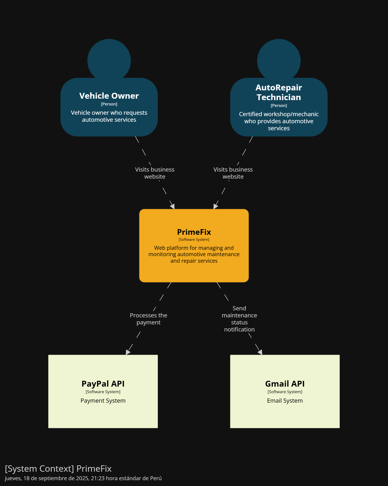

<h2 style="text-align:center">
  
</h2>

<h1 style="text-align:center">Universidad Peruana de Ciencias Aplicadas</h1>

<h3 style="text-align:center; margin-top:18px; margin-bottom:18px;">
  Ingeniería de Software
    
  Curso: Aplicaciones Web
    
  Sección: 7452
    
  Profesor: Hugo Allan Mori Paiva
    
  Semestre: 2025-20
    
  Informe del Trabajo Final
    
  Startup: FixTech
    
  Producto: Prime-Fix
</h3>

<table style="margin: 0 auto; width: auto; display: table; border-collapse: collapse; font-size: 12pt;">
  <thead>
    <tr>
      <th style="border:1px solid #000; padding:6px 12px; text-align:center;">Alumno</th>
      <th style="border:1px solid #000; padding:6px 12px; text-align:center;">Código</th>
    </tr>
  </thead>
  <tbody>
    <tr><td style="border:1px solid #000; padding:6px 12px; text-align:center;">Cesar Augusto Arostegui Alzamora</td><td style="border:1px solid #000; padding:6px 12px; text-align:center;">u202114548</td></tr>
    <tr><td style="border:1px solid #000; padding:6px 12px; text-align:center;">Gianmarco Fabian Jiménez Guerra</td><td style="border:1px solid #000; padding:6px 12px; text-align:center;">u202123843</td></tr>
    <tr><td style="border:1px solid #000; padding:6px 12px; text-align:center;">Giorgio Marzouk Awad Vargas</td><td style="border:1px solid #000; padding:6px 12px; text-align:center;">u202324041</td></tr>
    <tr><td style="border:1px solid #000; padding:6px 12px; text-align:center;">Flor De María Contreras Leon</td><td style="border:1px solid #000; padding:6px 12px; text-align:center;">u202323243</td></tr>
    <tr><td style="border:1px solid #000; padding:6px 12px; text-align:center;">Piero Francesco Tenorio Medina</td><td style="border:1px solid #000; padding:6px 12px; text-align:center;">u202318731</td></tr>
  </tbody>
</table>

 Setiembre 2025 

# Registro de Versiones del Informe  
---

| Versión | Fecha       | Autor(es)                                                                 | Descripción de modificación |
|---------|-------------|---------------------------------------------------------------------------|------------------------------|
|   TB1   | 21/09/2025  | Gianmarco Fabian Jiménez Guerra                                           | Realicé la Descripción de la Startup, User Stories, Product Backlog, Organization Systems, Labeling Systems, Landing Page Wireframe, Landing Page Mock-up, Web Applications Wireframes, Web Applications Wireflow Diagrams, Web Applications Mock-ups, Web Applications User Flow Diagrams, Web Applications Prototyping |
|   TB1   | 21/09/2025  | Cesar Augusto Arostegui Alzamora                                          | Realicé el Ubiquitous Language, Web Applications UX/UI Design, Domain-Driven Software Architecture, Class Diagrams y la Primera versión de la Landing Page, Services & Applications Implementation. |
|   TB1   | 21/09/2025  | Flor De María Contreras Leon                                              | Realicé 1.2.2.1. Lean UX Problem Statements; 1.2.2.2. Lean UX Assumptions; 1.2.2.3. Lean UX Hypothesis Statements; 2.3.1. User Personas; 2.3.2. User Task Matrix; 2.4. Big Picture Event Storming; 3.1. To-Be Scenario Mapping; 3.3. Impact Mapping; 4.1. Style Guidelines; 4.1.1. General Style Guidelines; 4.1.2. Web Style Guidelines; 3.2. User Stories; 3.4. Product Backlog; 5.1. Software Configuration Management; 5.1.1. Software Development Environment Configuration; 5.1.2. Source Code Management; 5.2. Landing Page, Services & Applications Implementation. |
|   TB1   | 21/09/2025  | Giorgio Marzouk Awad Vargas                                               | Realicé Antecedentes y problematica, Lean UX Canvas, Análisis Competitivo, Estrategias y tácticas frente a competidores, User Journey Mapping, Empathy Mapping, Source Code Style Guide & Conventions, Software Deployment Configurations. |
|   TB1   | 21/09/2025  | Piero Francesco Tenorio Medina                                            | Realicé la secciones de User Stories, evaluando cada escenario posible de cada funcionalidad.Tambien el Diagrama de Clase en una versión temprana. Además de hacer los segmentos objetivos del proyecto. Evaluando los posibles usuarios a los que va dirijido el trabajo. |

# Project Report Collaboration Insights  

---

# Contenido
- [Registro de Versiones del Informe](#registro-de-versiones-del-informe)
- [Project Report Collaboration Insights](#project-report-collaboration-insights)
- [Contenido](#contenido)
- [Student Outcome](#student-outcome)
- [Capítulo I: Introducción](#capítulo-i-introducción)
  - [1.1. Startup Profile](#11-startup-profile)
    - [1.1.1. Descripción de la Startup](#111-descripción-de-la-startup)
    - [1.1.2. Perfiles de integrantes del equipo](#112-perfiles-de-integrantes-del-equipo)
  - [1.2. Solution Profile](#12-solution-profile)
    - [1.2.1. Antecedentes y problemática](#121-antecedentes-y-problemática)
    - [1.2.2. Lean UX Process](#122-lean-ux-process)
      - [1.2.2.1. Lean UX Problem Statements](#1221-lean-ux-problem-statements)
      - [1.2.2.2. Lean UX Assumptions](#1222-lean-ux-assumptions)
      - [1.2.2.3. Lean UX Hypothesis Statements](#1223-lean-ux-hypothesis-statements)
      - [1.2.2.4. Lean UX Canvas](#1224-lean-ux-canvas)
  - [1.3. Segmentos objetivo](#13-segmentos-objetivo)
- [Capítulo II: Requirements Elicitation \& Analysis](#capítulo-ii-requirements-elicitation--analysis)
  - [2.1. Competidores](#21-competidores)
    - [2.1.1. Análisis competitivo](#211-análisis-competitivo)
    - [2.1.2. Estrategias y tácticas frente a competidores](#212-estrategias-y-tácticas-frente-a-competidores)
  - [2.2. Entrevistas](#22-entrevistas)
    - [2.2.1. Diseño de entrevistas](#221-diseño-de-entrevistas)
    - [2.2.2. Registro de entrevistas](#222-registro-de-entrevistas)
    - [2.2.3. Análisis de entrevistas](#223-análisis-de-entrevistas)
  - [2.3. Needfinding](#23-needfinding)
    - [2.3.1. User Personas](#231-user-personas)
    - [2.3.2. User Task Matrix](#232-user-task-matrix)
    - [2.3.3. User Journey Mapping](#233-user-journey-mapping)
    - [2.3.4. Empathy Mapping](#234-empathy-mapping)
  - [2.4. Big Picture Event Storming](#24-big-picture-event-storming)
  - [2.5. Ubiquitous Language](#25-ubiquitous-language)
- [Capítulo III: Requirements Specification](#capítulo-iii-requirements-specification)
  - [3.1. To-Be Scenario Mapping](#31-to-be-scenario-mapping)
  - [3.2. User Stories](#32-user-stories)
  - [3.3. Impact Mapping](#33-impact-mapping)
  - [3.4. Product Backlog](#34-product-backlog)
- [Capítulo IV: Product Design](#capítulo-iv-product-design)
  - [4.1. Style Guidelines](#41-style-guidelines)
    - [4.1.1. General Style Guidelines](#411-general-style-guidelines)
    - [4.1.2. Web Style Guidelines](#412-web-style-guidelines)
  - [4.2. Information Architecture](#42-information-architecture)
    - [4.2.1. Organization Systems](#421-organization-systems)
    - [4.2.2. Labeling Systems](#422-labeling-systems)
    - [4.2.3. SEO Tags and Meta Tags](#423-seo-tags-and-meta-tags)
    - [4.2.4. Searching Systems](#424-searching-systems)
    - [4.2.5. Navigation Systems](#425-navigation-systems)
  - [4.3. Landing Page UI Design](#43-landing-page-ui-design)
    - [4.3.1. Landing Page Wireframe](#431-landing-page-wireframe)
    - [4.3.2. Landing Page Mock-up](#432-landing-page-mock-up)
  - [4.4. Web Applications UX/UI Design](#44-web-applications-uxui-design)
    - [4.4.1. Web Applications Wireframes](#441-web-applications-wireframes)
    - [4.4.2. Web Applications Wireflow Diagrams](#442-web-applications-wireflow-diagrams)
    - [4.4.3. Web Applications Mock-ups](#443-web-applications-mock-ups)
    - [4.4.4. Web Applications User Flow Diagrams](#444-web-applications-user-flow-diagrams)
  - [4.5. Web Applications Prototyping](#45-web-applications-prototyping)
  - [4.6. Domain-Driven Software Architecture](#46-domain-driven-software-architecture)
    - [4.6.1. Design-Level Event Storming](#461-design-level-event-storming)
    - [4.6.2. Software Architecture Context Diagram](#462-software-architecture-context-diagram)
    - [4.6.3. Software Architecture Container Diagrams](#463-software-architecture-container-diagrams)
    - [4.6.4. Software Architecture Components Diagrams](#464-software-architecture-components-diagrams)
  - [4.7. Software Object-Oriented Design](#47-software-object-oriented-design)
    - [4.7.1. Class Diagrams](#471-class-diagrams)
  - [4.8. Database Design](#48-database-design)
    - [4.8.1. Database Diagrams](#481-database-diagrams)
- [Capítulo V: Product Implementation, Validation \& Deployment](#capítulo-v-product-implementation-validation--deployment)
  - [5.1. Software Configuration Management](#51-software-configuration-management)
    - [5.1.1. Software Development Environment Configuration](#511-software-development-environment-configuration)
    - [5.1.2. Source Code Management](#512-source-code-management)
    - [5.1.3. Source Code Style Guide \& Conventions](#513-source-code-style-guide--conventions)
    - [5.1.4. Software Deployment Configuration](#514-software-deployment-configuration)
  - [5.2. Landing Page, Services \& Applications Implementation](#52-landing-page-services--applications-implementation)
    - [5.2.1. Sprint 1](#521-sprint-1)
      - [5.2.1.1. Sprint Planning 1](#5211-sprint-planning-1)
      - [5.2.1.2. Aspect Leaders and Collaborators](#5212-aspect-leaders-and-collaborators)
      - [5.2.1.3. Sprint Backlog 1](#5213-sprint-backlog-1)
      - [5.2.1.4. Development Evidence for Sprint Review](#5214-development-evidence-for-sprint-review)
      - [5.2.1.5. Execution Evidence for Sprint Review](#5215-execution-evidence-for-sprint-review)
      - [5.2.1.6. Services Documentation Evidence for Sprint Review](#5216-services-documentation-evidence-for-sprint-review)
      - [5.2.1.7. Software Deployment Evidence for Sprint Review](#5217-software-deployment-evidence-for-sprint-review)
      - [5.2.1.8. Team Collaboration Insights during Sprint](#5218-team-collaboration-insights-during-sprint)
  - [5.3. Validation Interviews](#53-validation-interviews)
    - [5.3.1. Diseño de Entrevistas](#531-diseño-de-entrevistas)
    - [5.3.2. Registro de Entrevistas](#532-registro-de-entrevistas)
    - [5.3.3. Evaluaciones según heurísticas](#533-evaluaciones-según-heurísticas)
  - [5.4. Video About-the-Product](#54-video-about-the-product)
- [Conclusiones](#conclusiones)
- [Conclusiones y recomendaciones](#conclusiones-y-recomendaciones)
- [Video About-the-Team](#video-about-the-team)
- [Bibliografía](#bibliografía)
- [Anexos](#anexos)

# Student Outcome  

*ABET – EAC - Student Outcome 5*

En el siguiente cuadro se presentan las acciones desarrolladas por el grupo, junto con las conclusiones obtenidas, que respaldan el cumplimiento del logro correspondiente al ABET – EAC - Student Outcome 5.

| Criterio específico | Acciones Realizadas | Conclusiones |
|-----------|-----------|-----------|
| 1. Trabaja en equipo para proporcionar liderazgo    |**Flor De Maria Contreras Leon**   **TB1:**  Trabajé en equipo para proporcionar liderazgo al desarrollar secciones clave de la documentación del proyecto como 1.2.2.1. Lean UX Problem Statements, 1.2.2.2. Lean UX Assumptions y 1.2.2.3. Lean UX Hypothesis Statements. Estas actividades permitieron guiar al equipo en la definición clara de problemas, supuestos e hipótesis, de manera que se estableciera una base conceptual sólida para estructurar el producto. Con ello se fortaleció la organización del trabajo y se aseguró que todos los integrantes tuvieran un marco común de referencia para continuar con el desarrollo.   **Gianmarco Fabian Jiménez Guerra**   **TB1:**  Logré contribuir y organizarme con el grupo para el desarrollo de Realicé la Descripción de la Startup, User Stories, Product Backlog, Organization Systems, Labeling Systems, Landing Page Wireframe, Landing Page Mock-up, Web Applications Wireframes, Web Applications Wireflow Diagrams, Web Applications Mock-ups, Web Applications User Flow Diagrams, Web Applications Prototyping.   **Giorgio Marzouk Awad Vargas**   **TB1:** Participé liderando la elaboración de secciones analíticas y estratégicas del informe como Antecedentes y problemática, Lean UX Canvas, Análisis competitivo, Estrategias y tácticas frente a competidores, además de User Journey Mapping, Empathy Mapping, Source Code Style & Conventions y Software Deployment Configurations. Estas contribuciones aportaron claridad al contexto del proyecto, estructuración de la propuesta de valor y lineamientos técnicos de implementación.    **Piero Francesco Tenorio Media**   **TB1:** Durante el desarrollo del trabajo, realice y participe de manera activa en el grupo de trabajo. Se me llegó a asignar los puntos de Diagrama de Clases, Diagramas de Arquitectura de Software, el desarrollo de las User Stories y el desarrollo de los Segmentos Objetivos.  **César Augusto Aróstegui Alzamora**   **TB1:** En el desarrollo del proyecto participé en la elaboración del Ubiquitous Language, lo que permitió que todos los integrantes del equipo compartiéramos un mismo entendimiento de los términos del dominio. También diseñé la parte de UX/UI de la aplicación web, propuse la arquitectura de software siguiendo principios de Domain-Driven Design, elaboré diagramas de clases para representar las entidades principales del sistema y realicé la primera versión de la Landing Page, junto con la implementación inicial de servicios y aplicaciones |**Flor De Maria Contreras Leon**    **TB1:**      Mi participación en la elaboración de los apartados vinculados a Lean UX (Problem Statements, Assumptions e Hypothesis Statements) permitió brindar liderazgo en la identificación y organización de los problemas centrales del proyecto. Esto contribuyó a guiar al equipo hacia una visión compartida y a alinear los esfuerzos individuales con los objetivos generales del trabajo.   **Gianmarco Fabian Jiménez Guerra**   **TB1:** Mi aporte principalmente en el capítulo IV fue de gran ayuda par apoder proporcionar una visión clara de lo que buscamos tener en el aplicativo, ello lo realicé coordinando y organizando las tareas con mis compañeros.   **Giorgio Marzouk Awad Vargas**   **TB1:** Mis aportes permitieron consolidar el enfoque estratégico y competitivo del proyecto, además de establecer convenciones de código y configuraciones de despliegue que guiarán al equipo en fases posteriores, asegurando coherencia técnica y sostenibilidad en el desarrollo.   **Piero Francesco Tenorio Medina**   **TB1:** Los aportes realizados para los distintos capitulos fueron fundamentales para el desarrollo completo del trabajo. Poder identificar y investigar me permitió centrarnos en el correcto desarrollo del trabajo.   **César Augusto Aróstegui Alzamora**   **TB1:** Estas actividades me permitieron asumir un rol de liderazgo técnico dentro del equipo, ya que ayudaron a organizar el proyecto desde sus primeras fases y a orientar a mis compañeros en la construcción de los entregables. Considero que este trabajo conjunto fortaleció la coordinación del grupo y facilitó que logremos los primeros resultados de manera ordenada y clara. |
| 2. Crea un entorno colaborativo, establece metas, planifica tareas y cumple objetivos | **Flor De Maria Contreras Leon**   **TB1:**   Contribuí a crear un entorno colaborativo, estableciendo metas y cumpliendo objetivos mediante la elaboración de entregables como 2.3.1. User Personas, 2.3.2. User Task Matrix, 2.4. Big Picture Event Storming, 3.1. To-Be Scenario Mapping, 3.3. Impact Mapping y 3.2. User Stories, además de secciones técnicas como 4.1. Style Guidelines, 3.4. Product Backlog y la configuración en 5.1. Software Configuration Management. Estas contribuciones hicieron posible cumplir con los objetivos del TB1, fomentar la colaboración entre los integrantes y garantizar insumos consistentes para avanzar en las siguientes fases del proyecto.   **Gianmarco Fabian Jiménez Guerra**   **TB1:** Junto con mis compañeros, pude avanzar cada una de mis partes especificadas previamente estableciendo algunas metas semanales y organizándonos mediante reuniones virtuales, ello me permitió cumplir de manera exitosa con cada una de las tareas asignadas.   **Giorgio Marzouk Awad Vargas**   **TB1:** Colaboré en la planificación de tareas relacionadas con la fundamentación del proyecto y la estrategia frente a competidores, lo que aseguró que el equipo tuviera un marco claro para avanzar. Asimismo, mi trabajo en User Journey y Empathy Mapping facilitó la alineación de objetivos del equipo con las necesidades reales de los usuarios.    **Piero Francesco Tenorio Medina**   **TB1:** Junto a los integrantes del grupo, pude avanzar con los distintos puntos asignados en el trabajo. Todo gracias a una comunicación constante y acertiva sobre los distintos puntos en los que cada integrante presentaba dudas.   **César Augusto Aróstegui Alzamora**   **TB1:** Además de las tareas técnicas, apoyé en la planificación de los objetivos iniciales del proyecto, definiendo junto con mis compañeros las metas alcanzables para el sprint. Contribuí a generar un entorno colaborativo compartiendo avances y resolviendo dudas en equipo, especialmente durante la elaboración de la Landing Page y la implementación de los servicios. Las actividades como el Ubiquitous Language y los diagramas de clases también facilitaron la distribución de tareas, ya que sirvieron como guía común para todo el grupo. | **Flor De Maria Contreras Leon**   **TB1:**   Al desarrollar entregables como User Personas, User Task Matrix, Big Picture Event Storming, To-Be Scenario Mapping, Impact Mapping, User Stories y Product Backlog, propicié un entorno colaborativo en el que cada integrante pudo aportar de manera ordenada. Gracias a la planificación de estas tareas y a la definición de metas claras, se alcanzaron los objetivos propuestos en el TB1, consolidando un avance estructurado y efectivo del proyecto.   **Gianmarco Fabian Jiménez Guerra**   **TB1:** Parte importante de mi avance fue desarrollar el aplicativo en Figma, para ello, tuve que establecer metas con el fin de que mis compañeros puedan ver mis avances y poder aprobarlos entre todos. Además, ello me sirvió para reforzar mis conocimientos sobre Figma.   **Giorgio Marzouk Awad Vargas**   **TB1:** Mi aporte ayudó a que el grupo tuviera claridad en los antecedentes, contexto y lineamientos técnicos. Esto favoreció la organización colectiva y el cumplimiento de objetivos con base en una visión estratégica y de valor frente al mercado.    **Piero Francesco Tenorio Medina**   **TB1:** Una de las secciones importantes de lo que he desarrollado seria el planteamiento de algunas User Stories que abarcan un completo Bounded Context. Además de los distintos diagramas, tanto el de Clases y el de Base de Datos. Esto me sirvió para poder reforzar los conocimientos adquiridos previamente.   **César Augusto Aróstegui Alzamora**   **TB1:** Gracias a estas acciones el equipo pudo organizarse mejor y avanzar de forma colaborativa. Se logró cumplir los objetivos del sprint inicial y cada integrante tuvo claro cómo aportar en el desarrollo. Este proceso me permitió mejorar mi capacidad de trabajar en grupo, tomar decisiones en conjunto y valorar la importancia de la planificación para cumplir con los entregables a tiempo.|

# Capítulo I: Introducción
## 1.1. Startup Profile
### 1.1.1. Descripción de la Startup
Prime-Fix es una startup especializada en el desarrollo de soluciones tecnológicas aplicadas a la web, cuyo propósito es transofrmar la forma en que los usuarios acceden a servicios de mantenimiento y reparación automotriz.
Con Prime-Fix nace AutoFix, una plataforma digital cuyo objetivo es facilitar el contacto entre talleres de vehículos y dueños de los mismos implementando una serie de funcionalidades que permitirán a ambos usuarios, obtener una experiencia de gestión clara.

<b>Misión: </b> Nuestra misión es acercar a los dueños de vehículos a talleres confiables por medio de una plataforma accesible y amigable. De esta manera, modernizamos el sector automotriz y optimizamos de toda la experiencia de este tipo de  servicios.

<b>Visión: </b> Tenemos como objetivo posicionarnos como la plataforma líder en Perú para la gestión digital de servicios automotrices, considerando una posible expansión hacia toda América Latina. A su vez, en el futuro se buscará integrar a este proyecto aplicaciones móviles y dispositivos IoT que permitan un mantenmiento inteligente para los vehículos.

### 1.1.2. Perfiles de integrantes del equipo

| Foto | Descripción |
|------|-------------|
|  | Mi nombre es Flor de María Contreras León y actualmente estudio la carrera de Ingeniería de Software en la Universidad Peruana de Ciencias Aplicadas (UPC), sede San Miguel. Tengo 20 años y me considero una persona responsable, comprometida y dedicada a mi formación profesional.Me apasiona la programación y la investigación, áreas en las que busco seguir aprendiendo y desarrollando nuevas habilidades. Aunque me considero una persona callada, siempre estoy atenta a los detalles, lo que me permite trabajar de manera cuidadosa y eficiente en mis proyectos. Asimismo, valoro el trabajo en equipo y creo que un entorno colaborativo y respetuoso es clave para alcanzar los mejores resultados. |
|  | Soy Gianmarco Jiménez alumno de Ingeniería de Software. Me gusta trabajar en equipo pues me permite aprender sobre las ideas que tienen los participantes y contrastarlas con las mías. He utilizado lenguajes como C++, Python, SQL y Java. Estoy muy interesado en aprender todo sobre el desarrollo de aplicaciones web con frameworks. |
|  | Soy Piero Tenorio, estudio en la sede San Miguel de la UPC estudiando la carrera de Ingeniería de Software . Soy una persona colaborativa, responsable y comprometida con los trabajos en los que estoy implicado, tratando de ser lo más eficiente posible.Conocimientos en HTML, CSS, Java, C++, JavaScript y Python. Cada día trato de mejorar como persona y si llego a cometer algún error, tratar de aprender de ello.  |
|  | Soy César Augusto, estudiante de Ingeniería de Software, actualmente con 21 años, mi lenguaje más utilizado y favorito es Python, actualmente adaptándome en JavaScript y estudiando frameworks  relacionados para el Desarrollo Web. |   
|  |Mi nombre es Giorgio Awad, estudio la carrera de Ingenieria de Software y tengo 22 años. Considero ser alguien que aporta ideas nuevas al equipo, que a largo plazo contribuyen con la resolución de cualquier problema que se presente. Asimismo, soy capaz de adaptarme al momento de trabajar en equipo, convirtiéndome en un compañero polifuncional. |

## 1.2. Solution Profile
### 1.2.1. Antecedentes y problemática
El sector automotriz en el Perú y en gran parte de Latinoamérica aún se encuentra rezagado en términos de digitalización de servicios, debido a que la mayoría de talleres funcionan con procesos manuales, tales como agendas físicas, llamadas telefónicas y mensajería web, afectando la trazabilidad de reparaciones y la atención que reciben los dueños de vehículos. Esto genera dificultades para ellos al obstaculizar la búsqueda de talleres confiables hoy en día.

A nivel global, ya existen plataformas que conectan a usuarios con talleres y servicios automotrices, lo que demuestra que hay una tendencia hacia la digitalización dentro de este sector. Sin embargo, en el Perú este modelo no ha sido consolidado y, por ende, se ha retrasado la modernización del servicio al cliente dentro de este sector, aumentando la desorganización en la gestión de talleres, debido a que no se cuenta con sistemas digitales de registro de citas ni sistemas para facilitar el seguimiento de las reparaciones. Según **Manrique (2011)**, los talleres en el Perú requieren de sistemas electrónicos para reservar citas previas a la atención, con el fin de optimizar recursos del taller en cuanto a organización y planificación.

En este contexto, **Fixtech** surge como una startup de base tecnológica que busca cerrar la brecha entre talleres y clientes mediante la creación de nuestro aplicativo **PrimeFix**, el cual tiene como objetivo centralizar la oferta de talleres en un entorno digital que otorgue transparencia, accesibilidad y confianza a los usuarios. 

Además, en Latinoamérica la inversión publicitaria digital en la industria automotriz está creciendo y señalando que los negocios del rubro están obligados a adaptarse al entorno digital para mantenerse competitivos. Por ejemplo, en octubre de 2024, Perú representó aproximadamente un **2,67 % de la inversión digital en publicidad automotriz en LATAM**, lo que indica interés y movimiento en el ecosistema digital automotriz del país (**Similarweb, 2024**).

### 1.2.2. Lean UX Process
#### 1.2.2.1. Lean UX Problem Statements
En el Perú, miles de dueños de vehículos enfrentan a diario la dificultad de acceder a servicios de mantenimiento y reparación de manera confiable y eficiente. La búsqueda de talleres suele convertirse en un proceso poco claro y desgastante, donde predominan la informalidad, la falta de información sobre disponibilidad y la ausencia de canales digitales que faciliten la comunicación. Como consecuencia, muchos conductores pierden tiempo llamando o visitando distintos talleres, enfrentan largas esperas y experimentan desconfianza frente a la calidad y transparencia del servicio recibido.

Al mismo tiempo, los talleres y mecánicos independientes cargan con limitaciones importantes. La gestión de citas se realiza de manera tradicional, mediante llamadas, mensajes o visitas presenciales, lo que genera desorden, sobrecarga de trabajo y pérdida de oportunidades de negocio. La falta de herramientas digitales para organizar horarios, técnicos y clientes impide que los talleres optimicen sus recursos y ofrezcan una experiencia más clara y moderna.

Las entrevistas realizadas revelan que tanto dueños de vehículos como mecánicos perciben esta situación como una limitación significativa y manifiestan el deseo de contar con una plataforma accesible, confiable y estructurada que facilite la comunicación, optimice la gestión de servicios y brinde mayor transparencia a todo el proceso de mantenimiento automotriz.

#### 1.2.2.2. Lean UX Assumptions

##### Suposiciones sobre dueños de vehículos
- Suponemos que los dueños de vehículos buscan talleres confiables y accesibles, pero actualmente enfrentan dificultades para encontrarlos de manera rápida y transparente.

- Suponemos que valoran la posibilidad de conocer horarios y disponibilidad en tiempo real antes de decidir a qué taller acudir.

- Suponemos que prefieren una experiencia digital sencilla, visual y clara, que les ahorre llamadas, visitas y pérdidas de tiempo.

- Suponemos que se sienten más seguros cuando reciben notificaciones y pueden dar seguimiento al servicio solicitado.

- Suponemos que confían más en una plataforma si les brinda transparencia en costos, tiempos y calidad del trabajo.

##### Suposiciones sobre mecánicos / talleres
- Suponemos que los talleres y mecánicos desean atraer más clientes sin sobrecargar sus canales de atención tradicionales.

- Suponemos que necesitan herramientas digitales para organizar técnicos, horarios y disponibilidad de manera eficiente.

- Suponemos que estarían dispuestos a usar una plataforma si esta facilita la comunicación con clientes y reduce la pérdida de citas o confusiones.

- Suponemos que valoran un sistema que les ayude a fidelizar clientes y mejorar su reputación en el mercado.

- Suponemos que los administradores de talleres aceptarían registrar técnicos y disponibilidad si esto aumenta su visibilidad y confianza frente a potenciales clientes.

##### Suposiciones sobre el entorno digital
- Suponemos que la plataforma debe ser accesible desde web y móvil, con una interfaz amigable y moderna.

- Suponemos que las notificaciones automáticas y formularios dinámicos son claves para la interacción fluida entre cliente y taller.

- Suponemos que un modelo freemium o por suscripción podría incentivar a los talleres a sumarse, mientras que la gratuidad inicial para clientes facilitaría la adopción.

- Suponemos que la inclusión de un sistema de reseñas y calificaciones generará confianza y motivará el uso frecuente.

------------

##### User Outcomes
- Que los dueños de vehículos puedan agendar servicios de manera rápida, segura y transparente.

- Que confíen en los talleres registrados y logren ahorrar tiempo en la gestión de mantenimiento y reparación.

- Que los talleres logren digitalizar su gestión interna, mejorando la organización y optimización de recursos.

- Que los mecánicos establezcan una relación más clara y confiable con los clientes, incrementando su fidelización.

##### Business Outcomes
- Lograr una alta adopción inicial entre dueños de vehículos y talleres mecánicos en Lima y posteriormente en otras ciudades del Perú.

- Generar confianza en el mercado automotriz como la primera plataforma digital que centraliza la gestión de citas y servicios.

- Incrementar la conversión de talleres gratuitos a planes de pago mediante funcionalidades premium (ej. mayor visibilidad, métricas de clientes, gestión avanzada de recursos).
  
#### 1.2.2.3. Lean UX Hypothesis Statements

A partir de nuestras asunciones, formulamos las siguientes hipótesis que deben ser validadas con usuarios reales:

1. **Creemos que los dueños de vehículos necesitan una forma confiable y rápida de agendar servicios de mantenimiento o reparación** porque actualmente enfrentan pérdida de tiempo, falta de transparencia y desconfianza en los talleres,entonces, si les ofrecemos una plataforma digital con agenda en línea, disponibilidad en tiempo real y notificaciones  aumentará su confianza y la frecuencia con la que solicitan servicios.

2. **Creemos que los talleres necesitan una herramienta para organizar técnicos, horarios y citas** porque ahora trabajan con sistemas manuales, llamadas y mensajes dispersos, entonces, si les damos un panel de gestión con registro de técnicos, agenda y comunicación integrada podrán atender más clientes de manera ordenada y mejorar su reputación.

3. **Creemos que una plataforma visual, intuitiva y accesible desde web o móvil motivará a los dueños de vehículos a usarla** porque están acostumbrados a aplicaciones simples y rápidas en su vida diaria,entonces, si Prome Fix ofrece una experiencia fluida y amigable, se incrementará la adopción y retención de usuarios.

4. **Creemos que permitir a los dueños de vehículos ver reseñas, calificaciones y disponibilidad en tiempo real aumentará la confianza en los talleres** porque actualmente sienten inseguridad respecto a la calidad y tiempos de atención entonces, si ofrecemos funciones de reseñas y visibilidad de horarios,los usuarios elegirán talleres a través de la plataforma en lugar de buscar por canales informales.

5. **Creemos que un modelo free con funciones básicas gratuitas para talleres y clientes permitirá captar más usuarios porque reduce la barrera de entrada y genera valor desde el primer uso**,entonces, si ofrecemos planes premium con mayor visibilidad, métricas y herramientas avanzadas,lograremos convertir talleres gratuitos en clientes de pago y sostener el crecimiento de la plataforma.
Estas hipótesis serán validadas mediante pruebas con usuarios, entrevistas, prototipos de la plataforma y análisis de métricas de uso.

#### 1.2.2.4. Lean UX Canvas
| **Business Problem** | **Business Outcomes** |
|----------------------|------------------------|
| - El sector automotriz en Perú carece de digitalización. - Dueños de vehículos no encuentran talleres confiables ni transparentes. - Talleres tienen procesos manuales e ineficientes. | - Incrementar talleres afiliados. - Reducir tiempo de búsqueda y agendamiento. - Aumentar confianza con transparencia en precios y reseñas. - Posicionar a FixTech como líder en Perú y LATAM. |

| **Users** | **User Outcomes & Benefits** |
|-----------|-------------------------------|
| - Dueños de vehículos: buscan **confianza, transparencia y facilidad**. - Talleres: necesitan digitalizar su gestión, captar clientes y mejorar organización. | - Dueños de vehículos: mayor confianza, ahorro de tiempo, historial de mantenimientos. - Talleres: más visibilidad, captación de clientes y mejor gestión. |

| **Hypotheses** | **Solutions** |
|----------------|---------------|
| - Creemos que los **dueños de vehículos** usarán Prime-Fix porque encontrarán confianza y transparencia. - Creemos que los talleres se afiliarán para captar más clientes y organizar su gestión. - Creemos que digitalizar procesos reducirá tiempos y aumentará satisfacción. | - Plataforma digital que conecte dueños de vehículos con talleres. - Agenda en línea con recordatorios. - Perfiles de talleres con reseñas y catálogo. - Historial digital de mantenimientos. - Futuras integraciones con app móvil e IoT. |

| **What’s the most important thing we need to learn first?** | **What’s the least amount of work we need to do to learn the next most important thing?** |
|-------------------------------------------------------------|------------------------------------------------------------------------------------------------|
| - Validar si los usuarios confían en la plataforma para agendar servicios. - Verificar si los talleres están dispuestos a afiliarse y pagar por visibilidad. | - Entrevistar a un grupo reducido de talleres y usuarios. - Recoger feedback y medir uso real. |

## 1.3. Segmentos objetivo

**Segmento 1: Dueños de vehículos**
**Aspectos Demográficos:**

* Sexo: Masculino y Femenino
* Edades: Entre 22 y 50 años

**Aspectos Geográficos:**

* Zona Geográfica en la que viven: Urbana, ciudad altamente transitada por vehículos.

**Aspectos Psicográficos:**

* Valoran el buen servicio y la eficacia.
* Tienen interés en la calidad del servicio que se le brinda a su vehiculo. 

**Segmento 2: Administrador de taller automotriz**
**Aspectos Demográficos:**

* Sexo: Masculino y Femenino
* Edades: Entre 21 y 50 años
* Ocupación: Dueño, administrador o asesor de servicios de un taller automotriz

**Aspectos Geográficos:**

* Zona Geográfica en la que viven: Urbana, ciudad altamente transitada por vehículos.
* Ubicacion del taller: Cercana a avenidas transitadas, zonas industriales o barrios con alta circulación vehicular.

**Aspectos Psicográficos:**

* Valoran la organizacion y eficiencia en la gestión de clientes.
* Interés en fidelizar clientes y mejroar la reputación de su taller.
* Buscan soluciones tecnológicas que les permitan optimizar el tiempo y reducir errores dentro del taller.

---

# Capítulo II: Requirements Elicitation & Analysis
## 2.1. Competidores
### 2.1.1. Análisis competitivo
En el mercado peruano de servicios automotrices, los competidores se pueden clasificar en tres grupos principales:  

1. **Competidores directos digitales**  
   - **Talleres con plataformas propias:** Algunos talleres grandes ya cuentan con páginas web o sistemas básicos de reservas en línea. Sin embargo, suelen ser limitados a un solo local y no agrupan múltiples opciones.  
   - **Aplicativos de búsqueda genéricos (Google Maps, Facebook, OLX Autos):** Son usados por conductores para encontrar talleres cercanos, pero no ofrecen trazabilidad, gestión de citas ni transparencia en precios y reputación.  

2. **Competidores indirectos tradicionales**  
   - **Talleres pequeños y medianos:** Se promocionan en redes sociales y captan clientes por recomendaciones. Su fortaleza es el trato cercano, pero carecen de procesos digitales estandarizados.  
   - **Agencias oficiales de marcas automotrices:** Tienen sistemas organizados y reputación fuerte, pero sus costos son altos y no son accesibles para la mayoría de conductores.  

3. **Referentes internacionales (benchmarking)**  
   - **Autofix (México), Carfix (Brasil), ClickMechanic (UK):** Plataformas que conectan talleres con usuarios, ofreciendo reservas online, reseñas y diagnósticos digitales. Estas soluciones muestran una tendencia clara hacia la digitalización del sector y sirven de inspiración para Prime-Fix, aunque aún no existe un actor consolidado en Perú.  

**Hallazgos clave del análisis:**  
- La **informalidad y falta de confianza** en talleres es el principal dolor de los usuarios.  
- Las **herramientas actuales no garantizan trazabilidad ni transparencia**.  
- Existe una **oportunidad de primer mover** en Perú para centralizar la gestión digital de talleres.  
- Los usuarios ya están acostumbrados a usar apps y redes sociales, por lo que la barrera de adopción tecnológica es baja.

| **Fortalezas** | **Oportunidades** |
|----------------|-------------------|
| - Plataforma innovadora en el Perú que centraliza la gestión de talleres y clientes. | - Creciente tendencia hacia la digitalización en el sector automotriz en Latinoamérica. |
| - Funcionalidades diferenciales: reseñas verificadas, disponibilidad en tiempo real, historial digital de mantenimientos. | - Aumento de la inversión en publicidad digital automotriz en Perú. |
| - Modelo freemium que facilita la captación de talleres y clientes desde la etapa inicial. | - Falta de plataformas consolidadas en el país, lo que ofrece ventaja de ser pioneros. |
| - Equipo multidisciplinario con visión tecnológica y conocimiento del mercado local. | - Posibilidad de expansión a mercados regionales (Arequipa, Trujillo, luego LATAM). |

| **Debilidades** | **Amenazas** |
|-----------------|---------------|
| - Dependencia inicial de la confianza de talleres y clientes para generar adopción. | - Competidores internacionales podrían ingresar al mercado peruano con más recursos. |
| - Recursos limitados para competir en marketing frente a grandes agencias automotrices. | - La informalidad en talleres pequeños puede dificultar la adopción digital. |
| - Riesgo de complejidad tecnológica en la implementación de funcionalidades avanzadas (IoT, app móvil). | - Posible desconfianza de usuarios al inicio respecto a pagos y transparencia en reseñas. |
| - Necesidad de soporte continuo y capacitación para talleres menos digitalizados. | - Cambios regulatorios en el sector automotriz que afecten la operación de talleres. |

### 2.1.2. Estrategias y tácticas frente a competidores
**Estrategia de diferenciación (vs. talleres tradicionales y Google Maps):**  
- Posicionarse como **plataforma de confianza**: incluir reseñas verificadas, historial de mantenimientos y diagnósticos digitalizados.  
- Integrar **disponibilidad en tiempo real** y notificaciones automáticas, algo que no ofrecen ni talleres pequeños ni buscadores generales.  

**Estrategia de penetración (vs. plataformas digitales incipientes):**  
- Implementar un **modelo freemium**: talleres pueden registrarse gratis con funciones básicas y luego acceder a planes premium con visibilidad destacada y métricas avanzadas.  
- Fomentar la **adopción rápida** con campañas de marketing digital enfocadas en dueños de vehículos jóvenes y en talleres medianos que necesitan visibilidad.  

**Estrategia de fidelización (vs. agencias oficiales de marcas):**  
- Ofrecer precios accesibles con un **sistema de comparación transparente** de costos y tiempos de servicio.  
- Incorporar **programas de fidelización digital** (recordatorios de mantenimientos preventivos, descuentos para clientes recurrentes).  

**Tácticas específicas:**  
- **Alianzas estratégicas:** Convenios con aseguradoras, universidades y flotas empresariales para captar usuarios masivos.  
- **Marketing de confianza:** Campañas en redes sociales con casos reales de clientes satisfechos, enfatizando seguridad y transparencia.  
- **Innovación constante:** A futuro, integrar IoT (dispositivos de diagnóstico vehicular) y una app móvil que facilite el seguimiento en tiempo real.  
- **Expansión escalonada:** Iniciar en Lima Metropolitana (alta densidad vehicular) y luego expandir hacia ciudades con gran parque automotor (Arequipa, Trujillo).  

## 2.2. Entrevistas

### 2.2.1. Diseño de entrevistas

Segmento #1: Dueños de vehículos 
"Buenos días/tardes/noches 'Nombre del entrevistado'. Mi nombre es 'Nombre del entrevistador' de la startup FixTech. Nos encontramos desarrollando una plataforma para que los dueños de vehículos tengan la facilidad de programar sus visitas a talleres de reparación de autos, hacer seguimiento al servicio y ver el diagnóstico de la falla detectada. En base a ello, tengo preparadas una lista de preguntas para conocer su punto de vista sobre algunos temas importantes para nuestra plataforma."

Preguntas:
1. ¿Ha realizado la búsqueda de algún taller durante los últimos meses? De ser así, ¿Podría comentarnos su experiencia?
2. ¿Qué plataformas o medios utiliza para realizar la búsqueda de talleres cuando su vehículo necesita reparación?
3. ¿Qué aspectos valora más en un servicio de taller? (distancia, disponibilidad, costo)
4. ¿Ha tenido experiencias negativas con talleres? De ser así, ¿Le hubiera gustado registrar dichas experiencias de manera pública?
5. ¿Usted mantiene un registro de su vehículo y del mantenimiento que le ha brindado durante todo este tiempo?
6. ¿Ha dejado su vehículo en un taller durante días u horas? ¿Cómo se le avisa que su vehículo ya está listo?
7. ¿Con qué dispositivo suele solicitar el servicio de mantenimiento?
8. ¿Qué herramientas o software utiliza para encontrar algún taller cerca de una ubicación específica?
9. Una vez terminado el servicio ¿Qué medios de pago utiliza? (efectivo, transferencia, etc)
11. ¿Estaría interesado en usar una plataforma que le permita agendar visita en talleres de su zona? ¿Por qué?
12. ¿Qué funcionalidades cree que harían que esta plataforma sea útil para el día a día?
13. ¿Se sentiría cómodo recibiendo algunos recordatorios de mantenimiento preventivo desde una app?
14. ¿Estaría de acuerdo con utilizar un aplicativo web para agilizar la programación de sus visitas?
15. ¿Le gustaría hacer seguimiento al estado de su vehículo mientras este se encuentra en mantenimiento?

Segmento #2: Asesor de servicios de un taller automotriz 
"Buenos días/tardes/noches 'Nombre del entrevistado'. Mi nombre es 'Nombre del entrevistador' de la startup FixTech. Nos encontramos desarrollando una plataforma para que los talleres tengan la facilidad de agendar y hacer seguimiento a las visitas de posibles clientes que solicitan la reparación de sus autos. En base a ello, tengo preparadas una lista de preguntas para conocer su punto de vista sobre algunos temas importantes para nuestra plataforma."

Preguntas:
1. Actualmente, ¿Cómo consigue clientes para el taller?
2. ¿En qué medio promociona sus servicios?
3. ¿Qué dispositivo se suele utilzar en la empresa para la programación de visitas de clientes? (celular, computadora de escritorio, laptop, etc)
4. ¿Encuentra dificultades al competir con talleres más grandes? De ser así ¿Podrías describirlas?
5. ¿Cómo gestiona los pedidos o solicitudes de servicios de reparación? (ej. llamadas, WhatsApp o visitas directas)
6. ¿Ha tenido algún reclamo sobre el desempeño de los técnicos? ¿Podría detallar más la experiencia? ¿Por qué medios se presentaron estos reclamos?
7. ¿Cómo maneja la información sobre los técnicos? ¿Cuenta con una base de datos?
8. ¿Qué tan importante consideraría mostrar la disponibilidad de sus técnicos en tiempo real?
9. ¿Qué tanto te ayudaría una plataforma donde puedas registrar tu taller, los técnicos y mostrar reseñas de clientes?
10. ¿Qué funcionalidades le añadirías a la plataforma?
11. ¿Le parece importante que el cliente sepa en qué estado se encuentra su vehículo y cuál es su diagnóstico final?
12. ¿Estaría interesado en una plataforma que notifique al cliente el momento en que puede recoger su vehículo?

### 2.2.2. Registro de entrevistas

### Segmento 1: Dueños de Vehiculos

##### Entrevista N°1: Dionisio Rodriguez

- Sexo: Masculino
- Edad:25 años
- Dirección: Lima, Av Arequipa Miraflores.

|  |
|-------------------------------------------------------------------------------------------------------------------|
|**Link De la Entrevista: [Enlance](https://upcedupe-my.sharepoint.com/:v:/g/personal/u202323243_upc_edu_pe/EZqmOelsxipLu6PdtBXftbsBmEjUS50k-dWYf3z7AC2i_w?nav=eyJyZWZlcnJhbEluZm8iOnsicmVmZXJyYWxBcHAiOiJTdHJlYW1XZWJBcHAiLCJyZWZlcnJhbFZpZXciOiJTaGFyZURpYWxvZy1MaW5rIiwicmVmZXJyYWxBcHBQbGF0Zm9ybSI6IldlYiIsInJlZmVycmFsTW9kZSI6InZpZXcifX0%3D&e=a5g003)** |
|Duracion:**00:05:02**&nbsp;&nbsp;&nbsp;&nbsp;&nbsp;Inicio:**00:00:31**&nbsp;&nbsp;&nbsp;&nbsp;Final:**00:05:02**|
| Dionisio Rodríguez, de 25 años, es conductor de automóvil y comentó que al momento de elegir un taller prioriza la confianza en el servicio, incluso si esto implica desplazarse a zonas más lejanas. Para ubicar opciones suele utilizar Google Maps, aunque reconoce que no siempre refleja la calidad real del taller. Señaló que en una ocasión tuvo una experiencia negativa, pues su vehículo fue dañado en un taller y los responsables no asumieron la reparación, lo que generó desconfianza y la necesidad de contar con mecanismos de referencia más seguros.Asimismo, resaltó que le resultaría valioso contar con una plataforma que permita no solo agendar visitas a talleres, sino también hacer seguimiento en tiempo real al estado del vehículo mientras se encuentra en mantenimiento. Además, considera importante que los usuarios puedan registrar y compartir públicamente sus experiencias, ya que esto ofrecería mayor transparencia y ayudaría a otros conductores a tomar mejores decisiones.|

##### Entrevista N°2: Marcos Contreras
- Sexo: Masculino
- Edad:24 años
- Dirección: Lima, Independencia.

|  |
|-------------------------------------------------------------------------------------------------------------------|
|**Link De la Entrevista: [Enlace](https://upcedupe-my.sharepoint.com/:v:/g/personal/u202318731_upc_edu_pe/EU-OfAcUkxlLsrpkalhCNRQBkang9sWzDtFzbJ4EEzaXvQ?e=Rq6OAR&nav=eyJyZWZlcnJhbEluZm8iOnsicmVmZXJyYWxBcHAiOiJTdHJlYW1XZWJBcHAiLCJyZWZlcnJhbFZpZXciOiJTaGFyZURpYWxvZy1MaW5rIiwicmVmZXJyYWxBcHBQbGF0Zm9ybSI6IldlYiIsInJlZmVycmFsTW9kZSI6InZpZXcifX0%3D)** |
|Duracion:**00:06:45**&nbsp;&nbsp;&nbsp;&nbsp;&nbsp;Inicio:**00:00:01**&nbsp;&nbsp;&nbsp;&nbsp;Final:**00:05:45**|
| Marcos Contreras es un joven de 24 años quien trabaja y estudia de manera paralela. Marcos nos cuenta que el tiene un vehiculo por la cual facilita movilizarse dentro de la ciudad. Marcos nos comenta que a la hora de encontrar un buen servicio que pueda atender a su vehículo, más que nada resalta que no llega a encontrar un lugar accesible. Marcos tambien nos cuenta que utiliza Google Maps,WhastApp e incluso Fcaebook para poder encontrar un taller que sea recomendado. Nos dice que valora la confianza y la calidad sobre el precio dentro de un servicio. Dentro de las experiencia negativas nos cuenta que si llego a presentar alguna, en la entrega de su vehículo. Finalmente, Marcos resalta que una aplicación que le ayude a gestionar los talleres a los que va, le puede hacer de mucha utilidad en su día a día. Que implemente funcionalidades que sean pertinentes para él como las agendas y las ubicaciones en mapas.|

##### Entrevista N°3: Anyelo Alejos
- Sexo: Masculino
- Edad: 23 años
- Dirección: Lima, Comas.

|  |
|-------------------------------------------------------------------------------------------------------------------|
|**Link De la Entrevista: [Enlace](https://upcedupe-my.sharepoint.com/:v:/g/personal/u202318731_upc_edu_pe/EbUouuLCEqlGvWQEGCCiPf4B8TQJNZIvqrxVh6ufl-rZQQ?e=zp4nf9&nav=eyJyZWZlcnJhbEluZm8iOnsicmVmZXJyYWxBcHAiOiJTdHJlYW1XZWJBcHAiLCJyZWZlcnJhbFZpZXciOiJTaGFyZURpYWxvZy1MaW5rIiwicmVmZXJyYWxBcHBQbGF0Zm9ybSI6IldlYiIsInJlZmVycmFsTW9kZSI6InZpZXcifX0%3D)** |
|Duracion:**00:05:40**&nbsp;&nbsp;&nbsp;&nbsp;&nbsp;Inicio:**00:00:01**&nbsp;&nbsp;&nbsp;&nbsp;Final:**00:05:40**|
| Anyelo Alejos es un chico de 23 años de edad. Él solo estudia pero cuenta con un Vehiculo para movilizarse a su centro de estudios. Él comenta que utiliza apliaciones como Google Maps para poder encontrar un taller que le sea pertinente, pero tambien lo busca de manera manual. Él valora aspectos como la confiabilidad dentro de un taller. Además, cuenta que no tuvo problemas con los talleres. Él suele solicitar servicios por un móvil y raras veces de manera manual. Anyelo comenta que le gustaría tener una aplicación que le ayude a a gendar citas en talleres para su vehículo, teniendo funcionalidades como reseña, precios y calificaciones de talleres.|

### Segmento #2: Asesor de servicios de un taller automotriz

##### Entrevista N°1: Jesús Valenzuela

- Sexo: Masculino
- Edad:21 años
- Dirección: Lima, San Miguel.

|  |
|-------------------------------------------------------------------------------------------------------------------|
|** Link De la Entrevista:** [Enlace](https://upcedupe-my.sharepoint.com/:v:/g/personal/u202123843_upc_edu_pe/EYVM_zdjduJKtn1KgPIWBJMB0jBtWI7znAkA--v8FtmlRA?nav=eyJyZWZlcnJhbEluZm8iOnsicmVmZXJyYWxBcHAiOiJPbmVEcml2ZUZvckJ1c2luZXNzIiwicmVmZXJyYWxBcHBQbGF0Zm9ybSI6IldlYiIsInJlZmVycmFsTW9kZSI6InZpZXciLCJyZWZlcnJhbFZpZXciOiJNeUZpbGVzTGlua0NvcHkifX0&e=IIHRcz)** |
|Duracion:**00:06:31**&nbsp;&nbsp;&nbsp;&nbsp;&nbsp;Inicio:**00:00:05**&nbsp;&nbsp;&nbsp;&nbsp;Final:**00:06:31**|
| Jesús Valenzuela es un joven asesor de servicios de reparación del taller Alvillantas, nos comenta que para atraer clientes, utiliza las redes sociales como Facebook y TikTok y una landing page. El entrevistado comenta que no siente que el taller donde trabaja sea afectado por la competencia dada su ubicación estratégica junto con la de sus otras sedes. Jesús menciona que la gestión de las solicitudes de servicios se realizan principalmente mediante WhatsApp, también reciben llamadas telefónicas y visitas directas al taller. En cuanto al desempeño de los técnicos y los servicios brindados, sí han recibido cierta retroalimentación. Se menciona que la gestión de los técnicos y de su información es un poco desordenada; sin embargo, considera interesante la idea de digitalizar ello y permitir que los clientes puedan conocer la disponibilidad de los trabajadores en tiempo real. El asesor menciona que en su taller se hace uso de un software llamado Qumpa para la gestión de su inventario de llantas de manera organizada, pero le parece interesante una plataforma que pueda ser utilizada por el cliente para la gestión de visitas con el fin de agilizar el proceso. Jesús menciona que este aplicativo puede ser de gran utilidad si cuenta con notificaciones para que el cliente pueda estar atento al estado de su vehículo. El diagnóstico de las fallas que ofrecen en Alvillantas se realiza mediante un documento físico, por lo que Jesús considera que podría ser buena idea virtualizar esta función para que el cliente pueda obtener esta información en sus dispositivos. Para finalizar, recalcó lo importante que es tener una plataforma con todas las funcionalidades mencionadas para garatizarle un buen servicio al cliente.|

##### Entrevista N°2: William Espinoza

- Sexo: Masculino
- Edad: 47 años
- Dirección: Lima, San Miguel.

|  |
|-------------------------------------------------------------------------------------------------------------------|
|** Link De la Entrevista:** [Enlace](https://upcedupe-my.sharepoint.com/:v:/g/personal/u202114548_upc_edu_pe/EYKmpMYFGk5BnxR4GI37EcsBrQaCB2q7n-PhGydUdeJAvg?nav=eyJyZWZlcnJhbEluZm8iOnsicmVmZXJyYWxBcHAiOiJPbmVEcml2ZUZvckJ1c2luZXNzIiwicmVmZXJyYWxBcHBQbGF0Zm9ybSI6IldlYiIsInJlZmVycmFsTW9kZSI6InZpZXciLCJyZWZlcnJhbFZpZXciOiJNeUZpbGVzTGlua0NvcHkifX0&e=zfkZrQ)** |
|Duracion:**00:03:53**&nbsp;&nbsp;&nbsp;&nbsp;&nbsp;Inicio:**00:00:01**&nbsp;&nbsp;&nbsp;&nbsp;Final:**00:03:53**|
| William Espinoza se desempeña en el área de almacén, repuestos y mantenimiento de un taller automotriz. Comenta que la captación de clientes se realiza principalmente a través de redes sociales y avisos publicitarios en la puerta del local. Para la programación de visitas utilizan una computadora con Excel. Señala que no perciben dificultades frente a talleres más grandes, ya que la atención depende más de la capacidad instalada que de la competencia.
La gestión de pedidos se lleva a cabo mediante un diagnóstico inicial, tras el cual se presenta al cliente una cotización del repuesto y del servicio requerido. Ha recibido algunos reclamos relacionados con la actitud o comunicación de los técnicos, normalmente de forma presencial. Explica que cuentan con una base de datos para evaluar la trayectoria de los técnicos y destaca la importancia de mostrar la disponibilidad de los mismos en tiempo real, pues considera que esto transmite confianza y rapidez al cliente.
Respecto a la posibilidad de digitalizar procesos, considera útil una plataforma que permita registrar el taller, técnicos y reseñas de clientes, resaltando que dicha información debería estar disponible también para los usuarios externos. Actualmente, la comunicación del estado del vehículo y los diagnósticos finales se realiza mediante WhatsApp, enviando fotos o videos desde el área técnica al área administrativa y de allí al cliente. Valora positivamente la idea de una plataforma que notifique cuándo el vehículo está listo para ser recogido y que permita al técnico subir directamente la información para que el cliente la consulte en línea. En conclusión, William considera que una herramienta digital con estas funcionalidades resultaría de gran utilidad para mejorar la transparencia y la experiencia del cliente.|

##### Entrevista N°3: Héctor Cárdenas

- Sexo: Masculino
- Edad: 35 años
- Dirección: Lima, San Miguel.

|  |
|-------------------------------------------------------------------------------------------------------------------|
|** Link De la Entrevista:** [Enlace](https://upcedupe-my.sharepoint.com/:v:/g/personal/u202114548_upc_edu_pe/EWUY_frgM_RKtA929ZLKHA0Bd6suNWEVHuj-_ofQHR_Ecg?e=1yRvjo&nav=eyJyZWZlcnJhbEluZm8iOnsicmVmZXJyYWxBcHAiOiJTdHJlYW1XZWJBcHAiLCJyZWZlcnJhbFZpZXciOiJTaGFyZURpYWxvZy1MaW5rIiwicmVmZXJyYWxBcHBQbGF0Zm9ybSI6IldlYiIsInJlZmVycmFsTW9kZSI6InZpZXcifX0%3D)** |
|Duracion:**00:05:26**&nbsp;&nbsp;&nbsp;&nbsp;&nbsp;Inicio:**00:00:01**&nbsp;&nbsp;&nbsp;&nbsp;Final:**00:05:26**|
| Héctor Cárdenas es un joven asesor de servicios de reparación del taller Alvillantas, nos comenta que para atraer clientes, utiliza las redes sociales como Facebook y TikTok y una landing page. El entrevistado comenta que no siente que el taller donde trabaja sea afectado por la competencia dada su ubicación estratégica junto con la de sus otras sedes. Jesús menciona que la gestión de las solicitudes de servicios se realizan principalmente mediante WhatsApp, también reciben llamadas telefónicas y visitas directas al taller. En cuanto al desempeño de los técnicos y los servicios brindados, sí han recibido cierta retroalimentación. Se menciona que la gestión de los técnicos y de su información es un poco desordenada; sin embargo, considera interesante la idea de digitalizar ello y permitir que los clientes puedan conocer la disponibilidad de los trabajadores en tiempo real. El asesor menciona que en su taller se hace uso de un software llamado Qumpa para la gestión de su inventario de llantas de manera organizada, pero le parece interesante una plataforma que pueda ser utilizada por el cliente para la gestión de visitas con el fin de agilizar el proceso. Jesús menciona que este aplicativo puede ser de gran utilidad si cuenta con notificaciones para que el cliente pueda estar atento al estado de su vehículo. El diagnóstico de las fallas que ofrecen en Alvillantas se realiza mediante un documento físico, por lo que Jesús considera que podría ser buena idea virtualizar esta función para que el cliente pueda obtener esta información en sus dispositivos. Para finalizar, recalcó lo importante que es tener una plataforma con todas las funcionalidades mencionadas para garatizarle un buen servicio al cliente.|

### 2.2.3. Análisis de entrevistas

**Segmento #2**

Total de entrevistados: 3

Datos sobre las preguntas:
  - 100% usa las redes sociales para promocionarse
  - 33% tiene dificultades al momento de competir con talleres más grandes
  - 67% no maneja una base de datos para la gestión de técnicos
  - 100% opina que la plataforma es buena idea

En resumen, la información brindada por este segmento es muy similar a lo previsto. Todos los talleres tienen algunas dificultados para mejorar la calidad de su servicio y todos consideran que Prime-Fix podría ser una muy buena plataforma que implementarían en sus talleres.

A continuación se mostrará de manera gráfica el análisis de las preguntas más relevantes:

**Redes sociales para promoción**

**Competencia con talleres más grandes**

**Base de datos para los técnicos**

**Opinión de Prime-Fix**

## 2.3. Needfinding
### 2.3.1. User Personas
Esta sección presenta dos arquetipos desarrollados para representar a los segmentos objetivos de Prime-Fix: Conductores de Autos y Administradores de talleres automotriz.

#### User Persona - Segmento 1 : Dueño de vehículo

- **Nombre:** José Ramírez
- **Edad:** 29 años
- **Género:** Masculino
- **Ocupación:** Analista de marketing digital
- **Ubicación:** Lima, Perú
- **Acceso digital:** Smartphone con conexión de datos móviles, laptop con internet en casa

**Objetivos y necesidades**

- Encontrar talleres confiables que garanticen un buen servicio.

- Poder agendar citas de manera rápida y sin pérdida de tiempo.

- Hacer seguimiento al estado de su vehículo mientras está en reparación.

- Tener transparencia en costos, tiempos y disponibilidad.

- Consultar reseñas reales de otros clientes antes de elegir un taller.

**Frustraciones**

- Pérdida de tiempo al llamar o visitar talleres para preguntar disponibilidad.

- Desconfianza hacia talleres informales por malas experiencias.

- Falta de seguimiento y comunicación clara sobre el estado del vehículo.

- No tener un historial organizado de mantenimientos realizados.

**Comportamientos digitales**

- Usa Google Maps y WhatsApp para buscar y comunicarse con talleres.

- Confía en reseñas en línea, pero reconoce que no siempre son fiables.

- Prefiere plataformas móviles rápidas y fáciles de usar.

**Frase representativa**

"Quiero un taller en el que pueda confiar y que me ahorre tiempo en llamadas innecesarias."

------------
#### User Persona - Segmento 2: Administrador de taller automotriz

- **Nombre:** Jorge Salazar
- **Edad:** 38 años
- **Sexo:** Masculino
- **Ocupación:** Administrador y dueño de un taller automotriz en Lima (zona industrial)
- **Ubicación:** Lima – Cercado de Lima

**Objetivos y necesidades**

- Organizar mejor las citas y disponibilidad de sus técnicos.

- Ofrecer a sus clientes un servicio más moderno y confiable.

- Aumentar la visibilidad del taller en internet para captar nuevos clientes.

- Fidelizar clientes con transparencia y comunicación constante.

- Reducir los reclamos por falta de información o retrasos.

**Frustraciones**

- No contar con una base de datos centralizada de clientes y técnicos.

- Pérdida de clientes por saturación de horarios y mala organización.

- Dificultad para competir con talleres grandes que tienen más visibilidad.

- Manejo desordenado de la información en medios dispersos (llamadas, mensajes, hojas).

**Comportamientos digitales**

- Usa Facebook y WhatsApp para promocionar su taller.

- Maneja citas en cuadernos y hojas de cálculo básicas.

- Tiene interés en soluciones digitales, pero necesita que sean simples y rápidas de implementar.

**Frase representativa**

"Necesito una herramienta que me ayude a organizar mi taller y mostrarle a los clientes que somos confiables."
### 2.3.2. User Task Matrix

Los segmentos considerados son:

Conductores de Autos (Jose Ramirez)
Administradores de Talleres Mecanicos(Jorge Salazar)

| **Tarea** | **Dueño de vehículo – Frecuencia** | **Dueño de vehículo – Importancia** | **Administrador de taller – Frecuencia** | **Administrador de taller – Importancia** |
|-----------|-------------------------------------|-------------------------------------|------------------------------------------|-------------------------------------------|
| Buscar talleres de confianza en internet | Alta | Alta | Media | Alta |
| Agendar una cita de mantenimiento/reparación | Media | Alta | Alta | Alta |
| Hacer seguimiento al estado del vehículo en el taller | Media | Alta | Media | Alta |
| Consultar disponibilidad y costos antes de acudir | Alta | Alta | Media | Alta |
| Revisar reseñas o experiencias de otros usuarios | Media | Alta | Baja | Media |
| Recibir notificaciones sobre avances del servicio | Media | Alta | Media | Alta |
| Gestionar pedidos y citas de clientes | N/A | N/A | Alta | Alta |
| Registrar técnicos y disponibilidad | N/A | N/A | Media | Alta |
| Responder consultas de clientes (WhatsApp, llamadas) | Media | Media | Alta | Alta |
| Promocionar el taller en canales digitales | Baja | Media | Alta | Media |
| Organizar información sobre diagnósticos y servicios | N/A | N/A | Media | Alta |
| Llevar un historial digital del vehículo | Media | Media | Baja | Media |

**Análisis comparativo**

Las tareas con mayor coincidencia en importancia para ambos segmentos son:

- Agendar citas.

- Hacer seguimiento del servicio.

- Recibir información clara y transparente.

**Para los dueños de vehículos las tareas con mas importancia son:**

- Alta frecuencia en buscar talleres en línea y consultar disponibilidad antes de decidir.

- Importancia alta en confianza, reseñas y notificaciones.

**Para los administradores de taller las tareas con mas importancia son:**

- Alta frecuencia en gestionar pedidos, responder consultas y organizar técnicos.

- Importancia alta en la gestión digital de clientes y transparencia frente al mercado.
  
### 2.3.3. User Journey Mapping
Segmento 1 (Dueño de vehículo: José Ramírez):

Segmento 2 (Asesor de taller automotriz: Jorge Salazar):

### 2.3.4. Empathy Mapping
Segmento 1 - Dueño de vehículo   
Empathy Mapping - José Ramírez

Segmento 2 - Asesor de taller automotriz   
Empathy Mapping - Jorge Salazar

Segmento 1: Jose Ramirez

Segmento 2: Jorge Salazar 

## 2.4. Big Picture Event Storming

En esta sección el equipo introduce, resume el proceso realizado por el equipo y presenta capturas y explicaciones de las etapas del Big Picture Event Storming. En una sesión colaborativa, el equipo se enfoca en entender el dominio del negocio en general, plasmando los eventos significativos y sus relaciones. Es una primera aproximación visual de alto nivel que explora el landscape del negocio, identificando procesos clave, exponiendo potenciales problemas u oportunidades.

- **Identificar los actores principales:** el taller mecánico (como proveedor de servicios) y el dueño de auto (como cliente que solicita reparación/mantenimiento).

- **Mapear eventos clave del negocio:** registro de talleres, consulta en el catálogo de talleres, recopilación y diagnóstico del vehículo, seguimiento del mantenimiento, pago del servicio y retroalimentación mediante calificaciones.

- **Definir relaciones y flujos de información:** se evidenció la interacción entre los usuarios, la aplicación web y la base de datos, así como la integración con servicios externos para pagos.

- **Detectar posibles problemas u oportunidades:** como la necesidad de garantizar la confiabilidad de la información de talleres, la transparencia en la calificación de técnicos y la facilidad en el proceso de pago.

El resultado de este ejercicio fue un mapa visual de alto nivel, que permitió comprender el landscape del negocio y sentar las bases para fases posteriores del proyecto, tales como el diseño de escenarios To-Be, la priorización del backlog y la identificación de puntos críticos en la experiencia de usuario.

## 2.5. Ubiquitous Language

En esta sección, presentaremos el lenguaje ubicuo del proyecto.

Glosario del Dominio del Negocio - PrimeFix

Este glosario contiene términos relacionados al dominio del proyecto PrimeFix. Los a presentar estan en inglés, seguido de su equivalente en español entre paréntesis. Las definiciones redactadas están en el idioma español, explicando de manera clara y sin ambigüedades sus significados. Esto se hace para facilitar la comunicación entre todos los miembros del equipo y los stakeholders.

1. Stakeholders & Roles

Technician (Técnico de Taller): Persona asignada a un taller en específico. Enacragdo del mantenimiento de los vehiculos que llegan al taller.

Vehicle Owner: Persona que es dueña de un vehículo y busca un taller adecuado para el mantenimiento de su vehículo.

2. Funcionalidades de la Plataforma

Register Auto Repair (Registro de Taller): Proceso en la que el usuario registra el taller al sistema.

Register Technician (Registro de Técnico): Proceso en la que el encargado del taller registra a los técnicos asignados del taller.

Register Vehicle (Registro de Vehículo): Proceso en la que el usuario registra el vehúclo con sus especificaciones dentro de la plataforma.

Search Auto Repair (Búsqueda de Taller mecánico): Proceso en la cual el usuario busca los talleres para su vehículo por medio de las especificaciones que él mismo ingrese.

Follow Status (Seguimiento de estado): Apartado donde se puede visualizar el estado en la que el vehículo registrado se encuentra.

3. Otros conceptos del dominio

Auto Repair (Taller mecánico): Se refiere al taller que es registrado por el usuario. Contiene información clave como técnicos asignados, ubicación, valoraciones, entre otros.

Visit Schedule (Programación de Visita): Referido a la visita que es programada por el usuario, donde se especifica el costo, el vehículo a antender y los problemas que este presenta.

Visit Attended (Vista en espera): Visita programada que ya a sido antendida por el taller.

Record (Historial): Historial donde el usuario puede visualizar las Visitas completadas en el pasado.

Rating (Valoración): Apartado donde el usuario puede escribir un comentario sobre el servicio ofrecido.

**Glosario del Dominio del Negocio - Prime-Fix**

Este glosario contiene términos relacionados al dominio del proyecto Prime-Fix. Los a presentar estan en inglés, seguido de su equivalente en español entre paréntesis. Las definiciones redactadas están en el idioma español, explicando de manera clara y sin ambigüedades sus significados. Esto se hace para facilitar la comunicación entre todos los miembros del equipo y los stakeholders.  

**1. Stakeholders & Roles**
- Technician (Técnico de Taller): Persona asignada a un taller en específico. Enacragdo del mantenimiento de los vehiculos que llegan al taller.

- Vehicle Owner: Persona que es dueña de un vehículo y busca un taller adecuado para el mantenimiento de su vehículo.

**2. Funcionalidades de la Plataforma**
- Register Auto Repair (Registro de Taller): Proceso en la que el usuario registra el taller al sistema.

- Register Technician (Registro de Técnico): Proceso en la que el encargado del taller registra a los técnicos asignados del taller.

- Register Vehicle (Registro de Vehículo): Proceso en la que el usuario registra el vehúclo con sus especificaciones dentro de la plataforma.

- Search Auto Repair (Búsqueda de Taller mecánico): Proceso en la cual el usuario busca los talleres para su vehículo por medio de las especificaciones que él mismo ingrese. 

- Follow Status (Seguimiento de estado): Apartado donde se puede visualizar el estado en la que el vehículo registrado se encuentra. 

**3. Otros conceptos del dominio**
- Auto Repair (Taller mecánico): Se refiere al taller que es registrado por el usuario. Contiene información clave como técnicos asignados, ubicación, valoraciones, entre otros.

- Visit Schedule (Programación de Visita): Referido a la visita que es programada por el usuario, donde se especifica el costo, el vehículo a antender y los problemas que este presenta.

- Visit Attended (Vista en espera): Visita programada que ya a sido antendida por el taller.

- Record (Historial): Historial donde el usuario puede visualizar las Visitas completadas en el pasado.

- Rating (Valoración): Apartado donde el usuario puede escribir un comentario sobre el servicio ofrecido.

---

# Capítulo III: Requirements Specification
## 3.1 To-Be Scenario Mapping

------------

**1. Conductor de auto (Jose Ramirez)**

Simular cómo sería una experiencia ideal con AutoFix, desde la perspectiva del conductor de auto, comparándola con el As-Is ya trabajado. El flujo debe enfocarse en una experiencia estructurada, empática y guiada, que acompañe al usuario en cada fase: desde el descubrimiento de la aplicación, el registro, la búsqueda de talleres, hasta la finalización del servicio y la fidelización.

------------

**2. Administrador de talleres (Jorge Salazar)**

Simular cómo sería una experiencia ideal con Prime-Fix, desde la perspectiva del administrador de taller, comparándola con el As-Is ya trabajado. El flujo debe enfocarse en una experiencia estructurada, empática y guiada, que acompañe al usuario en cada fase: desde el descubrimiento de la aplicación, el registro de su taller, la gestión de citas y clientes, hasta el seguimiento de servicios realizados y la fidelización de los conductores.

## 3.2. User Stories

### 3.2.1 Epics

| Epic ID | Título                                       | Descripción                                                                                                                                                                                  |
| ------- | -------------------------------------------- | -------------------------------------------------------------------------------------------------------------------------------------------------------------------------------------------- |
| EP-01   | Acceso de Usuarios                           | Como usuario del aplicativo, quiero un sistema de registro y acceso específico y completo para poder ingresar mediante mis credenciales.                                                     |
| EP-02   | Claridad Durante la Autenticación de Usuario | Como usuario, quiero brindar la información solicitada de manera clara para autorizar mi acceso al aplicativo sin confusiones.                                                               |
| EP-03   | Planes de Pago                               | Como usuario, quiero conocer los planes de pago para conocer las funcionalidades a las cuales no podré acceder                                                                               |
| EP-04   | Configuración de la Información de la Cuenta | Como usuario, quiero poder modificar la información previamente brindada para actualizar estos datos cuando corresponda.                                                                     |
| EP-05   | Personalización del Aplicativo               | Como usuario, quiero personalizar algunas funciones del aplicativo para mejorar mi experiencia de usuario según lo necesite.                                                                 |
| EP-06   | Navegación Inmediata                         | Como usuario, quiero tener a simple vista el acceso a diferentes funcionalidades del aplicativo, para agilizar la navegación y poder realizar mis tareas de manera rápida y sencilla.        |
| EP-07   | Notificaciones y Avisos                      | Como usuario, quiero recibir notificaciones o avisos de los procesos que esté realizando en la aplicación, para mantenerme informado en tiempo real sobre lo que está sucediendo.            |
| EP-08-  | Página Informativa                           | Como usuario, quiero tener acceso a una Landing Page que me informe sobre los servicios ofrecidos por Prime-Fix para saber a qué funcionalidades tendré acceso cuando adquiera el producto.  |
| EP-09   | Contacto desde la Landing Page               | Como usuario, quiero que la Landing Page me permita conocer los medios de contacto de Prime-Fix para poder realizar las preguntar pertinentes sobre el producto.                             |
| EP-10   | Información del Taller                       | Como asesor de servicios de un taller, quiero registrar datos relevante sobre el negocio y los trabajadores para que el cliente pueda estar informado sobre el negocio durante la búsqueda.  |
| EP-11   | Búsqueda de Talleres                         | Como dueño de coche, quiero buscar talleres según parámetros de ubicación para poder llevar el coche a lugares cercanos.                                                                     |
| EP-12   | Programación de Visita                       | Como dueño de coche, quiero programar mi visita al taller para un determinado momento brindando la información necesaria sobre mi visita, para que el taller pueda prepararse adecuadamente. |
| EP-13   | Gestión de Visita                            | Como asesor de servicios de un taller, quiero tener control e información de la solicitud de visitas para poder tomar la decisión de agendarla.                                              |
| EP-14   | Proceso y Avance del Servicio                | Como usuario, quiero formar parte del proceso de reparación del vehículo para poder realizar el seguimiento correcto.                                                                        |
| EP-15   | Finalización del Servicio                    | Como dueño de coche, quiero pagar y calificar el servicio para culminar con la atención de forma correcta.                                                                                    |

### 3.2.2 User Stories

| Epic/StoryID | Título | Descripción | Criterios de aceptación | Relacionado con epica |
| ------------ | ------ | ----------- | ----------------------- | --------------------- |
| US-01        | Ingreso con nombre de usuario  | Como usuario del aplicativo, quiero iniciar sesión con mi nombre de usuario elegido para facilitar el acceso a mi cuenta       | Scenario 1:Ingreso exitoso Given tengo un nombre de usuario definido para el aplicativo When inicio sesiòn con la información de usuario correspondiente Then se produce un inicio de sesión de manera exitosa Scenario 2: Ingreso fallido Given tengo entendido que puedo ingresar con el correo electrónico When inicio sesión con el correo electrónico en lugar del nombre de usuario Then se muestra un mensaje de error y no se realiza el inicio de sesión.| EP-01                 |
| US-02        | Selección del departamento de residencia  | Como dueño de vehículo, quiero seleccionar un departamento de residencia como referencia geográfica, para centralizar los talleres en una zona/distrito específico.       | Scenario 1: Seleccionar departamento de manera escrita Given estoy dentro del apartado de buscar Taller When me dirijo al apartado de departamento And selecciono esa opción Then la página me deja escribir el departamento en donde me ubico. Scenario 2: Seleccionar departamento de manera visual Given estoy dentro del apartado de buscar Taller When me dirijo al apartado de departamento And selecciono esa opción Then la página me deja elegir los distintos departamentos disponibles.| EP-01                 |
| US-03        | Selección del distrito de residencia  | Como dueño de vehículo, quiero seleccionar el distrito en donde me encuentro, para garantizar encontrar talleres cercanos a mi ubicación       | Scenario 1: Seleccionar distrito de manera escrita Given estoy dentro del apartado de buscar Taller When me dirijo al apartado de distrito And selecciono esa opción Then la página me deja escribir el distrito en donde me ubico. Scenario 2: Seleccionar distrito de manera visual Given estoy dentro del apartado de buscar Taller When me dirijo al apartado de distrito And selecciono esa opción Then la página me deja elegir los distintos distritos disponibles.                   | EP-01                 |
| US-04        | Restauración de Contraseña  | Como usuario, quiero recuperar mi clave para poder acceder si la olvido.       | Scenario 1: Solicitud de link de recuperación Given olvido mi contraseña When ingreso mi correo Then recibo un link para restablecer clave Scenario 2: Correo no registrado Given ingreso correo no registrado When solicito recuperación Then recibo un mensaje de error| EP-01                 |
| US-05        | Registro de cuenta con campos comprensibles  | Como usuario, quiero que los campos del registro de cuenta sean completamente entendibles para poder inscribirme de manera correcta.       | Scenario 1: Registro exitoso Given quiero crear mi cuenta para dueño de coche en Prime-Fix When ingreso cada campo de manera correcta Then se concreta el registro y aparece el mensaje de “Registro Exitoso” Scenario 2: Registro erróneo Given quiero crear mi cuenta para taller en Prime-Fix When aparece el apartado de correo electrónico Y lo lleno con mi correo personal Then se ha realizado un registro equivocado del taller, por lo que debo editar esta información.| EP-02                 |
| US-06        | Visualización planes de pago disponibles  | Como usuario, quiero visualizar los diferentes planes de pago disponibles con sus precios y funcionalidades, para entender los beneficios que puedo obtener con cada plan y las funciones que no estarán disponibles en otros planes       | Scenario 1: Visualización de planes de pago Given que el usuario accede a la sección “Planes de Pago” en la aplicación When el sistema carga la página con los planes Then se deben mostrar tres planes distintos: Básico, Estándar, Premium And cada plan debe incluir el precio y la lista de funcionalidades disponibles Scenario 2: Selección de un plan Given que el usuario se encuentra en la sección ”Planes de Pago” When el usuario selecciona el botón “Elegir plan” en el plan estándar Then el sistema debe registrar la elección And mostrar un mensaje de confirmación con los detalles del plan.| EP-03                 |
| US-07        | Cambio de contraseña  | Como usuario, quiero cambiar mi contraseña desde la sección configuración para mantener la seguridad de mi cuenta y evitar accesos no autorizados       | Scenario 1: Cambio exitoso de contraseña Given que el usuario está en la sección de configuración de la cuenta And ha validado correctamente la contraseña actual When hacer clic en el botón “Guardar cambios” Then el sistema debe mostrar el mensaje “Tu contraseña se ha actualizado correctamente” And actualizar la contraseña Scenario 2: Error por contraseña actual incorrecta Given que el usuario está en la sección de configuración de la cuenta And ha ingresado la contraseña actual de manera incorrecta When hace clic en “Guardar cambios” Then se muestra el mensaje “La contraseña actual no es correcta| EP-04                 |
| US-08        | Edición del perfil  | Como usuario, quiero modificar mi información para mantener mi perfil actualizado.       | Scenario 1: Actualización exitosa Given acceso a mi perfil When modifico datos y guardo Then se actualizan correctamente| EP-04                 |
| US-09        | Adición del vehiculo del usuario  | Como dueño de un vehículo, quiero agregar un nuevo auto a mi Lista de Vehículos, para agregar los distintos vehículos que puedan necesitar un mantenimiento.       | Scenario 1: Agregar un vehículo Given me encuentro en la sección de agregar vehículo And deseo agregar mi vehículo que necesita reparación When selecciono la opcion de agregar vehículo Then me redirecciona a la sección Agregar Coches| EP-04                 |
| US-10        | Adición del modelo de Vehículo  | Como dueño de vehículo, quiero agregar el modelo de vehículos en la sección de Registrar Vehículos, para ejemplificar o dar una idea del tipo de vehículo que se está registrando.       | Scenario 1: Añadir modelo de vehículo manualmente Given estoy en la sección de Agregar Coches And quiero especificar el modelo de mi vehículo When me dirija a la opción de Modelo de Vehículo Then la página me daría la opción de escribir un modelo específico de modelo de Auto. Scenario 2: Saltar la opción de modelo de vehículo Given me encuentro en la sección de Agregar Coches When seleccione la opción de Modelo de Vehículo And no ingrese nada Then la pagina me dice que la información es necesaria.                   | EP-04                 |
| US-11        | Adición de la placa de vehículo  | Como dueño de vehículo, quiero registrar la placa de un nuevo vehículo, para manejar un identificador único de mi vehículo que sea reconocible para mí.       | Scenario 1: Añadir placa de vehículo Given estoy en la sección de Agregar Coches And quiero agregar la placa de mi vehículo When me dirija a la opción de Agregar Placa Then la página me daría la opción de escribir la placa de mi vehículo. Scenario 2: Saltar la opción de placa de vehículo Given me encuentro en la sección de Agregar Coches When seleccione la opción de Agregar Placa And no ingrese nada Then la pagina me dice que la información es necesaria.| EP-04                 |
| US-12        | Cambio de idioma  | Como usuario del aplicativo, quiero ver las funcionalidades en español para no equivocarme al utilizar el aplicativo.       | Scenario 1: Aplicativo en español Given accedo al aplicativo, When leo las etiquetas Then todas estan en español por lo que comprendo todo Scenario 2: Aplicativo en inglés Given accedo al aplicativo When leo las etiquetas, noto que todo está en inglés Then no me siento seguro de utilizar el aplicativo ya que puedo reservar una cita por equivocación| EP-05                 |
| US-13        | Cambio de tema de la interfaz  | Como usuario registrado quiero poder elegir entre un tema claro u oscuro en el aplicativo para personalizar mi experiencia visual y mejorar la comodidad al usarlo       | Scenario 1: Cambio al tema oscuro Given que el usuario está en la sección “Configuración de Personalización” And está usando el tema claro When selecciona la opción “Tema oscuro” Then el sistema debe actualizar la interfaz al tema oscuro de inmediato Scenario 2: persistencia de la preferencia de tema Given que el usuario ha seleccionado el tema oscuro en una sesión anterior  When inicia sesión nuevamente en el aplicativo Then el sistema debe cargar la interfaz automáticamente en el tema oscuro| EP-05                 |
| US-14        | Cancelación de Reserva  | Como dueño de vehículo, quiero poder cancelar una reserva en caso de imprevisto, para reorganizar mi agenda con facilidad.       | Scenario 1: Cancelar reserva válidamente Given tengo una reserva activa When selecciono cancelar Then la reserva queda eliminada y el taller es notificado Scenario 2: Intentar cancelar reserva ya pasada Given la cita ya ocurrió When intento cancelar Then recibo un mensaje de error indicando que no es posible cancelar| EP-06                 |
| US-15        | Acceso rápido desde la pantalla principal  | Como usuario del aplicativo quiero tener accesos directos a las funcionalidades más utilizadas para poder navegar rápidamente       | Scenario 1: Visualización de funcionalidades Given que el usuario accede al aplicativo desde la pantalla principal When se carga la sección de navegación inmediata Then el sistema debe mostrar las funcionalidades principales Scenario 2: Acceso rápido a agendar cita Given que el usuario está en la pantalla principal del aplicativo When selecciona el acceso rápido “Agendar cita” Then el sistema debe llevarlo directamente al formulario de agendamiento de citas| EP-06                 |
| US-16        | Notificación de Promociones  | Como usuario, quiero recibir avisos sobre promociones activas para aprovechar descuentos.       | Scenario 1: Recibir notificación al registrarme a promos Given estoy suscrito When se activa una promoción nueva Then recibo aviso en la app| EP-07                 |
| US-17        | Notificaciones próxima cita  | Como dueño de vehículo, quiero recibir notificaciones cuando se acerque la fecha de mi cita en el taller, para no olvidar el mantenimiento.       | Scenario 1: Recibir notificación 24 horas antes Given tengo una cita agendada When falten 24 horas para la cita Then recibo una notificación recordatoria Scenario 2: No recibir notificación si la cita es cancelada Given cancelé mi cita When se acerque la fecha original de la cita Then no recibo ninguna notificación| EP-07                 |
| US-18        | Visualización de servicios principales  | Como visitante potencial de la plataforma, quiero conocer los servicios principales que ofrece AutoFix para entender qué problemas resuelve la plataforma       | Scenario 1: Given que soy un dueño de vehículo visitando la landing page When navego por la sección de beneficios y características Then debería ver información clara sobre registro de vehículos, solicitud de servicios, historial completo y seguimiento en tiempo real Scenario 2: Given que soy propietario de un taller automotriz When reviso la sección de funcionalidades para talleres Then debería ver información específica sobre registro del taller, gestión de técnicos, sistema de notificaciones y reporte de estado de mantenimiento | EP-08                 |
| US-19        | Comprensión del proceso de funcionamiento  | Como usuario interesado en la plataforma, quiero entender cómo funciona el proceso completo de Prime-Fix para saber qué pasos debo seguir para usar el servicio         | Scenario 1: Given que quiero entender el proceso de AutoFix When navego a la sección "¿Cómo funciona?" Then debería ver un proceso claro de 3 pasos: Registro del usuario, Solicitud de servicio, y Seguimiento Scenario 2: Given que estoy revisando los pasos del proceso When leo cada una de las 3 etapas Then cada paso debería explicar claramente las acciones tanto para clientes como para talleres | EP-08                 |
| US-20        | Acceso a información detallada de características  | Como potencial usuario de la plataforma quiero acceder a información detallada sobre todas las características disponibles para evaluar si la plataforma satisface mis necesidades específicas        | Scenario 1: Given que soy un dueño de vehículo evaluando la plataforma When navego a la sección de características detalladas Then debería ver funcionalidades específicas como registro de vehículos, programación de citas, historial completo y seguimiento en tiempo real Scenario 2: Given que represento un taller automotriz When reviso las funcionalidades para talleres Then debería ver herramientas como registro del taller, gestión de técnicos, sistema de notificaciones y reporte de estados | EP-08                 |
| US-21        |  Acceso a información de contacto  | Como usuario interesado en PrimeFix quiero encontrar fácilmente la información de contacto para poder comunicarme con el equipo de Prime-Fix       | Scenario 1: Given que necesito contactar al equipo de Prime-Fix When navego por la landing page buscando información de contacto Then debería encontrar una sección claramente identificada como "Contacto" en el footer de la página Scenario 2: Given que quiero ir directamente a la información de contacto When uso el menú de navegación y hago clic en "Contacto" Then debería ser dirigido automáticamente a la sección de contacto en el footer| EP-08                 |
| US-22        | Múltiples canales de comunicación  | Como usuario con diferentes preferencias de comunicación quiero tener acceso a múltiples medios de contacto para elegir el canal que me resulte más conveniente         | Scenario 1: Given que prefiero comunicarme por correo electrónico When reviso la sección de contacto Then debería ver una dirección de email (primefix@g	mail.com) como enlace clickeable que abra mi cliente de correo Scenario 2: Given que prefiero otros medios de comunicación When consulto los medios de contacto disponibles Then debería ver un número de teléfono y un enlace a Instagram con íconos representativos| EP-08                 |
| US-23        | Botón de cambio de idioma (ES/EN)  | CComo visitante internacional de la plataforma quiero poder cambiar el idioma de la Landing Page entre español e ingle para comprender fácilmente la información en mi idioma preferido       | Scenario 1: Given que estoy navegando en español en la Landing Page When hago clic en el botón de cambio de idioma y selecciono “English” Then toda la interfaz debe mostrarse en inglés. 2: Given que estoy navegando en inglés en la Landing Page When selecciono “Español” en el botón de idioma Then la interfaz debe actualizarse y mostrarse nuevamente en español| EP-08                 |
| US-24        | Botón de cambio de tema visual  | Como usuario que prefiere una experiencia personalizada Quiero poder cambiar entre modo claro y oscuro en la Landing Page Para mejorar la accesibilidad y la comodidad visual durante la navegación       | Scenario 1: Given que estoy navegando en modo claro When activo la opción “Modo Oscuro” en el botón de diseño Then todos los elementos visuales deben cambiar a un tema oscuro, manteniendo legibilidad y contraste adecuado 2: Given que estoy navegando en modo oscuro When selecciono la opción “Modo Claro” en el botón de diseño Then todos los elementos visuales deben volver a un tema claro, asegurando la misma consistencia de estilo| EP-08                 |
| US-25        | Adición de la información general del taller  | Como asesor de servicios de un taller quiero registrar la información básica en mi taller para que los clientes puedan conocer mejor mi negocio       | Scenario 1: Registro exitoso de la información del taller Given que el asesor de servicios accede a la sección “Información del taller” And relleno los campos nombre, dirección, teléfono, horario y servicios When hace clic en “Guardar” Then el sistema mostrará el mensaje “La información del taller ha sido registrada correctamente” Scenario 2: Error por campos incompletos Given que el asesor de servicios accede a la sección “Información del taller” And no ha rellenado los campos When hace clic en “Guardar” Then el sistema muestra el mensaje: “Por favor completa todos los campos obligatorios”| EP-10                 |
| US-26        | Adición de trabajadores del taller  | Como dueño de un taller de autos quiero registrar la información de los trabajadores para que los clientes puedan conocer a mi equipo y confiar en nuestro taller       | Scenario 1: Registro exitoso de un trabajador Given que el asesor accede a la sección “Trabajadores del taller” And ha ingresado el nombre, especialidad y experiencia del trabajador When hace clic en “Guardar” Then el sistema mostrará el mensaje “El trabajador ha sido registrado correctamente” Scenario 2: Given que el asesor accede a la sección “Trabajadores del taller” And ha dejado vacío el campo de nombre y especialidad When hace clic en “Guardar” Then el sistema debe mostrar el mensaje “Por favor completa los campos obligatorios”| EP-10                 |
| US-27        | Visualización de los talleres con los distintos requerimientos  | Como dueño del vehículo quiero visualizar los distintos talleres recomendados por la aplicación para decidir cuál taller se adecua a mis posibilidades como usuario.     | Scenario 1: Visualizar los talleres una vez completado los filtros Given me encuentro en la sección de Talleres When completo todas los requisitos de búsqueda Then la pagina me recomienda distintos talleres que tengan esos atributos| EP-11                 |
| US-28        | Visualización de los talleres dentro de la sección de Búsqueda  | Como dueño de vehiculos quiero dirigirme a la sección de Búsqueda de Talleres para encontrar el taller necesario y adecuado para mi vehículo       | Scenario 1: Ingresar a la sección de Búsqueda Given quiero buscar un taller adecuado para mi vehículo When me muevo por los distintos apartados de la página Then seleccionar la opción de Taller And me redirige al apartado que sirve para la búsqueda de talleres.| EP-11                 |
| US-29        | Visualización reseñas de Talleres  | Como dueño de vehículo, quiero ver calificaciones y comentarios para elegir un taller confiable.       | Scenario 1: Visualizar reseñas existentes Given ingreso al perfil de un taller When solicito ver reseñas Then se muestra la lista de reseñas con puntajes Scenario 2: No hay reseñas aún Given el taller no tiene reseñas When intento ver reseñas Then el sistema muestra “No hay reseñas disponibles”| EP-11                 |
| US-30        | Selección del vehículo registrado en la sección de Agendar Visita  | Como dueño de vehículo, quiero seleccionar uno de los vehículos anteriormente registrados, para agendar una visita en el taller con el vehículo que presenta fallas       | Scenario 1: Seleccionar el vehículo registrado de manera manual Given estoy dentro de la sección Programación de Visita When me dirijo a la sección de Modelo de Coche Then selecciono el vehículo a reparar Scenario 2: Seleccionar el vehículo registrado de automática Given estoy dentro de la sección Programación de Visita When me dirijo a la sección de Modelo de Coche And no selecciono un modelo en especifico And solo hay un modelo registrado Then se selecciona el modelo de manguera automáticamente.Scenario 3: No se selecciona ningún modelo Given estoy dentro de la sección Programación de Visita When me dirijo a la sección de Modelo de Coche And no selecciono ningun coche Then la página me recomienda seleccionar alguno.| EP-12                 |
| US-31        | Selección de fecha y hora  | Como dueño de coche, quiero seleccionar la fecha y hora de mi visita al taller, para ajustar la atención de mi vehículo a mi disponibilidad.       | Scenario 1: Selección de fecha y hora correcta Given el dueño del coche quiere agendar una visita When programa su visita, selecciona las fechas que tenía previstas Then agenda la visita de manera correcta. Scenario 2: Selección de fecha y hora erróneas Given el dueño del coche quiere agendar una visita When programa su visita, selecciona una fecha distinta a la que planeaba Then agenda la visita de manera incorrecta y luego tendrá que cancelar la visita.| EP-12                 |
| US-32        | Finalización de registro de fallas  | Como dueño de vehículo,quiero registrar las fallas de mi vehículo en un espacio determinado para detallar al técnico del taller que está fallando dentro de mi vehículo       | Scenario 1: Registrar fallas del vehículo Given me encuentro en la sección de Programación de Visita When me dirijo a la sección de Fallas Then escribo las fallas registradas en mi vehiculos| EP-12                 |
| US-33        | Visualización de Solicitudes disponibles  | Como asesor de taller, quiero visualizar las distintas solicitudes pendientes de nuestro taller,para tener un control general de las distintas visitas.       | Scenario 1: Visualizar las solicitudes pendientes Given deseo visualizar las solicitudes del taller When me dirijo a la sección de Solicitudes Then se mostrarán las solicitudes pendientes del taller| EP-13                 |
| US-34        | Verificación de solicitudes de visita  | Como asesor de servicios de un taller quiero poder visualizar las solicitudes de visita que envían los clientes para evaluar la disponibilidad y decidir si agendarlas o no       | Scenario 1: Visualización de solicitudes pendientes Given que el asesor accede al módulo “Gestión de visitas” When consulta la lista de solicitudes then el sistema debe mostrar todas las solicitudes con estado “pendiente” And despegar la información básica como cliente, vehículo, fecha y motivo de la visita Scenario 2: Aceptación de una solicitud Given que el asesor accede al módulo “Gestión de Visitas” And selecciona una solicitud pendiente When hace clic en aceptar Then el sistema debe actualizar el estado de la solicitud a “Aceptada” And enviar una notificación al cliente confirmando la cita| EP-13
| US-35        | Consulta de Historial de Servicios  | Como dueño de vehículo, quiero revisar las visitas pasadas para controlar el mantenimiento.       | Scenario 1: Listar historial completo Given tengo servicios registrados When accedo a historial Then se presentan fechas, talleres y tipos de servicio Scenario 2: No hay historial registrado Given no he realizado servicios When accedo a historial Then aparece mensaje “No hay registros”| EP-14                 |
| US-36        | Visualización de estado y avance  | Como dueño de vehículo, quiero ver el estado actual de mi orden de servicio y el porcentaje de avance con la hora de la última actualización y el responsable, para conocer con precisión cómo progresa el trabajo.       | Scenario 1: Given una orden activa, When abro Seguimiento, Then veo estado, porcentaje de avance, hora de última actualización y responsable. Scenario 2: Given un cambio de estado, When permanezco en Seguimiento, Then la información se actualiza automáticamente sin recargar.| EP-14                 |
| US-37        | Línea de tiempo con hitos y evidencias  | Como dueño de vehículo, quiero consultar una línea de tiempo con hitos, fotografías, documentos digitales y notas del taller.       | Scenario 1: Given una orden, When abro la línea de tiempo, Then veo hitos en orden cronológico con autor y fecha. Scenario 2: Given una evidencia, When la selecciono, Then puedo visualizarla y descargarla.| EP-14                 |
| US-38        | Inquietudes desde el seguimiento  | Como dueño de vehículo, quiero registrar una inquietud con texto y fotografías desde el seguimiento, para resolver dudas sobre mi servicio.       | Scenario 1: Dado que envío una inquietud, When se registra, Then se crea un caso vinculado y el asesor es notificado. Scenario 2: Given una respuesta del asesor, When abro la inquietud, Then veo el estado y el historial de mensajes.| EP-14                 |
| US-39        | Programación entrega del vehículo  | Como dueño de vehículo, quiero seleccionar y confirmar una franja horaria disponible para la entrega, para coordinar el retiro de manera conveniente.       | Scenario 1: Dado una orden en Listo para entrega, cuando abro el agendamiento, entonces selecciono y confirmo una franja disponible. Scenario 2: Given una reprogramación del taller, When proponga una nueva franja, Then confirmo y ambos recibimos notificación.| EP-14                 |
| US-40        | Pago completo del mantenimiento  | Como dueño de vehículo, quiero pagar el monto total del mantenimiento de mi vehículo desde la aplicación con el medio de pago de mi preferencia, para finalizar el servicio y recibir el comprobante de pago de manera inmediata.       | Scenario 1: Given que la orden de servicio tiene un monto total aprobado, When confirmo el medio de pago y autorizo la operación, Then el pago se registra como aprobado y la orden de servicio cambia a estado pagado. Scenario 2: Given que el pago fue aprobado, When finaliza la transacción, Then recibo el comprobante digital y puedo descargarlo y consultarlo en mi historial; si el pago es rechazado, entonces se muestra el motivo y se ofrece reintentar o cambiar el medio de pago.| EP-15                 |
| US-41        | Encuesta de satisfacción y calificación  | Como dueño de vehículo, quiero responder una encuesta de satisfacción y calificar el servicio, para contribuir a la mejora continua.       | Scenario 1: Given una orden entregada, When abro la encuesta, Then puedo calificar y dejar comentarios. Given una calificación baja según el umbral de la empresa, When envío la encuesta, Then se crea una alerta interna para seguimientos.| EP-15                 |

#### Technical Stories

| ID | Título Técnico                        | Descripción                                                                                     | Relacionado con                                                                                       |
| -------- | ----------------------------- | ----------------------------------------------------------------------------------------------- | ------------------------------------------------------------------------------------------------------------ |
| TS01    | Validación de campos obligatorios | Como developer, quiero validar los campos de registro y mostrar mensajes claros en caso de errores. | US-05                                                                                                   |
| TS02    | Endpoint visualización planes de pago | Como developer, quiero implementar un endpoint que devuelva la lista de planes de pago con precios y características. | US-06                                                                                                   |
| TS03    | Endpoint edición de perfil       | Como developer, quiero implementar un endpoint que permita actualizar la información del perfil del usuario. | US-08                                                                                                   |

## 3.3. Impact Mapping

## 3.4. Product Backlog

| Epic/StoryID | Título                                           | Descripción                                                                                                                                                                                                                      | Story Points |
|--------------|--------------------------------------------------|----------------------------------------------------------------------------------------------------------------------------------------------------------------------------------------------------------------------------------|--------------|
| US-01        | Ingreso con nombre de usuario                    | Como usuario del aplicativo, quiero iniciar sesión con mi nombre de usuario elegido para facilitar el acceso a mi cuenta.                                                                                                        | 3            |
| US-02        | Selección del departamento de residencia         | Como dueño de vehículo, quiero seleccionar un departamento de residencia como referencia geográfica, para centralizar los talleres en una zona/distrito específico.                                                             | 5            |
| US-03        | Selección del distrito de residencia             | Como dueño de vehículo, quiero seleccionar el distrito en donde me encuentro, para garantizar encontrar talleres cercanos a mi ubicación.                                                                                        | 5            |
| US-04        | Restauración de contraseña                       | Como usuario, quiero recuperar mi clave para poder acceder si la olvido.                                                                                                                                                         | 3            |
| US-05        | Registro de cuenta con campos comprensibles      | Como usuario, quiero que los campos del registro de cuenta sean entendibles para inscribirme correctamente.                                                                                                                      | 5            |
| US-06        | Visualización de planes de pago                  | Como usuario, quiero visualizar los diferentes planes de pago con precios y funcionalidades, para entender beneficios y limitaciones de cada plan.                                                                                | 8            |
| US-07        | Cambio de contraseña                             | Como usuario, quiero cambiar mi contraseña desde configuración para mantener seguridad y evitar accesos no autorizados.                                                                                                         | 3            |
| US-08        | Edición del perfil                               | Como usuario, quiero modificar mi información para mantener mi perfil actualizado.                                                                                                                                               | 3            |
| US-09        | Adición del vehículo                             | Como dueño de vehículo, quiero agregar un nuevo auto a mi lista de vehículos, para incluir todos los que requieran mantenimiento.                                                                                                | 5            |
| US-10        | Adición del modelo de vehículo                   | Como dueño de vehículo, quiero agregar el modelo de vehículos en la sección de registro para especificar tipo de vehículo registrado.                                                                                            | 3            |
| US-11        | Adición de la placa de vehículo                  | Como dueño de vehículo, quiero registrar la placa de un nuevo vehículo, para usarlo como identificador único.                                                                                                                     | 3            |
| US-12        | Cambio de idioma                                 | Como usuario del aplicativo, quiero ver las funcionalidades en español para evitar errores al usar la aplicación.                                                                                                                | 3            |
| US-13        | Cambio de tema de la interfaz                    | Como usuario registrado, quiero elegir entre un tema claro u oscuro para personalizar mi experiencia visual.                                                                                                                      | 5            |
| US-14        | Cancelación de reserva                           | Como dueño de vehículo, quiero cancelar una reserva en caso de imprevisto, para reorganizar mi agenda.                                                                                                                            | 5            |
| US-15        | Acceso rápido desde pantalla principal            | Como usuario del aplicativo, quiero accesos directos a funcionalidades principales para navegar rápidamente.                                                                                                                     | 3            |
| US-16        | Notificación de promociones                       | Como usuario, quiero recibir avisos sobre promociones activas para aprovechar descuentos.                                                                                                                                         | 3            |
| US-17        | Notificaciones de próxima cita                    | Como dueño de vehículo, quiero recibir notificaciones cuando se acerque la fecha de mi cita, para no olvidar el mantenimiento.                                                                                                   | 5            |
| US-18        | Visualización de servicios principales            | Como visitante, quiero conocer los servicios principales que ofrece AutoFix para entender qué problemas resuelve.                                                                                                                 | 5            |
| US-19        | Comprensión del proceso de funcionamiento         | Como usuario interesado, quiero entender cómo funciona Prime-Fix para saber qué pasos seguir.                                                                                                                                      | 5            |
| US-20        | Acceso a información detallada de características | Como potencial usuario, quiero acceder a información detallada sobre características de la plataforma para evaluar si satisface mis necesidades.                                                                                  | 5            |
| US-21        | Acceso a información de contacto                  | Como usuario interesado, quiero encontrar fácilmente la información de contacto para comunicarme con Prime-Fix.                                                                                                                   | 3            |
| US-22        | Múltiples canales de comunicación                 | Como usuario, quiero tener múltiples medios de contacto para elegir el canal conveniente.                                                                                                                                         | 3            |
| US-23        | Botón de cambio de idioma                         | Como visitante internacional, quiero cambiar idioma entre español e inglés para comprender la información.                                                                                                                        | 3            |
| US-24        | Botón de cambio de tema visual                    | Como usuario, quiero cambiar entre modo claro y oscuro para mejorar accesibilidad y comodidad visual.                                                                                                                             | 3            |
| US-25        | Adición de información general del taller         | Como asesor de servicios, quiero registrar la información básica de mi taller para que clientes lo conozcan.                                                                                                                       | 5            |
| US-26        | Adición de trabajadores del taller                | Como dueño de taller, quiero registrar información de mis trabajadores para que los clientes confíen en mi equipo.                                                                                                                | 5            |
| US-27        | Visualización de talleres con requerimientos      | Como dueño de vehículo, quiero visualizar talleres recomendados según filtros, para decidir cuál se adapta mejor.                                                                                                                 | 5            |
| US-28        | Visualización de talleres en búsqueda             | Como dueño de vehículo, quiero ingresar a la sección de búsqueda de talleres para encontrar el adecuado.                                                                                                                           | 3            |
| US-29        | Visualización de reseñas de talleres              | Como dueño de vehículo, quiero ver calificaciones y comentarios para elegir un taller confiable.                                                                                                                                   | 5            |
| US-30        | Selección de vehículo registrado                  | Como dueño de vehículo, quiero seleccionar uno de mis vehículos registrados para agendar visita.                                                                                                                                   | 5            |
| US-31        | Selección de fecha y hora                         | Como dueño de vehículo, quiero seleccionar fecha y hora de visita para ajustar atención a mi disponibilidad.                                                                                                                       | 5            |
| US-32        | Finalización de registro de fallas                | Como dueño de vehículo, quiero registrar las fallas de mi auto para informar al técnico.                                                                                                                                           | 3            |
| US-33        | Visualización de solicitudes disponibles          | Como asesor de taller, quiero visualizar solicitudes pendientes de visitas para controlarlas.                                                                                                                                      | 5            |
| US-34        | Verificación de solicitudes de visita             | Como asesor de servicios, quiero ver y aceptar solicitudes de visita enviadas por clientes.                                                                                                                                        | 5            |
| US-35        | Consulta de historial de servicios                | Como dueño de vehículo, quiero revisar visitas pasadas para controlar mantenimiento.                                                                                                                                              | 5            |
| US-36        | Visualización de estado y avance                  | Como dueño de vehículo, quiero ver estado y avance de mi orden de servicio con hora de última actualización y responsable.                                                                                                        | 5            |
| US-37        | Línea de tiempo con hitos y evidencias            | Como dueño de vehículo, quiero consultar línea de tiempo con hitos, fotos, documentos y notas.                                                                                                                                     | 8            |
| US-38        | Inquietudes desde el seguimiento                  | Como dueño de vehículo, quiero registrar inquietudes con texto y fotos desde seguimiento para resolver dudas.                                                                                                                      | 5            |
| US-39        | Programación entrega del vehículo                 | Como dueño de vehículo, quiero seleccionar y confirmar una franja horaria disponible para coordinar el retiro de mi auto.                                                                                                         | 5            |
| US-40        | Pago completo del mantenimiento                   | Como dueño de vehículo, quiero pagar el monto total del mantenimiento de mi vehículo desde la aplicación con el medio de pago de mi preferencia, para finalizar el servicio y recibir el comprobante.                               | 8            |
| US-41        | Encuesta de satisfacción y calificación           | Como dueño de vehículo, quiero responder una encuesta de satisfacción y calificar el servicio, para contribuir a la mejora continua.                                                                                              | 3            |
| TS-01       | Validación de campos obligatorios                 | Como developer, quiero validar los campos de registro y mostrar mensajes claros en caso de errores.                                                                                                                              | 5            |
| TS-02       | Endpoint visualización planes de pago             | Como developer, quiero implementar un endpoint que devuelva la lista de planes de pago con precios y características.                                                                                                            | 3            |
| TS-03       | Endpoint edición de perfil                        | Como developer, quiero implementar un endpoint que permita actualizar la información del perfil del usuario.                                                                                                                     | 5            |

---

# Capítulo IV: Product Design
## 4.1. Style Guidelines

En esta sección el equipo presenta la Guía de Estilos de Prime-Fix.

### 4.1.1. General Style Guidelines

**Branding**

El logo de FixTech representa el mensaje que nosotros queremos dar con nuestra StarUp que es una búsqueda de calidad en lo que talleres mecánicos se refiere. El logo se compone de un ícono de ubicación utilizado para referenciar el lugar en el que se encutran los talleres. Asimismo, se tiene un check dentro de este ícono, con esto queremos dar a entender que los vehiculos que son atendidos gracias al servicio de Prime-Fix, serán agendados a un mantenimiento vehicular que sea pertinente para el vehiculo. Los colores que hemos elegido para nuestro proyecto,transmiten una sensación de estar en un servicio que es enfocado en lo vehicular confiable y eficaz.

**Variantes del Logo**

<h3>Logo original</h3>

<h3>Logo transparente sin letras</h3>

<h3>Logo transparente con letras</h3>

**Typography**

Nuestra tipografía Exo proyecta una imagen de profesionalidad y confianza que se alinea con la misión de FixTech. Con su estilo moderno y geométrico, transmite una sensación de tecnología e innovación, mostrando que estamos al día con las últimas herramientas del mundo automotriz. Además, su claridad y legibilidad refuerzan la transparencia de nuestro servicio. Utilizaremos Exo en sus variantes más gruesas para títulos y llamadas a la acción, aportando un dinamismo que capta la atención. Para el cuerpo del texto, optaremos por un estilo más ligero, garantizando que toda la información sea fácil de leer, lo que contribuye a una experiencia de usuario que se percibe como limpia, ordenada y fiable. Todo esto se ve reforzado con los colores que impulsan y agilizan la lectura dentro de la página web. 

**Colors**

La paleta de colores elegida para la web de Prime-Fix fue diseñada para transmitir un mensaje dirigidos a los consumidores. El azul petróleo se asocia con la seguridad, la profesionalidad y la fiabilidad convirtiéndose en el color principal de la marca. El amarillo mostaza tiene la función de resaltar acciones importantes y de aportar energia al logo. El beige claro y el blanco se transmiten limpieza, simplicidad y frescura, con estos colores nuestra página es más ligera a la hora de navegar en ella. El color negro refuerza la seriedad a la sofisticación, al elegancia y la seriedad mientras que el gris medio aporta equilibrio. Finalmente, el azul grisáceo actúa como tono de apoyo.

<h3>Estilos</h3>

**Paleta de colores**
| **Color**        | **Código Hex** | **Descripción de uso** |
|------------------|----------------|-------------------------|
| Azul petróleo     | `#114358`      | Color principal de la marca, se usa en fondos, sidebar, y elementos que transmiten confianza y profesionalidad. |
| Amarillo mostaza  | `#F2AA1F`      | Color complementario y de acción; destaca botones principales y enlaces. |
| Beige claro       | `#F1ECE7`      | Color de soporte; aplicado en tarjetas, fondos de secciones (landing page) y formularios para dar claridad y frescura. |
| Blanco            | `#FFFFFF`      | Neutro principal para contraste; usado en textos que requieren limpieza visual. |
| Negro             | `#090909`      | Neutro fuerte; aplicado en textos principales para dar sensación de seriedad y sofisticación. |
| Gris medio        | `#B1B1B1`      | Secundario; usado para el trackeo de estados inactivos y elementos que requieren menor jerarquía. |
| Azul grisáceo     | `#6491A4`      | Color adicional; utilizado en iconografía secundaria y visualización de pestañas activas|

### 4.1.2. Web Style Guidelines

Respecto al estilo de la estructura de la web, se ha empleado el patrón Persistent Navigation, con una barra de navegación mediante la cual el usuario podrá tener acceso a las secciones principales sin perderse en el flujo y con la posibilidad de volver. Con este patrón se puede cumplir la heurística de visibilidad del estado del sistema donde el menú ne navegación resaltará la sección activa en todo momento.
El patrón de diseño Card Layout es visible en algunas secciones, este se encarga de organizar información relevante en bloques.
En la web de Prime-Fix se puede visualizar el uso de la huerística de brindar retroalimentación del usuario mediante la barra de progreso que permite rastrear el estado actual del vehículo.
En cuanto a los botones, destaca el patrón Primary Call to Action, con el que se permite destacar lo importante mediante un contraste y se guía al usuario hacia acciones críticas. 

## 4.2. Information Architecture

En esta sección se detallará parte importante de la estructura y etiquetado del aplicativo

### 4.2.1. Organization Systems

### 4.2.2. Labeling Systems

| Sección            | Etiqueta                 | Descripción                                                                                                                                                                                                                      |
| ------------------ | ------------------------ | -------------------------------------------------------------------------------------------------------------------------------------------------------------------------------------------------------------------------------- |
| Menú principal     | Visitas agendadas        | Apartado que muestra las visitas que el dueño del coche tenga programadas con el taller. Este se mostrará tanto para el dueño del vehículo como para el asesor de servicios que use el aplicativo en representación de un taller |
|                    | Calificaciones recibidas | Muestra información sobre calificaciones realizadas por parte de algunos clientes al servicio brindado por el taller.                                                                                                            |
| Perfil             | Editar perfil            | Botón que permitirá que el usuario pueda cambiar información de su perfil                                                                                                                                                        |
| Coches             | Agregar coche            | Permite que un usuario dueño de más de un coche los pueda registrar según sus necesidades                                                                                                                                        |
| Buscar taller      | Departamento             | El usuario que requiera una reparación deberá registrar el departamento en que se encuentra para realizar la búsqueda                                                                                                            |
|                    | Distrito                 | El usuario que requiera una reparación deberá registrar el distrito en que se encuentra para realizar la búsqueda                                                                                                                |
|                    | Programación de visita   | Es un apartado diseñado para que el usuario pueda programar su vida de manera correcta                                                                                                                                           |
| Historial          | Historial de visitas     | Contiene información relevante sobre visitas ya realizadas por el usuario                                                                                                                                                        |
| Seguir estado      | Estado                   | Muestra el estado actual del vehículo que ha sido dejado en el taller y cuya información será modificada por parte del propio taller                                                                                             |
| Configuración      | Cambiar contraseña       | Se le brinda a ambos tipos de usuario la posibilidad de cambiar las contraseñas que correspondan a la cuenta.                                                                                                                    |
|                    | Métodos de pago          | Apartado que le brinda la posibilidad de eliminar o agregar un nuevo método de pago.                                                                                                                                             |
|                    | Suscripción              | Muestra el plan de suscripciones adquirido por el momento                                                                                                                                                                        |
|                    | Ajustes                  | Permite que el usuario pueda  realizar ajustes de uso de aplicativo                                                                                                                                                              |
| Taller             | Nombre                   | Se ve el nombre del taller registrado                                                                                                                                                                                            |
|                    | Dirección                | Se muestra en escrito la dirección del taller registrada                                                                                                                                                                         |
|                    | Ubicación                | Se muestra en un mapa marcado la ubicación exacta del taller y sus alrededores                                                                                                                                                   |
| Gestionar técnicos | Agregar técnico          | Botón que permite agregar un nuevo técnico                                                                                                                                                                                       |
| Estado de coches   | Modificar estado         | Permite que el taller pueda cambiar el estado del vehículo que está siendo reparado en tiempo real                                                                                                                               |

### 4.2.3. SEO Tags and Meta Tags

**Landing Page Title:** Prime-Fix

**Description:** Prime-Fix es una startup que se especializa en el desarrollo de soluciones tecnológicas para web. Con FixTech, facilitamos el acceso a los usuarios en los distintos servicios de mantenimiento y reparación automotriz, lo que facilita la conexión entre los talleres y dueños de vehículos.

**Meta Keywords:** Mantenimiento automotriz, reparación de vehiculos, talleres confiables, gestion digital, tecnología automotriz.

**Meta Author:** FixTech

**Meta Description:** Facilitar la conexión entre los dueños de vehículos que necesiten un mantenimiento y los talleres automotrices.  

**Title:** FixTech

**Description:** FixTech, la plataforma digital de Prime-Fix, conecta a los dueños de vehiculos con talleres confiables, foreciendo servicios de mantenimiento y de reparación automotriz con una experiencia moderna, clara y de manera eficiente.

**Meta Author:** FixTech

### 4.2.4. Searching Systems

Prime-Fix cuenta con un sistema de búqueda que permite que el usuario poder buscar los talleres que sean más aptos para su vehiculo, esto a través de múltiples filtros:

| Filtros | Descripción |
| --- | --- |
| Departamento | Filtro geográfico que ayuda a ecnontrar los talleres disponibles en una zona específica. |
| Cantidad de Técnicos | Filtra los talleres según la cantidad de técnicos registrados en el taler. |
| Técnicos Disponibles | Filtra la cantidad de técnicos disponibles en el taller. |
| Reseñas  | Filtro que muestra los talleres que tienen mejor/pero reseña por parte de los usuarios. |
| Distrito | Filtro que selecciona a los talleres que se encuentran en un rango limitado por distrito. |

### 4.2.5. Navigation Systems

Los sistemas de navegación de Prime-Fix han sido diseñados para poder guiar de forma intuitiva a los usuarios a tráves de la Landing Page y dentro de la aplicación, facilitando la exploración del contenido y el acceso a las distintas funcionalidades que la aplicación ofrece. Prime-Fix sigue una estructura lógica clara que permite al usuario encontrar rápidamente lo que necesita mediante menús jerarquicos, enlaces destacados y botones de acción visibles para el usuario.

| Icono | Funcionalidad |
|---|---|
|  | Este ícono permite que el usuario pueda dirigirse a la pantalla inicial que brinda información vital sobre el funcionamiento de Prime-Fix.  |N
|  | Este ícono, que pertenece al lado del dueños de vehiculos, permite visualizar los coches que el usuario ha registrado. |
|  | Este ícono permite buscar un taller que se adecue a la situación del usuario. |
|  | Este ícono dirige al usuario al apartado de Historial, donde podrá visualizar los mantenimientos anteriores de su vehículo. |
|  | Permite visualizar el estado de los distintos vehiculos registrados dentro de Prime-Fix |
|  | Permite visualizar las solicitudes que están pednientes dentro del taller. |
|  | Permite gestionar y viualizar a los distintos técnicos dentro del taller registrado. |
|  | Permite al usuario visualizar el perfil con el que se ha registrado, brindado información pertinente como Nombres, contraseña, etc. |

## 4.3. Landing Page UI Design

A continuación se mostrarán los diseños realizados en Figma para la creación de la landing page de Prime-Fix

### 4.3.1. Landing Page Wireframe

### 4.3.2. Landing Page Mock-up

## 4.4. Web Applications UX/UI Design
### 4.4.1. Web Applications Wireframes

En este apartado se presentarán los Wireframes más relevantes del proyecto

**Formulario de registro de dueño de coche**

**Plan de pago para dueño de coche**

**Menú inicial para dueño de coche**

**Configuración para dueño de coche**

**Perfil de dueño de coche**

**Registro de coches del usuario dueño de coche**

**Búsqueda da taller y programación de visita**

**Historial de visitas realizadas**

**Seguimiento de estado de coche**

**Realizacion de pago del servicio**

**Formulario de registro del taller**

**Planes de pago para el taller**

**Menú inicial para el taller**

**Configuración para el taller**

**Perfil de taller**

**Información del taller**

**Solicitudes de servicio para el taller**

**Gestión de técnicos del taller**

**Estado de coches desde la vista del taller**

### 4.4.2. Web Applications Wireflow Diagrams

**En este apartado se mostrarán mediante los Wireframes los flujos de actividades a realizar para que el usuario pueda alcanzar sus respectivas metas**

**Ambos usuarios**

**User Goal 1: Registro, inicio de sesión y acceso al aplicativo** 
En esta meta, ambos usuarios deberán registrarse seleccionando su tipo de usuario correspondente, luego llenando el formulario de su información y finalmente realizando el pago del plan que van a comprar para poder tener acceso a las funcionalidades.

**Apartado de dueños de coches**

**User Goal 2: Reservar cita con taller** 
Para esta meta, el usuario comenzará desde el menú inicial para lugo dirigirse al apartado "Buscar taller", luego procede a llenar la información correspondiente a la ubicación donde querrá ser atendido. Posteriormente, se le muestra una lista de talleres disponibles con información útil para que el usuario pueda elegir entre lo que mejor le parezca. Finalmente, procede a llenar el formulario para la programación de visita y recibe las notificaciones correspondientes: si el taller no acepta la solicitud se muestra que no será posible agendar la visita; caso contrario, se comentará que la visita fue programada con éxito.

**User Goal 3: Seguir estado de coche en reparación** 
En esta meta, se procederá a acceder a "Seguir estado". Luego se selecciona el auto que está siendo reparado y a continuación se mostrará el estado actual del coche. Cada vez que se actualice el estado, se enviará una notificación. Esto sucede hasta que la reparación halla culminado.

**User Goal 4: Realizar pago** 
Luego de realizar el seguimiento debido, se le ofrece al usuario la posibilidad de pagar tanto con efectivo o por medio del aplicativo. En caso se opte por utilizar el aplicativo, el usuario deberá agregar/elegir su método para luego recibir la notificación de que el pago fue confirmado. Si opta por el pago en efectivo, la notificación de servicio pagado será enviada una vez el taller confirme el pago.

**User Goal 5: Calificar servicio** 
Este flujo se sigue luego del pago para que el usuario brinde una calificación del servicio voluntaria. Si el usuario decide calificarlo, tendrá un sistema de puntuación de 1 a 5 y la posibilidad de dejar un comentario opcional.

**User Goal 6: Configurar información** 
El usuario tendrá 3 apartados para configurar información privada:
 - En "Configuración" podrá modificar su contraseña, métodos de pago, suscripción y ajustes del sistema.
 - En "Perfil" podrá modificar su nombre de usuario, dirección y contraseña.
 - En "Coches", puede agregar, editar o eliminar los coches registrados

**Apartado de talleres**

**User Goal 7: Actualizar estado de coche** 
El usuario deberá cambiar el estado del coche en reparación desde "Estado de coches"

**User Goal 8: Gestionar técnicos** 
El usuario deberá dirigirse al apartado "Gestionar ténicos" y llenar el formulario correspondiente tanto para agregar a un nuevo técnico como para editar información de uno ya existente.

**User Goal 9: Gestionar solicitudes** 
El usuario deberá dirigirse al apartado "Gestionar solicitudes" y decidir si acepta o no alguna solicitud pendiente.

**User Goal 10: Configurar información** 
El usuario tendrá 3 apartados para configurar información privada:
 - En "Configuración" podrá modificar su contraseña, métodos de pago, suscripción y ajustes del sistema.
 - En "Perfil" podrá modificar su nombre de usuario, dirección y contraseña.
 - En "Taller", puede cambiar el nombre, la dirección y la ubicación en mapa con el marcador.

### 4.4.3. Web Applications Mock-ups

En este apartado se presentarán los Mock-ups más relevantes del proyecto

**Formulario de registro de dueño de coche**

**Plan de pago para dueño de coche**

**Menú inicial para dueño de coche**

**Configuración para dueño de coche**

**Perfil de dueño de coche**

**Registro de coches del usuario dueño de coche**

**Búsqueda da taller y programación de visita**

**Historial de visitas realizadas**

**Seguimiento de estado de coche**

**Realizacion de pago del servicio**

**Formulario de registro del taller**

**Planes de pago para el taller**

**Menú inicial para el taller**

**Configuración para el taller**

**Perfil de taller**

**Información del taller**

**Solicitudes de servicio para el taller**

**Gestión de técnicos del taller**

**Estado de coches desde la vista del taller**

### 4.4.4. Web Applications User Flow Diagrams

**En este apartado se mostrarán los flujos de actividades a realizar para que el usuario pueda alcanzar sus respectivas metas**

**Ambos usuarios**

**User Goal 1: Registro, inicio de sesión y acceso al aplicativo** 
En esta meta, ambos usuarios deberán registrarse seleccionando su tipo de usuario correspondente, luego llenando el formulario de su información y finalmente realizando el pago del plan que van a comprar para poder tener acceso a las funcionalidades.

**Apartado de dueños de coches**

**User Goal 2: Reservar cita con taller** 
Para esta meta, el usuario comenzará desde el menú inicial para lugo dirigirse al apartado "Buscar taller", luego procede a llenar la información correspondiente a la ubicación donde querrá ser atendido. Posteriormente, se le muestra una lista de talleres disponibles con información útil para que el usuario pueda elegir entre lo que mejor le parezca. Finalmente, procede a llenar el formulario para la programación de visita y recibe las notificaciones correspondientes: si el taller no acepta la solicitud se muestra que no será posible agendar la visita; caso contrario, se comentará que la visita fue programada con éxito.

**User Goal 3: Seguir estado de coche en reparación** 
En esta meta, se procederá a acceder a "Seguir estado". Luego se selecciona el auto que está siendo reparado y a continuación se mostrará el estado actual del coche. Cada vez que se actualice el estado, se enviará una notificación. Esto sucede hasta que la reparación halla culminado.

**User Goal 4: Realizar pago** 
Luego de realizar el seguimiento debido, se le ofrece al usuario la posibilidad de pagar tanto con efectivo o por medio del aplicativo. En caso se opte por utilizar el aplicativo, el usuario deberá agregar/elegir su método para luego recibir la notificación de que el pago fue confirmado. Si opta por el pago en efectivo, la notificación de servicio pagado será enviada una vez el taller confirme el pago.

**User Goal 5: Calificar servicio** 
Este flujo se sigue luego del pago para que el usuario brinde una calificación del servicio voluntaria. Si el usuario decide calificarlo, tendrá un sistema de puntuación de 1 a 5 y la posibilidad de dejar un comentario opcional.

**User Goal 6: Configurar información** 
El usuario tendrá 3 apartados para configurar información privada:
 - En "Configuración" podrá modificar su contraseña, métodos de pago, suscripción y ajustes del sistema.
 - En "Perfil" podrá modificar su nombre de usuario, dirección y contraseña.
 - En "Coches", puede agregar, editar o eliminar los coches registrados

**Apartado de talleres**

**User Goal 7: Actualizar estado de coche** 
El usuario deberá cambiar el estado del coche en reparación desde "Estado de coches"

**User Goal 8: Gestionar técnicos** 
El usuario deberá dirigirse al apartado "Gestionar ténicos" y llenar el formulario correspondiente tanto para agregar a un nuevo técnico como para editar información de uno ya existente.

**User Goal 9: Gestionar solicitudes** 
El usuario deberá dirigirse al apartado "Gestionar solicitudes" y decidir si acepta o no alguna solicitud pendiente.

**User Goal 10: Configurar información** 
El usuario tendrá 3 apartados para configurar información privada:
 - En "Configuración" podrá modificar su contraseña, métodos de pago, suscripción y ajustes del sistema.
 - En "Perfil" podrá modificar su nombre de usuario, dirección y contraseña.
 - En "Taller", puede cambiar el nombre, la dirección y la ubicación en mapa con el marcador.

## 4.5. Web Applications Prototyping

A continuación, se presentarán los prototipos de la aplicación web que cuentan con un flujo definido e interactividad para algunos botones. Este prototipo nos permitirá conocer un poco más sobre lo pensado para el desarrollo de Prime-Fix.

Link del prototipo: [Prototype](https://www.figma.com/proto/wf74HMrT48NvWY5Bq8MgZi/Prime-Fix?node-id=111-2886&t=MyqoCycGjMiKmrHp-1&scaling=contain&content-scaling=fixed&page-id=1%3A2)

## 4.6. Domain-Driven Software Architecture
### 4.6.1. Design-Level Event Storming

#### Registro de talleres Bounded Context
#### 

#### Catálogo de talleres Bounded Context
#### 

#### Recopilación y Diagnóstico Bounded Context
#### 

#### Seguimiento del estado de mantenimiento del vehículo Bounded Context
#### 

### Pago de servicio Bounded Context
#### 

### 4.6.2. Software Architecture Context Diagram
Diagrama de Contexto de PrimeFix

### 4.6.3. Software Architecture Container Diagrams
Diagrama de Contenedores de PrimeFix

### 4.6.4. Software Architecture Components Diagrams
Diagrama de Componente Auto Repair Registration

Diagrama de Componente Auto Repair Catalog

Diagrama de Componente Collection Diagnosis 

Diagrama de Componente de Maintenance Tracking

Diagrama de Componente de Payment Service

## 4.7. Software Object-Oriented Design
### 4.7.1. Class Diagrams
Diagrama de Clases de PrimeFix

URL: [Enlace del Diagrama](https://lucid.app/lucidchart/eb6fe88f-56d7-4914-b847-c77bdce717fa/edit?viewport_loc=-4049%2C-1831%2C10453%2C4825%2C0_0&invitationId=inv_89395be7-d9c0-44e9-9b5a-6a690082d61a)

## 4.8. Database Design

### 4.8.1. Database Diagrams
Diagrama de Base de datos

---

# Capítulo V: Product Implementation, Validation & Deployment
## 5.1. Software Configuration Management
### 5.1.1. Software Development Environment Configuration
# Herramientas Utilizadas

**Project Management**
- **Discord**: Herramienta de comunicación en línea que permitió al equipo realizar reuniones de coordinación en tiempo real mediante videollamadas y mensajes. 

- **Zoom**: Plataforma utilizada para llevar a cabo y registrar la exposición final, garantizando una grabación clara y accesible de la presentación grupal.  
- **Miro**: Herramienta de colaboración visual en línea que permite crear mapas mentales, diagramas de flujo y tableros interactivos, facilitando la planificación, organización y co-creación de ideas en tiempo real.  
- **GitHub**: Plataforma de desarrollo en línea que permite crear, editar y compartir proyectos web de manera rápida, ofreciendo un entorno de codificación colaborativo y basado en la nube, ideal para prototipado y desarrollo ágil.  
- **Uxpressia**: Herramienta para el diseño de experiencias de usuario y customer journey maps, que permitió representar de manera clara los procesos y la interacción de los usuarios con el sistema.  
- **Excalidraw**: Aplicación de diagramación colaborativa que facilitó la creación de esquemas, flujos y wireframes de manera simple e intuitiva.
- **Lucidchart**: Herramienta en línea de diagramación que permite crear diagramas de flujo, mapas de procesos, organigramas, wireframes y diagramas UML de manera colaborativa en tiempo real, facilitando la comunicación visual y la planificación estructurada de proyectos.

**Requirements Management**
- **Lucidchart**: Herramienta en línea de diagramación que permite crear diagramas de flujo, mapas de procesos, organigramas, wireframes y diagramas UML de manera colaborativa en tiempo real, facilitando la comunicación visual y la planificación estructurada de proyectos.  

**Product UX/UI Design**
- **Figma**: Plataforma de diseño colaborativo en línea que permite crear, prototipar y compartir interfaces de usuario en tiempo real, facilitando el trabajo en equipo de forma ágil y visual.  

**Software Development**
- **HTML**: Quinta versión del lenguaje de marcado estándar para la creación de páginas web, que incorpora nuevas etiquetas y funcionalidades para estructurar mejor los contenidos, integrar multimedia y mejorar la experiencia de usuario en distintos dispositivos.

- **CSS**: Lenguaje de hojas de estilo que permite definir la apariencia y el diseño de los documentos HTML, controlando aspectos como colores, tipografías, márgenes, posiciones y adaptabilidad de los elementos.  

- **JavaScript**: Lenguaje de programación que permite agregar interactividad, dinamismo y funcionalidades avanzadas a los sitios web, trabajando en conjunto con HTML y CSS.

**Software Documentation**
- **GitHub**: Plataforma de alojamiento de código basada en Git que permite gestionar proyectos, realizar control de versiones, colaborar en equipo y facilitar el seguimiento de cambios.  
- **Vercel**: Plataforma de despliegue que facilita la publicación y el hosting de aplicaciones web con integración continua y escalabilidad automática.  
### 5.1.2. Source Code Management

## Commits y Uso de Ramas  

Durante el desarrollo del proyecto, el equipo aplicó buenas prácticas de control de versiones utilizando **Git y GitHub**.  

- **Commits**  
  Cada integrante realizó *commits* claros y descriptivos que documentan los cambios efectuados.  
  Los mensajes de commit siguieron un formato breve pero preciso, lo cual permitió mantener un historial ordenado y comprensible del progreso del sistema.  

- **Ramas (Branches) por integrante**  
  Para garantizar un trabajo organizado y verificable, cada miembro del equipo creó una rama con su nombre:  
  - `piero`  
  - `cesar`  
  - `gianmarco`  
  - `giorgio`  
  - `flor`  

  De esta manera:  
  - Se evitaban conflictos en la rama principal.  
  - Se podía identificar fácilmente qué integrante realizó cada cambio.  
  - El flujo de integración consistía en trabajar en la rama personal y posteriormente fusionar los cambios en la rama principal (*main*) mediante *pull requests*.  

- **Beneficio del enfoque**  
  Este esquema permitió verificar de manera clara el aporte individual de cada miembro y asegurar que la rama principal siempre mantuviera un código estable y funcional.  

## Convención de Commits  

Con el fin de mantener un historial de cambios claro y uniforme, el equipo adoptó la convención de **Conventional Commits**, la cual establece una estructura estandarizada para redactar los mensajes de commit. Bajo este enfoque, se emplearon prefijos como:  

- **feat**: para la incorporación de nuevas funcionalidades.  
- **fix**: para la corrección de errores.  
- **docs**: para actualizaciones en la documentación.  
- **style**: para ajustes relacionados con formato o estilos que no afectan la lógica del código.  
- **refactor**: para modificaciones en la estructura interna del código sin alterar su comportamiento.  
- **test**: para la creación o modificación de pruebas.  

La aplicación de esta práctica no solo permitió una mejor comprensión del historial del proyecto, sino que también facilitó la automatización de procesos y potenció la colaboración entre los miembros del equipo, garantizando un flujo de trabajo más eficiente y ordenado.  

### 5.1.3. Source Code Style Guide & Conventions
En esta sección se detallan las convenciones de estilo y buenas prácticas que se deben seguir al momento de escribir código en los lenguajes y frameworks seleccionados para el proyecto.   

### Landing Page:

| **Tecnología** | **Convenciones principales** |
|---|---|
| **Tailwind CSS** | - Usar solo clases utilitarias de Tailwind. - Ordenar clases en bloques: Layout → Box Model → Tipografía → Colores/Fondos → Otros. - Mantener legibilidad en clases largas. |
| **HTML** | - Usar etiquetas semánticas (`header`, `main`, `section`, etc.). - Indentación de 2 espacios. - Atributos entre comillas dobles `"`. - Orden de atributos: `id`, `class` → accesibilidad (`aria-*`) → funcionales (`src`, `href`, `alt`). - Nombres en kebab-case (`main-section`). |
| **TypeScript** | - Variables/funciones en `camelCase`. - Clases/interfaces en `PascalCase`. - Constantes en `UPPER_SNAKE_CASE`. - Tipado obligatorio en variables, parámetros y retornos. - Ordenar imports de externos a internos. |
| **Astro** | - Archivos `.astro` en `PascalCase`. - Orden del archivo: frontmatter → HTML/JSX → estilos `\<style>`. - Props siempre tipadas con TypeScript. - Importaciones cortas y claras. - Componentes pequeños y reutilizables. |

### Front-End:

**Resumen:** Como principales tecnologías, usaremos Vue.js, HTML, JavaScript y CSS. Componentes pequeños y tipados, comunicación clara por props/emits, y manejo de estado y APIs mantenible.

| **Tecnología** | **Convención** |
|----------------|----------------|
| **HTML5** | Uso semántico de etiquetas (`header`, `main`, `section`, `footer`). Atributos en comillas dobles. Indentación de 2 espacios. |
| **CSS3** | Estilos modulares y reutilizables. Variables globales para colores/tipografía. Evitar `!important`. |
| **JavaScript** | Sintaxis moderna. Variables y funciones en `camelCase`. Constantes en `UPPER_SNAKE_CASE`. Imports ordenados. |
| **Vue.js** | Uso de **Single File Components (SFC)** con `<script setup>`. Nombres de componentes en **PascalCase**. Props tipadas y `emits` declarados. Composition API preferida sobre Options API. |
| **PrimeVue** | Librería de UI recomendada para formularios, tablas y componentes complejos. Personalizado vía tema, no con overrides en línea. |

### Back-End:

**Resumen:** Como principales tecnologías, C# y .NET. Como principales tecnologías, se utilizarán C# y .NET, enfocándose en un código limpio, seguro y mantenible bajo buenas prácticas de arquitectura, nomenclatura, validación, seguridad y pruebas.

| **Tecnología** | **Convención** |
|----------------|----------------|
| **C#** | Lenguaje principal. Usar sintaxis moderna (C# 10/11+), convenciones de nomenclatura estándar de Microsoft, y programación orientada a objetos junto con patrones modernos (LINQ, async/await, records, etc.). |
| **.NET Core** | Framework principal para el backend. Uso de **arquitectura en capas** (API, Application, Domain, Infrastructure). Enfoque en modularidad, mantenibilidad y soporte multiplataforma. |
| **Entity Framework Core** | ORM oficial para acceso a datos. Uso de `DbContext` por request, `AsNoTracking` para consultas de solo lectura, migraciones versionadas, y compatibilidad con transacciones. |
| **Swagger / Swashbuckle** | Generación automática de documentación de la API REST. Versionado claro (`/api/v1`, `/api/v2`) y contratos visibles para clientes externos. |
| **xUnit** | Framework de pruebas unitarias. Uso combinado con **WebApplicationFactory** para pruebas de integración y validación de endpoints. |

### 5.1.4. Software Deployment Configuration
## Despliegue de la Landing Page (Vercel + GitHub)

1. **Registro en GitHub**  
   Creamos una cuenta en GitHub para poder gestionar los repositorios del proyecto y almacenar el código de la Landing Page de Prime-Fix-App-Web.

2. **Creación del repositorio**  
   Hicimos clic en **New** para crear un nuevo repositorio.  
   Le asignamos el nombre **landing-page** dentro de la organización **prime-fix-app-web**.

3. **Configuración del repositorio**  
   - Visibilidad **pública** para permitir la integración con Vercel.  
   - Añadimos un `README.md` inicial y un `.gitignore` adecuado.

4. **Carga de los archivos de la landing**  
   - Subimos los archivos del proyecto (**HTML, TailwindCSS, TypeScript, Astro**).  
   - Confirmamos que los cambios estén en la rama **master**.  
   - “**Commit changes**”.

5. **Configuración en Vercel**  
   - Iniciamos sesión en Vercel → **New Project** → vinculamos GitHub.  
   - Importamos el repo `landing-page`.  
   - Framework **Astro** (detección automática).  
   - Definimos la rama de despliegue (**master**).

## 5.2. Landing Page, Services & Applications Implementation

En esta sección se documenta el proceso de implementación, pruebas, documentación y despliegue del Landing Page, los Web Services y las Frontend Web Applications.
Cada Sprint se registra con detalle en términos de producto, trabajo colaborativo y evidencias de revisión.

### 5.2.1. Sprint 1
#### 5.2.1.1. Sprint Planning 1

| **Sprint #** | Sprint 1 |
|--------------|----------|
| **Sprint Planning Background** | |
| **Date** | 2025-09-16 |
| **Time** | 09:00 PM |
| **Location** | Virtual (Discord) |
| **Prepared By** | Aróstegui Alzamora, César Augusto |
| **Attendees (to planning meeting)** | Aróstegui Alzamora, César Augusto / Jiménez Guerra, Gianmarco Fabian / Tenorio Medina, Piero Francesco / Contreras Leon, Flor De María / Awad Vargas, Giorgio Marzouk |
| **Sprint 0 Review Summary** | No aplica por que es el primer Sprint |
| **Sprint 0 Retrospective Summary** | No aplica por que es el primer Sprint |
| **Sprint Goal & User Stories** | |
| **Sprint 1 Goal** | Desplegar la Landing Page inicial con estructura básica, estilos globales y primeras secciones funcionales. |
| **Sprint 1 Velocity** | 20 Story Points |
| **Sum of Story Points** | 20 Story Points |

#### 5.2.1.2. Aspect Leaders and Collaborators

En esta sección se presenta la **Leadership-and-Collaboration Matrix (LACX)**.  
Se indican los aspectos principales considerados en el Sprint, especificando quién asume el rol de **Líder (L)** y quiénes participan como **Colaboradores (C)**.  
Esta organización asegura claridad en la comunicación y coherencia en la selección de tareas del Sprint.

| **Team Member (Last Name, First Name)** | **GitHub Username** | **Landing Page** (L / C) | **Services** (L / C) | **Applications** (L / C) | **Deployment** (L / C) |
|-----------------------------------------|---------------------|--------------------------|----------------------|--------------------------|------------------------|
| Aróstegui Alzamora, César Augusto        | Legendnt1             | L                        | C                    | C                        | L                      |
| Jiménez Guerra, Gianmarco Fabián         | ZAICO21             | C                        | L                    | C                        | C                      |
| Tenorio Medina, Piero Francesco          | PieroTM2005             | C                        | C                    | L                        | C                      |
| Contreras Leon, Flor De María              | FlorDeMa             | C                        | C                    | C                        | L                      |
| Awad Vargas, Giorgio Marzouk        | GiorgioAwad             | C                        | C                    | C                        | C                      |

#### 5.2.1.3. Sprint Backlog 1

El Sprint Backlog 1 se centra en implementar las primeras funcionalidades de la solución, asegurando la construcción inicial de la **Landing Page**.  
A continuación se muestra la tabla de control de estado para este Sprint.

| **Sprint #** | Sprint 1 |
|--------------|----------|

| **User Story Id** | **User Story Title**                           | **Task Id** | **Task Title**                        | **Description**                                                                 | **Estimation (Hours)** | **Assigned To** | **Status** |
|-------------------|-------------------------------------------------|-------------|---------------------------------------|---------------------------------------------------------------------------------|------------------------|-----------------|------------|
| US-18      | Visualización de servicios principales         | T-01        | Maquetar sección de servicios          | Crear estructura base de la sección de beneficios con Astro y Tailwind           | 3                     | César           | Done      |
| US-18      | Visualización de servicios principales         | T-02        | Integrar contenido dinámico            | Mostrar servicios diferenciados para dueños de vehículos y talleres              | 2                     | Gianmarco       | Done      |
| US-18      | Visualización de servicios principales         | T-03        | Ajustes de diseño responsive           | Optimizar visualización en desktop, tablet y móvil                              | 3                     | Flor          | Done      |
| US-19      | Comprensión del proceso de funcionamiento      | T-04        | Crear sección “¿Cómo funciona?”        | Diseñar e implementar layout con 3 pasos claros (registro, solicitud, seguimiento) | 3                     | Piero           | Done      |
| US-19      | Comprensión del proceso de funcionamiento      | T-05        | Redacción de textos explicativos       | Redactar contenido para cada etapa del flujo                                    | 4                     | Giorgio       | Done      |
| US-19      | Comprensión del proceso de funcionamiento      | T-06        | Diseño gráfico de ilustraciones        | Incluir íconos o diagramas representativos de los pasos                          | 2                     | Flor          | Done      |
| US-20      | Acceso a información detallada de características | T-07     | Maquetación de la sección              | Implementar bloque con funcionalidades detalladas para usuarios                 | 1                     | César           | Done      |
| US-20      | Acceso a información detallada de características | T-08     | Integrar listas de características     | Organizar funcionalidades específicas para talleres y dueños de vehículos       | 6                     | Gianmarco       | Done      |
| US-21      | Acceso a información de contacto                | T-10        | Implementar sección de contacto        | Crear footer con dirección de correo y teléfono                                 | 1                     | Cesar       | Done      |
| US-21      | Acceso a información de contacto                | T-11        | Vincular menú de navegación            | Agregar enlace desde el menú principal a la sección de contacto                  | 1                     | Gianmarco       | Done      |
| US-22      | Múltiples canales de comunicación               | T-13        | Configuración de email clickeable      | Integrar enlace `mailto:` para abrir cliente de correo automáticamente          | 1                     | César           | Done      |
| US-22      | Múltiples canales de comunicación               | T-14        | Integración de teléfono                | Mostrar número de contacto con enlace directo a llamada                         | 1                     | César           | Done      |
| US-22      | Múltiples canales de comunicación               | T-15        | Enlace a redes sociales                | Incluir enlace a Instagram con íconos representativos                           | 1                     | César          | Done      |
| US-23             | Botón de cambio de idioma (ES/EN)           | T-06        | Implementación de selector de idioma | Agregar botón para alternar entre español e inglés en la interfaz | 2                      | Piero       | Done  |
| US-23             | Botón de cambio de idioma (ES/EN)           | T-07        | Configuración de archivos i18n       | Crear y organizar archivos de traducción para ES y EN            | 3                     | Gianmarco       | Done       |
| US-24            | Botón de cambio de tema    | T-09        | Implementar switch de tema           | Desarrollar botón que permita cambiar entre modo claro y oscuro  | 3                    | Flor           | Done       |
| US-24             | Botón de cambio de tema    | T-10        | Configuración de estilos en Tailwind | Definir variables y clases para ambos temas en Tailwind          | 3                     | Giorgio           | Done       |

#### 5.2.1.4. Development Evidence for Sprint Review

| **Repository**              | **Branch**            | **Commit Id** | **Commit Message**                | **Commit Message Body**                                | **Committed on (Date)** |
|------------------------------|-----------------------|---------------|-----------------------------------|--------------------------------------------------------|--------------------------|
| prime-fix-app-web/landing-page       | development       | 89476f8       | feat: start project        | Start project landing page with astro  | 2025-09-15               |
| prime-fix-app-web/landing-page       | development       | ed4746b       | feat: Implement internationalization        | Implement internationalization for feature, footer, header, home, and home guide components   | 2025-09-15               |
| prime-fix-app-web/landing-page       | development      | 370fdff       |  feat: Refactor language      | Refactor language handling and UI translations; remove unused components and implement dynamic language support in pages       | 2025-09-15               |
| prime-fix-app-web/landing-page        | development          | c254f47       | feat: introducing button change theme          | Added button change Theme     | 2025-09-15               |
| prime-fix-app-web/landing-page           | development  | 332f3a9       | feat: Implement dark theme support and improve theme toggle functionality    | Improve toggle functionality      | 2025-09-15               |

#### 5.2.1.5. Execution Evidence for Sprint Review

Se completó la primera versión de la Landing Page con sección de bienvenida, navegación y estructura inicial de servicios.  

Landing Page modo claro en inglés:

Landing Page modo oscuro en inglés:

Landing Page modo claro en español:

Landing Page modo oscuro en español:

#### 5.2.1.6. Services Documentation Evidence for Sprint Review

No aplica por que el Sprint se centró en la Landing Page.

#### 5.2.1.7. Software Deployment Evidence for Sprint Review

- Se configuró un pipeline de CI/CD en GitHub Actions.  
- Se desplegó la Landing Page en Vercel con integración automática desde la rama main.  
- Se validaron configuraciones de DNS y HTTPS.  

#### 5.2.1.8. Team Collaboration Insights during Sprint

- El equipo trabajó con ramas **development/** y revisiones vía **pull requests**.  
- Cada miembro realizó commits relacionados con su área principal.

## 5.3. Validation Interviews
### 5.3.1. Diseño de Entrevistas
### 5.3.2. Registro de Entrevistas
### 5.3.3. Evaluaciones según heurísticas

## 5.4. Video About-the-Product

---

# Conclusiones
El proyecto "Prime-Fix" representó un esfuerzo colaborativo orientado a resolver una problemática real en el sector automotriz: la falta de digitalización en la gestión de talleres mecánicos y la dificultad de los conductores para encontrar servicios confiables y transparentes. A través del uso de metodologías centradas en el usuario, se lograron identificar y definir con claridad las necesidades de los dos segmentos principales: dueños de vehículos y administradores de talleres. Esto permitió diseñar una solución digital que integra funcionalidades como la reserva de citas en línea, la visualización de reseñas y calificaciones, el seguimiento del estado del vehículo en tiempo real, y la gestión de solicitudes y disponibilidad en los talleres.

El desarrollo del proyecto se apoyó en herramientas clave como las User Stories, To-Be Scenario Mapping, Impact Mapping y Big Picture Event Storming, que facilitaron la comprensión del dominio del negocio y la definición de flujos claros y estructurados. Asimismo, se aplicaron lineamientos de diseño (Style Guidelines) que aseguraron una experiencia de usuario intuitiva, confiable y coherente con los objetivos planteados. El trabajo colaborativo fue otro aspecto esencial: mediante el uso de GitHub, ramas personalizadas por cada integrante y un flujo de integración basado en pull requests, se garantizó la trazabilidad de los aportes individuales y la estabilidad del producto.

En conjunto, el proyecto no solo permitió plasmar una solución funcional y escalable, sino que también demostró la capacidad del equipo para coordinarse de manera organizada, aplicar buenas prácticas de desarrollo y mantener un enfoque constante en la experiencia del usuario. "Prime-Fix" constituye así un avance significativo en la modernización de los servicios automotrices, estableciendo las bases para su futura evolución e implementación en un contexto real.

# Conclusiones y recomendaciones
Durante el desarrollo del proyecto se recomienda mejorar la estandarización de los mensajes de commit siguiendo convenciones claras (por ejemplo, diferenciando entre feat, fix, docs, entre otros), así como especificar en los merge commits el propósito de la integración para mantener una trazabilidad adecuada. Asimismo, es aconsejable reforzar la organización de ramas empleando prefijos que identifiquen el tipo de trabajo realizado, lo que facilitaría la revisión y el control de cambios. En cuanto a la documentación, se sugiere unificar el estilo de las tablas, optimizar su presentación con títulos y descripciones, y asegurar consistencia en el uso de Markdown (encabezados, listas e imágenes), con el fin de mantener un formato más claro, profesional y fácil de interpretar. Finalmente, se recomienda mantener la rama principal siempre estable, aplicando revisiones mediante pull requests antes de la integración, lo que no solo asegura calidad en el código, sino también fomenta la colaboración efectiva entre los integrantes del equipo.
# Video About-the-Team
# Bibliografía

- Manrique Olaechea, R. (2011). *Diseño de un sistema electrónico de reserva de citas para atención a clientes en talleres de autos utilizando tecnología Web e IVR* [Tesis de licenciatura, Pontificia Universidad Católica del Perú]. Repositorio PUCP.

- OpusLine (2023,19 de diciembre) *Etapas y consejos para el proceso productivo de un taller mecánico*. OpusLine. Recuperado el 9 de setiembre de 2025, de: [https://opus-line.es/proceso-productivo-taller-mecanico/](https://opus-line.es/proceso-productivo-taller-mecanico/)

# Anexos

Link de la organización de Github de la Startup: [https://github.com/prime-fix-app-web](https://github.com/prime-fix-app-web)

Link del repositorio de Github del reporte del trabajo: [https://github.com/prime-fix-app-web/docs](https://github.com/prime-fix-app-web/docs)

Link del repositorio de Github de la Landing Page: [https://github.com/prime-fix-app-web/landing-page](https://github.com/prime-fix-app-web/landing-page)

Link del repositorio de Github del Frontend Web Applications: [https://github.com/prime-fix-app-web/frontend](https://github.com/prime-fix-app-web/frontend)

Link del repositorio de Github del RESTful Web Services: [https://github.com/prime-fix-app-web/backend](https://github.com/prime-fix-app-web/backend)

Link de la Landing Page: [https://landing-page-pearl-kappa-37.vercel.app/](https://landing-page-pearl-kappa-37.vercel.app/)

Link del Diagrama de Clases: [https://lucid.app/lucidchart/eb6fe88f-56d7-4914-b847-c77bdce717fa/edit?viewport_loc=-4049%2C-1831%2C10453%2C4825%2C0_0&invitationId=inv_89395be7-d9c0-44e9-9b5a-6a690082d61a](https://lucid.app/lucidchart/eb6fe88f-56d7-4914-b847-c77bdce717fa/edit?viewport_loc=-4049%2C-1831%2C10453%2C4825%2C0_0&invitationId=inv_89395be7-d9c0-44e9-9b5a-6a690082d61a)
